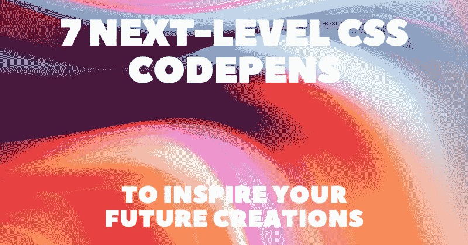

# 激发你未来创作灵感的 7 支下一级 CSS 代码笔😍✨

> 原文：<https://javascript.plainenglish.io/7-next-level-css-codepens-to-inspire-your-future-creations-5a51a0c96188?source=collection_archive---------13----------------------->

在这篇文章中，我收集了一些我最喜欢的 CSS 作品，它们证明了 CSS 的力量，并展示了如果你正确使用它，你可以实现什么。

对于每个 CSS 作品，我将提供一个直接链接，一个交互式预览，以及作者链接，这样你就可以探索他们的工作了。

## [Muson.css](https://codepen.io/fossheim/pen/BapZQjK)

作者:[莎拉·福斯海姆](https://codepen.io/fossheim)

## [北极星相机](https://codepen.io/kassandrasanch/pen/WNxJZyz)

作者:[卡斯](https://codepen.io/kassandrasanch)

## [带棋子的 3D 棋盘模型](https://codepen.io/ShadowShahriar/pen/JjXaOqe)

作者: [S. Shahriar](https://codepen.io/ShadowShahriar)

## [CasioPT-1](https://codepen.io/fossheim/pen/VweaNYW)

作者:[莎拉·福斯海姆](https://codepen.io/fossheim)

## [德罗林](https://codepen.io/ykadosh/pen/yLzmKYp)

作者: [Yoav Kadosh](https://codepen.io/ykadosh)

## [CSS 艺术键盘](https://codepen.io/kassandrasanch/pen/ExyrGKR)

作者:[卡斯](https://codepen.io/kassandrasanch)

## [带液晶显示屏的 Arduino UNO](https://codepen.io/ShadowShahriar/pen/pobqepZ)

作者: [S. Shahriar](https://codepen.io/ShadowShahriar)

写作一直是我的激情所在，帮助和激励他人给我带来了快乐。如果您有任何问题，请随时联系我们！

在 [Twitter](https://twitter.com/madzadev) 、 [LinkedIn](https://www.linkedin.com/in/madzadev/) 和 [GitHub](https://github.com/madzadev) 上和我联系！

访问我的[博客](https://madza.dev/blog)获取更多类似的文章。

*更多内容请看*[***plain English . io***](https://plainenglish.io/)*。报名参加我们的* [***免费周报***](http://newsletter.plainenglish.io/) *。关注我们关于*[***Twitter***](https://twitter.com/inPlainEngHQ)*和*[***LinkedIn***](https://www.linkedin.com/company/inplainenglish/)*。查看我们的* [***社区不和谐***](https://discord.gg/GtDtUAvyhW) *加入我们的* [***人才集体***](https://inplainenglish.pallet.com/talent/welcome) *。*