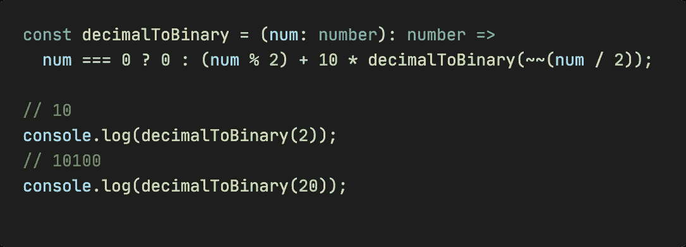

# 改进打字稿开发的 7 个一行程序

> 原文：<https://javascript.plainenglish.io/7-one-liners-to-improve-typescript-development-6c9daadb7825?source=collection_archive---------0----------------------->

## 像专家一样写出更好的打字稿代码。


Image by Author

更少的代码通常意味着更好的代码。在本文中，我将向您介绍 TypeScript 的 7 种单行代码，其中有许多高级用法，如泛型、断言等。希望能帮到你。

# 1.基于特定的键将数组转换为单个对象


```
**const toSingleObject = <
  T extends Record<PropertyKey, unknown>,
  K extends keyof T,
>(
  arr: T[]
  key: K,
): Record<string, T> =>
  Object.fromEntries(arr.map((item) => [item[key], item]));**// {
//   '1': { id: 1, name: 'Bravo', gender: 'Male' },
//   '3': { id: 3, name: 'Charlie', gender: 'Female' }
// }
console.log(
  toSingleObject(
    [
      {
        type: 'vegetable',
        name: 'carrot',
      },
      {
        type: 'fruit',
        name: 'apple',
      },
    ],
    'type',
  ),
);
```

# **2。将十进制转换成二进制**



```
**const decimalToBinary = (num: number): number =>
  num === 0 ? 0 : (num % 2) + 10 * decimalToBinary(~~(num / 2));**// 10
console.log(decimalToBinary(2));
// 10100
console.log(decimalToBinary(20));
```

# 3.生成假 IP


```
**const randomIp = (): string =>
  [...new Array(4)]
    .map((_, index) => Math.floor(Math.random() * 255) + Number(Boolean(index)))
    .join('.');**// 223.145.14.11
console.log(randomIp());
```

# 4.检查代码是否在 Node.js 中运行


```
**const isNode = (): boolean =>
  typeof process !== 'undefined' &&
  Object.prototype.toString.call(process) === '[object process]';**console.log(isNode());
```

# 5.检查一个值是否是一个普通对象


```
**const isPlainObject = (val: unknown): val is Record<string, any> =>
  Object.prototype.toString.call(val) === '[object Object]' &&
  [Object.prototype, null].includes(Object.getPrototypeOf(val));**const test = {
  name: 1,
};if (isPlainObject(test)) {
  // ✅
  console.log(test.name);
} else {
  // ❌ Property 'name' does not exist on type 'never'.
  console.log(test.name);
}
```

# 6.将秒格式化为 hh:mm:ss


```
**const formatSeconds = (s: number): string =>
  new Date(s * 1000).toISOString().slice(11, 19);**// 00:01:40
console.log(formatSeconds(100));
// 00:05:00
console.log(formatSeconds(300));
```

# 7.获取数组的所有子集


```
**const getSubsets = <T>(arr: T[]): T[][] =>
  arr.reduce(
    (acc, cur) => acc.concat(acc.map((k) => k.concat(cur))),
    [[] as T[]],
  );**// [
//   [],       [ 1 ],
//   [ 2 ],    [ 1, 2 ],
//   [ 3 ],    [ 1, 3 ],
//   [ 2, 3 ], [ 1, 2, 3 ]
// ]
console.log(getSubsets([1, 2, 3]));
```

*今天就到这里。我是 Zachary，我会继续输出与 web 开发相关的故事，如果你喜欢这样的故事并想支持我，请考虑成为* [*中级会员*](https://medium.com/@islizeqiang/membership) *。每月 5 美元，你可以无限制地访问媒体内容。如果你通过* [*我的链接*](https://medium.com/@islizeqiang/membership) *报名，我会得到一点佣金。*

你的支持对我来说非常重要——谢谢。

*更多内容看* [***说白了。报名参加我们的***](https://plainenglish.io/) **[***免费每周简讯***](http://newsletter.plainenglish.io/) *。关注我们* [***推特***](https://twitter.com/inPlainEngHQ) *和*[***LinkedIn***](https://www.linkedin.com/company/inplainenglish/)*。加入我们的* [***社区不和谐***](https://discord.gg/GtDtUAvyhW) *。***