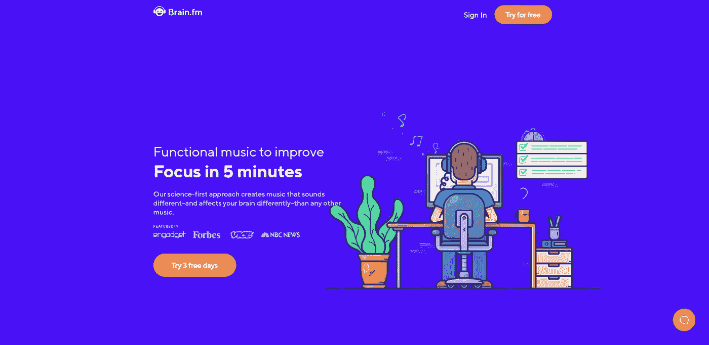
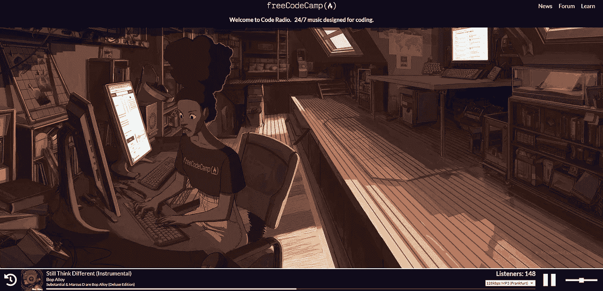
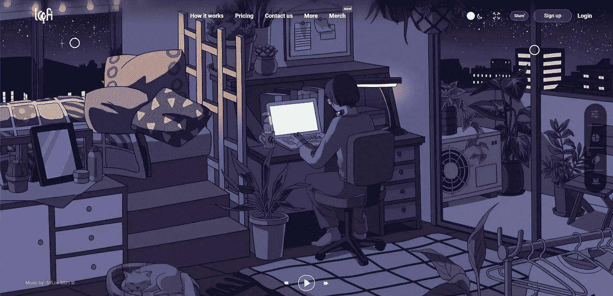
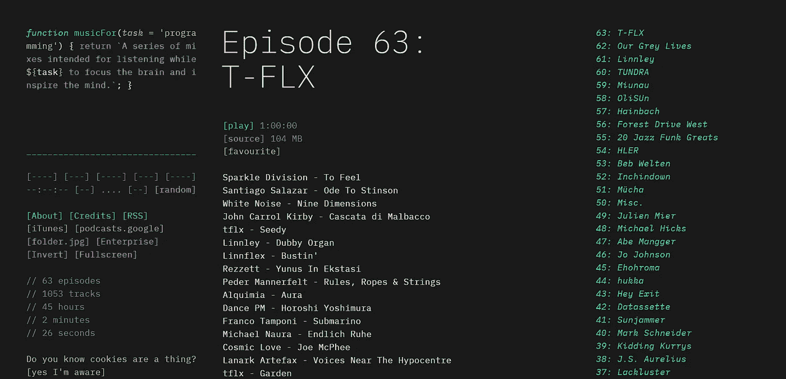

# 7 个在线收音机，可在编码时收听🎵💖

> 原文：<https://javascript.plainenglish.io/7-online-radios-to-listen-to-while-coding-c86cf6a15e67?source=collection_archive---------13----------------------->

## 我最喜欢的一些电台，你可以用它们来听一些很棒的音乐，并且在编码的时候提高你的工作效率。

不久前我做了一个[讨论](https://dev.to/madza/music-or-no-music-while-coding-which-type-of-person-are-you-5ei2)，问开发人员是否喜欢边听音乐边编码。我很惊讶我得到了这么多肯定的回答。

因此，在这篇文章中，我收集了一些我最喜欢的电台，你可以用它们来获得一些很棒的音乐，并提高你的编码效率。

我将为您提供直接链接，给你一个简洁的描述，以及包括截图，所以你可以得到一个初步的印象。

## [brain.fm](https://brain.fm)

科学第一的方法产生的音乐听起来和影响你大脑的方式都不同于其他类型的音乐。三天免费试用期的付费产品。

## [自由代码营电台](https://coderadio.freecodecamp.org/)

FFC 为编码设计的 24/7 音乐。一个电台，可以选择调到离你最近的最佳比特率。最近播放的列表和均衡器在编码 GIF 之上。

## [lofi.cafe](https://lofi.cafe)

一个在线电台，基于 YouTube 上一些最受程序员欢迎的电台。包括漂亮的 gif 和方便的键盘快捷键导航。

## [lofi.co](https://lofi.co)

一键播放完美的播放列表。点击播放，立即进入状态。三个电台适合你的心情:冷，爵士或昏昏欲睡。包括免费和高级计划。

## [musicforprogramming.net](https://musicforprogramming.net/latest/)

独特而引人注目的设计。许多鲜为人知的曲目值得你花时间去探索。截至发稿时，包括 63 集。

## [chillstep.info](https://chillstep.info)

如果你属于 Chillstep 流派，请选择单站音乐。已经有一段时间了。最近播放的列表和背景包，以便进一步定制。

## [DevTunes FM](https://radio.madza.dev)

一个提高程序员生产力的在线收音机。截至发稿时，已有 28 个不同的电台和 16 万首歌曲被收听。基于 SoundCloud API 的个人创作。

写作一直是我的激情所在，帮助和激励他人给我带来了快乐。如果您有任何问题，请随时联系我们！

如果这些资源有帮助的话，请在 [Twitter](https://twitter.com/madzadev) 、 [LinkedIn](https://www.linkedin.com/in/madzadev/) 和 [GitHub](https://github.com/madzadev) 上联系我！

访问我的[博客](https://madza.dev/blog)获取更多类似的文章。

*更多内容看* [***说白了。报名参加我们的***](https://plainenglish.io/) **[***免费周报***](http://newsletter.plainenglish.io/) *。关注我们关于*[***Twitter***](https://twitter.com/inPlainEngHQ)*和*[***LinkedIn***](https://www.linkedin.com/company/inplainenglish/)*。加入我们的* [***社区***](https://discord.gg/GtDtUAvyhW) *。***