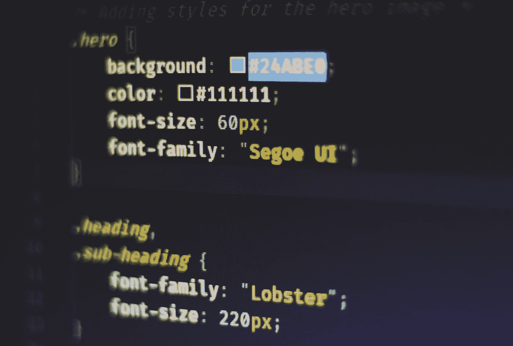
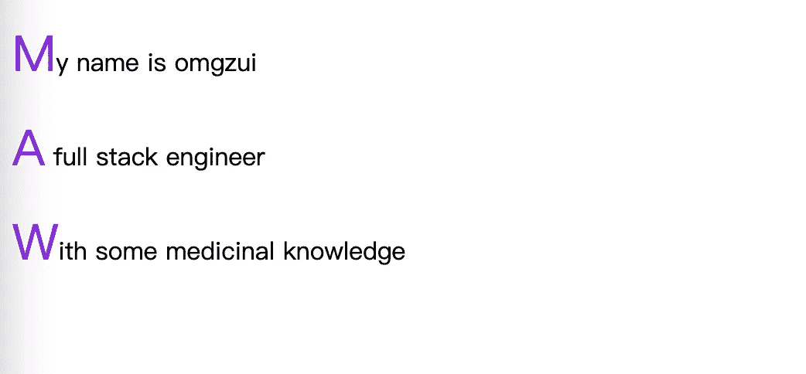
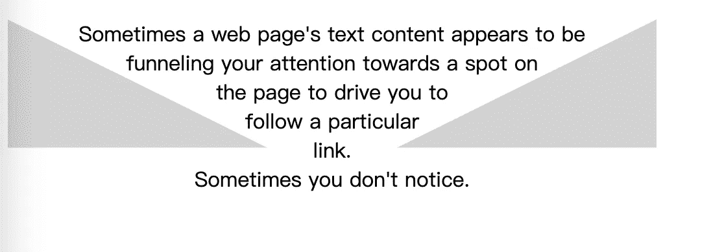
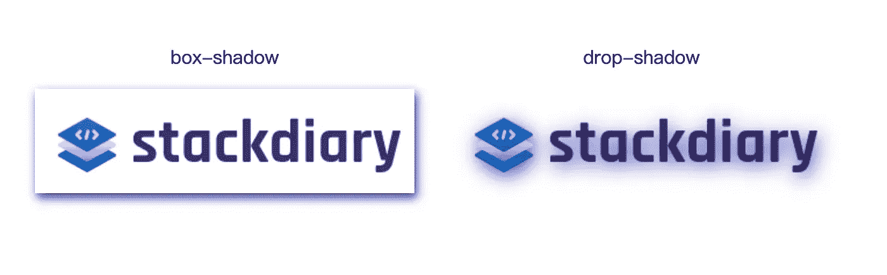
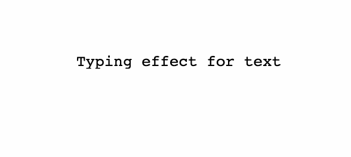
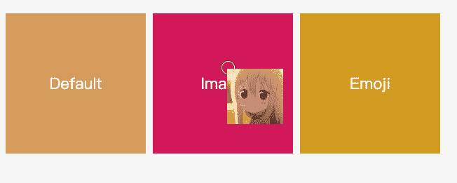
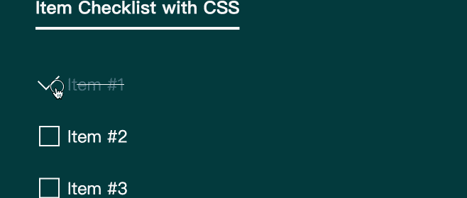

# 7 个实用的 CSS 技巧

> 原文：<https://javascript.plainenglish.io/7-practical-css-tips-c6e4d77f4c40?source=collection_archive---------0----------------------->



Photo by [Ferenc Almasi](https://unsplash.com/@flowforfrank?utm_source=medium&utm_medium=referral) on [Unsplash](https://unsplash.com?utm_source=medium&utm_medium=referral)

# 1.首字母下降



我们可以用`:first-letter`去掉文本的第一个字母。

```
p:first-letter {
 font-size: 200%;
 color: #8A2BE2;
}
```

`:first-letter`选择器用于指定元素首字母的样式，它只适用于块级元素。效果如下

# 2.图像文本环绕



[**Shape-outside**](https://developer.mozilla.org/zh-CN/docs/Web/CSS/shape-outside)是一个 CSS 属性，允许设置形状。它还有助于定义文本流动的区域

# 3.用:where()简化代码

将同一样式应用于多个元素时，CSS 可能如下所示:

```
.page div,
.paget .title,
.page #article {
 color: red;
}
```

这段代码看起来可读性不强，而`:where()`伪类就派上了用场。`:where()`伪类函数接受一个选择器列表作为其参数，并将选择选择器列表中任何规则可以选择的所有元素。

上面的代码可以用`:where()`写成这样:

```
.page :where(div, .title, #article) {
 color: red;
}
```

代码看起来是不是干净多了？

# 4.透明图像的阴影



你有没有尝试过给透明图像添加一个`box-shadow`，只是为了让它看起来像是你添加了一个边框？我想我们都经历过。为透明图像添加阴影效果的解决方案是使用`drop-shadow`。

它的工作方式是`drop-shadow`属性跟随给定图像的 alpha 通道。因此，阴影是基于图像内部的形状，而不是显示在图像外部。

# 5.文本的键入效果



网页设计正变得越来越有创意。在 CSS 动画功能的帮助下，你可以让你的网页看起来栩栩如生。在这个例子中，我们使用 animation 和``@keyframes`'属性来实现打字机效果。

具体来说，对于这个演示，我们实现了`steps()`属性来分割我们的文本动画。首先，您必须指定`steps()`的数量，在我们的例子中，这是我们希望动画化的文本的字符长度。

其次，我们使用``@keyframes`'来声明动画何时开始。例如，如果您在“文本的键入效果”后写了另一个单词，动画将无法工作，除非您更改 CSS 代码片段中的`steps()`的数量。

也就是说，这种效应并不新鲜。然而，尽管使用 CSS 也可以达到同样的效果，大多数开发人员还是会涌向 JavaScript 库。

# 6.设置自定义光标



你不太可能强迫你的访问者使用一个独特的光标。至少对 UX 将军来说不是这样。尽管如此，关于`cursor`属性需要注意的一点是，它允许您显示图像。这相当于以照片格式显示工具提示。

一些用例包括能够比较两张不同的照片，而不需要在视口中渲染这些照片。例如，光标属性可用于节省设计中的不动产。因为您可以将自定义光标锁定到特定的 div 元素，所以它不会干扰它之外的元素。

# 7.纯 CSS 中的清单



正如我在文章开头提到的，CSS 正稳步走向成熟。这个动态清单的演示就是一个很好的例子。

它的工作方式是我们使用 checkbox 输入类型和`:checked`伪类。每当`:checked`规范返回 true 时，使用`transform`属性来改变状态。

你可以用这种方法实现各种各样的事情。例如，当用户点击特定复选框时切换隐藏内容。它适用于单选和复选框等输入类型，但也可以应用于 *<选项>* 和 *<选择>* 元素。

# 结论

我使用了 Alex Ivanovs 的一篇文章中的一些有用的 CSS 技巧。正如他所说，这些 CSS 技巧和诀窍凸显了某些设计特性不需要 JavaScript 的潜力。好的一面是，你可以在任何设计中实现这些技巧。我完全同意他的观点。


[omgzui](https://medium.com/@omgzui?source=post_page-----c6e4d77f4c40--------------------------------)

## 更好的编程

[View list](https://medium.com/@omgzui/list/better-programing-9b4c9bb174aa?source=post_page-----c6e4d77f4c40--------------------------------)109 stories

[omgzui](https://medium.com/@omgzui?source=post_page-----c6e4d77f4c40--------------------------------)

## Java Script 语言

[View list](https://medium.com/@omgzui/list/javascript-48bfc7b5f93c?source=post_page-----c6e4d77f4c40--------------------------------)57 stories

[omgzui](https://medium.com/@omgzui?source=post_page-----c6e4d77f4c40--------------------------------)

## 新闻

[View list](https://medium.com/@omgzui/list/news-67ec0a972660?source=post_page-----c6e4d77f4c40--------------------------------)23 stories

*更多内容请看*[***plain English . io***](https://plainenglish.io/)*。报名参加我们的* [***免费周报***](http://newsletter.plainenglish.io/) *。关注我们关于*[***Twitter***](https://twitter.com/inPlainEngHQ)*和*[***LinkedIn***](https://www.linkedin.com/company/inplainenglish/)*。查看我们的* [***社区不和谐***](https://discord.gg/GtDtUAvyhW) *加入我们的* [***人才集体***](https://inplainenglish.pallet.com/talent/welcome) *。*