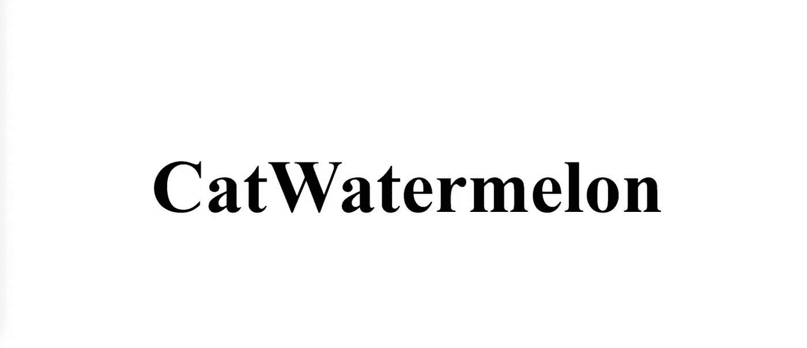
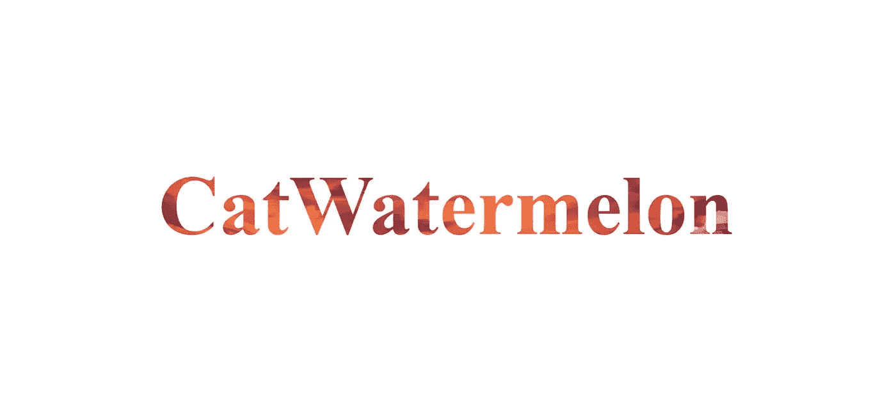
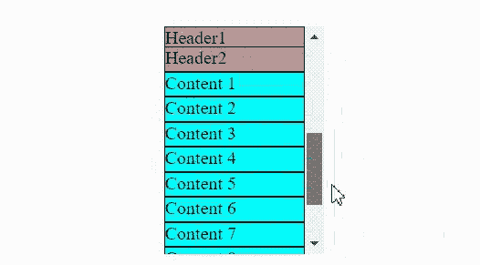
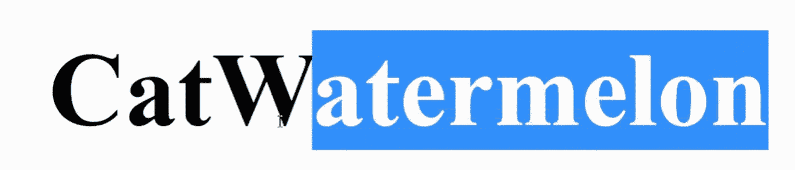
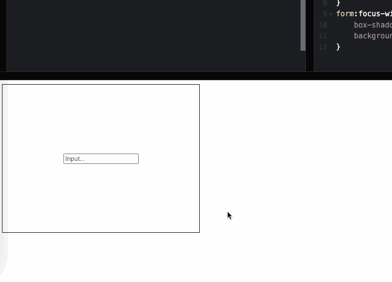

# 7 个实用的 CSS 技巧

> 原文：<https://javascript.plainenglish.io/7-practical-css-tips-part-2-8b396f7979f6?source=collection_archive---------3----------------------->

## 第二部分:1。背景剪辑:文本，2。:空选择器，3。ga，4。位置:粘人，5。用户选择，6。:无效的伪类，7。:焦点-在伪类中


Photo by [Ferenc Almasi](https://unsplash.com/@flowforfrank?utm_source=medium&utm_medium=referral) on [Unsplash](https://unsplash.com?utm_source=medium&utm_medium=referral)

# 1.背景-剪辑:文本



这个属性可能朋友用的不多，有什么用？简单来说，你可以制作一个带有背景的文字效果:

**图 1 +图 2 =图 3** 。是不是很神奇？你通常用它来制作一些裁剪效果吗？in 是否知道它也有一个属性`text`值？`background-clip: text`用来制作带背景的文字效果。相信大家在浏览一些网站的时候都会看到类似的实现。其实我们也可以通过 CSS 达到这个效果。不要被骗以为都是用画图工具做的。

# 2.:空选择器

在正常开发过程中，数据是通过请求接口获取的，可能会出现接口没有数据的情况。这个时候正常的做法是给用户一个提醒，让用户知道没有 bug，但是确实没有数据。

一般的方法是我们人为判断当前数据返回列表的长度是否为 0，如果为 0，则向用户显示“无数据”，否则隐藏提示。

有了这个选择器，你可以把这个任务交给 CSS。

```
.container {
    height: 400px;
    width: 600px;
    background-color: antiquewhite;
    display: flex;
    justify-content: center;
    align-items: center;
}
.container:empty::after {
    content: "No Data";
} 
```

`:empty`选择内容为空的容器，然后通过伪元素为空容器添加提示。是不是很方便？

# 3.总代理人

日常开发中，朋友们都用过`padding`和`margin`。它们`margin`一般是作为边距，将两个元素隔开一点距离，但是对于某些场景，我们很难通过计算得到一个可分的值，比如 100px。让 3 个元素等间距 10px 会很尴尬。

我们可以使用`gap`属性，`gap`适用于网格布局、Flex 布局和多栏布局，不一定只在网格布局中可用。

例如，如果我们希望每个元素的间距为 20px，那么`gap`我们可以这样做:

```
display: flex | grid；
gap: 20px;
```

是不是很简单？

# 4.位置:粘性



不知道大家在平时的业务拓展中有没有遇到过类似上图的吸顶需求:标题滚动的时候，会一直粘在最上面。

这样的场景其实有很多:比如表格的标题栏，网站的导航栏，手机通讯录里一个人名字的首字母等等。如果让大家自己做，他们会用 js 结合 css 来实现吗？之前确实是这样，直到属性`sticky`上增加了一个新的`position`属性，前端程序员迎来了一个小春天。

```
.container {
    background-color: oldlace;
    height: 200px;
    width: 140px;
    overflow: auto;
  }
  .container div {
    height: 20px;
    background-color: aqua;
    border: 1px solid;
  }
  .container .header {
    position: sticky;
    top: 0;
    background-color: rgb(187, 153, 153);
} 
```

```
<div class="container">
  <div class="header">Header</div>
  <div>1</div>
  <div>2</div>
  <div>3</div>
</div>
```

就这么简单？没错，就是这么简单，但是朋友使用的时候要注意兼容性。

# 5.用户选择



很多人不知道这个属性是什么意思。看看下面这张图:

网页和 APP 的区别在于，网页上的文字可以用光标选择，而 APP 里不行。

有些朋友可能会疑惑:那我的网页上就不需要这个属性了？

不，不，我们知道现在很多新技术都在涌现， **webviews** 或者**网页**可以嵌套在 app 中，比如**电子**制作的桌面应用**。你见过可以用光标选择的桌面应用吗？**

`user-select`属性可以**禁用光标选择**，使网页看起来和移动终端一样。

# 6.:无效的伪类

`**:invalid**`表示任何未通过`input`或其他`form`元素验证的内容。那是什么意思？比如说。

这是一种形式。

```
<form>
  <label for="url_input">Enter a URL:</label>
  <input type="url" id="url_input" />
  <br />
  <br />
  <label for="email_input">Enter an email address:</label>
  <input type="email" id="email_input" required/>
</form>
```

我们的要求是当值有效时，使元素颜色为绿色`input`，当值无效时，使元素颜色为红色。

```
input:invalid {
  background-color: #ffdddd;
}

form:invalid {
  border: 5px solid #ffdddd;
}

input:valid {
  background-color: #ddffdd;
}

form:valid {
  border: 5px solid #ddffdd;
}

input:required {
  border-color: #800000;
  border-width: 3px;
}

input:required:invalid {
  border-color: #C00000;
}
```

有了`:invalid`属性，就可以实现没有 JS 的验证提示的效果。

# 7.:焦点-在伪类中



`**:focus-within**`表示一个元素获得焦点，或者该元素的一个后代元素获得焦点，并且会匹配。你什么意思？

话不多说，先看图:

```
// CSS
form {
    border: 1px solid;
    width: 400px;
    height: 300px;
    display: flex;
    justify-content: center;
    align-items: center;
}
form:focus-within {
    box-shadow: 0px 4px 4px rgba(0, 0, 0, 0.3);
    background-color: beige;
}

// HTML
<form>
  <input type="text" id="ipt" placeholder="Input..." />
</form>
```

根据子元素的状态改变父元素的样式非常方便。还可以玩很多花样。

# 最后

**感谢阅读**。期待您的关注，阅读更多高质量的文章。


[omgzui](https://medium.com/@omgzui?source=post_page-----8b396f7979f6--------------------------------)

## 更好的编程

[View list](https://medium.com/@omgzui/list/better-programing-9b4c9bb174aa?source=post_page-----8b396f7979f6--------------------------------)109 stories

[omgzui](https://medium.com/@omgzui?source=post_page-----8b396f7979f6--------------------------------)

## Java Script 语言

[View list](https://medium.com/@omgzui/list/javascript-48bfc7b5f93c?source=post_page-----8b396f7979f6--------------------------------)57 stories

[omgzui](https://medium.com/@omgzui?source=post_page-----8b396f7979f6--------------------------------)

## 新闻

[View list](https://medium.com/@omgzui/list/news-67ec0a972660?source=post_page-----8b396f7979f6--------------------------------)23 stories

*更多内容看* [***说白了就是***](https://plainenglish.io/) *。报名参加我们的* [***免费周报***](http://newsletter.plainenglish.io/) *。关注我们关于* [***推特***](https://twitter.com/inPlainEngHQ) ， [***领英***](https://www.linkedin.com/company/inplainenglish/) *，*[***YouTube***](https://www.youtube.com/channel/UCtipWUghju290NWcn8jhyAw)*，以及* [***不和***](https://discord.gg/GtDtUAvyhW) *。对增长黑客感兴趣？检查* [***电路***](https://circuit.ooo/) *。*