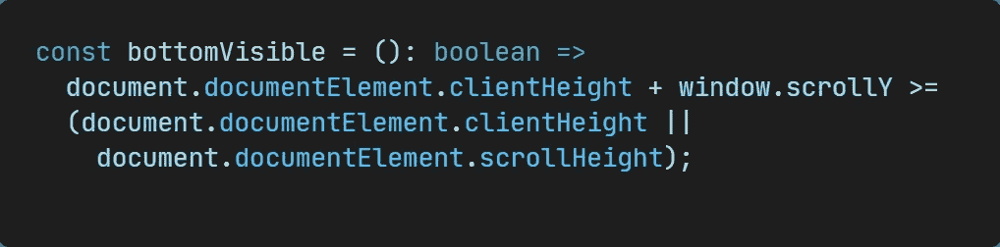
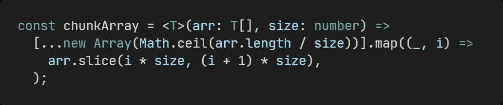
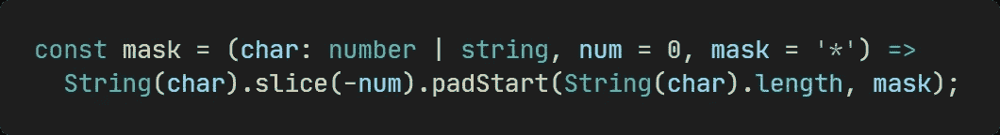
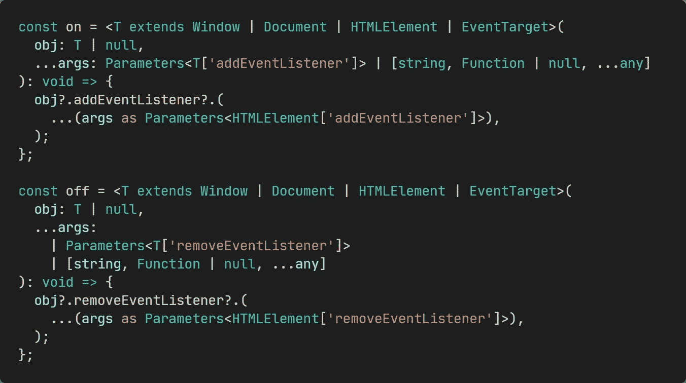
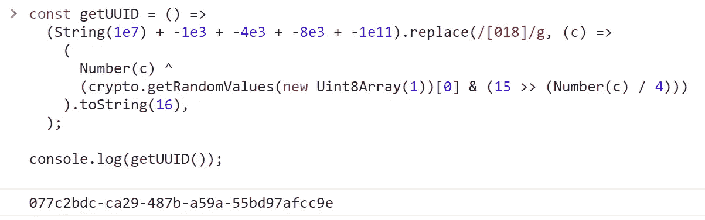
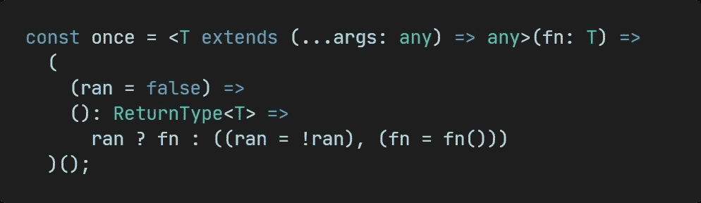
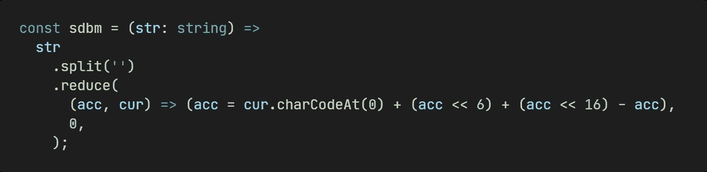

# 7 个快速打印的一行程序

> 原文：<https://javascript.plainenglish.io/7-quick-typescript-one-liners-d5c060f5fb94?source=collection_archive---------9----------------------->

## 代码越少越好。


Image by Author

更少的代码通常意味着更好的代码。在本文中，我将向您介绍 TypeScript 的 7 种单行代码，其中有许多高级用法，如泛型、断言等。希望能帮到你。

# 底部可见

确定页面底部是否可见。



```
const bottomVisible = (): boolean =>
  document.documentElement.clientHeight + window.scrollY >=
  (document.documentElement.clientHeight ||
    document.documentElement.scrollHeight);
```

# chunk 阵列

基于传入大小的块数组。



```
const chunkArray = <T>(arr: T[], size: number) =>
  [...new Array(Math.ceil(arr.length / size))].map((_, i) =>
    arr.slice(i * size, (i + 1) * size),
  );// [ [ 0, 1 ], [ 2, 3 ], [ 4 ] ]
console.log(chunkArray([0, 1, 2, 3, 4], 2));
// [ [ 0, 1, 2, 3, 4 ] ]
console.log(chunkArray([0, 1, 2, 3, 4], 100));
```

# 面具

加密字符，可以选择末尾保留的字符数，也可以自定义加密字符。



```
const mask = (char: number | string, num = 0, mask = '*') =>
  String(char).slice(-num).padStart(String(char).length, mask);console.log(mask('123')); // 123
console.log(mask('123456789', 4)); // *****6789
console.log(mask('123456789', 3, '#')); // ######789
```

# 开/关

`Add/Remove`DOM 元素或事件委托对象的事件监听器，没有`addEventListener/removeEventListener`的麻烦。



```
const on = <T extends Window | Document | HTMLElement | EventTarget>(
  obj: T | null,
  ...args: Parameters<T['addEventListener']> | [string, Function | null, ...any]
): void => {
  obj?.addEventListener?.(
    ...(args as Parameters<HTMLElement['addEventListener']>),
  );
};const off = <T extends Window | Document | HTMLElement | EventTarget>(
  obj: T | null,
  ...args:
    | Parameters<T['removeEventListener']>
    | [string, Function | null, ...any]
): void => {
  obj?.removeEventListener?.(
    ...(args as Parameters<HTMLElement['removeEventListener']>),
  );
};
```

# getUUID

使用浏览器中可用的[加密](https://developer.mozilla.org/en-US/docs/Web/API/Crypto) API 生成符合 [RFC4122](https://www.ietf.org/rfc/rfc4122.txt) 版本 4 的 UUID。



```
const getUUID = () =>
  (String(1e7) + -1e3 + -4e3 + -8e3 + -1e11).replace(/[018]/g, (c) =>
    (
      Number(c) ^
      (crypto.getRandomValues(new Uint8Array(1))[0] & (15 >> (Number(c) / 4)))
    ).toString(16),
  );console.log(getUUID());
```

# 一次

执行一次函数。



```
const once = <T extends (...args: any) => any>(fn: T) =>
  (
    (ran = false) =>
    (): ReturnType<T> =>
      ran ? fn : ((ran = !ran), (fn = fn()))
  )();let n = 1;
const incOnce = once(() => ++n);
console.log(incOnce()); // 2
console.log(incOnce()); // 2
console.log(incOnce()); // 2
console.log('n: ', n); // n: 2
```

# sdbm

将输入字符串散列成一个整数。



```
const sdbm = (str: string) =>
  str
    .split('')
    .reduce(
      (acc, cur) => (acc = cur.charCodeAt(0) + (acc << 6) + (acc << 16) - acc),
      0,
    );console.log(sdbm('Hello')); // -1421493998
console.log(sdbm('Hello')); // -1421493998
console.log(sdbm('World')); // -2242392430
```

今天就到这里。我是 Zachary，我会继续输出与 web 开发相关的故事，如果你喜欢这样的故事并想支持我，请考虑成为 [*中级会员*](https://medium.com/@islizeqiang/membership) *。每月 5 美元，你可以无限制地访问媒体内容。如果你通过* [*我的链接*](https://medium.com/@islizeqiang/membership) *报名，我会得到一点佣金。*

你的支持对我来说很重要——谢谢。

*更多内容看* [***说白了就是***](https://plainenglish.io/) *。报名参加我们的* [***免费每周简讯***](http://newsletter.plainenglish.io/) *。关注我们* [***推特***](https://twitter.com/inPlainEngHQ) *和*[***LinkedIn***](https://www.linkedin.com/company/inplainenglish/)*。加入我们的* [***社区不和谐***](https://discord.gg/GtDtUAvyhW) *。*