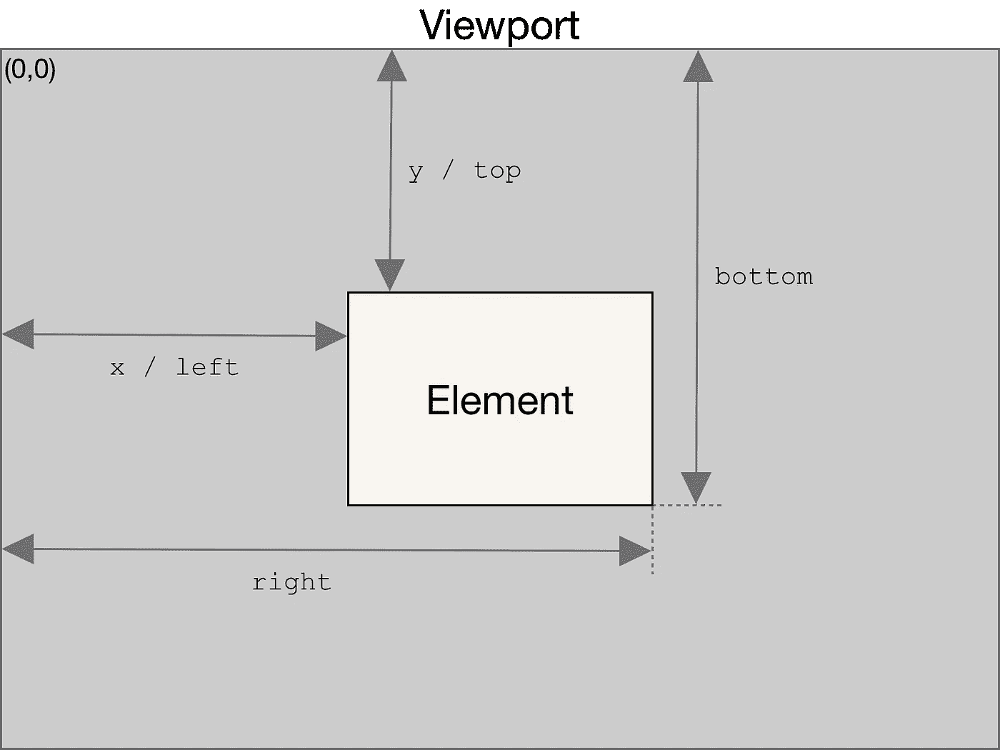
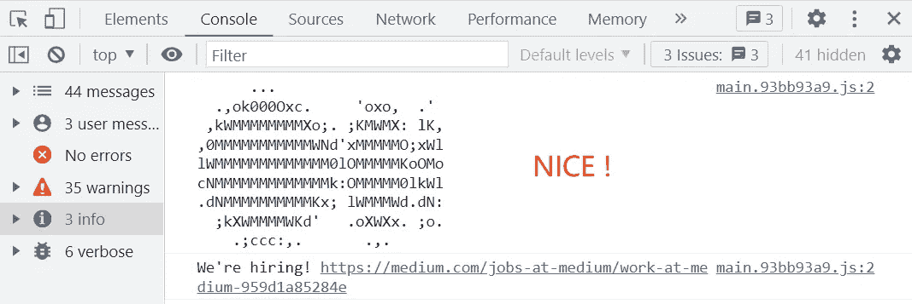
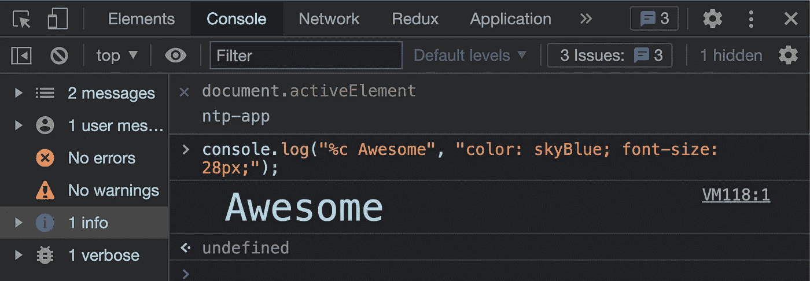

# 9 个罕见但有用的 JavaScript 技巧

> 原文：<https://javascript.plainenglish.io/7-rare-but-useful-javascript-tricks-cc7f2c380517?source=collection_archive---------0----------------------->

## 短小精悍、功能强大的 JavaScript 技巧


Photo by [Artem Sapegin](https://unsplash.com/@sapegin?utm_source=medium&utm_medium=referral) on [Unsplash](https://unsplash.com?utm_source=medium&utm_medium=referral)

JavaScript 发展至今，出现了很多令人惊叹的库和框架。它们为我们的现代生活提供了极大的便利，但其中许多都是基于本机实现的。今天我们将遇到一些罕见但有用的 JavaScript 技巧

# getComputedStyle

`window.getComputedStyle()`方法返回一个`[CSSStyleDeclaration](https://developer.mozilla.org/en-US/docs/Web/API/CSSStyleDeclaration)`对象(与 style 属性的类型相同),包含元素的计算样式

**语法**

该方法接受两个参数:获取计算样式的元素和一个伪元素字符串(如`:after`)。如果不需要查询伪元素，可以向第二个参数传递 null。

# getBoundingClientRect

`Element.getBoundingClientRect()`方法返回一个`[DOMRect](https://developer.mozilla.org/en-US/docs/Web/API/DOMRect)`，一个提供元素大小及其相对于[视窗](https://developer.mozilla.org/en-US/docs/Glossary/Viewport)位置信息的对象。

**语法**

```
domRect = element.getBoundingClientRect();
```

它的返回值是一个`[**DOMRect**](https://developer.mozilla.org/en-US/docs/Web/API/DOMRect)`对象，它是元素的`[getClientRects()](https://developer.mozilla.org/en-US/docs/Web/API/Element/getClientRects)`方法返回的矩形集合，是元素的 CSS 边框大小。

返回的结果是包含完整元素的最小矩形，并且具有以像素`left, top, right, bottom, x, y, width, and height`表示的描述整个边框的只读属性。宽度和高度以外的属性是相对于视图窗口的左上角计算的。



from [mdn](https://developer.mozilla.org/en-US/docs/Web/API/Element/getBoundingClientRect)

**应用场景**

1.  获取 DOM 元素相对于网页左上角的距离

2.确定元素是否在可见区域

# 仅执行一次的事件侦听器

再也不用 lodash 的 once 方法了，Vanilla JS 可以

# 从数组中获取最小值/最大值

可以将 Math.min()或 Math.max()与 spread 运算符一起使用，以查找数组中的最小值或最大值。

# 复制到剪贴板

您可以使用[剪贴板 API](https://developer.mozilla.org/en-US/docs/Web/API/Clipboard_API) 创建一个“复制到剪贴板”功能

剪贴板 API 提供了响应剪贴板命令(剪切、复制和粘贴)以及异步读取和写入系统剪贴板的能力。

这个函数执行后，它会在 3 秒内读取我们在当前页面使用 Ctrl + C 的内容，然后使用 Ctrl + V 到控制台，就可以看到刚刚复制的内容。

注意:如果你没有在 3 秒钟内使用 Ctrl + C，那么控制台会给出一个错误

# 让您的 console.log()看起来有风格



EG: Make your console.log() appear styled

让你的控制台变得丰富多彩，你可以在一些特殊的场景下(类似于打印 Redux 流，Axios 请求服务 API 等)。

这是 CSS 格式说明符及其各自输出的列表。

*   %s 将值格式化为字符串
*   %i 或%d 将值格式化为整数
*   %f 将值格式化为浮点值
*   %o 将值格式化为可扩展的 DOM 元素。如元素面板中所示
*   %O 将值格式化为可扩展的 JavaScript 对象
*   %c 将 CSS 样式规则应用于第二个参数指定的输出字符串

## 句法



Awesome!

# HTML5 数据-*属性

`data-*` [全局属性](https://developer.mozilla.org/en-US/docs/Web/HTML/Global_attributes)形成了一类称为定制数据属性的属性，它允许通过脚本在 HTML 及其 DOM 表示之间交换专有信息。

这是一个很棒的功能！试想一下，如果你的项目中有一个逻辑是你不敢改变或者不能理解的，但是你需要在这个标签上做点别的，那么不要犹豫，是时候用`**data-***`了

这个函数非常干净，没有侵入代码，**而且对重构**很有好处，因为它不是脏代码

Try clicking on species type

# 检查大写锁定是否打开

一个非常常见的场景是，在登录界面中，用户可能无意中打开了 Caps Lock 键，这时我们需要给用户一个轻微的提醒，这是一种培养良好的**用户体验的方式**

# Void 0 vs 未定义

好吧，没有区别。`void 0`总回报`undefined`

例如，在 React 中，您可以编写:)

# 结论

通过这篇文章我们学到了一些罕见但有用的 JavaScript 技巧，希望对你有所帮助！

# 了解更多信息

[](https://medium.com/@_tomoe/how-to-write-clean-typescript-code-eda1716eead1) [## 如何写出干净的 TypeScript 代码？

### 我们如何在工作中写出干净的 TypeScript 代码，本文带你通过 9 个知识点来掌握如何写…

medium.com](https://medium.com/@_tomoe/how-to-write-clean-typescript-code-eda1716eead1) [](https://medium.com/weekly-webtips/12-extremely-practical-javascript-one-line-codes-35b95c2d21a8) [## 12 个非常实用的 JavaScript 单行代码

### 非常简短、漂亮、实用的 JavaScript 技巧

medium.com](https://medium.com/weekly-webtips/12-extremely-practical-javascript-one-line-codes-35b95c2d21a8) 

*更多内容请看*[***plain English . io***](https://plainenglish.io/)*。报名参加我们的* [***免费周报***](http://newsletter.plainenglish.io/) *。关注我们关于*[***Twitter***](https://twitter.com/inPlainEngHQ)*和*[***LinkedIn***](https://www.linkedin.com/company/inplainenglish/)*。加入我们的* [***社区不和谐***](https://discord.gg/GtDtUAvyhW) *。*