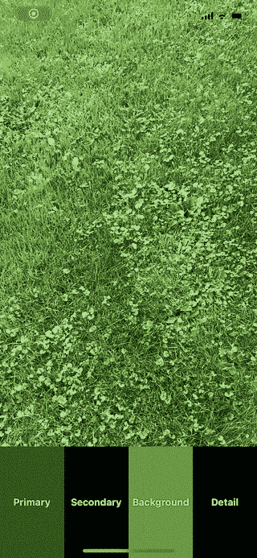
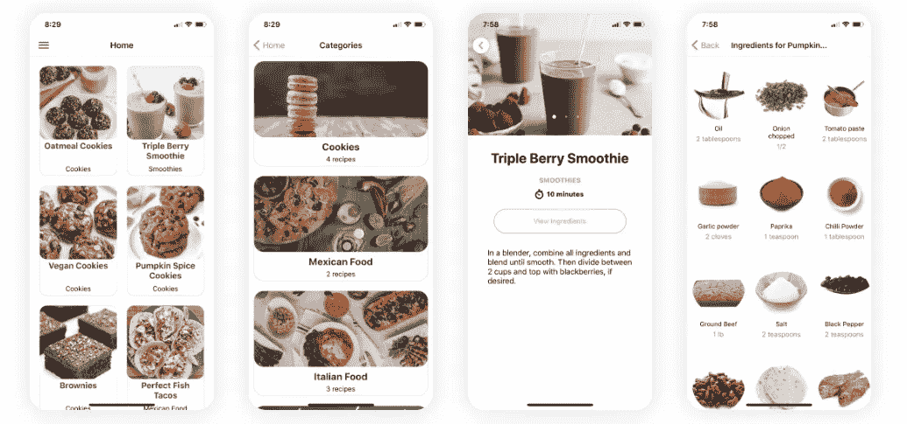
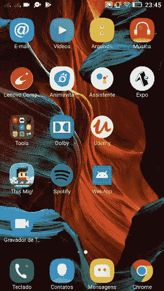
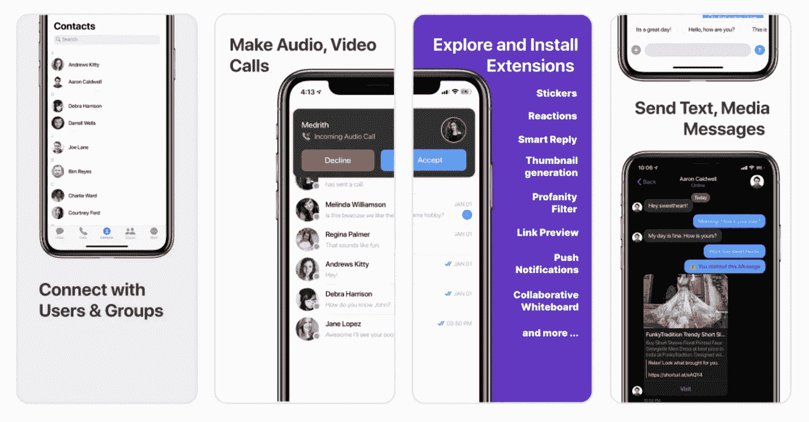
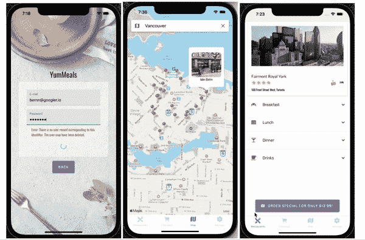
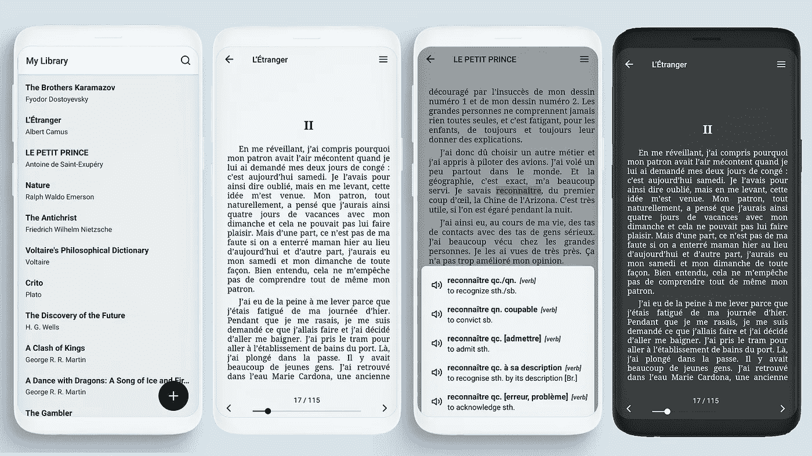

# 7 对原生开源项目做出反应，成为更好的移动应用开发者

> 原文：<https://javascript.plainenglish.io/7-react-native-open-source-projects-to-become-a-better-mobile-app-developer-345840199fcd?source=collection_archive---------4----------------------->

## 第 2 部分:增强您的移动应用程序开发


Photo by [Nubelson Fernandes](https://unsplash.com/@nublson?utm_source=medium&utm_medium=referral) on [Unsplash](https://unsplash.com?utm_source=medium&utm_medium=referral)

阅读大量代码是提高开发技能的最佳方式之一。开源项目是了解最佳实践、编码风格和其他主题的最佳地方。

软件开发最受欢迎的领域之一是跨平台移动应用程序开发。React Native 是构建跨平台移动应用最强大的工具之一。今天，我们将看看 7 个开源 React 原生项目，它们可以帮助您提高移动应用程序开发技能。

# 1.彩色波



这个应用程序使用 [VisionCamera](https://github.com/mrousavy/react-native-vision-camera) 和[reained](https://github.com/software-mansion/react-native-reanimated)来检测现实世界中的颜色波(样本/调色板)。它是用 React Native(TypeScript/JavaScript)写的，在 iOS 和 Android 上都可以用。但是，本地 Objective-C/Swift/Java 代码支持关键性能部分(如图像处理算法和动画)。你可以在 [Google Play](https://play.google.com/store/apps/details?id=com.mrousavy.colorwaver) 或[应用商店](https://apps.apple.com/at/app/colorwaver/id1583400396)上查看该应用。

[](https://github.com/mrousavy/Colorwaver) [## GitHub - mrousavy/Colorwaver:🎨一个应用程序来检测现实世界中的调色板

### 一个在现实世界中检测色彩波(样本/调色板)的应用程序——由 VisionCamera 提供支持，并被重新激活。我写了…

github.com](https://github.com/mrousavy/Colorwaver) 

# 2.食谱-应用程序-反应-本地



这是一个可爱的免费 React 本地初学者工具包，带有一个食谱应用程序，可以帮助您开始移动应用程序开发。做一个真实的项目会让你学会如何反应。您还将了解本机组件、导航和 redux 等内容。

[](https://github.com/instamobile/recipes-app-react-native) [## GitHub-insta mobile/Recipes-App-React-Native:React Native 中的 Recipes App

### 下载这款漂亮的免费 React 原生入门套件，包含一个食谱应用程序，以引导您的移动应用程序…

github.com](https://github.com/instamobile/recipes-app-react-native) 

# 3.阿尼维塔



Animavita 由两个拉丁词组成:“Animal”和“Vitae”，分别表示“动物”和“生命”。这是一个简单，优雅，美丽的移动应用程序，帮助人们寻找和收养最近的宠物朋友，拯救生命。你将能够从这个项目中学习脸书登录，博览会，风格组件，Reactotron，Redux 等。

[](https://github.com/animavita/animavita) [## GitHub - animavita/animavita:触发救生警报，注册动物收养和寻找…

### 一个简洁、干净和漂亮的移动应用程序，帮助人们找到最亲近的宠物朋友来收养，拯救生命和改变…

github.com](https://github.com/animavita/animavita) 

# 4.海琳达


你喜欢调解吗？。如果你这样做，那么这可能是一个很好的资源给你。这是一款免费开源的冥想应用，任何人都可以使用。它是在 React Native 和 Expo 的帮助下创建的。它提供了许多功能，如沉思，跟踪进度，黑暗模式，当前条纹等。

[](https://github.com/heylinda/heylinda-app) [## GitHub - heylinda/heylinda-app:每个人的开源和免费冥想应用程序选择…

### 面向所有人的开源免费冥想应用。与 React Native 和 Expo 一起构建。冥想音轨…

github.com](https://github.com/heylinda/heylinda-app) 

# 5.反应-原生-聊天-应用程序



以下应用程序是一个功能齐全的实时消息应用程序，能够进行私人(一对一)、群组消息以及语音和视频通话(使用 CometChat UIKit 构建)。它提供了许多功能，如富媒体附件、打字指示器、文本、媒体和自定义消息、阅读回执等。

[](https://github.com/cometchat-pro/react-native-chat-app) [## GitHub-comet Chat-pro/react-native-Chat-App:开源语音视频通话和文字聊天应用…

### CometChat 厨房水槽示例应用程序(使用 CometChat UIKit 构建)是一个全功能的实时消息应用程序，能够…

github.com](https://github.com/cometchat-pro/react-native-chat-app) 

# 6.美味佳肴



这是一个在线订餐应用程序，看起来像是大型应用程序的简化版本，如[优步吃](https://www.ubereats.com/)和 [DoorDash](https://www.doordash.com/) 。使用城市名称进行位置搜索，显示搜索结果附近的餐馆列表，用户注册/登录验证，带有可定制用户头像的设置屏幕，以及将餐馆保存为收藏夹的能力都是核心功能。

[](https://github.com/BernStrom/YumMeals) [## GitHub - BernStrom/YumMeals:世界各地餐厅的在线食品订购移动应用程序…

### 全球餐厅在线订餐移动应用。只需按城市搜索、浏览和订购即可🍣 🥡…

github.com](https://github.com/BernStrom/YumMeals) 

# 7.双投资组合



阅读某种语言的书籍是学习这种语言最有效的方法之一。另一方面，读者经常需要查阅字典，这会干扰他们的注意力和沉浸感。这就是这个项目的切入点。它有一个集成的翻译系统，可以让你通过简单地选择单词来快速查找单词，而不会中断你的流程。可以在 [Google Play](https://play.google.com/store/apps/details?id=com.duofolio) 上查看 app。

[](https://github.com/farshed/duofolio) [## GitHub - farshed/duofolio:帮助你学习语言的简单电子书阅读器📖

### 帮助你阅读其他语言书籍的电子书阅读器。专为舌鸟打造。学习英语的最好方法之一是…

github.com](https://github.com/farshed/duofolio) 

# 另一部分在哪里？

有很多很棒的 React 原生开源资源。我想分享尽可能多的资源，让你的开发之旅更轻松。

如果你想知道更多牛逼的 React 原生开源项目，请查看下面。

[](/7-react-native-open-source-projects-to-become-a-better-mobile-app-developer-43a77b1cb389) [## 7 对原生开源项目做出反应，成为更好的移动应用开发者

### 增强您的移动应用开发

javascript.plainenglish.io](/7-react-native-open-source-projects-to-become-a-better-mobile-app-developer-43a77b1cb389) [](/7-react-native-open-source-projects-to-become-a-better-mobile-app-developer-e33ef5b73ec) [## 7 对原生开源项目做出反应，成为更好的移动应用开发者

### 第 3 部分:使用这些 React 原生开源项目增强您的移动应用程序开发。

javascript.plainenglish.io](/7-react-native-open-source-projects-to-become-a-better-mobile-app-developer-e33ef5b73ec) 

今天到此为止。谢谢你坚持到最后。相信这些项目会帮助你学到很多新的东西。

如果你知道任何其他漂亮的开源项目，请在评论中分享。直到我们再次见面…干杯！

```
**Want to Connect?**If you want to, you can connect with me on [**Twitter**](https://twitter.com/FarhanT99598254) or [**LinkedIn**](https://www.linkedin.com/in/farhan-tanvir-b08520151/).
```

*更多内容请看*[***plain English . io***](https://plainenglish.io/)*。报名参加我们的* [***免费周报***](http://newsletter.plainenglish.io/) *。关注我们关于*[***Twitter***](https://twitter.com/inPlainEngHQ)*和*[***LinkedIn***](https://www.linkedin.com/company/inplainenglish/)*。查看我们的* [***社区不和谐***](https://discord.gg/GtDtUAvyhW) *加入我们的* [***人才集体***](https://inplainenglish.pallet.com/talent/welcome) *。*