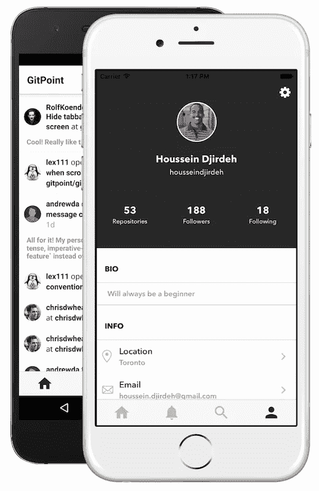
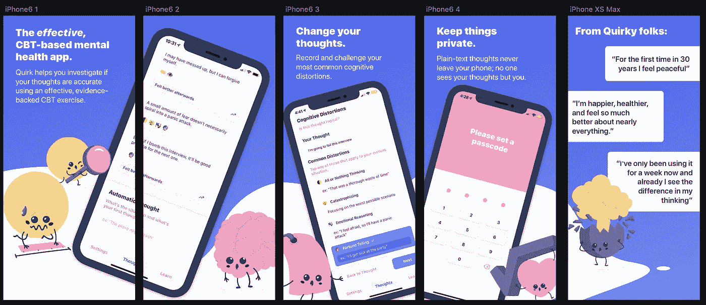
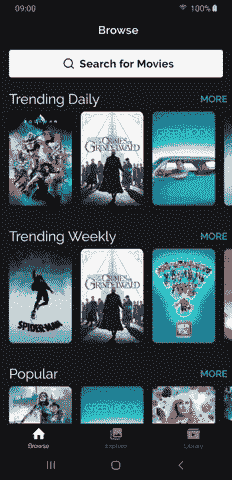
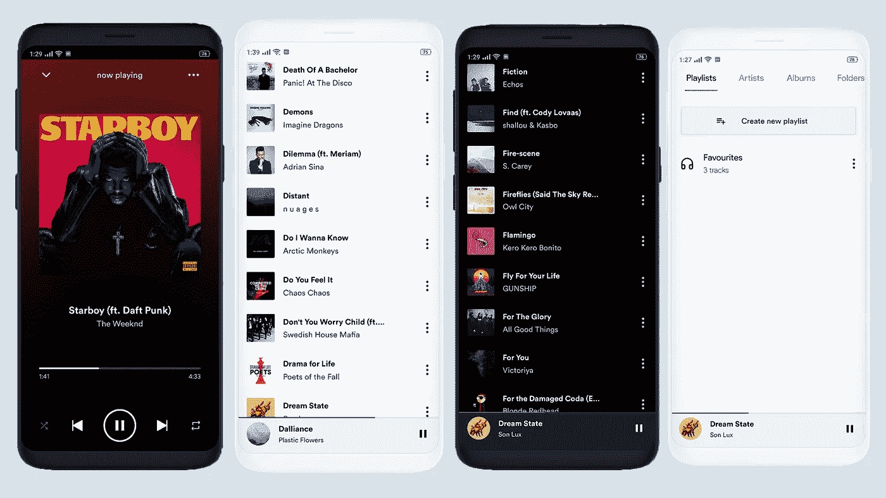
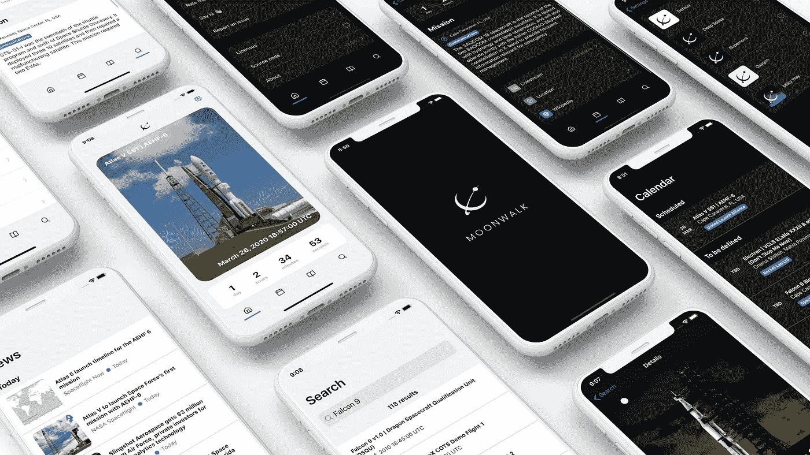
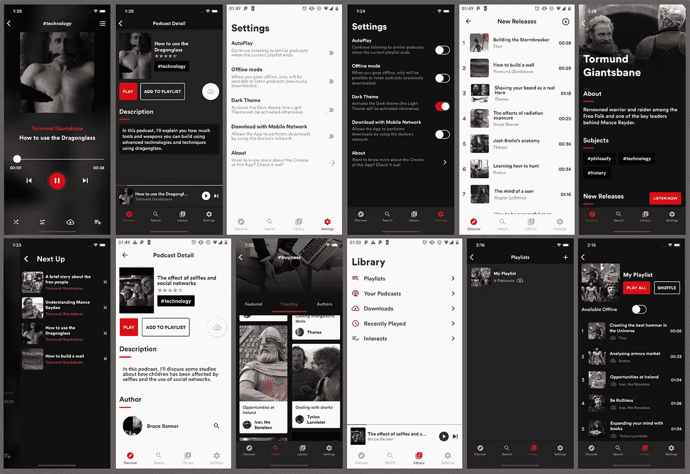

# 7 对原生开源项目做出反应，成为更好的移动应用开发者

> 原文：<https://javascript.plainenglish.io/7-react-native-open-source-projects-to-become-a-better-mobile-app-developer-43a77b1cb389?source=collection_archive---------0----------------------->

## 增强您的移动应用开发


Photo by [Oskar Yildiz](https://unsplash.com/@oskaryil?utm_source=medium&utm_medium=referral) on [Unsplash](https://unsplash.com?utm_source=medium&utm_medium=referral)

提高开发技能的最好方法之一是阅读大量代码。开源项目是学习最佳实践、编码风格和其他主题的最有价值的资源。

跨平台移动应用开发是软件开发的需求领域之一。React Native 是您可以用来创建跨平台移动应用程序的最佳工具之一。今天我们将了解 7 个 React 原生开源项目，它们可以帮助你更好地开发移动应用。

# 1.GitPoint



这个项目是一个免费的 GitHub 客户端。它提供了许多功能，如查看存储库和用户信息，控制您的通知，管理您的问题和请求，等等。虽然这个仓库有点旧，但是你可以学到很多东西。它在 GitHub 上有超过 4.5k 颗星。

[](https://github.com/gitpoint/git-point) [## GitHub-git point/git-point:GitHub 在你的口袋里

### GitHub 在你口袋里。用 React Native 构建。查看存储库和用户信息，控制您的通知和…

github.com](https://github.com/gitpoint/git-point) 

# 2.React 本机计算器


如果您想知道如何构建源代码以在多种设备上运行，那么这将是一个很好的资源。这个项目是一个移动，桌面和网站应用程序，具有相同的代码。它对 android 和 iOs 应用程序使用 React-Native，对桌面应用程序使用 electron，对 web 应用程序使用 React。你可以在这里 查看网站 app [**的演示。它在 Github 上有超过 5k 颗星。**](http://benoitvallon.github.io/react-native-nw-react-calculator)

[](https://github.com/benoitvallon/react-native-nw-react-calculator) [## GitHub-benoitvallon/react-native-NW-react-calculator:移动、桌面和网站应用程序，带有…

### 这个项目展示了如何构建源代码以在多种设备上运行。截至目前，它能够运行…

github.com](https://github.com/benoitvallon/react-native-nw-react-calculator) 

# 3.怪癖



Quirk 是一个基于 React Native / Expo 的认知行为治疗(CBT)应用程序，它是跨平台的，并获得 GPL 许可。与许多 CBT 应用程序不同，它在你使用它的目的上是相当公正的；它没有要求你做专门针对抑郁症的认知行为测试练习。这使得它易于使用和隐藏，尤其是在公共场合。它在 Github 上有 2k 颗星和超过 3k 个 firks。

[](https://github.com/flaque/quirk) [## GitHub - Flaque/quirk: ✨🐙一个面向 iOS 和 Android 的 GPL 授权认知行为治疗应用程序…

### Quirk 是我开始做 CBT 时为自己做的一件小事。随着我变得更好，我不再需要怪癖了。但是在…

github.com](https://github.com/flaque/quirk) 

# 4.电影 Swiper



这个应用程序使用 TMDb API 来获取电影。由于 API 不支持帐户推荐，Explore 选项卡显示 TMDb 上最受欢迎的电影以及本地存储的电影列表。“浏览”标签中的“离线”队列可确保在连接恢复时处理未连接互联网的影片。您将能够从这个应用程序中学习如何使用 redux、reselect、redux-saga、react-native-gesture-handler、react-native-reanimated 等。

[](https://github.com/azhavrid/movie-swiper) [## GitHub-azhavrid/movie-swiper:React Native client for TMDb🎬https://www.themoviedb.org

### 用 React Native 创建的 TMDb 非官方客户端 React Native 0.60+redux Typescript 中的所有业务逻辑支持…

github.com](https://github.com/azhavrid/movie-swiper) 

# 5.声音香料



如果你想知道如何创建一个美丽的音乐播放器，那么这可能是一个很好的资源给你。这是一个轻量级，极简音乐播放器。你将能够从这个项目中学习如何使用 Redux，样式组件等。

[](https://github.com/farshed/SoundSpice-mobile) [## GitHub-farshed/sound spice-mobile:一个轻量级和极简主义的 Android 音乐播放器

### 此时您不能执行该操作。您已使用另一个标签页或窗口登录。您已在另一个选项卡中注销，或者…

github.com](https://github.com/farshed/SoundSpice-mobile) 

# 6.月球漫步



使用发射库 2 和航天新闻 API，这个项目提供了一个简单的方法来保持对即将到来的太空发射的了解。你将能够从这个项目中学习如何使用 React-Navigation、MobX、TypeScript、Styled-Components 等。

[](https://github.com/Illu/moonwalk) [## GitHub-Illu/月球漫步:🚀react-火箭发射🛰本地应用

### 一个简单的方法来保持与即将到来的空间发射，建立与反应-原生，使用发射库 2 和…

github.com](https://github.com/Illu/moonwalk) 

# 7.MindCast



这个项目是一个基于播客的流媒体音频应用程序，以播客的形式提供信息。这个应用程序提供了很多功能，如收听和下载单个播客来离线收听，播放列表，底部播放器等。你将能够从这个应用程序运行如何使用 Axios，流，样式组件等。

# 下一部分在哪里？

有很多很棒的 React 原生开源资源。我想分享尽可能多的资源，让你的开发之旅更轻松。

如果你想知道更多精彩的开源资源，请查看下面。

[](/7-react-native-open-source-projects-to-become-a-better-mobile-app-developer-345840199fcd) [## 7 对原生开源项目做出反应，成为更好的移动应用开发者

### 第 2 部分:增强您的移动应用程序开发

javascript.plainenglish.io](/7-react-native-open-source-projects-to-become-a-better-mobile-app-developer-345840199fcd) 

今天到此为止。谢谢你坚持到最后。相信这些项目会帮助你学到很多新的东西。

如果你知道任何其他漂亮的开源项目，请在评论中分享。直到我们再次见面…干杯！

```
**Want to Connect?**If you want to, you can connect with me on [**Twitter**](https://twitter.com/FarhanT99598254) or [**LinkedIn**](https://www.linkedin.com/in/farhan-tanvir-b08520151/).
```

*更多内容请看*[***plain English . io***](https://plainenglish.io/)*。报名参加我们的* [***免费周报***](http://newsletter.plainenglish.io/) *。关注我们关于*[***Twitter***](https://twitter.com/inPlainEngHQ)*和*[***LinkedIn***](https://www.linkedin.com/company/inplainenglish/)*。查看我们的* [***社区不和谐***](https://discord.gg/GtDtUAvyhW) *加入我们的* [***人才集体***](https://inplainenglish.pallet.com/talent/welcome) *。*