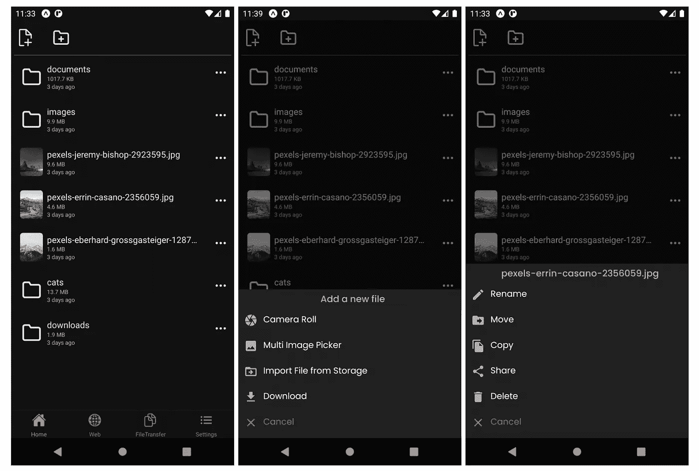
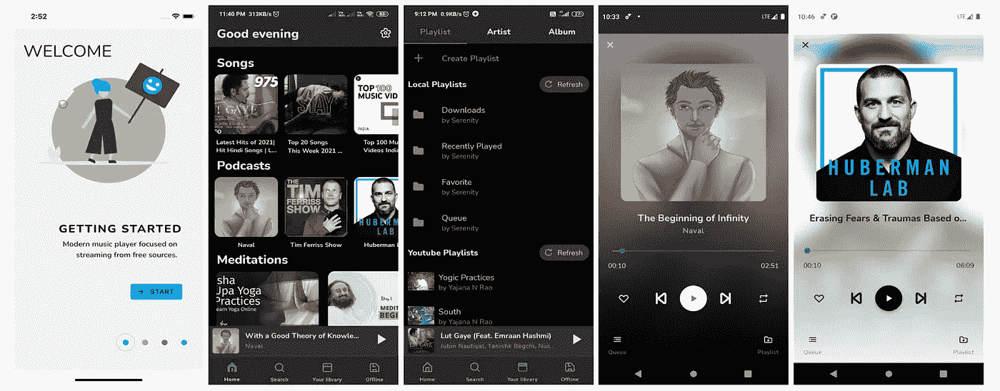
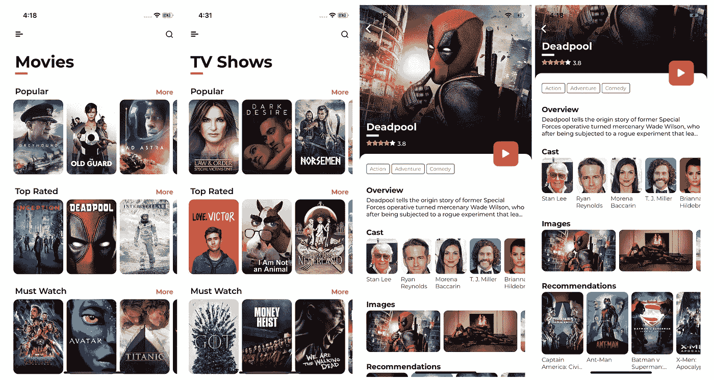
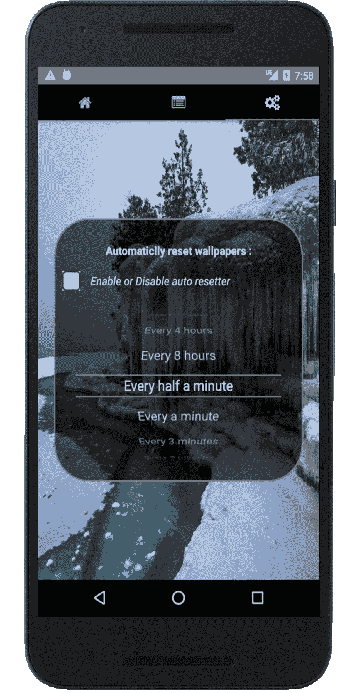
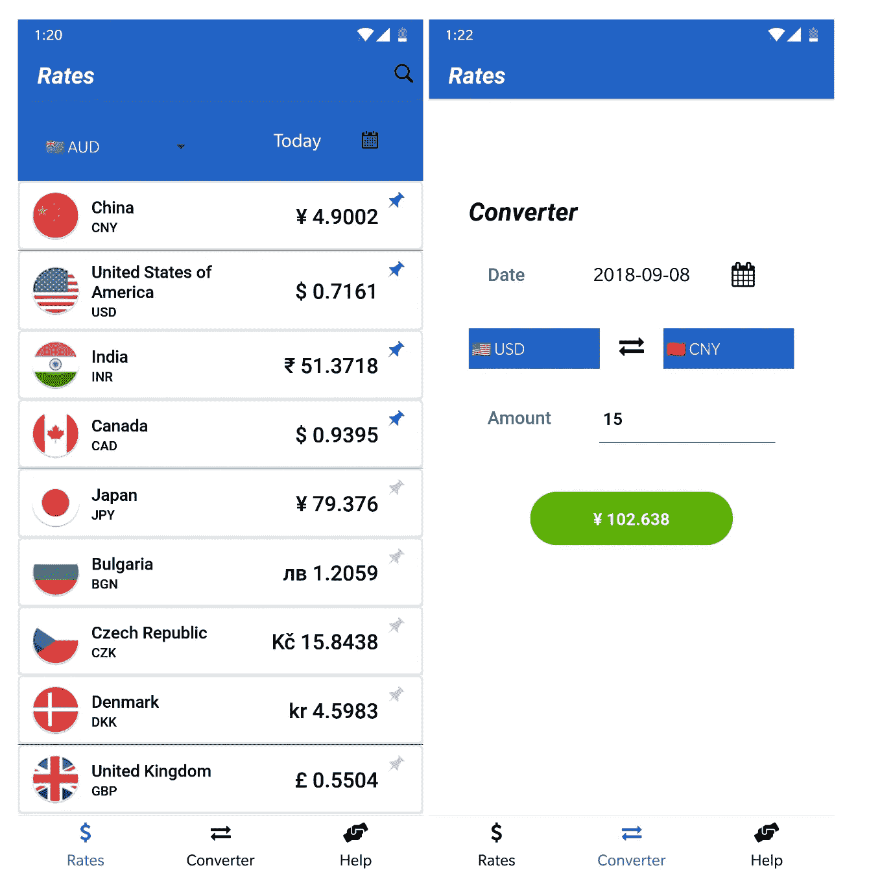

# 7 对原生开源项目做出反应，成为更好的移动应用开发者

> 原文：<https://javascript.plainenglish.io/7-react-native-open-source-projects-to-become-a-better-mobile-app-developer-e33ef5b73ec?source=collection_archive---------3----------------------->

## 第 3 部分:使用这些 React 原生开源项目增强您的移动应用程序开发。


Photo by [Marvin Meyer](https://unsplash.com/@marvelous?utm_source=medium&utm_medium=referral) on [Unsplash](https://unsplash.com?utm_source=medium&utm_medium=referral)

提高开发技能的最好方法之一是阅读大量代码。开源项目是学习最佳实践、编码风格和其他主题的最有价值的资源。

跨平台移动应用开发是软件开发的需求领域之一。React Native 是您可以用来创建跨平台移动应用程序的最佳工具之一。今天我们将了解 7 个 React 原生开源项目，它们可以帮助你更好地开发移动应用。

# 1.博览会文件管理器



正如你从名字中猜到的，这是一个用 React Native & Expo 制作的文件管理器应用程序。您可以使用此应用程序直接从网站下载文件，以及从照片库中导入和导出照片和视频。除非手机是 root 的，否则应用程序管理的文件隐藏在应用程序的文件夹中，无法通过手机的默认文件管理器访问。

[](https://github.com/martymfly/expo-file-manager) [## GitHub-martyfly/Expo-file-manager:一个用 React Native & Expo 制作的文件管理器应用程序

### 一个用 React Native & Expo 构建的文件管理器应用。使用此应用程序，您可以将照片和视频从照片导入/导出到照片…

github.com](https://github.com/martymfly/expo-file-manager) 

# 2.宁静



这是一个音频播放器，专注于播放音乐、冥想和播客。它可以让你从各种来源播放歌曲，包括本地和在线存储设备。它提供了许多其他功能，如按流派浏览，创建播放列表和播放保存的播放列表中的歌曲，管理歌曲队列等。这个项目仍在开发中。

[](https://github.com/YajanaRao/Serenity) [## GitHub - YajanaRao/Serenity:音频播放器，从音频源流式传输和下载🎸

### 成为测试者下载 Serenity 是一款音频播放器，专注于播放音乐、冥想和播客。它…

github.com](https://github.com/YajanaRao/Serenity) 

# 3.反应-本地-新闻-应用程序


该应用程序提供突发新闻标题，并根据您的兴趣和国家偏好过滤简短描述。你将能够从这个应用程序中学习 redux、redux-persist、expo、react-navigation 等。

[](https://github.com/fromtexas/react-native-news-app) [## GitHub-fromtexas/react-native-news-app:获取带有简短描述的突发新闻标题…

### 安卓只反应原生新闻 app。获取带有简短描述的突发新闻标题，根据您的兴趣和…

github.com](https://github.com/fromtexas/react-native-news-app) 

# 4.每日电影



相信你已经明白了，这是一款影视节目移动应用。这是使用 [TMDb](https://www.themoviedb.org/) API 创建的。这个应用程序提供了许多功能，如搜索电影和电视节目，发现电视和电影，观看相关视频，查看与电影相关的图像等。你可以从 PlayStore 和 AppStore 获得这款应用。

[](https://github.com/ahnafalfariza/MoviesDaily) [## GitHub-ahnafalfariza/Movies daily:电影和电视节目移动应用程序。使用 react 构建…

### 电影和电视节目移动应用。适用于 iOS 和 Android。作为个人项目开发，使用…

github.com](https://github.com/ahnafalfariza/MoviesDaily) 

# 5.在线壁纸



这是一个易于使用的 Android 壁纸管理器，通过使用 Reddit API 获得平台用户共享的最新壁纸。并且允许用户从无限数量的壁纸中进行选择。用户可以从类别列表中选择他们想要的壁纸种类。另外，你可以在选择一个之前浏览它们。此外，它有能力自动设置一个新的随机壁纸从选定的类别为用户指定的持续时间。

[](https://github.com/mrf345/online-wallpapers) [## GitHub-MRF 345/online-wallpapers:用 react-native 和 utlizes 构建的 Android 壁纸管理器…

### 一个简单易用的 Android 壁纸管理器，它利用 reddit API 来获取最新的壁纸

github.com](https://github.com/mrf345/online-wallpapers) 

# 6.PegavaDatingApp


如果你有兴趣创建一个约会应用程序，那么这是一个很好的资源给你。Pegava 是一款很好看的交友 app。你将能够从这个应用程序中学习 TypeScript，React Native Reanimated，React-Redux，Styled-components 等。

[](https://github.com/GSTJ/PegavaDatingApp) [## GitHub - GSTJ/PegavaDatingApp:💖一个得到爱的地方。Pegava 是一个漂亮的约会应用程序…

### 一个地方得到一些爱完整的响应设计位于这里:Figma 链接(主题是根据系统…

github.com](https://github.com/GSTJ/PegavaDatingApp) 

# 7.外汇-汇率-手机-应用



这是一个外汇汇率和货币转换器手机应用程序。你也可以从这个应用程序中查看历史外汇汇率。在 [PlayStore](https://play.google.com/store/apps/details?id=com.forexrates) 有售。

[](https://github.com/MicroPyramid/forex-rates-mobile-app) [## GitHub-MicroPyramid/forex-rates-mobile-app:外汇汇率，货币转换器手机应用程序…

### 此时您不能执行该操作。您已使用另一个标签页或窗口登录。您已在另一个选项卡中注销，或者…

github.com](https://github.com/MicroPyramid/forex-rates-mobile-app) 

# 另一部分在哪里？

有很多很棒的 React 原生开源资源。我想分享尽可能多的资源，让你的开发之旅更轻松。

如果你想知道更多精彩的开源资源，请查看下面。

[](/7-react-native-open-source-projects-to-become-a-better-mobile-app-developer-43a77b1cb389) [## 7 对原生开源项目做出反应，成为更好的移动应用开发者

### 增强您的移动应用开发

javascript.plainenglish.io](/7-react-native-open-source-projects-to-become-a-better-mobile-app-developer-43a77b1cb389) [](/7-react-native-open-source-projects-to-become-a-better-mobile-app-developer-345840199fcd) [## 7 对原生开源项目做出反应，成为更好的移动应用开发者

### 第 2 部分:增强您的移动应用程序开发

javascript.plainenglish.io](/7-react-native-open-source-projects-to-become-a-better-mobile-app-developer-345840199fcd) 

今天到此为止。谢谢你坚持到最后。相信这些项目会帮助你学到很多新的东西。

如果你知道任何其他漂亮的开源项目，请在评论中分享。直到我们再次见面…干杯！

```
**Want to Connect?**If you want to, you can connect with me on [**Twitter**](https://twitter.com/FarhanT99598254) or [**LinkedIn**](https://www.linkedin.com/in/farhan-tanvir-b08520151/).
```

*更多内容请看*[***plain English . io***](https://plainenglish.io/)*。报名参加我们的* [***免费周报***](http://newsletter.plainenglish.io/) *。关注我们关于*[***Twitter***](https://twitter.com/inPlainEngHQ)**和*[***LinkedIn***](https://www.linkedin.com/company/inplainenglish/)*。查看我们的**[***社区不和谐***](https://discord.gg/GtDtUAvyhW) *加入我们的* [***人才集体***](https://inplainenglish.pallet.com/talent/welcome) *。***