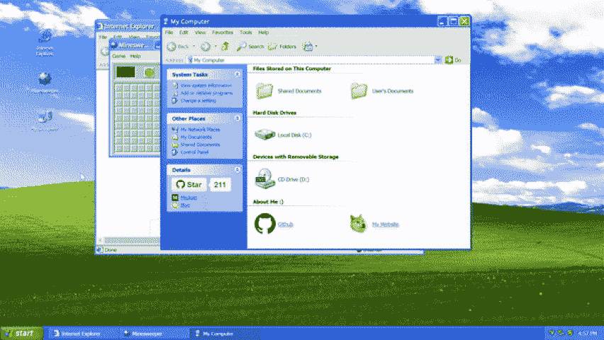
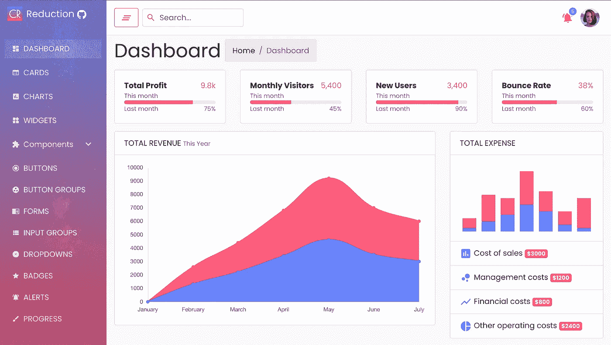
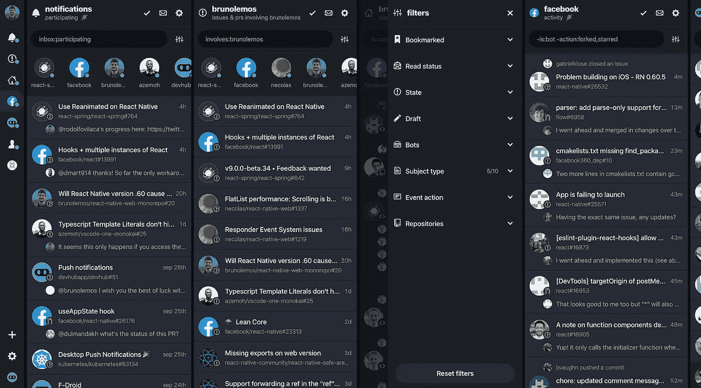
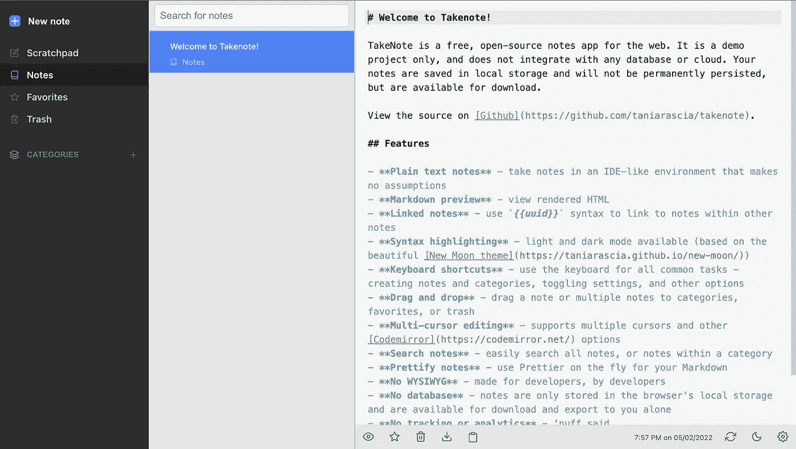
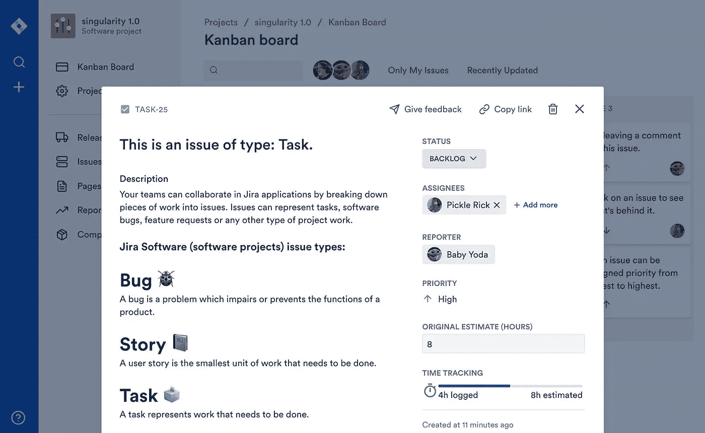
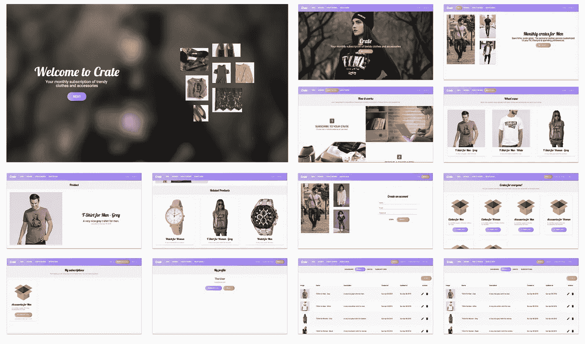
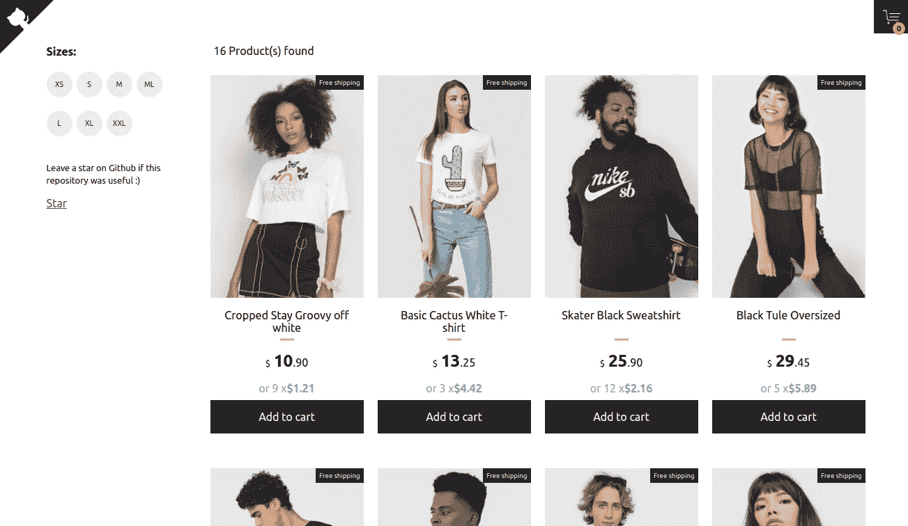

# 7 React 开源项目启发你

> 原文：<https://javascript.plainenglish.io/7-react-open-source-project-to-inspire-you-806a898fc245?source=collection_archive---------2----------------------->

## 增强你的反应能力

Photo by [Joshua Aragon](https://unsplash.com/@goshua13?utm_source=medium&utm_medium=referral) on [Unsplash](https://unsplash.com?utm_source=medium&utm_medium=referral)

开发者最好的朋友是开源项目。我相信在文档化之后，开源项目是一个很好的学习来源。

React 是创建用户界面的最好的 JavaScript 库之一。今天我们将学习 7 个 React 开源项目，它们可以帮助你成为更好的 React 开发者。

# 1.WinXP

这个项目让我怀旧。它会让你也一样。我想你已经明白了，这是一个基于 web 的 Windows XP 桌面。它提供了许多功能，如拖动和调整窗口大小，扫雷，Internet Explorer，Winamp，画图等。你可以在这里 查看现场试玩 [**。它在 Github 上有 4.9k 星。**](https://winxp.vercel.app/)

 [## GitHub - ShizukuIchi/winXP:🏁基于网络的 Windows XP 桌面娱乐。

### 🏁基于网络的 Windows XP 桌面娱乐。功能:拖动和调整大小，最小化，最大化窗口打开应用程序…

github.com](https://github.com/ShizukuIchi/winXP) 

# 2.反应还原

管理面板是大多数项目需要的东西之一。这是一个用 React 和 Bootstrap4 构建的漂亮的免费管理模板。您可以根据需要对其进行定制。可以在这里查看现场试玩**。它在 Github 上有 1.3k 星。**

** [## GitHub-Reduction-Admin/react-Reduction:用 React 构建的 React Reduction - Free 管理模板…

### 你可以看看实时预览。克隆回购 git 克隆 https://github.com/reduction-admin/react-reduction.git 去…

github.com](https://github.com/reduction-admin/react-reduction) 

# 3.DevHub

这个项目是一个移动和桌面应用程序，允许您管理 GitHub 通知并跟踪存储库活动。它同时使用 React Native 和 React Native Web，95%以上的代码在它们之间共享。这里 可以查看 app [**。它在 GitHub 上有 8.1k 颗星。**](https://app.devhubapp.com/)

 [## GitHub-devhubapp/devhub:GitHub 的 TweetDeck 过滤问题、活动和通知- Web…

### GitHub 的 TweetDeck 过滤问题、活动和通知-网络、移动和桌面，99%的代码在…

github.com](https://github.com/devhubapp/devhub) 

# 4.记笔记

我想从名字你就已经明白了，这是一款用于网络的笔记应用。这个项目是用 TypeScript、React、Redux、Node.js、Express、Webpack、Jest、Cypress、Mousetrap 和许多其他令人敬畏的开源软件创建的。你可以在这里 查看演示 [**。它在 Github 上有超过 5k 颗星。**](https://takenote.dev/app)

 [## GitHub - taniarascia/takenote:📝面向开发人员的基于网络的 notes 应用程序。

### 面向开发者的基于 web 的 notes 应用程序。

一个基于网络的 developers.github.com 笔记应用程序](https://github.com/taniarascia/takenote) 

# 5.吉拉克隆

吉拉是大多数开发人员使用的最好的问题和项目跟踪软件之一。这是一个用 React/Babel(客户端)和 Node.js/TypeScript(API)构建的简化的吉拉克隆。这是自动格式化的漂亮和柏树测试。你可以在这里查看试玩 [**。它在 Github 上有超过 8k 颗星。**](https://jira.ivorreic.com/project/board)

 [## GitHub - oldboyxx/jira_clone:用 React/Babel(客户端)构建的简化吉拉克隆，以及…

### 用 React/Babel(客户端)和 Node/TypeScript (API)构建的简化的吉拉克隆。用更漂亮的自动格式化…

github.com](https://github.com/oldboyxx/jira_clone) 

# 6.板条箱

如果您想了解如何创建一个示例电子商务网站，那么这可能是一个很好的资源。这个项目是一个使用 Node.js、Express、React、React Native、Redux 和 GraphQL 构建的示例 web 和移动应用程序。它是 stitchfix.com/krate.in 的一个非常基本的复制品(允许用户每月订阅时尚服装和配饰)。它在 Github 上有大约 23000 颗星。

 [## GitHub-atulmy/板条箱:👕 👖 📦一个用 Node，Express 构建的示例 web 和移动应用程序…

### 👕 👖 📦使用 Node、Express、React、React Native、Redux 和 GraphQL 构建的示例 web 和移动应用程序。非常…

github.com](https://github.com/atulmy/crate) 

# 7.反应-购物车

这个简单的购物车原型演示了如何在电子商务应用程序中使用 React with Typescript、React hooks、react Context 和 Styled Components，通过实时可视化更新和可伸缩代码创建友好的用户体验。可以在这里查看试玩**。它在 Github 上有 1.9k 的星星。**

** [## github-Jefferson Ribeiro/react-shopping-cart:🛍️简单的电子商务购物车应用程序

### 这个简单的购物车原型展示了如何使用 Typescript、React hooks、react Context 和样式化组件…

github.com](https://github.com/jeffersonRibeiro/react-shopping-cart)** 

**今天到此为止。相信这些项目会帮助你学到很多新的东西。**

**如果你知道任何其他漂亮的开源 React 项目，请在评论中分享。直到我们再次相遇。干杯！**

*****想连接？*****

***如果你愿意，可以在*[***Twitter***](https://twitter.com/FarhanT99598254)**或*[***LinkedIn***](https://www.linkedin.com/in/farhan-tanvir-b08520151/)***上与我联系。******

****更多内容请看*[***plain English . io***](https://plainenglish.io/)*。报名参加我们的* [***免费周报***](http://newsletter.plainenglish.io/) *。关注我们关于*[***Twitter***](https://twitter.com/inPlainEngHQ)*和*[***LinkedIn***](https://www.linkedin.com/company/inplainenglish/)*。加入我们的* [***社区不和谐***](https://discord.gg/GtDtUAvyhW) *。******