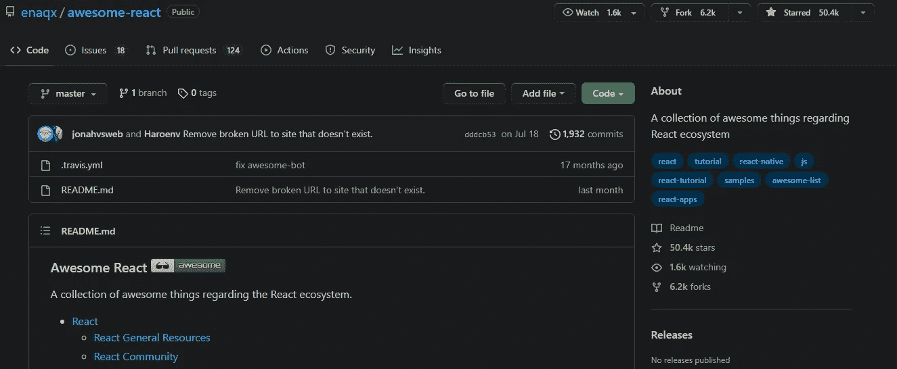
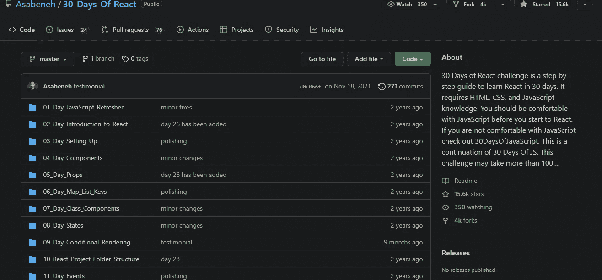
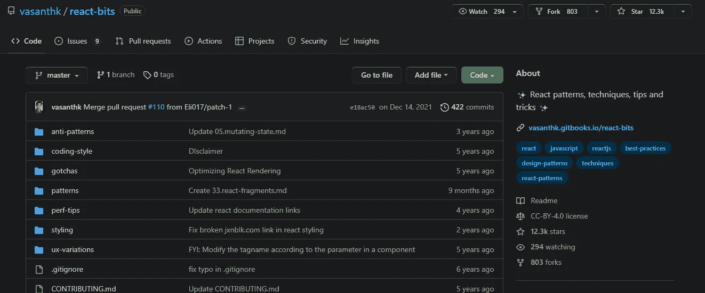
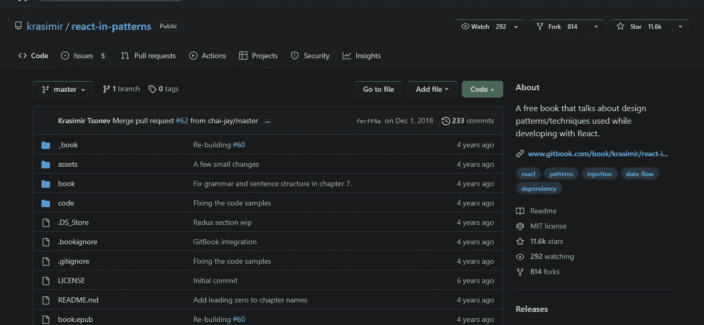
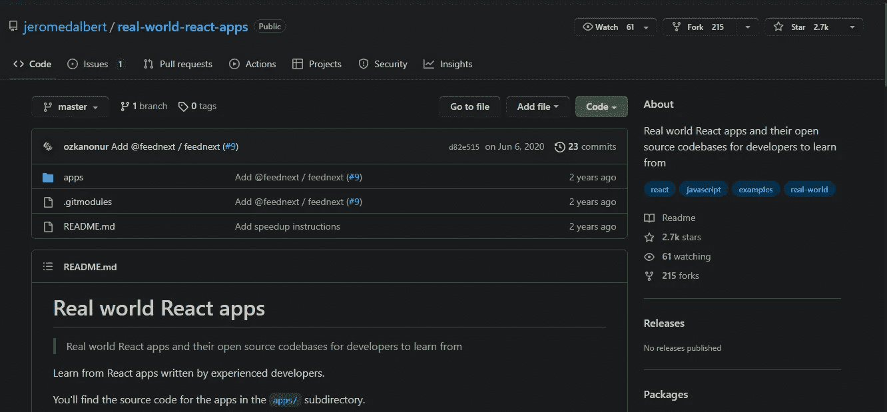
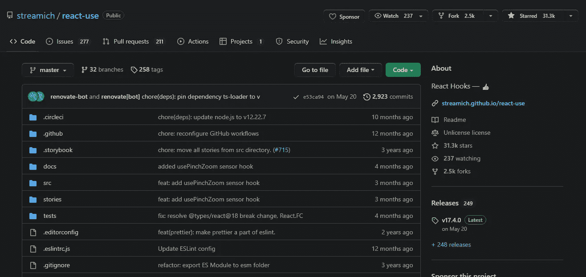

# 对 React 开发者非常有帮助的 7 个 GitHub 库🚀🎯

> 原文：<https://javascript.plainenglish.io/7-really-helpful-github-repositories-for-react-developers-21d9692c0be2?source=collection_archive---------10----------------------->

## 免费资源

## 帮助你学习和寻找灵感的资源

Photo by [Rubaitul Azad](https://unsplash.com/@rubaitulazad?utm_source=medium&utm_medium=referral) on [Unsplash](https://unsplash.com?utm_source=medium&utm_medium=referral)

有很多可用的 GitHub 库，所以找到正确的库是一个挑战。但是你什么都不用担心。如果您正在寻找 React 存储库，那么您只需要阅读这篇文章。

为了方便起见，我为 React anthracites 策划了 7 个非常有用的 GitHub 库。

这些存储库值得一试:

## 1.厉害的反应

叉子 **6.4k** |星星 **52.7k**

这是一系列与 React 生态系统相关的精彩内容，包括 React 资源、React 在线游乐场、React 社区和 React 通用资源。
React 教程涵盖 React 内部、React 性能、打字稿，以及 React 面试问题、视频、GraphQL、Redux、React Native 等相关技术。如果我只能选择一种资源，那就是这一种。

> 链接:[https://github.com/enaqx/awesome-react](https://github.com/enaqx/awesome-react)

## 2.30 天反应期

前叉 **4.6k** |星形 **17.9k**

如果你熟悉 HTML、CSS 和 JavaScript，这是学习 React 最有效的 30 天挑战。另外，建议您对 JavaScript 有一个相当透彻的理解。

> 链接:[https://github.com/Asabeneh/30-Days-Of-React](https://github.com/Asabeneh/30-Days-Of-React)

## 3.反应位

拨叉 **971** |星形 **14.3k**

这个资源库有许多有用的设计模式、技术、UX 变体、样式、陷阱、技巧和诀窍。

> 链接:[https://github.com/vasanthk/react-bits](https://github.com/vasanthk/react-bits)

## 4.反应模式

叉 **878** |星 **12.1k**

**按模式反应**是一本免费的反应书。它讨论了创建 React 应用程序时可以使用的设计模式和技术。

> 链接:[https://github.com/krasimir/react-in-patterns](https://github.com/krasimir/react-in-patterns)

## 5.真实世界反应应用

拨叉 **264** |星形 **3.1k**

真实世界 React 应用展示真实生活 React 应用及其开源代码库。这是一个学习如何构建实际应用程序的很好的知识库，我认为这是一种感受技术的有用方式。

链接:[https://github.com/jeromedalbert/real-world-react-apps](https://github.com/jeromedalbert/real-world-react-apps)

## 6.反应使用

叉 **2.7k** |星 **34.4k**

如果你对学习 React 钩子感兴趣，这是开始的地方。在这里，您可以找到一个完整的自定义 React 挂钩集合，并附有完整的文档。

> 链接:【https://github.com/streamich/react-use 

## 7.反应还原

叉 **2.5k** |星 **22k**

React、Redux、ES6 等最全面的精选教程和资源集合。查看一些有用的 React 资源。

> 链接:[https://github.com/markerikson/react-redux-links](https://github.com/markerikson/react-redux-links)

## 包裹

今天就到这里:))

所以我希望这对你有所帮助，如果有，我很感激。我期待着继续分享像这样的资源，以及其他一些与 web 开发相关的主题，但在下一个之前，请照顾好自己。

如果您有兴趣阅读更多内容，请关注我，不要忘记订阅我的时事通讯，以便在您的收件箱中收到这些故事。

[***中***](https://ishratumar.medium.com/)***|***[***推特***](https://twitter.com/ishratUmar18)***|***[***GitHub***](https://github.com/ishratUmar18/)***|***[***hash node***](https://hashnode.com/@ishratUmar18)

## ***更多内容请看*[***plain English . io***](https://plainenglish.io/)*。***

## ***报名参加我们的* [***免费周报***](http://newsletter.plainenglish.io/) *。关注我们上* [***推特***](https://twitter.com/inPlainEngHQ) ， [***领英***](https://www.linkedin.com/company/inplainenglish/) ***，***[***YouTube***](https://www.youtube.com/channel/UCtipWUghju290NWcn8jhyAw)***，以及****[***不和***](https://discord.gg/GtDtUAvyhW) ***

## ******想看看你的软件启动规模*** *？检查* [***电路***](https://circuit.ooo/?utm=publication-post-cta) *。****