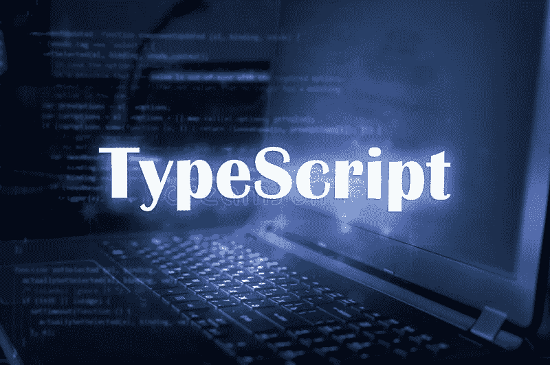

# TypeScript 优于普通 JavaScript 的 7 个原因

> 原文：<https://javascript.plainenglish.io/7-reasons-why-typescript-is-better-than-vanilla-javascript-f87528f216b6?source=collection_archive---------7----------------------->

## 编译时错误，JS 是有效的类型脚本，不必“键入”所有内容，自定义类型，接口，访问修饰符，更安全的重构

在我将 TypeScript 用于实际项目之前，我曾认为这是浪费时间。我认为，为每个变量和函数编写一个类型的文档、定制类型和接口以及为我的代码带来更多的边际效益，会花费很多精力。

我一点也不知道我会爱上打字稿。

## 1.编译时错误

与普通 JavaScript 不同，TypeScript 能够在编译时提供错误。无论您是在执行错误的类型检查，还是将错误的变量类型传递给函数，或者只是遗漏了函数 TypeScript 的必需参数，都会在编译时让您知道。这有助于避免不必要的错误，让你专注于改进你的应用程序。

## 2.JavaScript 是有效的类型脚本

TypeScript 是 JavaScript 的类型化超集，可以编译成普通的 JavaScript。这意味着您可以粘贴任何 JavaScript 文件，并将文件扩展名改为“*”。ts* "并且它将是开箱即用的有效类型脚本。

> 当你没有设置类型，并且 TypeScript 不能从上下文中推断类型时，它将得到` *any`* 类型。

如果你愿意，你可以通过*设置更严格的规则。tsconfig* 文件，这些规则帮助您实施干净的代码和最佳实践。但是，当开始使用 TypeScript 或将 TypeScript 引入大型代码库时，您可能希望开始时没有太多严格的规则，并逐渐设置更多的规则。

这使得切换到 TypeScript 的障碍非常低，并允许您只使用您实际想要/需要的 TypeScript 功能。

## 3.你不必“输入”所有的东西

TypeScript 尽其所能推断类型。只有当不清楚变量的类型时，才需要手工记录类型。当你没有设置类型，并且 TypeScript 不能从上下文中推断出类型时，它将获得 *any* 类型。

此类型允许任何形式的内容，不能进行类型检查。尽管这是一种不好的做法，但它使得切换到 TypeScript 更加容易。这意味着您可以转换您的 JavaScript 代码，并在以后担心任何类型。

当我们在我目前的职位上转换到 TypeScript 时，我们花了几个月的时间将一个大的代码库转换成小部分的 TypeScript。最后一步是不允许*任何*类型，因为这通常是流程中最困难的一步。

 [## 如何建立一个简单的网络计算器

### 使用 TypeScript 和自定义元素

javascript.plainenglish.io](/how-to-build-a-simple-web-calculator-fa0ba9c2808c) 

## 4.自定义类型

Typescript 允许您创建自定义类型。这有许多不同的用例，但是让我们看一个非常常见的例子，接收一个 API 响应。

在 JavaScript/TypeScript 代码中，您无法知道您收到的响应是什么。作为开发人员，您可能已经记住了响应的细节，您可能会查看 API 文档，或者您可能会在处理响应之前对响应进行 console.log 以查看其中的内容。

记录一次类型将有助于您了解响应中的内容，并帮助 TypeScript 更快地检测代码中的错误，此外，您的编辑器将使用该类型为您自动完成代码。

下面的代码笔中有一个自定义类型的演示。在笔的顶端，一个*事实*被创造出来。然后从一个公共 API 获取一个随机事实，并期望一个*事实*作为响应。这些数据被传递给一个函数，用事实、源和到源的 URL 创建一个块引用。

## 5.接口

除了类型之外，TypeScript 还允许我们定义接口。这两个特征非常相似。这个[线程](https://stackoverflow.com/questions/37233735/interfaces-vs-types-in-typescript)有很多关于异同的信息。

您可以在 TypeScript 中创建接口，并通过简单地在类级别声明它来要求类实现它们。这通常比继承更好，并且允许用一个简单的步骤保持许多类一致。

> 因为 TypeScript 中的所有内容都经过了类型检查，所以您可以放心，只要您在重构代码时犯了错误，TypeScript 就会告诉您。

例如，一个很好的用例是实现观察者模式。这要求主体有一个通知、附加和分离方法，观察者有一个更新方法。

如果没有一个需要实现方法的接口，实现这种模式会更容易出错。

关于实现这种模式(通过接口)的更多信息，请看我关于这种模式的文章。

 [## TypeScript 中的设计模式:观察者模式

### 编辑描述

javascript.plainenglish.io](/design-patterns-in-typescript-observer-pattern-cf0adb5e17be) 

## 6.访问修饰符

你可以将一个类的属性和方法标记为`public`、`protected`或`private`。这确保了您只公开了类中实际上应该公开的部分。

如果一个类有一个封装了一些逻辑的内部函数，你可能不希望它在类之外被使用，你也不希望你的 autocomplete 在每次使用一个类的实例时都建议这个方法。

1.  **Public—** 公共属性和方法在任何使用类实例的地方都是可用的。它们可以自由读取或调用，并通过编辑器的自动完成功能显示出来。
2.  受保护的属性和方法只在包含类和从包含类继承的类中可用。
3.  **私有** —私有属性和方法只在包含类中可用。甚至没有直接子节点可以读取或调用这些方法或属性。

*PS: JavaScript 现在也通过#variableName 符号支持私有方法/属性。*

## 7.更安全的重构

这是类型检查的一个额外好处，但它非常有价值，我认为它值得单独列出一节。

因为 TypeScript 中的所有内容都经过了类型检查，所以您可以放心，只要您在重构代码时犯了错误，TypeScript 就会告诉您。

例如，如果 API 响应已更改，并且不再接收属性。这可以从自定义类型中移除，TypeScript 将在引用该属性的任何地方引发错误，这使得捕捉对代码片段的所有引用变得快速而简单。

## TypeScript 入门

如果我激起了你的兴趣，你想试试打字稿。设置起来非常简单。我建议您看一看我写的关于如何设置 TypeScript Starter 项目的文章。这将详细介绍 TypeScript 的安装。

 [## 创建 TypeScript 初学者项目的初学者指南

### 编辑描述

javascript.plainenglish.io](/a-beginners-guide-to-creating-a-typescript-starter-project-6129deeeb973) 

## 结论

TypeScript 是一个非常棒的工具，适合大多数项目。如果你犹豫要不要尝试一下，请相信我的话，它并不像听起来那么可怕，而且比你最初想象的更有用。

如果你一路来到这里，我希望你喜欢我的文章，如果你喜欢，请留下掌声，或者如果你完全不同意，留下评论，让我们讨论我们的观点。

如果你喜欢我的内容，并想支持我的努力，考虑通过[我的会员链接](https://medium.com/@WesleySmits/membership)成为一个媒体订阅者。这不会花费你任何额外的费用，但 Medium 会把部分收益给我，让我推荐你。

如果你愿意，你可以在 LinkedIn 或者 Twitter 上和我联系！

 [## 通过我的推荐链接加入 Medium-Wesley Smits

### 阅读韦斯利·斯密特(以及媒体上成千上万的其他作家)的每一个故事。您的会员费直接支持…

medium.com](https://medium.com/@WesleySmits/membership) 

*更多内容请看*[***plain English . io***](https://plainenglish.io/)*。报名参加我们的* [***免费周报***](http://newsletter.plainenglish.io/) *。关注我们关于*[***Twitter***](https://twitter.com/inPlainEngHQ)[***LinkedIn***](https://www.linkedin.com/company/inplainenglish/)*[***YouTube***](https://www.youtube.com/channel/UCtipWUghju290NWcn8jhyAw)*[***不和***](https://discord.gg/GtDtUAvyhW) *。对增长黑客感兴趣？检查* [***电路***](https://circuit.ooo/) *。***