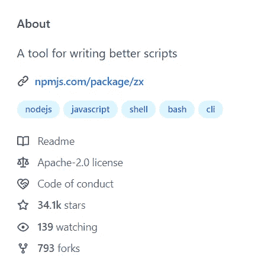

# 2022 年值得探索的 7 个前端库推荐

> 原文：<https://javascript.plainenglish.io/7-recommended-front-end-libraries-worth-exploring-in-2022-3006e22fc5a2?source=collection_archive---------6----------------------->

## 1.zx，2。Vite，3。React & Next.js，4。托里，5 岁。顺风 CSS，6。Slidev 和 7。esbuild


Photo by [Bence Halmosi](https://unsplash.com/@bencehalmosi?utm_source=medium&utm_medium=referral) on [Unsplash](https://unsplash.com?utm_source=medium&utm_medium=referral)

2022 前端要学什么，众说纷纭。但我始终相信，数据从来不会说谎。让我们来看看 2021 年《星数》即将爆发的图书馆中的“黑马”和“大师”。

## 1.zx:用 JS 编写更简单的 shell 脚本

[**zx 2021 收到 24.3K 星。**](https://github.com/google/zx)



在前端工程越来越热的今天，前端人员需要面对的工程问题也变得越来越复杂，往往需要前端 R&D 手工编写 shell 脚本。但是因为技术栈，脚本质量和开发效率都很着急。zx.js 的出现正是为了解决这种尴尬的困境！
这只是一个外壳，我可以用 JS 写出来！

```
#! /usr/bin/env zx
await $`cat package.json | grep name`let branch = await $`git branch — show-current`
await $`dep deploy — branch=${branch}`await Promise.all([
 $`sleep 1; echo 1`,
 $`sleep 2; echo 2`,
 $`sleep 3; echo 3`,
])
```

zx.js 再一次向世人证明了一件事:“**凡是能用 js 实现的库，都会用 JS 实现**。”如果你也经常有写脚本的需求，那就不能错过这款 zx！

## 2.Vite:下一代前端工具

[**Vite 2021 收到 21.4K 星。**](https://github.com/vitejs/vite)


Vite(发音类似于[weɪt]，法语中的 fast)是一个由本地 ES 模块支持的 web 开发构建器。它基于开发环境中的浏览器原生 ES 导入和生产环境中的基于汇总的打包。

虽然 webpack 仍然是 2021 年无可争议的构建者之王，但活跃的前端社区终于出现了一个有能力的挑战者。Vite 直接针对 webpack 最受批评的弱点:“在开发时构建太慢了。”
Vite 采取了简单的方式，在开发时通过 esbuild 加载 ESM 格式的模块，几乎就像是“二次创业”。对于被 webpack 蜗牛般的构建速度折磨的开发人员来说，这是一个说“呜呜”的好方法。
谈到产品构建，Vite 通过包装旧的构建工具 rollup，使普通开发人员更容易参与进来。
无论你是 React 开发人员还是 Vue 开发人员，Vite 都是你想要尝试的工具。相信我，你会喜欢的。

## 3.React & Next.js:共同成就

[**React 2021 获 18.5K 星**](https://reactjs.org/) **。**

[**next . js 2021 年获得+19.7K 星增量。**](https://nextjs.org/)


我们不需要介绍 React 是什么；大家都知道。我们没想到的是，React 会在 2022 年实现如此巨大的增量。Next.js 是一个基于 React 的应用程序框架，使得 React 应用程序的开发更加容易。
构建脚本、打包命令、开发工具、路由、状态管理、网络请求、SASS/LESS、服务器端渲染。
在社区里你再也不用“选择性”了；您可以快速开始开发功能。
很爽！虽然 Next.js 是基于 React，但是 Next.js 怎么就不是 React 的成果呢？

## 4.Tauri:构建更小更快的跨平台桌面应用

[**18.0K 为金牛座 2021 星增量**](https://github.com/tauri-apps/tauri)


Tauri 是一个为所有主流桌面平台构建小型快速二进制文件的框架。开发人员可以集成任何编译成 HTML、JS 和 CSS 的前端框架来构建他们的用户界面。应用程序的后端是一个 Rust 二进制文件，带有一个 API，前端可以与之交互。

看到上面，你们很多人一定想到了另一个库:electron.js .同样的 HTML，js，和 CSS，同样的跨平台，同样的桌面应用。那么是什么让 Tauri 在 2022 年脱颖而出呢？
两个杀手锏。

*   它变小了！它的构建比 Electron 的小，因为它抛弃了巨大的 Chromium 和 Node.js，在前端使用 OS webview，在后端集成 Rust。
*   甚至更小！它的内存开销要小得多。

## 5.顺风 CSS:“原子类”CSS 实用框架的新时代

[**顺风 CSS 2021**](https://tailwindcss.com/)18.0k 星增量


这是一个实用优先的 CSS 框架，它使用“原子类”的方式与 10 年前类似。您可以将相应的 CSS 代码命名为 flex、pt-4 或 text-center。有人说这是历史的倒退。但是大人，时代变了。在当前高度组件化的时代，JS 中的 CSS 横行，原子化的 CSS 在顺风 CSS 的帮助下，显示出了便捷、高语义、高约束的优势。也许说“老树出新枝”并不恰当，但也许我们只能由衷地感叹“原子 CSS”已经风光不再了。

## 6.Slidev:基于降价的演示幻灯片

[**Slidev 2021 星增量+16.9K**](https://sli.dev/)


你还在苦于不会玩 PowerPoint 以致于你的演示看起来总是特别差吗？您是否曾经希望能够像处理自己的代码一样处理演示文档？加油！Slidev 拥有一切！对于减价爱好者来说！Slidev 是一个为开发者设计的开源库。使用 Slidev，您可以使用 Markdown 快速创建更灵活、更具表现力、更有吸引力的幻灯片。

## 7.esbuild:小偷的快速 JavaScript 打包程序

[**esbuild 2021 将获得+12.9K 星。**](https://esbuild.github.io/)


esbuild 官方认为“所有其他当前的打包工具比它们应该慢 10-100 倍。”我没有针对任何人。更确切地说，是网络包/汇总等。做得不太好。为什么？它基于 Golang，只是比 Node 快一点。高度并行的处理算法。适度特征设计。核心工具链被重写。

2021 年，esbuild 已经在前端界大放异彩，当年最大的黑马 Vite 也毫不犹豫的选择了 esbuild 作为其构建工具之一。
我们可以说，在这个效率的时代，esbuild 一定有更广阔的空间。

***欢迎关注我上***[***Twitter***](https://twitter.com/yanghui0324)*[***LinkedIn***](https://www.linkedin.com/in/hui-yang-075076245/)***，以及***[***GitHub***](https://github.com/guchen-yh)***！****

*写作一直是我的激情所在，它给了我帮助和激励他人的快乐。如果您有任何问题，请随时联系我们！*

**更多内容请看*[***plain English . io***](https://plainenglish.io/)*。报名参加我们的* [***免费周报***](http://newsletter.plainenglish.io/) *。关注我们关于*[***Twitter***](https://twitter.com/inPlainEngHQ)[***LinkedIn***](https://www.linkedin.com/company/inplainenglish/)*[***YouTube***](https://www.youtube.com/channel/UCtipWUghju290NWcn8jhyAw)*[***不和***](https://discord.gg/GtDtUAvyhW) *。对增长黑客感兴趣？检查* [***电路***](https://circuit.ooo/) *。****