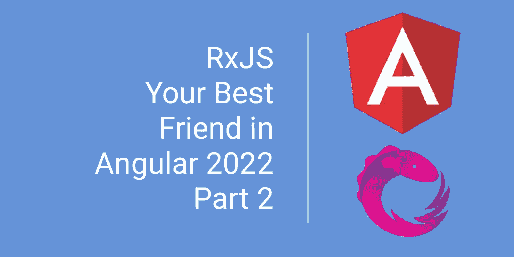
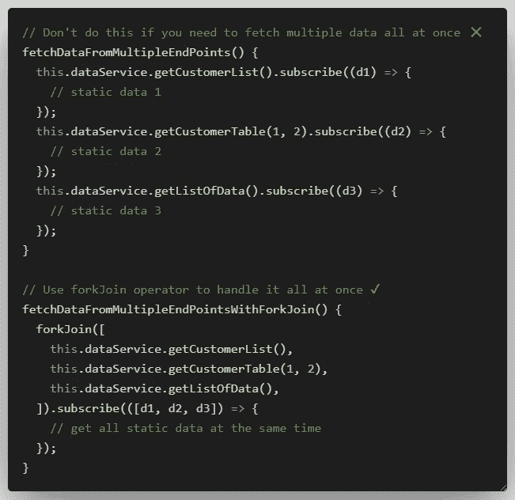
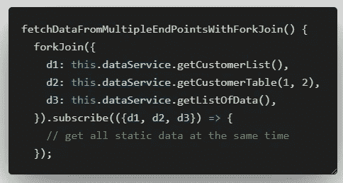
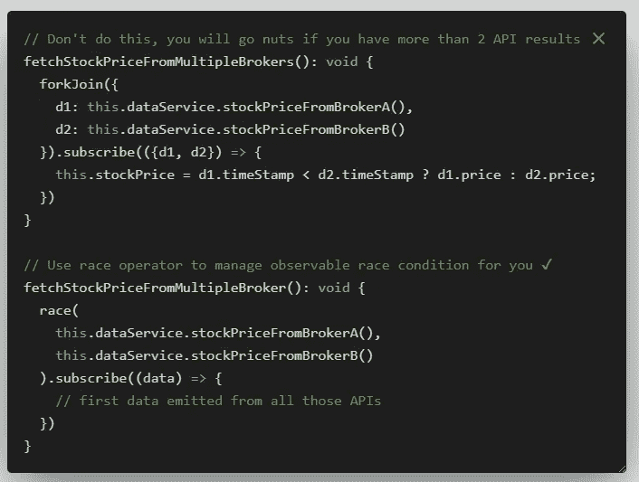
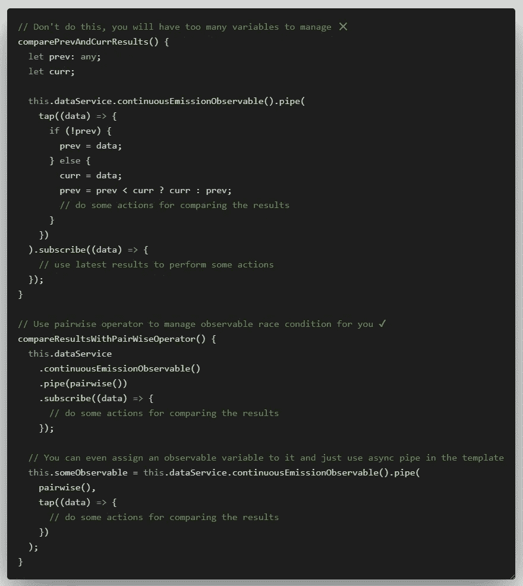
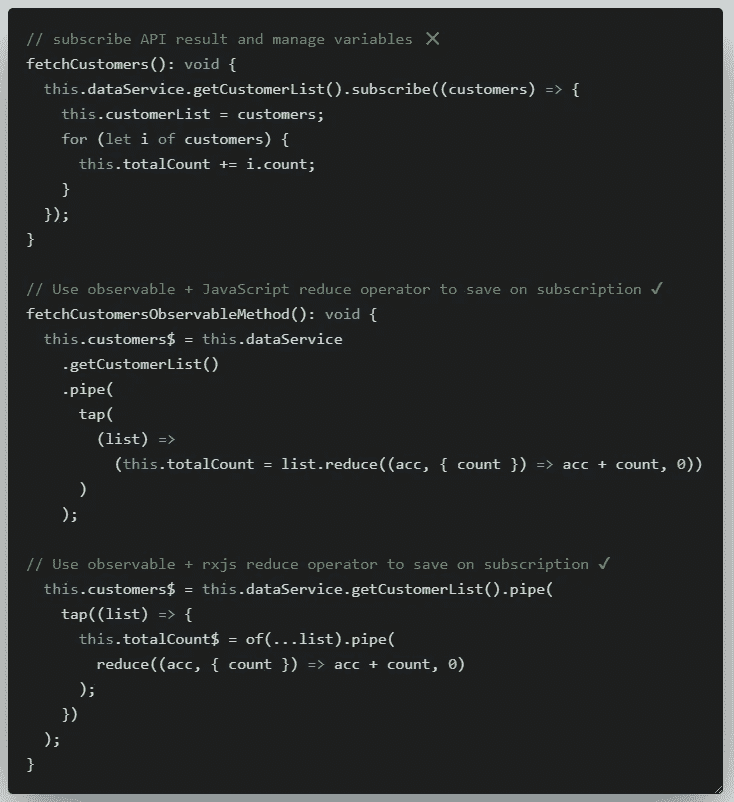
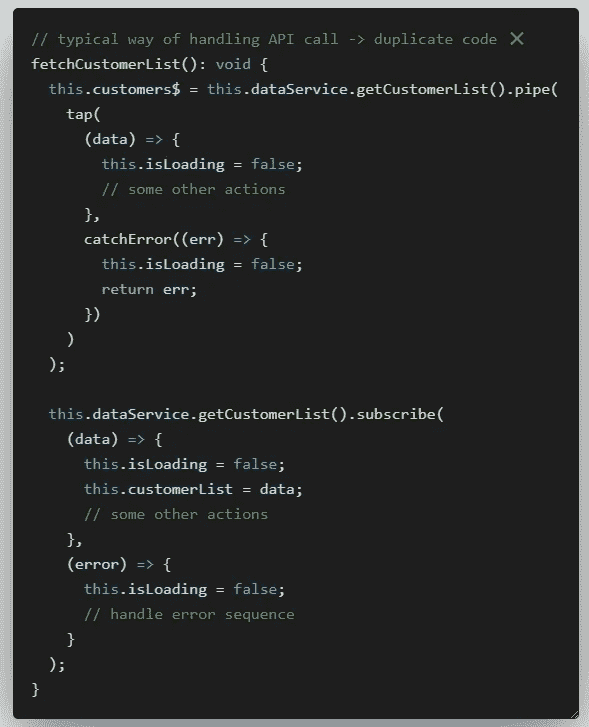
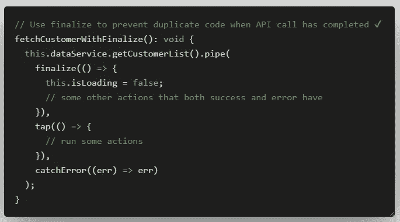
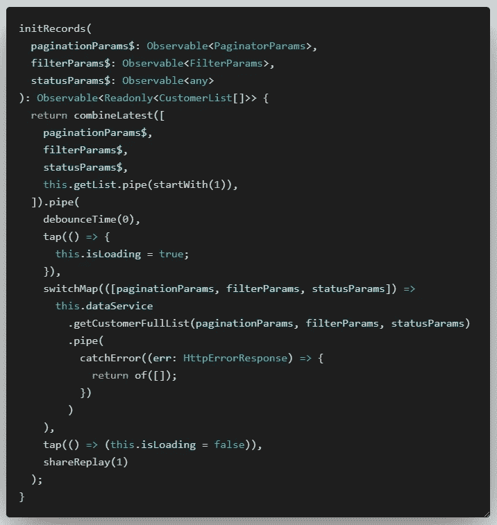
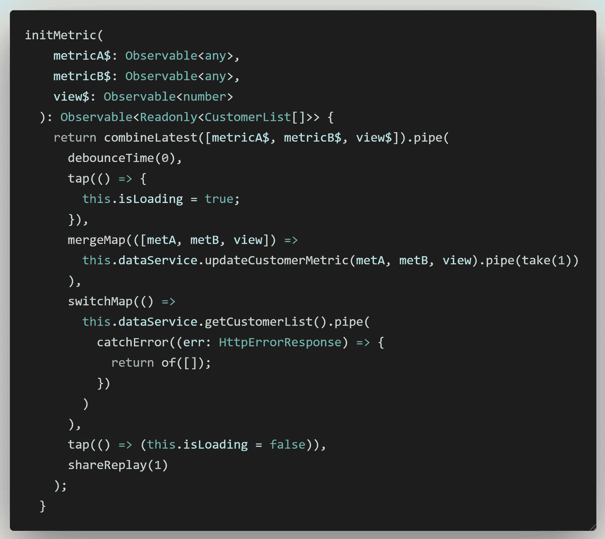

# 2022 年你应该知道的 7 个 RxJS 运营商

> 原文：<https://javascript.plainenglish.io/7-rxjs-operators-you-should-know-about-in-2022-b561786e5915?source=collection_archive---------0----------------------->

## 不要忽视这些有用的 RxJS 算子，它们可能是您角度应用的救星。

在我之前关于 **RxJS** 的文章中，我分享了一些最常用的 RxJS 操作符，每个 Angular 开发者都应该知道。这些都是关键和必要的，你不能错过你的角度应用。如果你还没有看过这篇文章，一定要看看。

 [## 遇见 RxJS:2022 年你在 Angular 最好的朋友

### 详细查看最常用的 RxJS 运算符。

javascript.plainenglish.io](/angular-rxjs-dont-let-it-be-your-enemy-make-it-your-best-friend-22e90640d0c1) 

在这篇文章中，我将介绍一些最容易被忽视的操作符，Angular 开发者没有充分利用这些操作符，但是它们有巨大的能力让 Angular 应用程序变得更好。

# 1.叉连接

需要同时调用多个 API 来取静态数据并一起得到结果？您可以将它们合并到一个 forkJoin 操作符中，作为一个整体来管理响应，而不是调用单独的 HTTP 调用并分别管理它们。

如果您想在对象中的标签下标记您的 API 请求，您可以将对象而不是数组传递给 forkJoin 操作符。

 [## 叉连接

### forkJoin 错误如果您不执行以下操作，将会丢失任何其他本应完成或已经完成的观察值

www.learnrxjs.io](https://www.learnrxjs.io/learn-rxjs/operators/combination/forkjoin) 

# 2.人种

你是否面临这样的情况:你需要比较两个可观察结果的时间戳，以确定哪个是第一个结果，并显示在你的网站上？您可以使用 race operator 返回发出结果的第一个可观察对象，而不是要求您的后端在您的 API 响应中包含时间戳或为每个 API 调用计时。

 [## 人种

### 编辑描述

www.learnrxjs.io](https://www.learnrxjs.io/learn-rxjs/operators/combination/race) 

# 3.成对地

是否需要将之前的可观察结果与当前的可观察结果进行比较来执行某些操作？别担心，你不需要声明和`previous`和`current`变量来比较它们。您可以使用成对运算符来获得数组中可观察对象的先前和当前结果，并直接比较它们。

💡这里有一个小提示，如果您已经将一个排放分配给一个可观察变量，以便在模板中使用异步管道来显示某些结果，您可以使用`tap`或`map`或其他条件运算符(`distinct` / `distinctUntilChanged` / `distinctUntilKeyChanged`)来帮助您比较结果。

 [## 成对地

### 将以前和当前的值作为数组发出。

www.learnrxjs.io](https://www.learnrxjs.io/learn-rxjs/operators/combination/pairwise) 

# 4.减少

您是否有这样的 API 响应，它要求您在返回结果之前做一些加法或数学运算，但您仍然希望遵守 Angular 遵循的可观察模式？您可以选择这两种方法，而不是传统的订阅结果的方法，并将值赋给一个变量。

这两种方法都允许您不订阅结果，而只使用模板上的`async`管道来获得您在显示中需要的结果。😀

 [## 减少

### 将源可观察值减少为源完成时发出的单个值。

www.learnrxjs.io](https://www.learnrxjs.io/learn-rxjs/operators/transformation/reduce) 

# 5.完成

您是否有一些需要在 API 调用成功时运行的代码，以及一些需要在异常发生时在 catch error 块中运行的代码？

你的感觉和我一样吗？成功和错误块中有太多重复代码。在上面的例子中，我只管理了 1 个`isLoading`变量。假设您在两个代码块中都要处理多个状态。更好的方法是使用`finalize`，删除成功和错误块中的重复代码，并将这些代码放在`finalize`块中，以便在 API 调用完成时运行。

 [## 最终确定

### 编辑描述

www.learnrxjs.io](https://www.learnrxjs.io/learn-rxjs/operators/utility/finalize) 

# 6.开关图

您是否有多个观察对象与获取最新客户记录列表的请求相关联？例如，将过滤器观察值、分页观察值或其他状态观察值放入一个`combineLatest`中，根据所有不同的参数获取最新的记录列表。`switchMap`可能是您在应用中需要的。

使用`switchMap`，在 API 调用完成之前对`combineLatest`中任何参数的任何更新都将取消同一 API 调用的先前正在进行的网络请求。

 [## 开关图

### switchMap 一次只维护一个内部订阅，这在

www.learnrxjs.io](https://www.learnrxjs.io/learn-rxjs/operators/transformation/switchmap) 

# 7.合并地图

根据上面关于`switchMap`的讨论，如果相反，当参数改变时，您的应用程序不想取消先前的 API 调用，您可以使用`mergeMap`来确保所有活动的 API 调用将被完成，即使参数在`combineLatest`块中改变。这个场景的用例是，如果您有多个将更新某个度量、日志或数据的侦听器，那么您会希望记录每个更改(每个更新 API 调用都要完成)。

 [## 合并地图/平面地图

### mergeMap 同时维护多个活动的内部订阅，这有可能通过长时间的…

www.learnrxjs.io](https://www.learnrxjs.io/learn-rxjs/operators/transformation/mergemap) 

# 摘要

希望这篇文章拓宽了你的知识面，激发了你对 **RxJS** 运算符的兴趣。你可能不知道在 **RxJS** 的帮助下，你的应用程序中的一些东西可以被简化或变得更容易。学习曲线真的很陡，但是你的应用程序在更干净的代码和更好的性能方面的回报会更加明显。如果有其他 **RxJS** 操作符经常被忽略但很有用，请在下面的评论中告诉我，我很想了解一下。干杯。

 [## 用我的推荐链接- DevJo 加入媒体

### 作为一个媒体会员，你的会员费的一部分会给你阅读的作家，你可以完全接触到每一个故事…

medium.com](https://medium.com/@devjo/membership) 

*更多内容看* [***说白了就是 io***](https://plainenglish.io/) *。报名参加我们的* [***免费周报***](http://newsletter.plainenglish.io/) *。关注我们关于*[***Twitter***](https://twitter.com/inPlainEngHQ)*和*[***LinkedIn***](https://www.linkedin.com/company/inplainenglish/)*。查看我们的* [***社区不和谐***](https://discord.gg/GtDtUAvyhW) *加入我们的* [***人才集体***](https://inplainenglish.pallet.com/talent/welcome) *。*