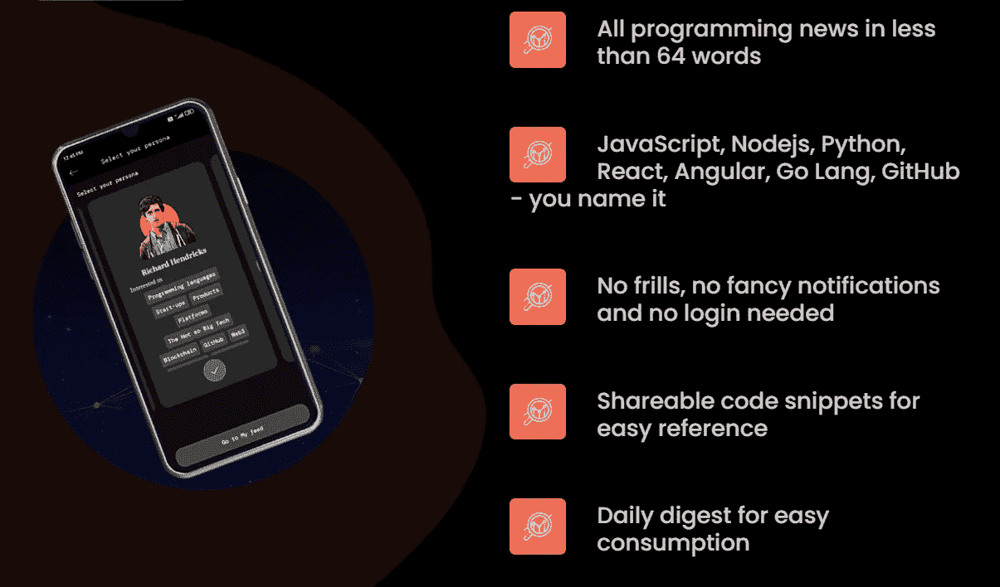
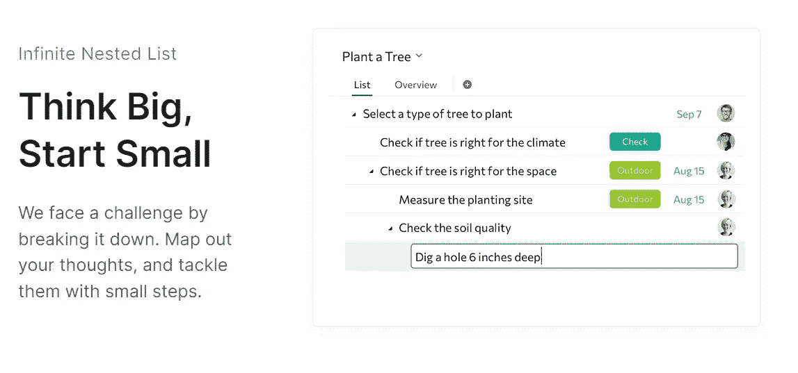
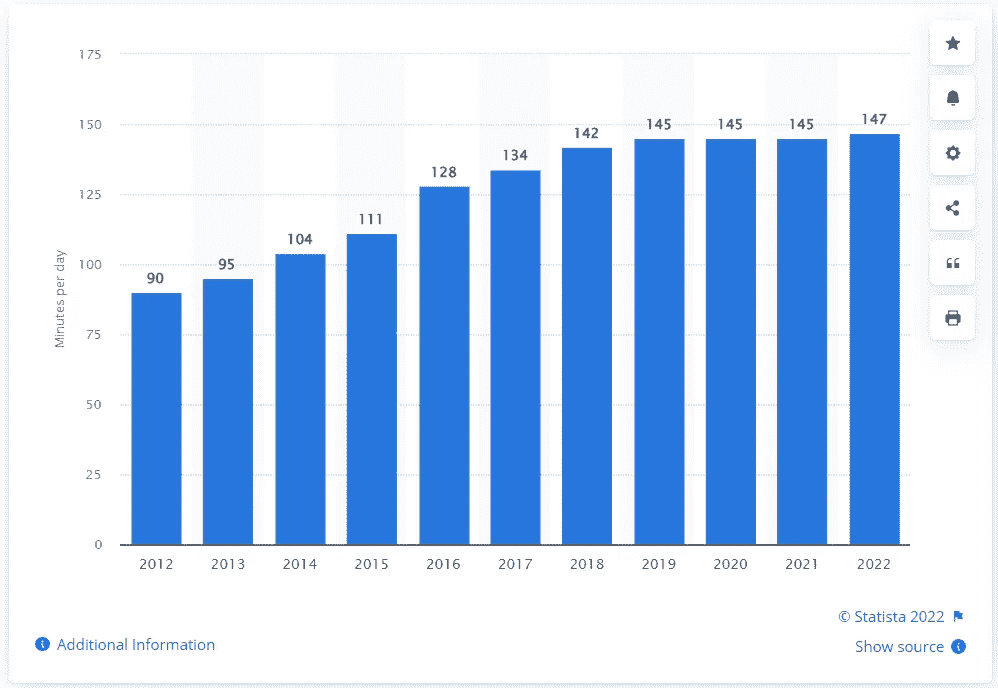
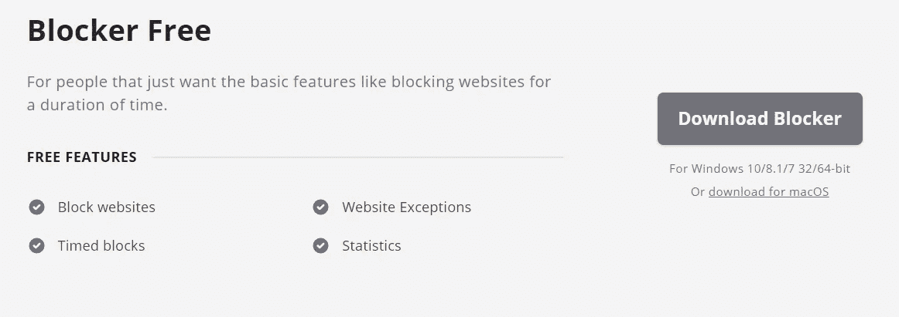
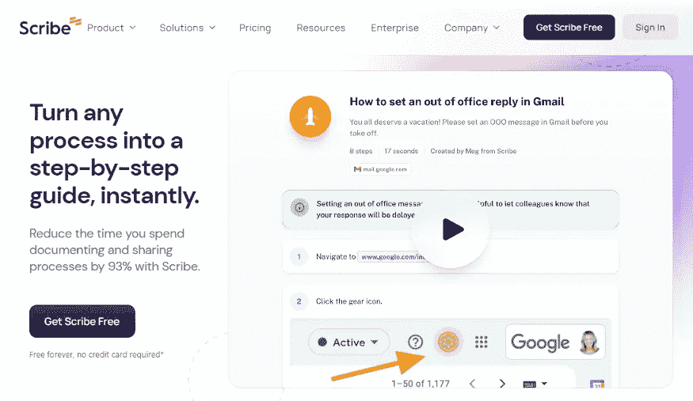
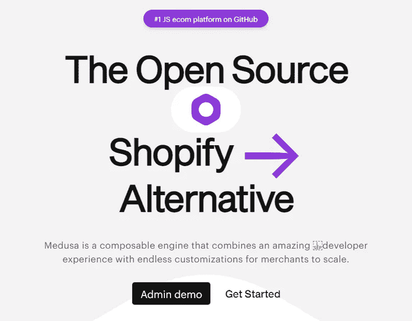

# 7 个你可能从未听说过的愚蠢简单的编程工具

> 原文：<https://javascript.plainenglish.io/7-stupidly-simple-programming-tools-youve-probably-never-heard-of-d1f0edf54645?source=collection_archive---------0----------------------->

## 它不包括 Canva、Figma 或任何类似产品。

Source: [Pexels](https://www.pexels.com/photo/joyful-confident-woman-using-netbook-in-park-3772621/)

追随任何职业，短语“富有成效”将永远是相关的。

嗯，我是一名程序员，为了赚更多的钱，我需要尽我所能提供最好的服务，这就要求我要高效。为此，我不断尝试[提高自己](/how-im-working-to-become-wealthy-as-a-programmer-4b18fc92d93f)、[保持健康](https://nitinfab.medium.com/sugar-salt-alcohol-and-caffeine-the-main-culprits-6e156cd945aa)，并使用一些最好的在线工具(当然是免费的)。

例如，设计师必须向 Adobe 支付订阅费，才能在 2016 年之前创作出设计。Figma 后来发布了，这变得容易多了，因为我(作为一名开发人员)现在也可以进行 UI 设计了。

同样的，自从 Canva 的引入，平面设计变得简单多了。但是您已经了解了所有这些工具，因此我想向您介绍一些独特的编程工具，它们将对您有所帮助。

说实话，合适的互联网工具可以帮助你成功，赚更多的钱。我将告诉你一些最好的。

让我们开始吧。

1.  [DevBytes](https://bit.ly/3A41QH4)

大多数时候，我希望以最简单的方式阅读一些最近的编程更新/博客。我喜欢使用的应用程序只有一个，那就是 DevBytes。

[DevBytes](https://bit.ly/3A41QH4) 是一个应用程序，甚至是一个 [chrome 扩展](https://chrome.google.com/webstore/detail/devbytes/hplbpdkajdhlggncdpdmnkjldopmoomg)，它聚集了来自众多出版物、科技博客和社交网站的最新编码或科技相关新闻，并用不到 64 个单词解释一切。

简而言之，你可以在不到一分钟的时间内看完博客，这将有助于你变得更有效率。

听起来不错，对吧？

我已经安装了这个应用程序，通常每天阅读一次，我很喜欢它，因为它的用户设计和令人愉快的功能。如果你是程序员、开发人员、产品经理，或者在 IT 部门工作，这个应用会给你很大帮助。

你可以通过点击[这里](https://bit.ly/3A41QH4)来获得这个应用(目前只对 android 用户开放)，这里是 [chrome 扩展](https://chrome.google.com/webstore/detail/devbytes/hplbpdkajdhlggncdpdmnkjldopmoomg)的链接。

**2。** [**Quire**](https://quire.io/) **，**[**smart task**](https://www.smarttask.io/)**，**[**Asana**](https://asana.com/)**，或者** [**周一**](https://monday.com/)

Source: Quire

如果您关注我，您可能会意识到我以前使用 Trello，但由于其令人难以置信的功能和简单的 UI，我现在已经改用 [Quire](https://quire.io/) 和类似的工具。

因为我有很多兼职，必须定期做项目，必须花时间和家人在一起，所以我必须尽可能高效地管理我的时间。

这就是为什么我不断寻找一个理想的利用。

这是我试过的众多网站中最好的一个。别担心，它是免费使用的(在一定程度上),我不会卖那些要花钱的东西。

智能任务、[体式](https://asana.com/)和[周一](https://monday.com/)是更多可能对你有用的选项。这些在一定程度上也是免费的。

这些工具可以帮助您完成日常任务、项目管理、销售监控、营销工作、人力资源活动和其他职责。

**3。**

**当人们问我如何变得更有效率时，我告诉他们屏蔽掉令人分心的网站、游戏和应用程序。**

**我们大多数人把大部分时间花在社交媒体平台上，比如 YouTube、Instagram、脸书、Reddit 等等。**

**如果你不相信我，考虑一下统计数据。**

****

**Source: [Statista](https://www.statista.com/statistics/433871/daily-social-media-usage-worldwide/)**

**根据统计数据，个人平均每天花 147 分钟在社交媒体上。而且，正如前几年所显示的那样，这一数字还在继续上升。**

**你可能想知道解决方案是什么。简单地关掉所有干扰，你可以用[冷火鸡](https://getcoldturkey.com/)来做这个。**

**它在一定限度内是自由的。**

****

**Source: [Cold Turkey](https://getcoldturkey.com/pricing/)**

****4。****

********

****Source: Wappalyzer****

****作为一名 web 开发人员，我经常需要收集关于某个网站的大量信息，以了解它使用的编程语言、库和框架。****

****它提供了额外的知识，并允许我改进我正在从事的项目。****

****如果你在谷歌上搜索，那就不简单了。甚至你可能遇到过这样的情况，你想更多地了解一个网站，如技术，安全和工具，它用来为其用户服务。****

****为此， [Wappalyzer](https://www.wappalyzer.com/) 可以帮助你。****

******5。** [**划片**](https://scribehow.com/)****

********

****Source: Scribe****

****你以前可能用过织布机。它本质上是一个免费的工具，允许你录制视频，并与你的同事或同事分享网址。它还被 1400 多万人使用。****

****同样， [Scribe](https://scribehow.com/) 可以帮助你将任何流程转化为一步一步的指导。您可以使用它来生成文档、创建培训材料、帮助客户以及执行各种其他事情。****

****您也不需要手动解释该过程。只要记录下来，这个工具就会把它转换成向导。****

******6。******

************

******Source: Clockify******

******计时可以让你在几项任务中追踪你的时间。******

******这是一个免费的工具，可以记录你的工作时间，管理你的时间，提高你的工作效率。它提供了额外的功能，如在不到一分钟的时间内记录您的每周活动，并与其他应用程序进行交互。******

******您甚至可以使用该工具跟踪员工的时间，以跟踪工资单的出勤情况。******

******简单地说，它将帮助你提高生产力，给客户开账单，管理团队，分析你的公司在几个项目上的效率，等等。******

******7。 [**美杜莎**](https://medusajs.com/)******

********

****Source: Medusa****

****作为一名网站开发人员，我必须创建各种各样的网站。我经常需要管理外部数据。****

****有一些工具可以大大简化你的任务。****

****我给你举个例子。****

****假设你要建一个电子商务网站，需要很长时间。相反，考虑一下 Shopify 的开源替代品 [Medusa](https://medusajs.com/) 。****

****它使开发人员能够以最少的努力和高度的开发人员知识来构建可扩展的复杂电子商务设置，并且它可以永远免费获得。****

****希望你喜欢。****

****就这样——谢谢。****

****[*如果你喜欢阅读这样的故事，并想帮助我成为一名作家，可以考虑成为一名中等会员*](https://nitinfab.medium.com/membership) *。每月花费 5 美元，你可以无限制地访问媒体内容。如果你通过我的链接注册，我会得到一点佣金。*****

**** [## 通过我的编程生涯，我已经赚了 3000 多美元——下面是我的方法

### 当然，其中一些会让你大吃一惊。

medium.com](https://medium.com/swlh/ive-made-3-000-through-my-programming-side-hustle-here-s-how-facad58120a5)**** 

*****更多内容看* [***说白了。报名参加我们的***](https://plainenglish.io/) **[***免费周报***](http://newsletter.plainenglish.io/) *。关注我们关于* [***推特***](https://twitter.com/inPlainEngHQ) ，[***LinkedIn***](https://www.linkedin.com/company/inplainenglish/)*，*[***YouTube***](https://www.youtube.com/channel/UCtipWUghju290NWcn8jhyAw)*，以及* [***不和***](https://discord.gg/GtDtUAvyhW) *。*******