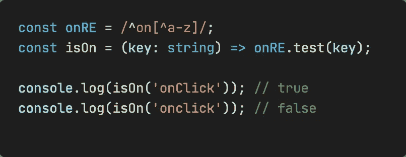
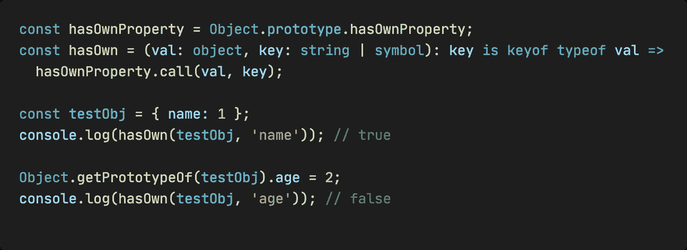
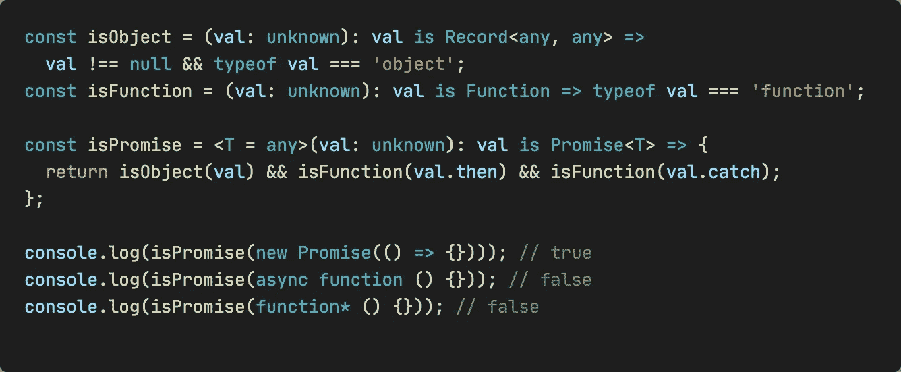
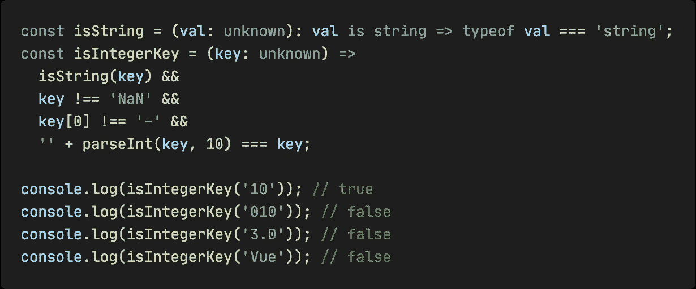
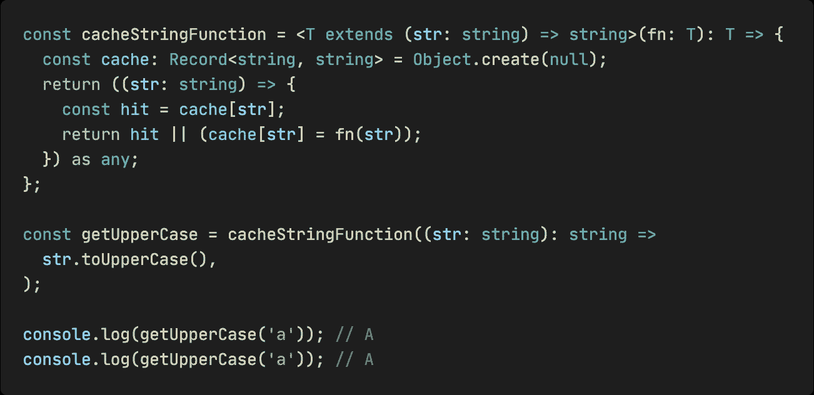
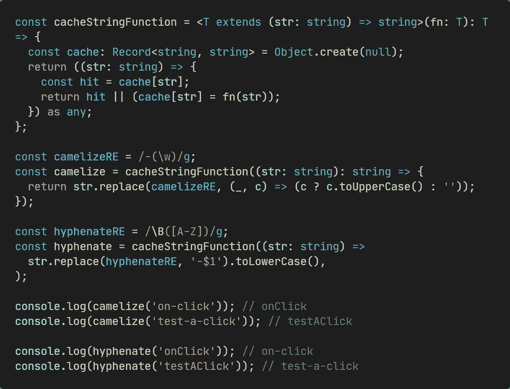
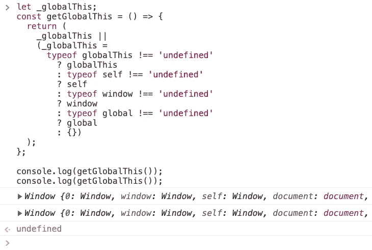

# 我从 Vue3 学到的 7 个超级有用的实用函数

> 原文：<https://javascript.plainenglish.io/7-super-useful-utility-functions-i-learned-from-vue3-adc6c93067b?source=collection_archive---------11----------------------->

## 像专家一样编写可重用的函数。


Image by Author

在本文中，我将向您展示 Vue3 中一些令人惊叹的实用函数，它们的源代码是[这里是](https://github.com/vuejs/core/blob/main/packages/shared/src/index.ts)。这些函数高度可重用，对于日常开发非常有用，所以让我们开始吧！

# 1.确定字符串是否以 on 开头



```
**const onRE = /^on[^a-z]/;
const isOn = (key: string) => onRE.test(key);**console.log(isOn('onClick')); // true
console.log(isOn('onclick')); // false
```

你可以看到它使用了常规匹配。它将匹配以`on`开头并且下一个字符不是`a`到`z`的字母。

# 2.确定 p **属性**是否是自己的



```
**const hasOwnProperty = Object.prototype.hasOwnProperty;
const hasOwn = (val: object, key: string | symbol): key is keyof typeof val =>
  hasOwnProperty.call(val, key);**const testObj = { name: 1 };
console.log(hasOwn(testObj, 'name')); // trueObject.getPrototypeOf(testObj).age = 2;
console.log(hasOwn(testObj, 'age')); // false
```

这个方法使用`Object.prototype.hasOwnProperty`来确定一个键是否是对象本身的属性。

当我们使用`Object.getPrototypeOf()`获取 testObj 的原型并在其上设置 age 属性时，hasOwn 将返回 false。

其中，它在这里使用了 TypeScript 的`is`关键字，这创建了一个用户定义的类型保护，它在运行时检查以确保它是我们在特定范围内期望的类型。如果你不确定，可以看看我之前的文章。

# 3.确定它是否是一个承诺



```
const isObject = (val: unknown): val is Record<any, any> =>
  val !== null && typeof val === 'object';
const isFunction = (val: unknown): val is Function => typeof val === 'function';**const isPromise = <T = any>(val: unknown): val is Promise<T> => {
  return isObject(val) && isFunction(val.then) &&      isFunction(val.catch);
};**console.log(isPromise(new Promise(() => {}))); // true
console.log(isPromise(async function () {})); // false
console.log(isPromise(function* () {})); // false
```

这个方法借用`isObject`来确定当前值是一个对象，借用`isFunction`来确定当前值的`then`和`catch`属性是函数。

他们三个也都使用了`is`关键字。此外，`isPromise`还使用泛型来传递 Promise 的结果类型。

# 4.确定它是否是整数字符串



```
const isString = (val: unknown): val is string => typeof val === 'string';
**const isIntegerKey = (key: unknown) =>
  isString(key) &&
  key !== 'NaN' &&
  key[0] !== '-' &&
  '' + parseInt(key, 10) === key;**console.log(isIntegerKey('10')); // true
console.log(isIntegerKey('010')); // false
console.log(isIntegerKey('3.0')); // false
console.log(isIntegerKey('Vue')); // false
```

先用`isString`判断是否为字符串类型，再判断是否为`'NaN'`且第一个字符不是`-`，最后用空字符串将`parseInt`转换的十进制数转换为字符串，判断是否等于原字符串。

# 5.缓存字符串计算结果



```
**const cacheStringFunction = <T extends (str: string) => string>(fn: T): T => {
  const cache: Record<string, string> = Object.create(null);
  return ((str: string) => {
    const hit = cache[str];
    return hit || (cache[str] = fn(str));
  }) as any;
};**const getUpperCase = cacheStringFunction((str: string): string =>
  str.toUpperCase(),
);console.log(getUpperCase('a')); // A
console.log(getUpperCase('a')); // A
```

这是一个高阶函数，它在内部使用一个闭包来缓存以前的计算结果，如果再次调用时发现已经计算过了，就返回以前的结果。

# 6.连字符到驼峰/驼峰到连字符



```
const cacheStringFunction = <T extends (str: string) => string>(fn: T): T => {
  const cache: Record<string, string> = Object.create(null);
  return ((str: string) => {
    const hit = cache[str];
    return hit || (cache[str] = fn(str));
  }) as any;
};const camelizeRE = /-(\w)/g;
const camelize = cacheStringFunction((str: string): string => {
  return str.replace(camelizeRE, (_, c) => (c ? c.toUpperCase() : ''));
});const hyphenateRE = /\B([A-Z])/g;
const hyphenate = cacheStringFunction((str: string) =>
  str.replace(hyphenateRE, '-$1').toLowerCase(),
);console.log(camelize('on-click')); // onClick
console.log(camelize('test-a-click')); // testAClickconsole.log(hyphenate('onClick')); // on-click
console.log(hyphenate('testAClick')); // test-a-click
```

以上两种方法都是用正则表达式匹配，用`String.prototype.replace()`替换字符，都是用上一节介绍的缓存函数包装的，也就是说一旦需要处理同一个字符串，会直接返回缓存结果。

# 7.获取当前环境的全局对象



```
**let _globalThis: any;
const getGlobalThis = (): any => {
  return (
    _globalThis ||
    (_globalThis =
      typeof globalThis !== 'undefined'
        ? globalThis
        : typeof self !== 'undefined'
        ? self
        : typeof window !== 'undefined'
        ? window
        : typeof global !== 'undefined'
        ? global
        : {})
  );
};**console.log(getGlobalThis());
console.log(getGlobalThis());
```

这里也使用了闭包，但是这次闭包存储的`_globalThis`是在当前加载的[模块](https://developer.mozilla.org/en-US/docs/Web/JavaScript/Guide/Modules)中，这样只需要调用一次，判断一次，不需要后续的判断。

让我们看看函数内部的逻辑，它的优先级是:

1.  使用 [globalThis](https://developer.mozilla.org/en-US/docs/Web/JavaScript/Reference/Global_Objects/globalThis) ，它提供了跨环境访问全局对象的标准方式。
2.  判断 [self](https://developer.mozilla.org/en-US/docs/Web/API/Window/self) ，这是因为在 [Web Workers](https://developer.mozilla.org%20/en-US/docs/Web/API/Worker) 中，不能访问窗口对象，只能通过 [self](https://developer.mozilla.org/en-US/docs/Web/API/Window/self) 访问当前全局对象。
3.  公共窗口对象。
4.  Node.js 中的全局[对象。](https://nodejs.org/api/globals.html#globals_global)

*今天就到这里。我是 Zachary，我会继续输出与 web 开发相关的故事，如果你喜欢这样的故事并想支持我，请考虑成为* [*中级会员*](https://medium.com/@islizeqiang/membership) *。每月 5 美元，你可以无限制地访问媒体内容。如果你通过* [*我的链接*](https://medium.com/@islizeqiang/membership) *报名，我会得到一点佣金。*

你的支持对我来说很重要——谢谢。

*更多内容请看*[***plain English . io***](https://plainenglish.io/)*。报名参加我们的* [***免费周报***](http://newsletter.plainenglish.io/) *。关注我们关于*[***Twitter***](https://twitter.com/inPlainEngHQ)*和*[***LinkedIn***](https://www.linkedin.com/company/inplainenglish/)*。加入我们的* [***社区不和谐***](https://discord.gg/GtDtUAvyhW) *。*