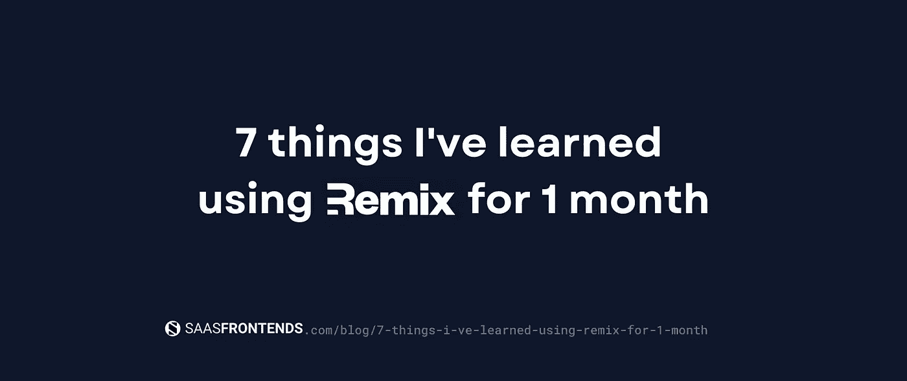
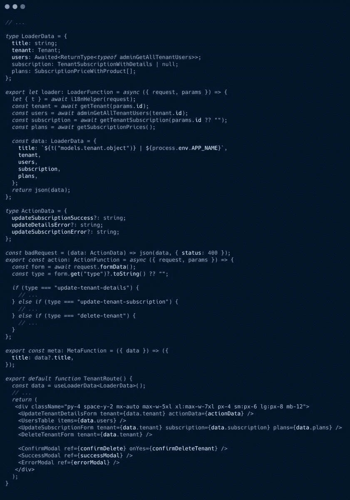
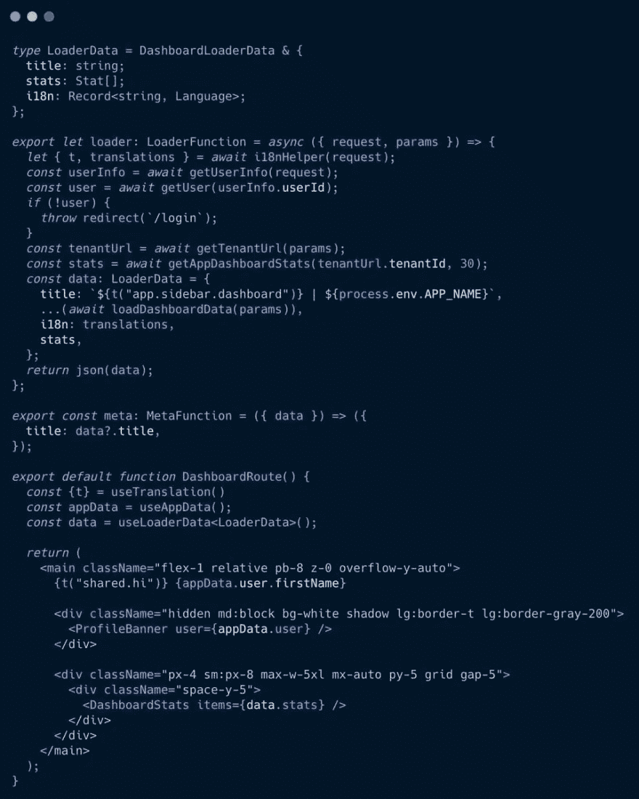
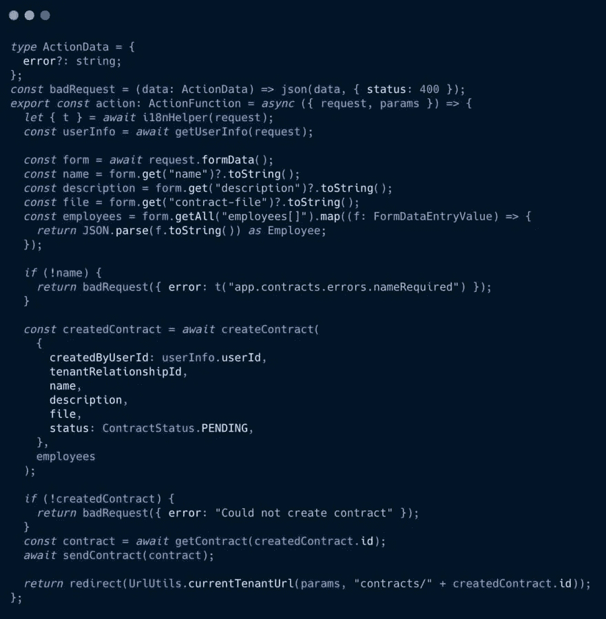
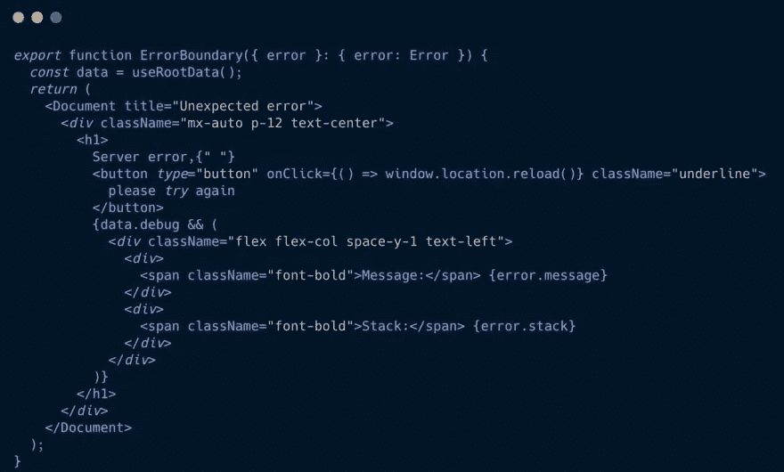
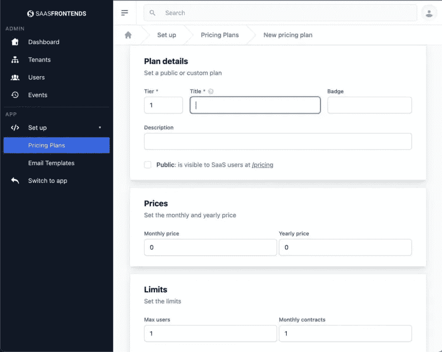
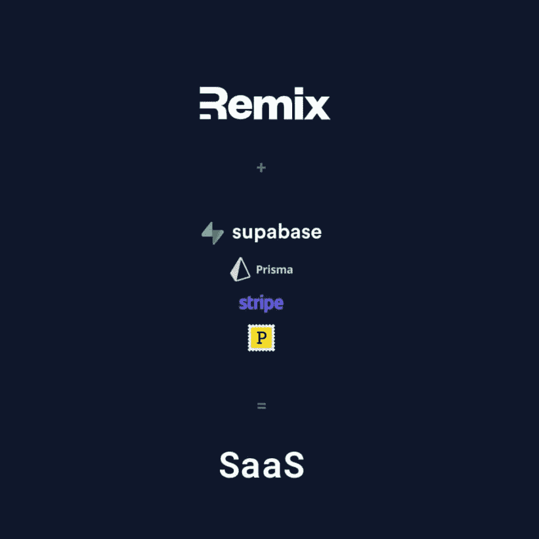

# 我用 Remix 一个月学会的 7 件事

> 原文：<https://javascript.plainenglish.io/7-things-ive-learned-using-remix-for-1-month-4c02aaf0d566?source=collection_archive---------4----------------------->

## Remix 我用了一个月遇到的最好的功能。

我已经使用[@ remix _ run](https://twitter.com/remix_run)1 个月了，它就像我以前没有用过的东西一样，这里是我遇到的一些最好的功能:

*   全栈路由💽
*   装载机⌛
*   ⚡️行动组织
*   误差边界⚠️
*   不再装载旋转器💀
*   UI/UX💅🏻
*   还有更多…

7 thins I’ve learned using Remix for 1 month

# 1.全栈路由💽

你需要的一切都在一个文件里。加载器导出以获取数据+动作导出以提交表单+一个 React 组件以处理 under 100ms 以内的 SSR。

# 2.装载机⌛

你需要在一个函数中加载的一切:用户状态，重定向未授权用户，i18n 翻译，搜索引擎优化元信息…

# 3.⚡️行动组织

验证表单提交、解析数组值、执行 DB 操作、使用第三方库(例如:发送电子邮件)，并在完成时重定向用户。

# 4.误差边界⚠️

使用 ErrorBoundary 路由导出处理意外错误，使用 ClientBoundary 导出处理预期错误。

# 5.不再装载旋转器💀

使用 SPA 意味着您必须等待服务器加载数据，同时，您需要通过给用户一个加载微调器↻.来让他们平静下来

有了 SSR，你可以得到完全互动的页面，而 Remix 则让你想都不用想。

# 6.UI/UX💅🏻

我不必放弃我从 React + Tailwind CSS 组件中学到的一切，事实上，现在我更加关注它们，以给我的用户提供出色的 UI/UX。

# 7.集成🎁

有了用于本地开发的 [@prisma](https://twitter.com/prisma) + SQLite 和用于快速⚡️ PostgreSQL prod 应用的 [@supabase](https://twitter.com/supabase) ，使用数据库从未如此简单；结合 [@stripe](https://twitter.com/stripe) 和 [@postmarkapp](https://twitter.com/postmarkapp) ，它为任何来自&当然 [@vercel](https://twitter.com/vercel) 的 SaaS 应用程序创意提供了全部动力。👌

如果 Remix 团队( [@mjackson](https://twitter.com/mjackson) ， [@ryanflorence](https://twitter.com/ryanflorence) ， [@kentcdodds](https://twitter.com/kentcdodds) )在不久的将来推出 Vue.js/Svelte+Remix 技术，让几乎所有全栈开发梦想成真，我不会感到惊讶。

给我那个可爱的三英尺。混音混音。

让我知道你的想法，或者[关注我](https://twitter.com/AlexandroMtzG)了解更多😃！

*更多内容请看*[***plain English . io***](https://plainenglish.io/)*。报名参加我们的* [***免费周报***](http://newsletter.plainenglish.io/) *。关注我们关于*[***Twitter***](https://twitter.com/inPlainEngHQ)*和*[***LinkedIn***](https://www.linkedin.com/company/inplainenglish/)*。加入我们的* [***社区不和谐***](https://discord.gg/GtDtUAvyhW) *。*