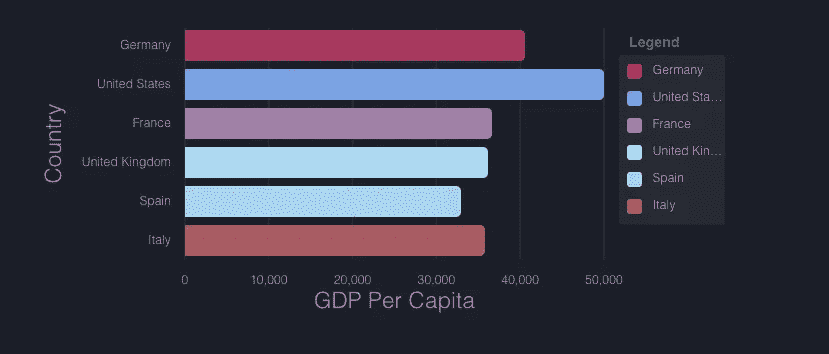
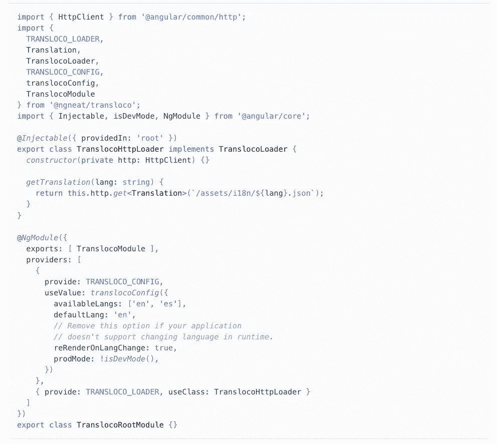
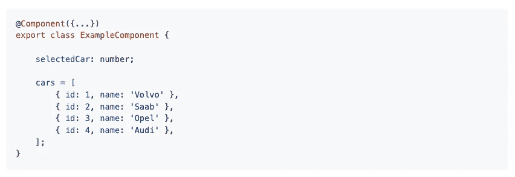
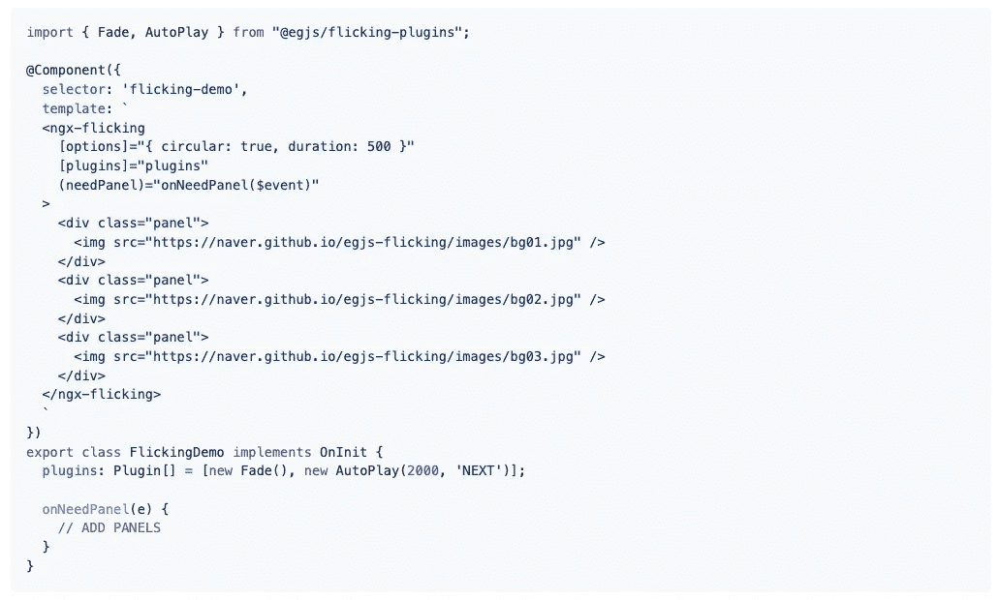
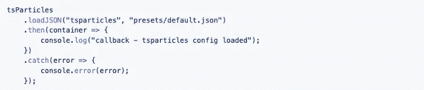
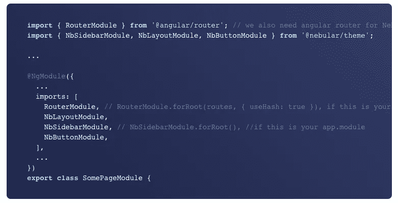
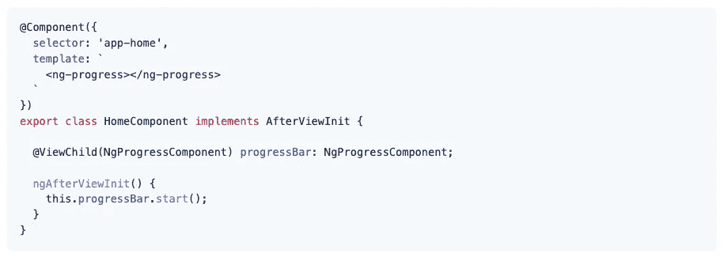

# 你应该在下一个项目中使用的 7 个有用的角度库

> 原文：<https://javascript.plainenglish.io/7-useful-angular-libraries-you-should-use-in-your-next-project-4336ab135e50?source=collection_archive---------1----------------------->

## 增强你的角度发展

Photo by [Fotis Fotopoulos](https://unsplash.com/@ffstop?utm_source=unsplash&utm_medium=referral&utm_content=creditCopyText) on [Unsplash](https://unsplash.com/s/photos/programming?utm_source=unsplash&utm_medium=referral&utm_content=creditCopyText)

当我们可以通过使用一个库轻松实现相同的结果时，为什么还要编写自定义功能呢？开发人员最好的朋友和救星是库。我相信一个好的项目会利用一些最好的可用库。

Angular 是一个基于组件的框架，它将帮助您构建可伸缩的 web 应用程序。在这里，我编译了一个 7 Angular 库的列表，它将在你的开发之旅中帮助你。

# 1.NGX 图表

如果你必须和图表打交道，那么这是一个很好的资源。这个库使用 Angular 来渲染和动画 SVG 元素及其所有的绑定和速度优势，并使用 d3 作为优秀的数学函数、比例、轴和形状生成器。它支持不同种类的图表，如水平和垂直条形图(标准、分组、堆叠、归一化)、面积图(标准、堆叠、归一化)、饼图(可展开图、网格、自定义图例)等等。它在 GitHub 上有超过 4k 颗星。

 [## GitHub-swimlane/ngx-charts:Angular 的声明性图表框架

### Angular 的声明式图表框架！ngx-charts 是独一无二的，因为我们不仅仅包装 d3，也不包装任何其他图表…

github.com](https://github.com/swimlane/ngx-charts) 

# 2.Transloco

这个库允许你为你的内容定义不同语言的翻译，并在运行时轻松地在它们之间切换。它公开了一个丰富的 API 来高效、干净地管理翻译。它提供了多个插件，将改善您的开发体验。它包括许多特性，比如支持延迟加载、同时支持多种语言、支持测试等等。它在 GitHub 上有超过 1.5k 颗星。

 [## GitHub - ngneat/transloco:🚀 😍Angular 的国际化(i18n)库

### Angular Transloco 的国际化(i18n)库允许您定义内容的翻译…

github.com](https://github.com/ngneat/transloco) 

# 3.挑选

我认为 Select 是软件开发中使用最多的组件之一。正如你已经猜到的，这个库提供了本地角度选择组件。它包括许多功能，如自定义选项、标签、页眉和页脚模板、大型数据集(> 5000 项)的虚拟滚动支持、灵活的客户端/服务器过滤自动完成功能等等。它在 GitHub 上有超过 3k 颗星。

 [## GitHub - ng-select/ng-select:本地角度选择组件

### 参见演示页面。该库正在积极开发中，可能会对后续的主要版本进行 API 重大更改…

github.com](https://github.com/ng-select/ng-select) 

# 4.NGX-闪烁

使用轮播是显示多个图像的最佳方式之一。这个库提供了一个可靠的、灵活的、可扩展的传送带。它包括许多功能，如 SSR(服务器端渲染)就绪，循环(循环)模式，恢复类似状态的位置和使用 [persist](https://naver.github.io/egjs-persist/) 的活动幻灯片，等等。它在 GitHub 上有超过 2k 颗星。

 [## egjs-flicking/packages/ngx-flicking at master naver/egjs-flicking

### 🎠♻️每天有 3000 万人经历。它是可靠、灵活和可扩展的转盘。…

github.com](https://github.com/naver/egjs-flicking/tree/master/packages/ngx-flicking) 

# 5.ts 粒子

这个库将帮助您轻松创建高度可定制的 JavaScript 粒子效果、五彩纸屑爆炸和焰火动画，并将其用作网站的动画背景。React.js、Vue.js (2.x 和 3.x)、Angular、Svelte、jQuery、Preact、Inferno、Solid、Riot 和 Web 组件可用的现成组件。它在 GitHub 上有超过 4.5k 颗星。

 [## GitHub-matteobruni/ts particles:ts particles-轻松创建高度可定制的 JavaScript…

### 轻松创建高度可定制的 JavaScript 粒子效果，五彩纸屑爆炸和烟火…

github.com](https://github.com/matteobruni/tsparticles) 

# 6.星云的

这是一个可定制的 UI 库，专注于漂亮的设计，并能够轻松适应您的品牌。它带有 4 个令人惊叹的视觉主题，一个强大的主题引擎，运行时主题切换，并支持自定义 CSS 属性模式。它基于 Eva 设计系统规范。它在 GitHub 上有超过 7.5k 颗星。

 [## GitHub - akveo/nebular:基于 Eva 设计系统黑暗模式的可定制角度 UI 库

### 文档| Stackblitz 模板| UI Bakery-Angular UI Builder | Angular 模板 Nebular 是一个可定制的…

github.com](https://github.com/akveo/nebular) 

# 7.进度条

加载数据时显示进度条是创造更好用户体验的最佳方式之一。这个库提供了一个纳米级的进度条。它以逼真的涓涓动画为特色，让你的用户相信一些事情正在发生。

 [## github-murhafsousli/ngx-进度条:角度进度条☄

### 纳米级进度条。以逼真的细流动画为特色，让你的用户相信有事情正在发生…

github.com](https://github.com/MurhafSousli/ngx-progressbar) 

# 其他一些很棒的资源在哪里？

总有新的东西要学。如果你想了解更多 React 上的精彩资源，请点击下面的链接。

 [## 你应该知道的 7 个最著名的 React 库

### 使用这些 React 库增强您的开发能力。

javascript.plainenglish.io](/7-most-starred-react-libraries-you-should-know-19fc3508d2c1) 

今天到此为止。我希望这些库有助于简化开发过程。

如果你知道任何其他有用的角度库，请在评论中分享。直到我们再次相遇。干杯！

***想要连接？*** *如果你愿意，可以在* [***推特***](https://twitter.com/FarhanTanvirBD) ***上与我联系。***

*更多内容请看*[***plain English . io***](https://plainenglish.io/)*。报名参加我们的* [***免费周报***](http://newsletter.plainenglish.io/) *。关注我们关于*[***Twitter***](https://twitter.com/inPlainEngHQ)[***LinkedIn***](https://www.linkedin.com/company/inplainenglish/)*[***YouTube***](https://www.youtube.com/channel/UCtipWUghju290NWcn8jhyAw)*[***不和***](https://discord.gg/GtDtUAvyhW) ***。*****

*****对缩放您的软件启动感兴趣*** *？检查* [***电路***](https://circuit.ooo?utm=publication-post-cta) *。***