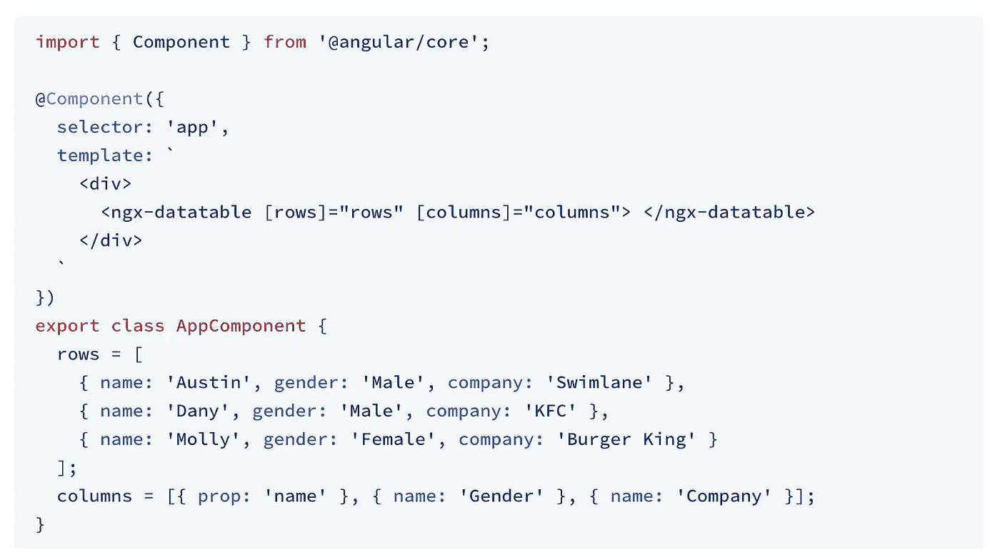
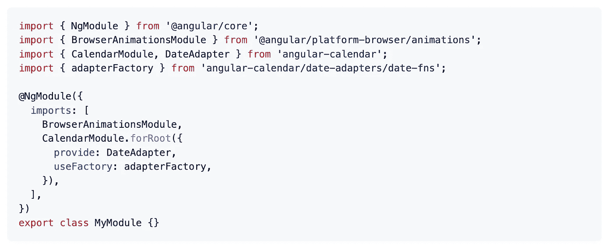
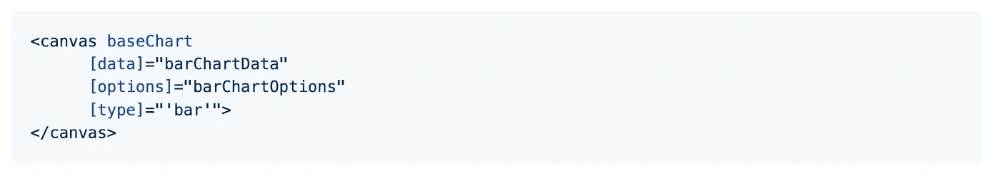
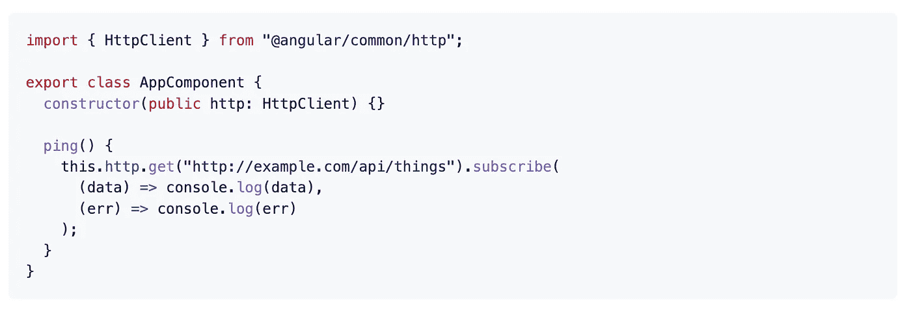
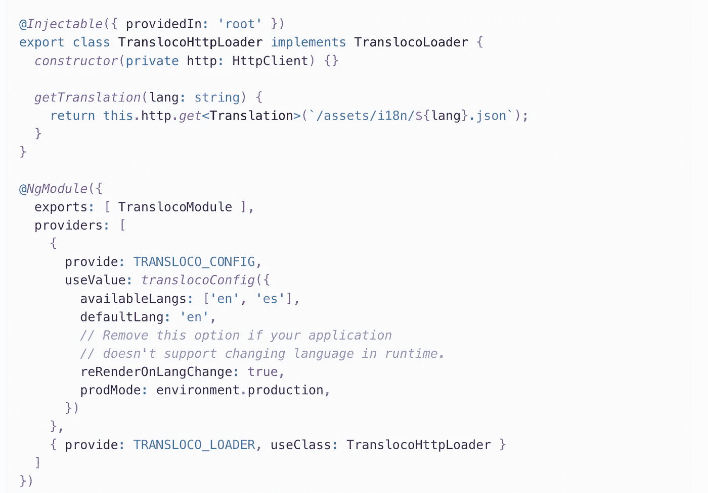
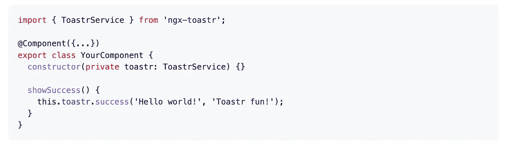
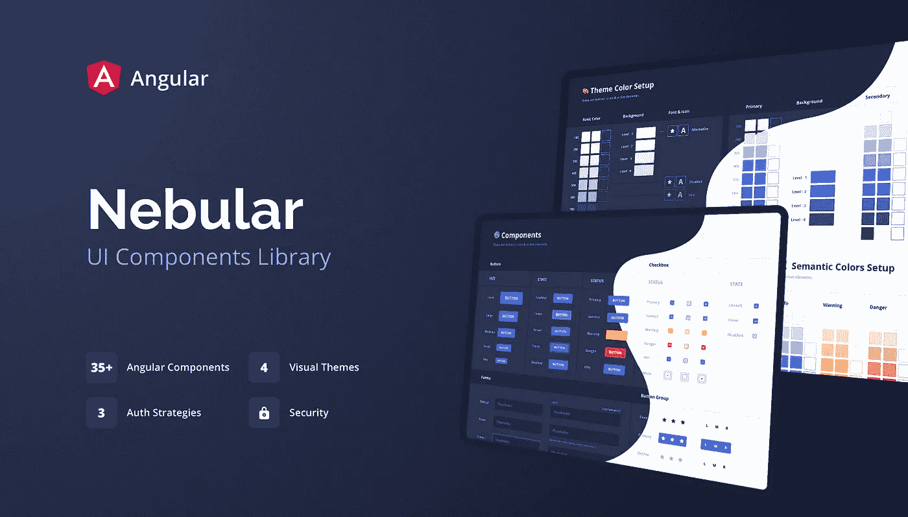

# 你应该在下一个项目中使用的 7 个有用的角度库

> 原文：<https://javascript.plainenglish.io/7-useful-angular-libraries-you-should-use-in-your-next-project-690d950ff2b2?source=collection_archive---------0----------------------->

## 增强你的角度发展

Photo by [Tudor Baciu](https://unsplash.com/@baciutudor?utm_source=unsplash&utm_medium=referral&utm_content=creditCopyText) on [Unsplash](https://unsplash.com/s/photos/angular?utm_source=unsplash&utm_medium=referral&utm_content=creditCopyText)

当我们可以通过使用一个库轻松实现相同的结果时，为什么还要编写自定义功能呢？开发人员最好的朋友和救星是库。我相信一个好的项目会利用一些最好的可用库。

Angular 是一个基于组件的框架，它将帮助您构建可伸缩的 web 应用程序。在这里，我编译了一个 7 Angular 库的列表，它将在你的开发之旅中帮助你。

# 1.数据表

我认为表格是应用程序中使用最多的组件之一。这是一个用于展示大型复杂数据的库。它具有您期望从任何其他表中获得的所有功能，但是是一个没有外部依赖性的轻量级包。这张桌子被设计得非常灵活轻便。它不会对您的数据或您如何过滤、排序或分页做出任何假设。这个库在 GitHub 上有超过 4.5k 的星星。

 [## github-swimlane/ngx-datatable:✨一个功能丰富但轻量级的数据表

### ngx-datatable 是一个角度组件，用于呈现大型复杂数据。它拥有您所期望的所有功能…

github.com](https://github.com/swimlane/ngx-datatable) 

# 2.日历

处理数据是开发人员的常见任务之一。这个库将帮助您完成这项任务。这是一个灵活的日历库，可以按月、周或日视图显示事件。它支持角度 14.0+。这个库在 GitHub 上有超过 2.5k 的星星。

 [## GitHub-mattlewis 92/angular-calendar:angular 14.0+的灵活日历组件，可以…

### angular 14.0+的灵活日历组件，可以按月、周或日视图显示事件。- GitHub …

github.com](https://github.com/mattlewis92/angular-calendar) 

# 3.图表

正如您从名称中已经猜到的那样，如果您有一个数据驱动的应用程序并且想要显示图表，这是一个很好的资源。它支持 8 种图表:`line`、`bar`、`radar`、`pie`、`polarArea`、`doughnut`、`bubble`、`scatter`。这个库在 GitHub 上有超过 2k 的星星。

 [## GitHub-valor-software/ng2-charts:基于 Chart.js 的 Angular 的漂亮图表

### 漂亮的角度图表基于 Chart.js 样本使用 ng2-charts https://valor-software.com/ng2-charts/你可以…

github.com](https://github.com/valor-software/ng2-charts) 

# 4.JWT

这个库将帮助你处理应用程序中的 jwt。它提供了一个`HttpInterceptor`，可以自动将一个 JWT 附加到`HttpClient`请求上。这个库在 GitHub 上有超过 2.5k 的星星。

 [## GitHub - auth0/angular2-jwt:用于处理 angular 应用程序中 jwt 的助手库

### 示例-常见 angular-jwt 身份验证场景的代码示例。文档网站-探索我们的文档网站并了解…

github.com](https://github.com/auth0/angular2-jwt) 

# 5.Transloco

如果你想给你的应用程序添加本地化，这是一个很好的资源。这个库允许你为你的内容定义不同语言的翻译，并在运行时轻松地在它们之间切换。它公开了一个丰富的 API 来高效、干净地管理翻译。它提供了多个插件，将改善您的开发体验。这个库在 GitHub 上有超过 1.5k 的星星。

 [## GitHub - ngneat/transloco:🚀 😍Angular 的国际化(i18n)库

### Angular Transloco 的国际化(i18n)库允许您定义内容的翻译…

github.com](https://github.com/ngneat/transloco) 

# 6.托阿斯特尔

与用户交流是应用程序的一个常见特性，显示一条 toast 消息是一个很好的方式。这个库将帮助你实现这个功能。它包括不使用`*ngFor`、AoT 编译和延迟加载兼容性、定制吐司的组件继承等特性。这个库在 GitHub 上有超过 2k 的星星。

 [## GitHub - scttcper/ngx-toastr:🍞角形托阿斯托

### 演示:https://ngx-toastr . vercel . app Toast 组件注入未通过 ViewContainerRef 未使用*ngFor…

github.com](https://github.com/scttcper/ngx-toastr) 

# 7.星云的

这是一个可定制的 Angular 10+ UI 库，专注于漂亮的设计，并能够轻松适应您的品牌。它带有 4 个令人惊叹的视觉主题，一个强大的主题引擎，运行时主题切换，并支持自定义 CSS 属性模式。Nebular 基于 Eva 设计系统规范。它在 GitHub 上有超过 7.5k 颗星。

 [## GitHub - akveo/nebular:基于 Eva 设计系统黑暗模式的可定制角度 UI 库

### 文档| Stackblitz 模板| UI Bakery-Angular UI Builder | Angular 模板 Nebular 是一个可定制的…

github.com](https://github.com/akveo/nebular) 

# 其他一些很棒的资源在哪里？

总有新的东西要学。如果你想了解更多 React 上的精彩资源，请点击下面的链接。

 [## 你应该知道的 7 个最著名的 React 库

### 使用这些 React 库增强您的开发能力。

javascript.plainenglish.io](/7-most-starred-react-libraries-you-should-know-19fc3508d2c1) 

今天到此为止。我希望这些库有助于简化开发过程。

如果你知道任何其他有用的角度库，请在评论中分享。直到我们再次相遇。干杯！

***想要连接？***

*如果你愿意，可以在*[***Twitter***](https://twitter.com/FarhanTanvirBD)***上联系我。***

*更多内容请看*[***plain English . io***](https://plainenglish.io/)*。报名参加我们的* [***免费周报***](http://newsletter.plainenglish.io/) *。关注我们关于*[***Twitter***](https://twitter.com/inPlainEngHQ)[***LinkedIn***](https://www.linkedin.com/company/inplainenglish/)*[***YouTube***](https://www.youtube.com/channel/UCtipWUghju290NWcn8jhyAw)*[***不和***](https://discord.gg/GtDtUAvyhW) *。对增长黑客感兴趣？检查* [***电路***](https://circuit.ooo/) *。***