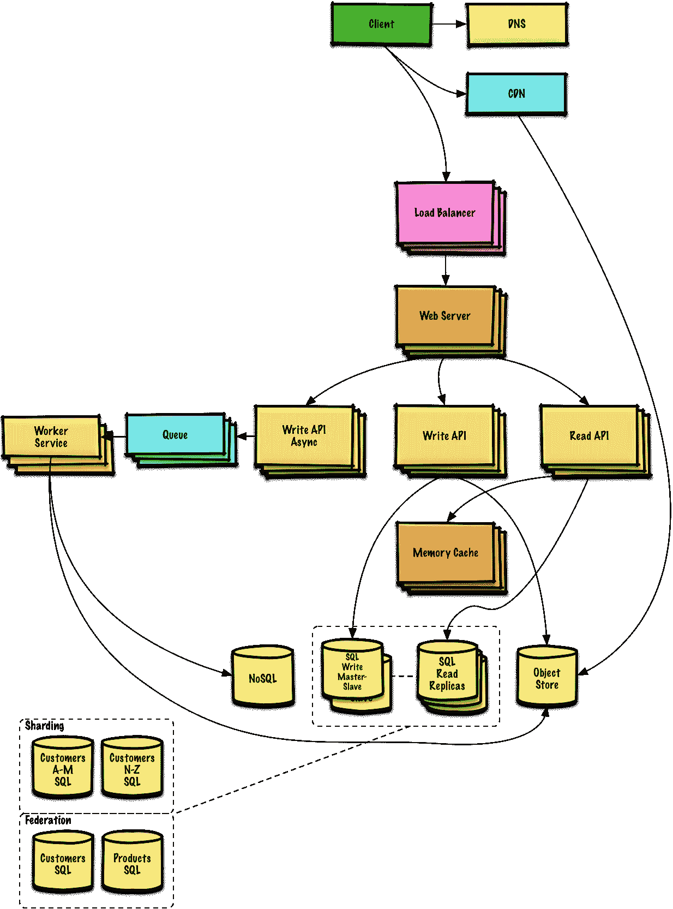
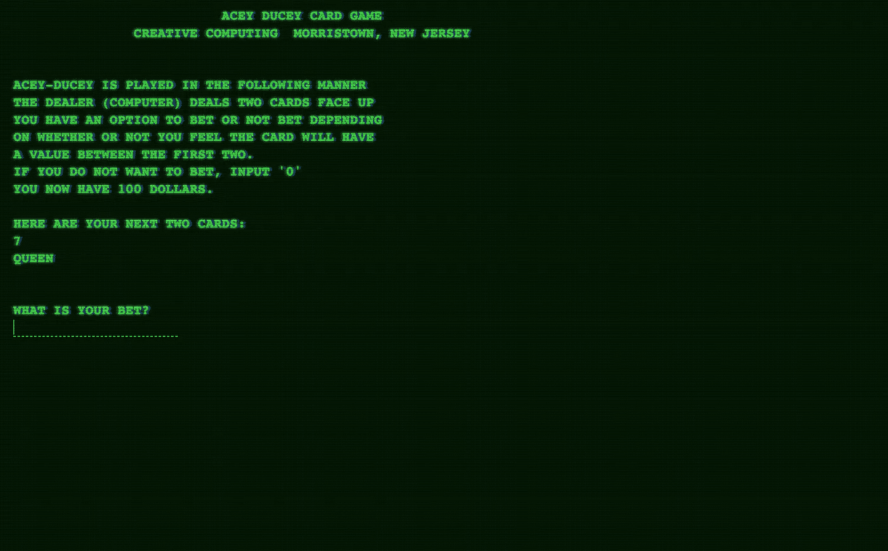
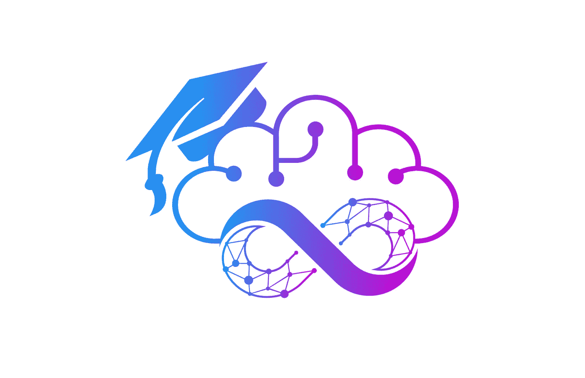
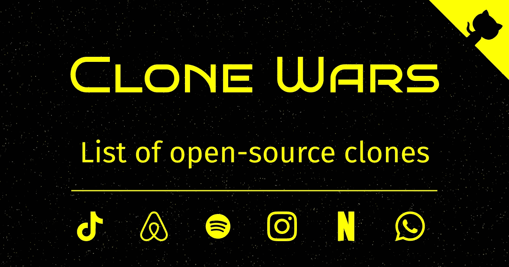

# 每个程序员都应该知道的 7 个有用的 GitHub 存储库

> 原文：<https://javascript.plainenglish.io/7-useful-github-repositories-every-programmer-should-know-515534fb432c?source=collection_archive---------7----------------------->

## 一个好的程序员总是学习

## 做一个更好的程序员

Photo by [Christopher Gower](https://unsplash.com/@cgower?utm_source=medium&utm_medium=referral) on [Unsplash](https://unsplash.com?utm_source=medium&utm_medium=referral)

作为一名程序员，有必要不断学习。开源项目是一个令人敬畏的学习场所。Github 上有很多开源项目。但是有时很难根据您的需要找到最好的存储库。在这里，我已经编译了 7 个库，将帮助你成为一个更好的程序员。

# 1.系统设计入门

如果你想成为一个更好的程序员，学习如何设计可扩展的系统是必要的。系统设计是一个广泛的话题。互联网上散布着大量关于系统设计原理的材料。这个存储库是一个组织良好的资源集合，帮助您学习如何创建像网飞、谷歌、亚马逊等大规模系统。它有超过 172 颗恒星。

 [## git hub-done Martin/system-design-primer:学习如何设计大规模系统。为…做准备

### 了解如何设计大规模系统。准备系统设计面试。学习如何设计可扩展的系统…

github.com](https://github.com/donnemartin/system-design-primer) 

# 2.基本电脑游戏

我认为这是最有趣的资料库之一。这个存储库的目标是将这些经典游戏转换成一系列现代的、内存安全的语言，比如 C#、Java、JavaScript、Kotlin 等。它包含大约 93 种不同的游戏。你可以在这里看到这些游戏的 Javascript 版本[。它有超过 7k 颗恒星。](https://coding-horror.github.io/basic-computer-games/)

 [## GitHub -编码-恐怖/基础-电脑游戏:经典“基础电脑…

### 经典“基本电脑游戏”的更新版本，在各种常见的记忆中有很好的例子…

github.com](https://github.com/coding-horror/basic-computer-games) 

# 3.学习测试驱动的开发

TDD(测试驱动开发)是一种软件开发过程，在此过程中，在软件完全开发之前，软件需求被转换为测试用例，并且通过对照所有测试用例重复测试软件来跟踪所有软件开发，从而开发软件。本教程将帮助您立即实现测试驱动开发。在接下来的 30 分钟里，您将学到所有您需要知道的关于为您的网络项目编写测试的知识。

 [## git hub-dwyl/learn-tdd:JavaScript 中的测试驱动开发(TDD)简介…

### 没有测试的项目通常看起来像是用胶带粘在一起...更改一个部分并…

github.com](https://github.com/dwyl/learn-tdd) 

# 4.技术面试手册

每个程序员都需要更擅长技术面试。不是每个人都有时间回答数百个 LeetCode 问题。该资料库包含为忙碌的工程师准备的免费和精选的技术面试准备材料。超过 50 万人从该手册中受益。太棒了。不是吗？。它也有超过 68k 个答案。

 [## GitHub -阳顺/tech-访谈-手册:💯为繁忙的…精心准备面试准备材料

### 不是每个人都有时间做几百道 LeetCode 题。这里有免费的和策划的技术面试…

github.com](https://github.com/yangshun/tech-interview-handbook) 

# 5.90 天的开发周期

DevOps 是一套文化概念、流程和工具，可以提高组织生产大量应用程序和服务的能力。如果您想学习 DevOps，这是一个为您提供的一站式资源库。这个资源库的目标是花 90 天时间，每天一个小时，了解 DevOps 的 13 个不同方面，达到核心水平。这个知识库不会涵盖关于 DevOps 的所有知识，但是它会涵盖将增强您的整体学习和理解的领域。它拥有超过 6k 颗恒星。

 [## GitHub-Michael cade/90 daysofdevops:这个库是我学习

### 这个库是我学习 DevOps 世界的文档库。我从 1 号开始这段旅程…

github.com](https://github.com/MichaelCade/90DaysOfDevOps) 

# 6.克隆人战争

学习编程的最好方法之一是创建一个巨型公司的克隆网站。在这个库中，有超过 100 个开源克隆和替代大型网站，如 Airbnb、亚马逊、Instagram、网飞、抖音、Spotify、WhatsApp、YouTube 等。源代码、教程、演示链接、技术堆栈和 GitHub star count 都包含在列表中。这是一个用于学习目的的必备存储库。它拥有超过 18k 颗恒星。

# **7。LinkedIn 技能评估测验**

Photo by [Greg Bulla](https://unsplash.com/@gregbulla?utm_source=medium&utm_medium=referral) on [Unsplash](https://unsplash.com?utm_source=medium&utm_medium=referral)

如果你想提升你的 Linkedin 个人资料，这个库是你必须要有的。顾名思义，这个知识库为你提供 LinkedIn 技能评估测验的答案和问题。它包含了大多数测验的问题和答案，如 javascript、react、机器学习、power-point 等。它有超过 13K 颗恒星。

 [## GitHub-Ebazhanov/linkedin-技能评估-测验:LinkedIn 答案 2022 的完整参考…

### 技能测评完整参考 LinkedIn answers 2022(AWS-lambda，rest-api，javascript，react，git，html…

github.com](https://github.com/Ebazhanov/linkedin-skill-assessments-quizzes) 

今天到此为止。我希望这个库将有助于使编程之旅更加容易。

如果你知道任何其他令人敬畏的仓库，请在评论中分享它们。直到我们再次见面…干杯！

***想要连接？***

*如果你愿意，可以在*[*Twitter*](https://twitter.com/FarhanT99598254)*或*[*LinkedIn*](https://www.linkedin.com/in/farhan-tanvir-b08520151/)*上与我联系。*

*更多内容请看*[***plain English . io***](https://plainenglish.io/)*。报名参加我们的* [***免费周报***](http://newsletter.plainenglish.io/) *。关注我们关于*[***Twitter***](https://twitter.com/inPlainEngHQ)*和*[***LinkedIn***](https://www.linkedin.com/company/inplainenglish/)*。加入我们的* [***社区不和谐***](https://discord.gg/GtDtUAvyhW) *。*