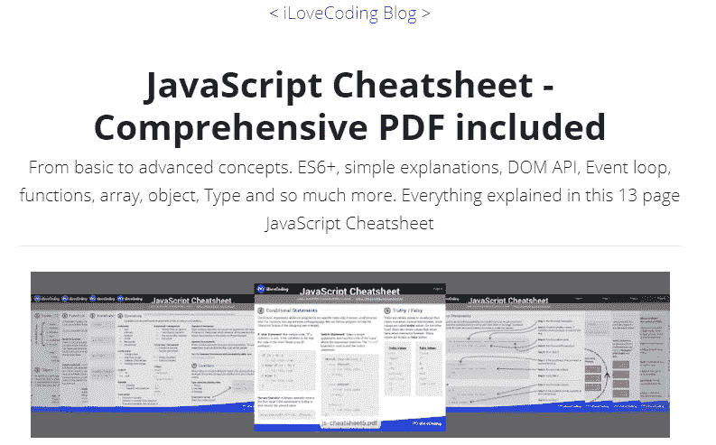
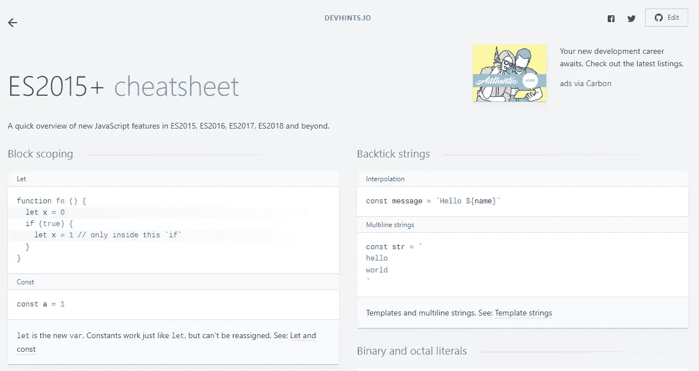
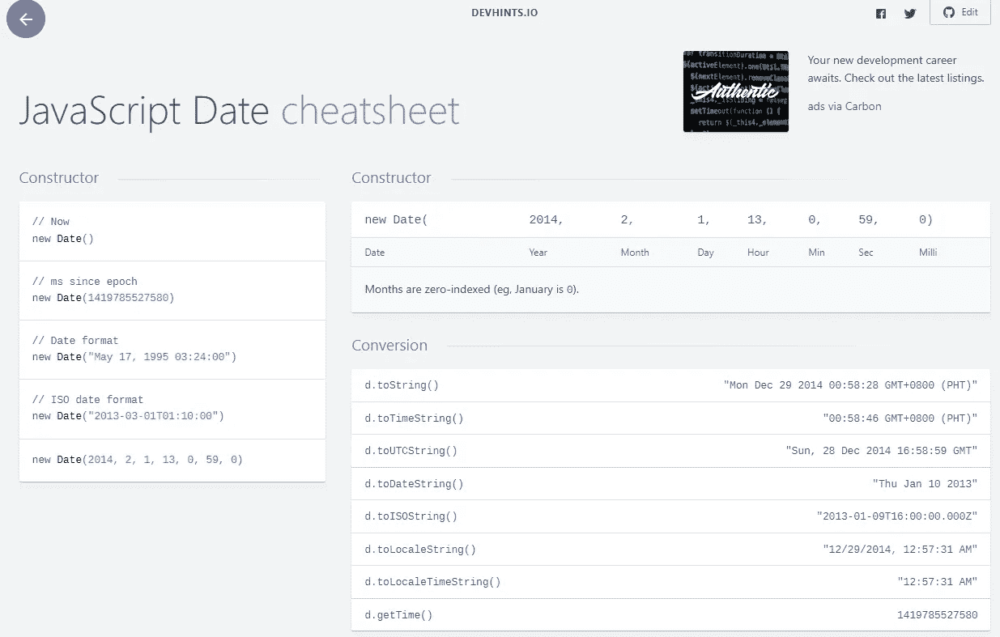
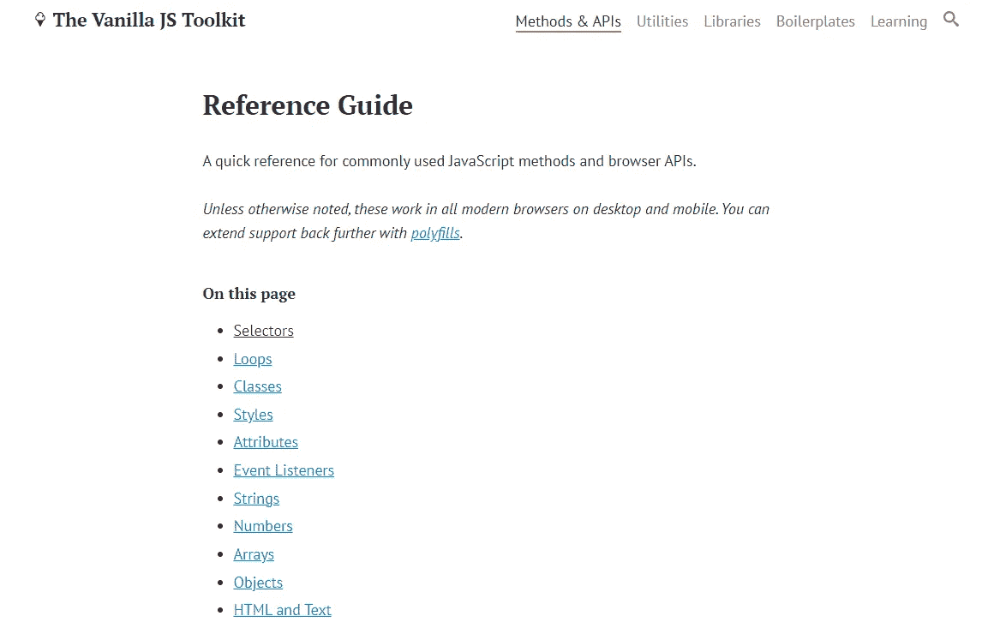
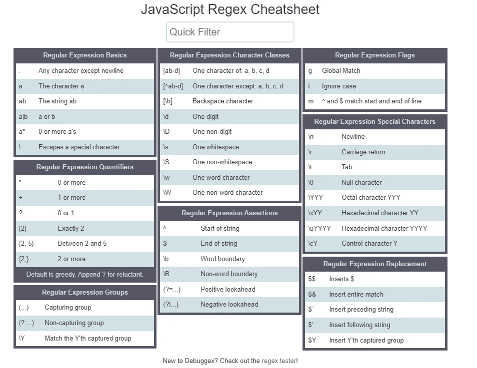
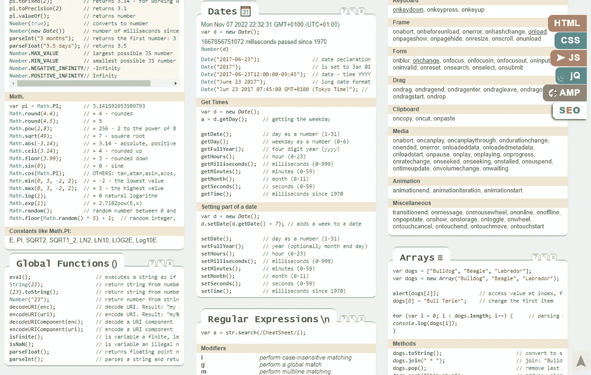

# 每个 Web 开发人员都应该知道的 7 个有用的 JavaScript 备忘单

> 原文：<https://javascript.plainenglish.io/7-useful-javascript-cheatsheets-every-web-developer-should-know-9f67924d83f1?source=collection_archive---------0----------------------->

## 一个伟大的 JavaScript 清单，以提高您的生产力。

Photo by [ThisIsEngineering](https://www.pexels.com/photo/woman-in-black-tank-top-using-laptop-3861961/) on [Pexels](https://www.pexels.com/).

作为 web 开发人员，我们总是有很多编码概念和技术，我们大部分时间都必须学习。一般来说，当涉及到 web 开发或编码时，学习永远不会停止。

那是因为科技行业一直在变，一直在更新。总有新的东西要学。因此，当谈到编码时，我们需要把自己当成终生的学生。

当然，你不可能学会所有的东西，或者把每一个代码片段都保存在你的大脑里，因为知识是没有尽头的。这就是为什么当你在编码的时候，你总是需要使用一些资源，做你的谷歌搜索。

在线资源可以节省你很多时间，提高你的工作效率。无论你是在做一个项目还是在学习新的东西，你总是需要查看一些在线资源来学习一些编码技术和提高你的知识水平。

这就是备忘单发挥作用的地方。它们可以帮助你节省时间，避免记忆的过程。除此之外，无论何时你忘记了什么，你都可以去备忘单上查看一下。

因此，在本文中，我将与您分享一些非常有用的 JavaScript 备忘单，您可以使用它们来节省时间。让我们开始吧。

# 1.从基础到高级 JavaScript 备忘单

如果你是 JavaScript 的新手，并且希望将你的知识提升到一个新的水平，那么这个备忘单真的非常有用。

Captured by the author from ILoveCoding.

备忘单让您节省时间，轻松学习从基础到高级的 JavaScript 基础知识。有 13 页的文本、代码示例和视觉效果可供您学习。

除此之外，如果您愿意，还可以下载完整的 JavaScript 备忘单 PDF 文件。

# 2.现代 JavaScript 备忘单

如果你在寻找现代 JavaScript 知识，这篇 [JavaScript 备忘单](https://github.com/mbeaudru/modern-js-cheatsheet)非常有用。如果您想了解现代 JavaScript 编码，这是一个很好的参考和惊人的资源。

Captured by the author from [GitHub](https://github.com/mbeaudru/modern-js-cheatsheet).

如果你想写干净和现代的 JavaScript 代码，这个备忘单对你有好处。这将帮助您熟悉现代代码库和项目。

# 3.ES2015+备忘单

[ES2015+ cheatsheet](https://devhints.io/es6) 包含最重要的 JavaScript ES2015+特性的可视化代码片段列表。如果您忘记了一些 ES6+代码片段或者不知道如何以简洁的方式编写它们，这是一个很好的备忘单。

Captured by the author from [DevHints](https://devhints.io/es6)(external link).

# 4.JavaScript 日期备忘单

如果您正在寻找 JavaScript Date 特性的丰富代码片段和示例列表，那么这个[备忘单](https://devhints.io/js-date)会对您非常有用。

Captured by the author from DevHints.

所以我想，如果你手里有这个很棒的备忘单，你就不用再在 Google 上搜索 JavaScript 日期了。

# 5.普通 JavaScript 快速参考

如果你正在寻找一种快速的方法和参考资料来轻松地学习常用的 JavaScript 方法和浏览器 API，这个[备忘单](https://vanillajstoolkit.com/reference/)会很有用。

Captured by the author from The Vanilla JS Toolkit.

如您所见，如果您想在学习这些普通 JavaScript 特性时节省时间，这是一个很好的资源。

# 6.JavaScript 正则表达式备忘单

这是一个关于正则表达式的有用而快速的 JavaScript [备忘单](https://www.debuggex.com/cheatsheet/regex/javascript)。所以你不需要记住所有的正则表达式的特性，因为你只能在处理正则表达式的时候来检查这个备忘单。

Capture by the author from [Debuggex](https://www.debuggex.com/)(external link).

# 7.交互式 JavaScript 备忘单

这个[交互式备忘单](https://htmlcheatsheet.com/js/)是一个很好的资源，你可以用它来学习一些最重要和最常见的 JavaScript 特性和方法。你也可以把它作为一个资源来获取你想要的代码。

Image captured by the author from HTML cheatsheet.

正如你在上面的图片中看到的，在每个代码片段的旁边，都有一个使用注释的解释。从这份备忘单中可以很容易地找到许多代码片段。你可以去寻找你想要的代码，学习它或者在你的项目中使用它。

# 结论

所以这是一个列出了一些非常有用的 JavaScript 备忘单的列表，你可以用它来节省时间和提高你的生产力。

这些备忘单可以用作您忘记的功能或代码的参考。除此之外，你还可以将它们作为快速学习资源。

因此，我强烈建议您将这些备忘单放在您计算机上的 notes 文档中，然后在需要时随时使用它们。

*感谢您阅读本文。此外，如果您发现我的内容有用，而您不是媒体会员，您可以在此处获取您的媒体会员资格***(媒体推荐链接)以无限制访问所有内容并支持我们作为作者。**

* [## 通过我的推荐链接加入 Medium-Mehdi Aoussiad

### 阅读 Mehdi Aoussiad(以及媒体上成千上万的其他作家)的每一个故事。您的会员费直接支持…

mehdiouss.medium.com](https://mehdiouss.medium.com/membership) 

**延伸阅读:**

 [## 9 个有用的前端 Web 开发人员备忘单来节省时间

### 2022 年每个 web 开发人员都应该知道的惊人的备忘单。

javascript.plainenglish.io](/9-useful-front-end-web-developer-cheatsheets-to-save-time-2e1fe7495e8)  [## 每个前端开发者应该在 2022 年建设的 5 个令人敬畏的项目

### 前端开发人员提高技能的有用项目思路列表。

blog.devgenius.io](https://blog.devgenius.io/5-awesome-projects-every-frontend-developer-should-build-in-2022-fbe2575f88aa) 

*更多内容请看*[***plain English . io***](https://plainenglish.io/)*。报名参加我们的* [***免费周报***](http://newsletter.plainenglish.io/) *。关注我们上*[***Twitter***](https://twitter.com/inPlainEngHQ)[***LinkedIn***](https://www.linkedin.com/company/inplainenglish/)*[***YouTube***](https://www.youtube.com/channel/UCtipWUghju290NWcn8jhyAw)**和* [***不和***](https://discord.gg/GtDtUAvyhW) *对成长黑客感兴趣？检查* [***电路***](https://circuit.ooo/) ***。******