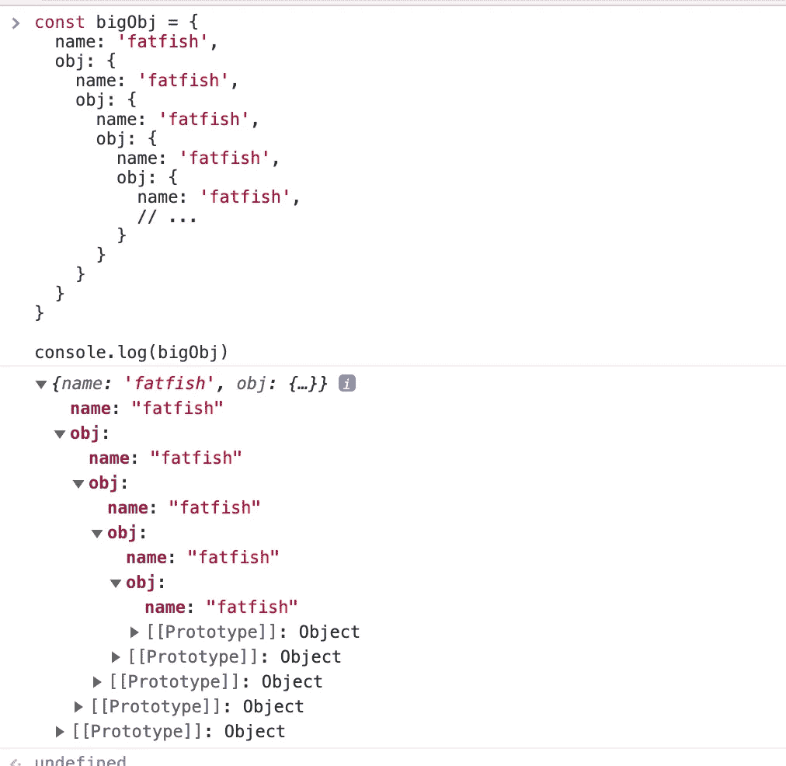
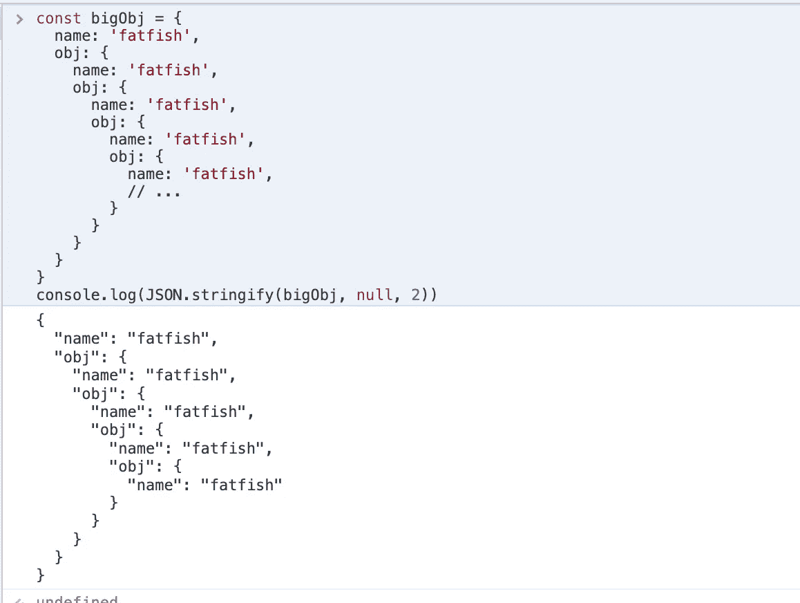

# 你应该使用的 7 种有用的 JavaScript 编码技术

> 原文：<https://javascript.plainenglish.io/7-useful-javascript-coding-techniques-that-you-should-use-680dc68437d9?source=collection_archive---------2----------------------->

## 你知道所有这些把戏吗？

Photo by [Ludemeula Fernandes](https://unsplash.com/@ludemeula?utm_source=medium&utm_medium=referral) on [Unsplash](https://unsplash.com?utm_source=medium&utm_medium=referral)

# 1.使用对象而不是“switch”

我们经常使用`switch`来处理不同的事情，但是你有没有想过使用一个对象来大大简化你的代码？**(它在一些简单的场景中起作用)**

你只需要用一个对象来实现你的目标。

# 2.使用“包括”方法，而不是多个“如果”

你经常这样写代码吗？多个条件可以触发一条逻辑。随着业务的增长，你可能需要写更多的“|”，这太可怕了。

使用`includes`使代码具有额外的可维护性。

# 3.使用 ES6 函数的默认参数

为什么不使用默认参数？

# 4.使用”？… : …”而不是“如果…否则…”

很多时候，简单的条件判断不需要使用“if”。

只使用三元表达式来简化代码。

# 5.使用“+”将字符串转换为数字

可以使用`Number()`和`parseInt()`将字符串转换为数字。

实际上更容易使用“+”。

# 6.使用“JSON.stringify”输出更漂亮的信息

这是一个深度嵌套的对象，您可以使用`console.log`来打印它。

但这并不便于查看特定的属性，我们需要手动展开每个级别来查看数据。

非常方便直观。

# 7.使用“fill”初始化数组

初始化一个固定长度的数组，每个项目就是“fatfish”。

实际上，使用`fill`就很容易了。

# 最后

**感谢阅读。**期待关注并阅读更多高质量的文章。

 [## 采访者:在 JavaScript 语言中，(a = = 1 & & a = = 2 & & a = = 3)能达到 true 吗？

### 没错，这可能是真的，而且有 6 种方法——太神奇了！

javascript.plainenglish.io](/interviewer-can-a-1-a-2-a-3-ever-evaluate-to-true-in-javascript-d2329e693cde)  [## “我因为承诺而失去了一个工作机会。”

### 一次让我如此伤心的采访经历。

javascript.plainenglish.io](/i-lost-a-job-opportunity-just-because-of-promise-all-be396f6efe87)  [## 记者:“npm 跑 xxx”怎么回事？

### 一个大多数人都不知道的秘密。

javascript.plainenglish.io](/interviewer-what-happened-to-npm-run-xxx-cdcb37dbaf44)  [## 采访者:可以“x！== x”在 JavaScript 中返回 True？

### 你可能不知道的五个神奇的 JavaScript 知识点！

javascript.plainenglish.io](/interviewer-can-x-x-return-true-in-javascript-7e1d1fa7b5cd)  [## 现在是 2022 年，不要再滥用 Arrow 函数

### 4 种不应该使用 arrow 函数的情况。

javascript.plainenglish.io](/its-2022-don-t-abuse-the-arrow-function-anymore-905862a9c668) 

*更多内容请看*[***plain English . io***](https://plainenglish.io/)*。报名参加我们的* [***免费周报***](http://newsletter.plainenglish.io/) *。关注我们关于*[***Twitter***](https://twitter.com/inPlainEngHQ)[***LinkedIn***](https://www.linkedin.com/company/inplainenglish/)*[***YouTube***](https://www.youtube.com/channel/UCtipWUghju290NWcn8jhyAw)*[***不和***](https://discord.gg/GtDtUAvyhW) *。对增长黑客感兴趣？检查* [***电路***](https://circuit.ooo/) *。***