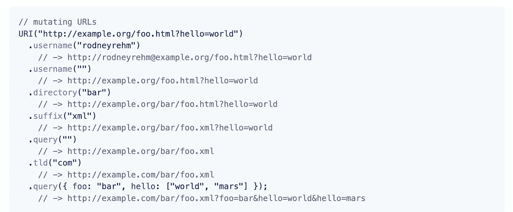

# 您可以在下一个项目中使用的 7 个有用的 JavaScript 库

> 原文：<https://javascript.plainenglish.io/7-useful-javascript-libraries-you-can-use-in-your-next-project-319659c45597?source=collection_archive---------2----------------------->

## 增强你的发展


Photo by [Tudor Baciu](https://unsplash.com/@baciutudor?utm_source=unsplash&utm_medium=referral&utm_content=creditCopyText) on [Unsplash](https://unsplash.com/s/photos/code?utm_source=unsplash&utm_medium=referral&utm_content=creditCopyText)

有句谚语“不必多此一举”。图书馆就是最好的例子。它帮助你以一种简单的方式编写复杂而耗时的功能。根据我的观点，一个好的项目使用一些最好的可用库

我不认为 JavaScript 需要任何介绍。它是几乎所有用途中最常用的编程语言之一。在这里，我编译了 7 个有用的 JavaScript 库，它们将在您的开发之旅中为您提供帮助。

# 1.日期-fns


这是星级最高的库之一，拥有超过 30k 颗星。处理日期是开发人员的一项常见任务，这个库将帮助您完成这项任务。它为在浏览器和 Node.js 中操作 JavaScript 日期提供了最全面、最简单和最一致的工具集。它包括许多功能，如适用于所有场合的 200 多个函数，可与 Webpack、Browserify、Rollup 或 tree-shaking 一起使用，支持 Flow 和 TypeScript，等等。

[](https://github.com/date-fns/date-fns) [## GitHub - date-fns/date-fns:⏳现代 JavaScript 日期实用程序库⌛️

### ⏳现代 JavaScript 日期实用程序库⌛️.通过在…上创建帐户，为 date-fns/date-fns 开发做出贡献

github.com](https://github.com/date-fns/date-fns) 

# 2.拉达


加载数据时显示进度条是获得良好用户体验的常见方式之一。这个库提供了一个内置加载指示器的按钮，有效地弥合了动作和反馈之间的差距。它主要用于在提交时给用户即时反馈的表单，而不是让用户在浏览器完成任务时感到疑惑。它在 GitHub 上有超过 7.5k 颗星。

[](https://github.com/hakimel/Ladda) [## GitHub - hakimel/Ladda:内置加载指示器的按钮。

### 带有内置装载指示器的按钮。通过在 GitHub 上创建一个帐户，为 hakimel/Ladda 开发做出贡献。

github.com](https://github.com/hakimel/Ladda) 

# 3.i18 下一步


如果你想为你的应用程序增加国际化，这是一个很好的资源。这是一个非常流行的浏览器或任何其他 javascript 环境的国际化框架(例如 Node.js，Deno)。它包括许多特性，比如可选缓存、用户语言检测、适当的多元化、到后端的灵活连接等等。它在 GitHub 上有超过 6.5k 颗星。

[](https://github.com/i18next/i18next) [## GitHub - i18next/i18next: i18next:学一次-到处翻译

### i18 下一步:学一次——到处翻译。在 GitHub 上创建一个帐户，为 i18next/i18next 开发做贡献。

github.com](https://github.com/i18next/i18next) 

# 4.URI.js



这是一个处理 URL 的 javascript 库。它提供了一个“jQuery 风格”的 API ( [Fluent 接口](http://en.wikipedia.org/wiki/Fluent_interface)，方法链接)来读写所有常规组件和许多方便的方法，如。[目录](http://medialize.github.io/URI.js/docs.html#accessors-directory)()和。[权威](http://medialize.github.io/URI.js/docs.html#accessors-authority)()。虽然这个库提供了一个 [jQuery 插件](http://medialize.github.io/URI.js/jquery-uri-plugin.html)，但是你并不需要 jQuery 来使用它。它在 GitHub 上有超过 6k 颗星。

[](https://github.com/medialize/URI.js/) [## GitHub-media lize/uri . js:Javascript URL 突变库

### 重要提示:您可能不再需要 URI.js 了！现代浏览器提供了 URL 和 URLSearchParams 接口。注意:…

github.com](https://github.com/medialize/URI.js/) 

# 5.Loglevel


我认为日志是调试应用程序最常用的方式之一。这个库用基于级别的日志和过滤取代了 console.log()和 friends，没有控制台的任何缺点。它包括一些特性，比如在控制台对象的给定级别(trace/debug/info/warn/error)记录事情，按级别过滤记录等等。它在 GitHub 上有超过 2k 颗星。

[](https://github.com/pimterry/loglevel) [## GitHub-PIM terry/log level:JavaScript 的最小轻量级日志记录，增加了可靠的日志级别…

### 分类帐:JavaScript 的最小轻量级日志记录，添加可靠的日志级别方法来包装任何可用的控制台

github.com](https://github.com/pimterry/loglevel) 

# 6.diff2html


顾名思义，这是一个 Diff 解析器库和一个漂亮的 HTML 生成器。每个差异都提供了代码更改的全面可视化，帮助开发人员识别问题并更好地理解更改。它包括支持 git 和统一差异、逐行和并排差异、类似 GitHub 的视觉风格等特性。它在 GitHub 上有超过 2k 颗星。

[](https://github.com/rtfpessoa/diff2html) [## GitHub - rtfpessoa/diff2html:与 html javascript 库(diff2html)非常不同

### 相当不同于 html javascript 库(diff 2 html)-GitHub-rtfpessoa/diff 2 html:相当不同于 html javascript…

github.com](https://github.com/rtfpessoa/diff2html) 

# 7.时间线 JS3


这是一个工具，旨在帮助具有最低限度技术技能的人在网上讲述丰富、动态的故事。大多数人会使用官方创作工具[创建时间线，并在过程结束时使用一小段 HTML 代码嵌入他们的作品。它在 GitHub 上有超过 2.5k 颗星。](http://timeline.knightlab.com/#make)

[](https://github.com/NUKnightLab/TimelineJS3) [## GitHub-NUKnightLab/Timeline js 3:Timeline js v3:用 JavaScript 构建的讲故事时间线…

### TimelineJS v3:用 JavaScript 构建的讲故事时间线。https://timeline.knightlab.com timeline js 是一个工具…

github.com](https://github.com/NUKnightLab/TimelineJS3) 

# 其他一些很棒的资源在哪里？

总有新的东西要学。如果你想了解更多的 Javascript 库，请点击下面的链接。

[](/7-useful-javascript-libraries-you-should-use-in-your-next-project-c0f2b0499f79) [## 你应该在下一个项目中使用的 7 个有用的 JavaScript 库

### 增强您的 JavaScript 开发

javascript.plainenglish.io](/7-useful-javascript-libraries-you-should-use-in-your-next-project-c0f2b0499f79) 

今天到此为止。相信这些库对你的开发之旅会有很大的帮助。

如果你知道任何其他漂亮的 JavaScript 库，请在评论中分享。直到我们再次见面…干杯！

```
**Want to Connect?**If you want to, you can connect with me on [**Twitter**](https://twitter.com/FarhanTanvirBD)
```

*更多内容请看*[***plain English . io***](https://plainenglish.io/)*。报名参加我们的* [***免费周报***](http://newsletter.plainenglish.io/) *。关注我们关于*[***Twitter***](https://twitter.com/inPlainEngHQ)[***LinkedIn***](https://www.linkedin.com/company/inplainenglish/)*[***YouTube***](https://www.youtube.com/channel/UCtipWUghju290NWcn8jhyAw)*[***不和***](https://discord.gg/GtDtUAvyhW) *。对增长黑客感兴趣？检查* [***电路***](https://circuit.ooo/) *。***