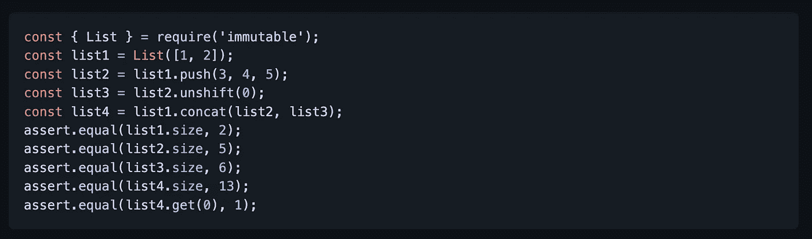
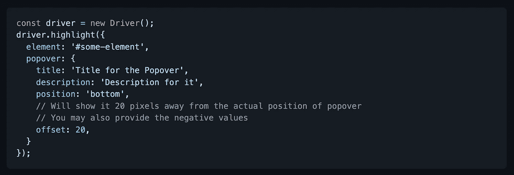
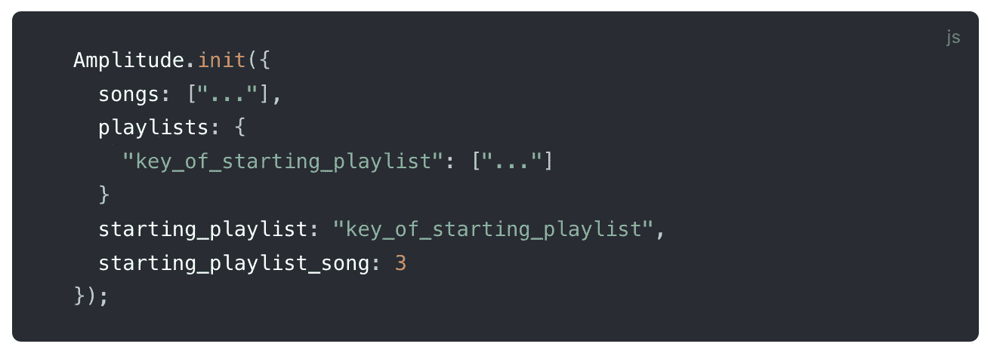
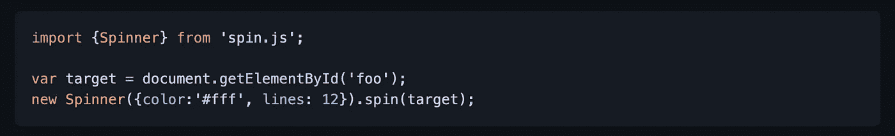
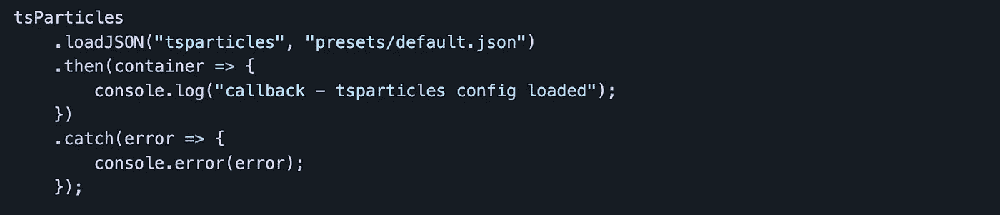
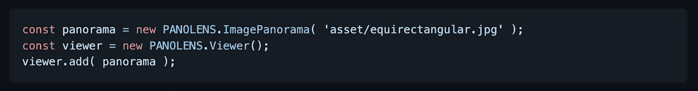
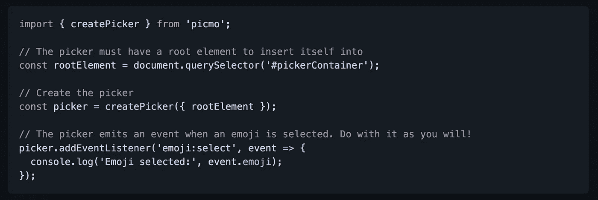

# 您可以在下一个项目中使用的 7 个有用的 JavaScript 库

> 原文：<https://javascript.plainenglish.io/7-useful-javascript-libraries-you-can-use-in-your-next-project-5c80d64c9c9f?source=collection_archive---------2----------------------->

## 增强您的 JavaScript 开发

Photo by [Pakata Goh](https://unsplash.com/@pakata?utm_source=unsplash&utm_medium=referral&utm_content=creditCopyText) on [Unsplash](https://unsplash.com/s/photos/Programming?utm_source=unsplash&utm_medium=referral&utm_content=creditCopyText)

有句谚语“不必多此一举”。图书馆就是最好的例子。它帮助你以一种简单的方式编写复杂而耗时的功能。根据我的观点，一个好的项目使用一些最好的可用库

我不认为 JavaScript 需要任何介绍。它是几乎所有用途中最常用的编程语言之一。在这里，我编译了 7 个有用的 JavaScript 库，它们将在您的开发之旅中为您提供帮助。

# 1.不可变-js

[不可变](https://en.wikipedia.org/wiki/Immutable_object)数据一旦创建就不能更改，这使得应用程序开发变得更加简单，没有防御性复制，并且能够使用简单的逻辑实现高级记忆和更改检测技术。持久化的数据提供了一个可变的 API，它不会就地更新数据，而是总是产生新更新的数据。该库提供了许多持久不变的数据结构，包括:`List`、`Stack`、`Map`、`OrderedMap`、`Set`、`OrderedSet`和`Record`。这些数据结构在现代 JavaScript 虚拟机上非常高效，通过 Clojure 和 Scala 普及的[哈希映射尝试](https://en.wikipedia.org/wiki/Hash_array_mapped_trie)和[向量尝试](https://hypirion.com/musings/understanding-persistent-vector-pt-1)使用结构共享，最大限度地减少了复制或缓存数据的需求。这也是 GitHub 上星数超过 32k 的最星库之一。

 [## GitHub-Immutable-js/Immutable-js:Javascript 的不可变持久数据集合…

### 闲暇时聊天，阅读文件，吃蔬菜。文档是从 README.md 和…

github.com](https://github.com/immutable-js/immutable-js) 

# 2.Driver.js

如果你需要某种形式的页面覆盖，那么这是一个很好的资源。一个常见的用例可能是当用户与某个组件交互时背景变暗。这个库是用普通 JS 编写的，没有依赖性，高度可定制。它有几个选项，允许您操纵它的行为方式，还提供了钩子来操纵高亮显示、将要高亮显示或取消选择的元素。它在 GitHub 上有超过 14k 颗星星。

 [## GitHub - kamranahmedse/driver.js:一个轻量级、无依赖性的普通 JavaScript 引擎，用于驱动…

### 一个轻量级的、无依赖性的、普通的 JavaScript 引擎来驱动用户在页面上的注意力——GitHub…

github.com](https://github.com/kamranahmedse/driver.js) 

# 3.Amplitude.js

在 HTML5 中，audio 标签允许用户向他们的网页添加常见的音频格式。问题是音频播放界面是由浏览器控制的。该库通过简单地将类和/或属性应用于页面元素，使您能够控制设计。然后，您可以通过 CSS 样式化这些元素并控制您的音频。它增加了播放列表功能(下一个、上一个、随机播放)、歌曲元数据和可视化。这个库在 GitHub 上有超过 3.5k 的星星。

 [## GitHub-server sideup/AmplitudeJS:AmplitudeJS:开源 HTML5 Web 音频库。设计您的…

### AmplitudeJS:开源 HTML5 网络音频库。按照您想要的方式设计您的网络音频播放器。没有依赖关系…

github.com](https://github.com/serversideup/amplitudejs) 

# 4.自旋. js

加载数据时显示微调器是创建更好的用户体验的常见做法之一。正如你已经猜到的名字，这个库提供了一个动画加载微调器。它包括许多特性，如无图像、无依赖性、高度可配置等等。它在 GitHub 上有超过 9k 颗星。

 [## GitHub - fgnass/spin.js:一个旋转活动指示器

### 旋转活动指示器。在 GitHub 上创建一个帐户，为 fgnass/spin.js 的开发做出贡献。

github.com](https://github.com/fgnass/spin.js) 

# 5.ts 粒子

这个库将帮助您轻松创建高度可定制的 JavaScript 粒子效果、五彩纸屑爆炸和焰火动画，并将其用作网站的动画背景。它还包括 React.js、Vue.js、Angular、Svelte、jQuery、Preact、Inferno、Solid、Riot 和 Web 组件的现成组件。它在 GitHub 上有超过 4k 颗星。

 [## GitHub-matteobruni/ts particles:ts particles-轻松创建高度可定制的 JavaScript…

### 轻松创建高度可定制的 JavaScript 粒子效果，五彩纸屑爆炸和烟火…

github.com](https://github.com/matteobruni/tsparticles) 

# 6.Panolens.js

如果您想在应用程序中添加全景图像查看功能，这是一个很好的资源。该库提供了一个事件驱动和基于 WebGL 的全景查看器。它轻便灵活。它在 GitHub 上有超过 2.5k 颗星。

 [## GitHub - pchen66/panolens.js:基于 Three.js 的 Javascript 全景查看器

### js 是一个事件驱动的基于 WebGL 的全景浏览器。轻巧灵活。它建立在…

github.com](https://github.com/pchen66/panolens.js) 

# 7.皮克莫

这个库将帮助你用几行代码在你的应用程序中添加一个全功能的表情选择器。它包括许多功能，如表情数据从 CDN 加载一次并缓存在浏览器中以供后续会话使用，可按名称或标签搜索，完全支持肤色变化等等。它在 GitHub 上有超过 1k 颗星。

 [## GitHub-joeatardi/picmo:JavaScript 表情符号选择器。任何 app，任何框架。

### JavaScript 表情选择器。任何 app，任何框架。通过在…上创建一个帐户，为 joeattardi/picmo 开发做出贡献

github.com](https://github.com/joeattardi/picmo) 

# 其他一些很棒的资源在哪里？

总有新的东西要学。如果你想了解更多关于 React 强大的库，请点击下面的链接。

 [## 你应该知道的 7 个最著名的 React 库

### 使用这些 React 库增强您的开发能力。

javascript.plainenglish.io](/7-most-starred-react-libraries-you-should-know-19fc3508d2c1) 

今天到此为止。相信这些库对你的开发之旅会有很大的帮助。

如果你知道任何其他漂亮的 JavaScript 库，请在评论中分享。直到我们再次见面…干杯！

***想要连接？*** *如果你愿意，可以在* [***推特***](https://twitter.com/FarhanTanvirBD) ***上与我联系。***

*更多内容请看* [***说白了就是***](https://plainenglish.io/) *。报名参加我们的* [***免费每周简讯***](http://newsletter.plainenglish.io/) *。关注我们关于* [***推特***](https://twitter.com/inPlainEngHQ) ，[***LinkedIn***](https://www.linkedin.com/company/inplainenglish/)*，*[***YouTube***](https://www.youtube.com/channel/UCtipWUghju290NWcn8jhyAw)*[***不和***](https://discord.gg/GtDtUAvyhW) *。对增长黑客感兴趣？检查出* [***电路***](https://circuit.ooo/) *。**