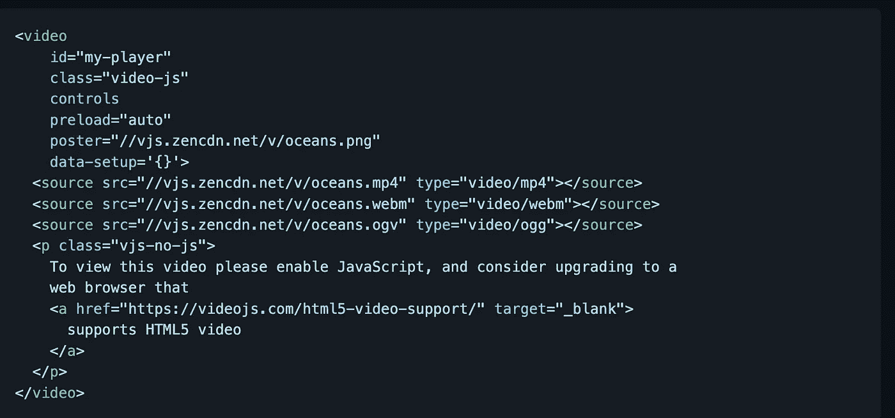
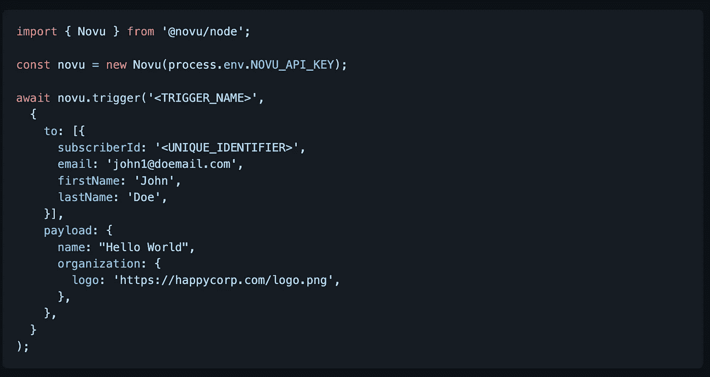
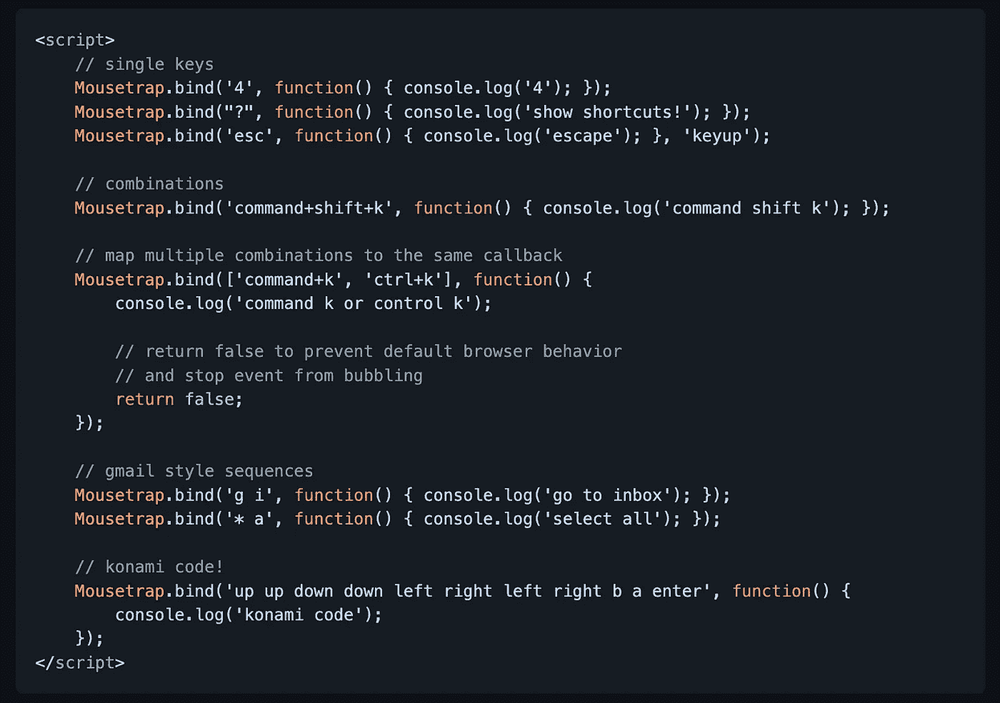
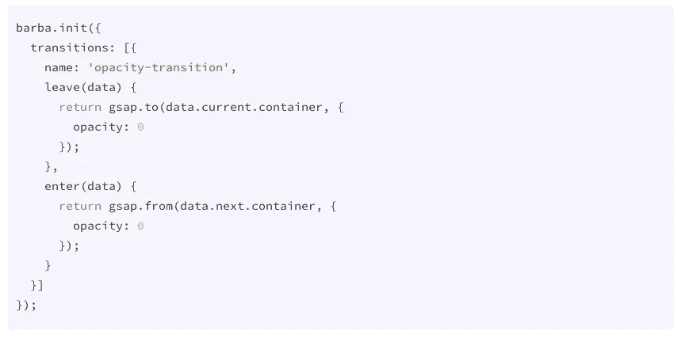
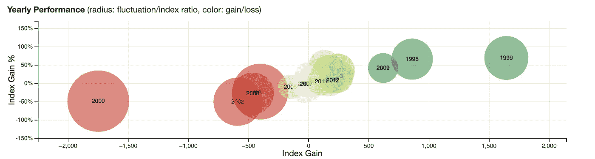
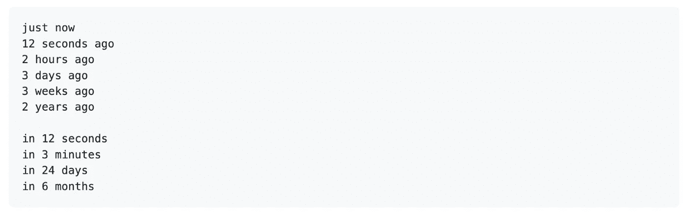
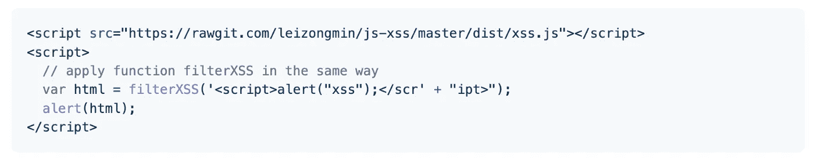

# 您可以在下一个项目中使用的 7 个有用的 JavaScript 库

> 原文：<https://javascript.plainenglish.io/7-useful-javascript-libraries-you-can-use-in-your-next-project-6bd161757135?source=collection_archive---------3----------------------->

## 增强您的 JavaScript 开发

Photo by [Clément Hélardot](https://unsplash.com/@clemhlrdt?utm_source=unsplash&utm_medium=referral&utm_content=creditCopyText) on [Unsplash](https://unsplash.com/s/photos/javascript-code?utm_source=unsplash&utm_medium=referral&utm_content=creditCopyText)

有句谚语“不必多此一举”。图书馆就是最好的例子。它帮助你以一种简单的方式编写复杂而耗时的功能。根据我的观点，一个好的项目使用一些最好的可用库

我不认为 JavaScript 需要任何介绍。它是几乎所有用途中最常用的编程语言之一。在这里，我编译了 7 个有用的 JavaScript 库，它们将在您的开发之旅中为您提供帮助。

# 1.视频. js

这是 GitHub 上星级最高的库之一，拥有超过 34k 颗星。正如你已经猜到的名字，这个库提供了一个为 HTML5 世界从头开始构建的网络视频播放器。它支持 HTML5 视频和媒体源扩展，以及其他播放技术，如 YouTube 和 Vimeo(通过[插件](https://videojs.com/plugins/))。它支持在桌面和移动设备上播放视频。这个项目始于 2010 年中期，现在已经有超过 [700，000 个网站](https://trends.builtwith.com/media/VideoJS)使用这个播放器。

 [## GitHub-video js/video . js:video . js-开源 HTML5 视频播放器

### Video.js -开源 HTML5 视频播放器。在 GitHub 上创建一个帐户，为 videojs/video.js 的开发做出贡献。

github.com](https://github.com/videojs/video.js) 

# 2.诺武

建立一个通知系统是复杂的。起初，这似乎只是发送一封电子邮件，但实际上，这只是一个开始。如今，用户期望通过电子邮件、短信、推送、聊天和其他渠道获得多渠道通信体验。每天都有越来越多的提供者出现，通知也在代码中传播。这个库的目标是简化通知，并为开发人员提供在系统和用户之间创建有意义的通信的工具。它在 GitHub 上有超过 14k 颗星星。

 [## GitHub - novuhq/novu:产品的开源通知基础设施

### 使用单一 API 管理多渠道通知的终极服务。建立一个通知系统是…

github.com](https://github.com/novuhq/novu) 

# 3.捕鼠器

如果你必须在你的应用中处理键盘，那么这是一个很好的资源。这是一个简单的库，可以帮助你处理键盘快捷键。它支持特定按键、键盘组合或按键序列上的`keypress`、`keydown`和`keyup`事件。它大约缩小了 2kb，压缩了 4.5kb，没有外部依赖性。这个库在 GitHub 上有超过 11k 的星星。

 [## GitHub - ccampbell/mousetrap:在 Javascript 中处理键盘快捷键的简单库

### 在 Javascript-GitHub-ccampbell/mouse trap 中处理键盘快捷键的简单库

github.com](https://github.com/ccampbell/mousetrap) 

# 4.巴尔巴

这是一个小的(7kb 缩小和压缩)和易于使用的库，帮助您创建网站页面之间的流畅和平滑的过渡。它有助于减少页面之间的延迟，最大限度地减少浏览器 HTTP 请求，并增强用户的 web 体验。它在 GitHub 上有超过 10k 颗星星。

 [## GitHub - barbajs/barba:在你的网站页面之间创建流畅平滑的过渡。

### js 是一个小的(7kb 缩小和压缩)和易于使用的库，它可以帮助你…

github.com](https://github.com/barbajs/barba) 

# 5.直流 js

这是一个多维图表，旨在使用 d3.js 呈现的 cross filter 进行本地工作。在这个库中，每个图表通过其元素的位置、大小和颜色显示一些属性的集合，还提供了一个可以过滤的维度。当滤镜或笔刷更改时，所有其他图表都会使用动画转场进行动态更新。这个库在 GitHub 上有超过 7k 的星星。

 [## GitHub - dc-js/dc.js:多维制图构建为与交叉过滤渲染一起本机工作…

### 多维图表构建为与使用 d3.js - GitHub - dc-js/dc.js 渲染的 crossfilter 一起工作…

github.com](https://github.com/dc-js/dc.js) 

# 6.很久以前

正如您所猜测的，这是一个 nano 库(小于`2 kb`)，用于用`*** time ago`语句格式化日期时间。比如“3 小时前”。它包括支持 i18n，支持时间`ago`和时间`in`，支持实时渲染等特性。它在 GitHub 上有超过 4k 颗星。

 [## GitHub—HUS TCC/time ago . js::clock 8:time ago . js 是一个很小的(2.0 kb)库，用于格式化日期…

### clock8: :hourglass: timeago.js 是一个很小的(2.0 kb)库，用于用` *** time ago '语句格式化日期。— GitHub …

github.com](https://github.com/hustcc/timeago.js) 

# 7.js-xss

正如你已经猜到的名字，这个库是用来过滤来自用户的输入，以防止 XSS 攻击。它用白名单指定的配置来净化不可信的 HTML(以防止 XSS)。它在 GitHub 上有超过 4.5k 颗星。

 [## GitHub - leizongmin/js-xss:用指定的配置净化不可信的 HTML(防止 XSS)…

### xss 是一个用于过滤用户输入以防止 XSS 攻击的模块。(什么是 XSS 攻击？)项目主页…

github.com](https://github.com/leizongmin/js-xss) 

# 其他一些很棒的资源在哪里？

总有新的东西要学。如果你想了解更多关于 React 强大的库，请点击下面的链接。

 [## 你应该知道的 7 个最著名的 React 库

### 使用这些 React 库增强您的开发能力。

javascript.plainenglish.io](/7-most-starred-react-libraries-you-should-know-19fc3508d2c1) 

今天到此为止。相信这些库对你的开发之旅会有很大的帮助。

如果你知道任何其他漂亮的 JavaScript 库，请在评论中分享。直到我们再次见面…干杯！

***想要连接？*** *如果你愿意，可以在* [***推特***](https://twitter.com/FarhanTanvirBD) ***上与我联系。***

*更多内容请看* [***说白了就是***](https://plainenglish.io/) *。报名参加我们的* [***免费每周简讯***](http://newsletter.plainenglish.io/) *。关注我们关于* [***推特***](https://twitter.com/inPlainEngHQ) ，[***LinkedIn***](https://www.linkedin.com/company/inplainenglish/)*，*[***YouTube***](https://www.youtube.com/channel/UCtipWUghju290NWcn8jhyAw)*[***不和***](https://discord.gg/GtDtUAvyhW) ***。****

****有兴趣缩放你的软件启动*** *？检查出* [***电路***](https://circuit.ooo?utm=publication-post-cta) *。**