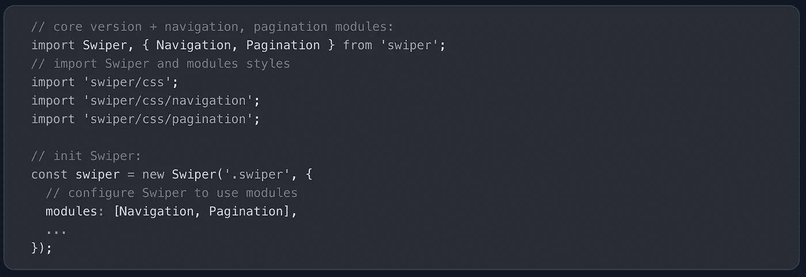

# 您可以在下一个项目中使用的 7 个有用的 JavaScript 库

> 原文：<https://javascript.plainenglish.io/7-useful-javascript-libraries-you-can-use-in-your-next-project-79efaa5d2e22?source=collection_archive---------3----------------------->

## 增强你的发展

Photo by [Jorge Rosal](https://unsplash.com/@yortrosal?utm_source=unsplash&utm_medium=referral&utm_content=creditCopyText) on [Unsplash](https://unsplash.com/s/photos/Programming?utm_source=unsplash&utm_medium=referral&utm_content=creditCopyText)

有句谚语“不必多此一举”。图书馆就是最好的例子。它帮助你以一种简单的方式编写复杂而耗时的功能。根据我的观点，一个好的项目使用一些最好的可用库

我不认为 JavaScript 需要任何介绍。它是几乎所有用途中最常用的编程语言之一。在这里，我编译了 7 个有用的 JavaScript 库，它们将在您的开发之旅中为您提供帮助。

# 1.Swiper

这个库是最现代的移动触摸滑块，具有硬件加速的过渡和令人惊叹的本机行为。此外，它是 GitHub 上最受欢迎的库之一，拥有超过 33k 颗星。它旨在用于移动网站、移动 web 应用程序和移动本机/混合应用程序。这并不兼容所有平台，它是一个现代的触摸滑块，只专注于现代的应用程序/平台，以带来最佳的体验和简单性。

 [## GitHub - nolimits4web/swiper:最现代的移动触摸滑块，带有硬件加速过渡

### 最现代的带硬件加速过渡的移动触摸滑块- GitHub - nolimits4web/swiper:最现代的…

github.com](https://github.com/nolimits4web/swiper) 

# 2.安阳

如果你想在你的应用中加入语音识别，这是一个很好的资源。这个库允许您的用户用语音命令控制您的站点。它支持多种语言，没有依赖性，重量只有 2kb，并且可以免费使用。这个库在 GitHub 上有超过 6k 的星星。

 [## GitHub - TalAter/annyang:为您的站点提供语音识别

### 一个小的 JavaScript 语音识别库，让你的用户用语音命令控制你的网站。安阳没有…

github.com](https://github.com/TalAter/annyang) 

# 3.异嗜症

如果你想在不损失质量的情况下调整图片大小，这是一个很好的资源。这个库可以让你在浏览器中调整图像的大小，没有像素化，而且速度相当快。它自动选择最佳可用技术，如 web workers、web assembly、createImageBitmap 和 pure JS。它在 GitHub 上有超过 3k 颗星。

 [## GitHub - nodeca/pica:在浏览器中以高质量和高速度调整图像大小

### 在浏览器中调整图像大小，没有像素化，速度相当快。自动选择最佳可用技术…

github.com](https://github.com/nodeca/pica) 

# 4.克拉普

这是一个可扩展的网络媒体播放器。你的架构主要被投射到插件中，通过设计给项目增加了低耦合性，并有可能很容易地增加无限的特性。它默认使用 [HTMLVideoElement](https://developer.mozilla.org/en-US/docs/Web/API/HTMLVideoElement) ，保证了对很多平台的支持。它在 GitHub 上有超过 6k 颗星。

 [## GitHub - clappr/clappr:一个可扩展的网络媒体播放器。

### 克拉珀:一个可扩展的网络媒体播放器。通过在…上创建帐户，为 clappr/clappr 开发做出贡献

github.com](https://github.com/clappr/clappr) 

# 5.巴尔巴

这是一个小的(7kb 缩小和压缩)和易于使用的库，帮助您创建网站页面之间的流畅和平滑的过渡。它有助于减少页面之间的延迟，最大限度地减少浏览器 HTTP 请求，并增强用户的 web 体验。这个库在 GitHub 上有超过 10k 颗星星。

 [## GitHub - barbajs/barba:在你的网站页面之间创建流畅平滑的过渡。

### js 是一个小的(7kb 缩小和压缩)和易于使用的库，它可以帮助你…

github.com](https://github.com/barbajs/barba) 

# 6.颜色

使用颜色是开发人员的常见任务之一。这是一个不可变颜色转换和操作的库，支持 CSS 颜色字符串。这个库在 GitHub 上有超过 4k 的星星。

 [## GitHub - Qix-/color: Javascript 颜色转换和操作库

### rainbow: Javascript 颜色转换和操纵库- GitHub - Qix-/color: Javascript 颜色转换和…

github.com](https://github.com/Qix-/color) 

# 7.Lunr.js

对于所有数据都已经存储在客户端的 web 应用程序来说，能够在客户端搜索这些数据是有意义的。它节省了在服务器上添加额外的压缩服务。这是一个供浏览器使用的小型全文搜索库。它索引 JSON 文档，并提供一个简单的搜索接口来检索最匹配文本查询的文档。这个库在 GitHub 上有超过 8k 的星星。

 [## GitHub - olivernn/lunr.js:有点像 Solr，但是小得多，也不那么明亮

### 有点像 Solr，但是小得多，没有那么亮- GitHub - olivernn/lunr.js:有点像 Solr，但是小得多，而且…

github.com](https://github.com/olivernn/lunr.js) 

# 其他一些很棒的资源在哪里？

总有新的东西要学。如果你想了解更多关于 React 强大的库，请点击下面的链接。

 [## 你应该知道的 7 个最著名的 React 库

### 使用这些 React 库增强您的开发能力。

javascript.plainenglish.io](/7-most-starred-react-libraries-you-should-know-19fc3508d2c1) 

今天到此为止。相信这些库对你的开发之旅会有很大的帮助。

如果你知道任何其他漂亮的 JavaScript 库，请在评论中分享。直到我们再次见面…干杯！

***想要连接？*** *如果你愿意，可以在* [***推特***](https://twitter.com/FarhanTanvirBD) ***上与我联系。***

*更多内容请看*[***plain English . io***](https://plainenglish.io/)*。报名参加我们的* [***免费周报***](http://newsletter.plainenglish.io/) *。关注我们关于*[***Twitter***](https://twitter.com/inPlainEngHQ)[***LinkedIn***](https://www.linkedin.com/company/inplainenglish/)*[***YouTube***](https://www.youtube.com/channel/UCtipWUghju290NWcn8jhyAw)*[***不和***](https://discord.gg/GtDtUAvyhW) *。对增长黑客感兴趣？检查* [***电路***](https://circuit.ooo/) *。***