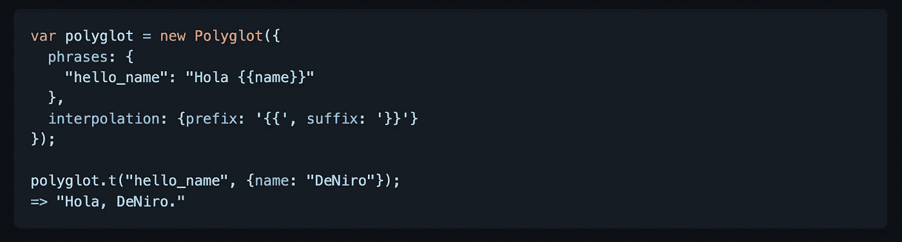

# 您可以在下一个项目中使用的 7 个有用的 JavaScript 库

> 原文：<https://javascript.plainenglish.io/7-useful-javascript-libraries-you-can-use-in-your-next-project-b88ae3af56d?source=collection_archive---------4----------------------->

## 增强你的发展

Photo by [Fili Santillán](https://unsplash.com/es/@filisantillan?utm_source=unsplash&utm_medium=referral&utm_content=creditCopyText) on [Unsplash](https://unsplash.com/s/photos/javascript?utm_source=unsplash&utm_medium=referral&utm_content=creditCopyText)

有句谚语“不必多此一举”。图书馆就是最好的例子。它帮助你以一种简单的方式编写复杂而耗时的功能。根据我的观点，一个好的项目使用一些最好的可用库

我不认为 JavaScript 需要任何介绍。它是几乎所有用途中最常用的编程语言之一。在这里，我编译了 7 个有用的 JavaScript 库，它们将在您的开发之旅中为您提供帮助。

# 1.本地饲料

这是拥有超过 21k 颗星的最受欢迎的 Javascript 库之一。这是一个快速简单的 JavaScript 存储库。它通过一个简单的类似于`localStorage`的 API 使用异步存储(IndexedDB 或 WebSQL)来改善 web 应用的离线体验。它在不支持 IndexedDB 或 WebSQL 的浏览器中使用 localStorage。

 [## GitHub -本地饲料/本地饲料:💾离线存储，改进。包装 IndexedDB、WebSQL 或…

### 💾离线存储，改进。使用简单但强大的 API 包装 IndexedDB、WebSQL 或 localStorage。- GitHub …

github.com](https://github.com/localForage/localForage) 

# 2.DOMPurify

这个库净化 HTML 并防止 XSS 攻击。你可以给它一个充满脏 HTML 的字符串，它将返回一个包含干净 HTML 的字符串(除非另外配置)。它将删除所有包含危险 HTML 的内容，从而防止 XSS 攻击和其他不良行为。它也太快了。你的浏览器越快，这个库就越快。它在 GitHub 上有超过 9k 颗星。

 [## GitHub-cure 53/DOM purify:DOM purify——一个 DOM 专用的、超级快速的、超级宽容的 XSS 杀毒软件，用于…

### DOMPurify -一个只支持 DOM 的，超快的，超级宽容的 XSS 杀毒软件，支持 HTML，MathML 和 SVG。DOMPurify 与一个安全的…

github.com](https://github.com/cure53/DOMPurify) 

# 3.懂得多种语言的

这张是 Airbnb 的。这是一个很小的 I18n 助手库，可以在浏览器和 CommonJS 环境(Node)中工作。它为插值和多元化提供了一个简单的解决方案。它对你的翻译后端是不可知的。它不执行任何翻译；它只是为您提供了一种从客户端或服务器端 JavaScript 应用程序管理翻译短语的方法。它在 GitHub 上有超过 3.5k 颗星。

 [## GitHub - airbnb/polyglot.js:让你的 JavaScript 具备说多种语言的能力。

### 让您的 JavaScript 能够说多种语言。- GitHub - airbnb/polyglot.js:给你的 JavaScript 一个…

github.com](https://github.com/airbnb/polyglot.js) 

# 4.授予

这是一个受单元测试库(如 Mocha 或 Jest)启发的表单验证框架。通过引入它的声明性语法，它被设计得易于使用和学习。这是与框架无关的，意味着它可以与任何 UI 框架一起使用，或者根本不需要任何框架。它在 GitHub 上有超过 2k 颗星。

 [## GitHub - ealush/vest: Vest ✅声明性验证框架

### Vest Documentation Vest 是一个表单验证框架，受 Mocha 或 Jest 等单元测试库的启发；这是…

github.com](https://github.com/ealush/vest) 

# 5.日期选择器

处理数据是开发人员的常见任务之一。这个库将帮助您完成这项任务。这个日期选择器带有内置功能，允许您设置最小和最大允许日期。根据需要，这些设置可以组合使用，也可以单独使用。请注意，日期值必须以 IS0–8601 格式传递:`YYYY-MM-DD`。它可以在任何 JavaScript 框架中实现和使用，或者根本不用框架。它在 GitHub 上有超过 1.5k 颗星。

 [## GitHub-duetds/Date-Picker:Duet Date Picker 是 Duet Design System 的开源版本…

### Duet 日期选择器是 Duet Design System 的可访问日期选择器的开源版本。请在以下位置尝试实际示例…

github.com](https://github.com/duetds/date-picker) 

# 6.m2cgen

m2cgen (Model 2 Code Generator)是一个轻量级的库，它提供了一种将训练好的统计模型转换成本机代码(Python、C、Java、Go、JavaScript、Visual Basic、C#、PowerShell、R、PHP、Dart、Haskell、Ruby、F#、Rust、Elixir)的简单方法。它在 GitHub 上有超过 2k 颗星。

 [## GitHub-Bayes witness/m2cgen:将 ML 模型转换成原生代码(Java，C，Python，Go…

### 将 ML 模型转换成原生代码(Java，C，Python，Go，JavaScript，Visual Basic，C#，R，PowerShell，PHP，Dart…

github.com](https://github.com/BayesWitnesses/m2cgen) 

# 7.流动

这个库通过 HTML5 文件 API 提供多个同步、稳定、容错、可恢复/可重启的文件上传。它旨在将容错引入到大文件的上传中。这是通过将每个文件分成小块来实现的。然后，每当块的上传失败时，就重试上传，直到该过程完成。这允许上传在本地或到服务器的网络连接断开后自动恢复上传。它在 GitHub 上有超过 2.5k 颗星。

 [## GitHub - flowjs/flow.js:一个 JavaScript 库，提供多个同步、稳定的…

### 一个 JavaScript 库，提供多个同步、稳定、容错和可恢复/可重启的文件上传，通过…

github.com](https://github.com/flowjs/flow.js) 

# 其他一些很棒的资源在哪里？

总有新的东西要学。如果你想了解更多关于 React 强大的库，请点击下面的链接。

 [## 你应该知道的 7 个最著名的 React 库

### 使用这些 React 库增强您的开发能力。

javascript.plainenglish.io](/7-most-starred-react-libraries-you-should-know-19fc3508d2c1) 

今天到此为止。相信这些库对你的开发之旅会有很大的帮助。

如果你知道任何其他漂亮的 JavaScript 库，请在评论中分享。直到我们再次见面…干杯！

***想要连接？*** *如果你愿意，可以和我联系* [***推特***](https://twitter.com/FarhanTanvirBD)

*更多内容请看*[***plain English . io***](https://plainenglish.io/)*。报名参加我们的* [***免费周报***](http://newsletter.plainenglish.io/) *。关注我们上*[***Twitter***](https://twitter.com/inPlainEngHQ)[***LinkedIn***](https://www.linkedin.com/company/inplainenglish/)*[***YouTube***](https://www.youtube.com/channel/UCtipWUghju290NWcn8jhyAw)**和* [***不和***](https://discord.gg/GtDtUAvyhW) *对成长黑客感兴趣？检查* [***电路***](https://circuit.ooo/) ***。*****