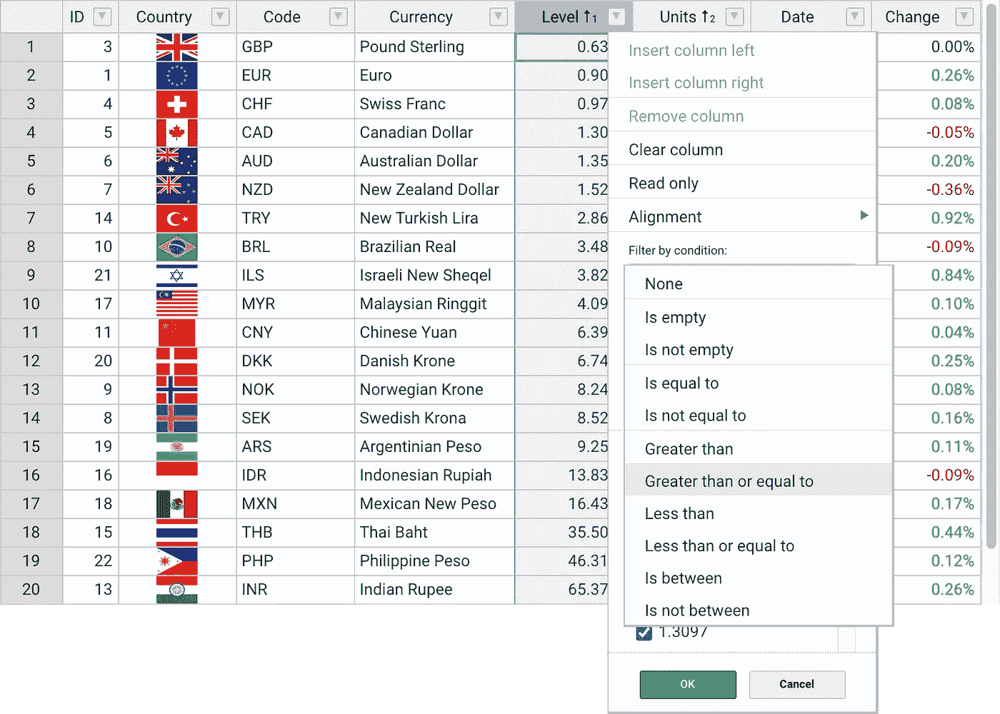
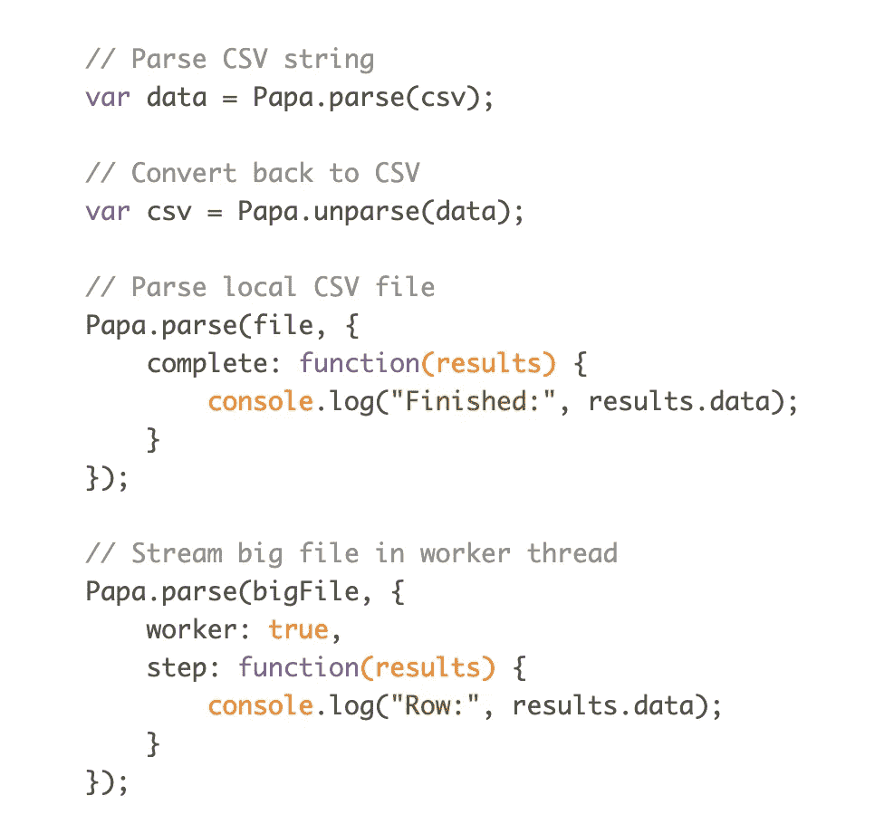
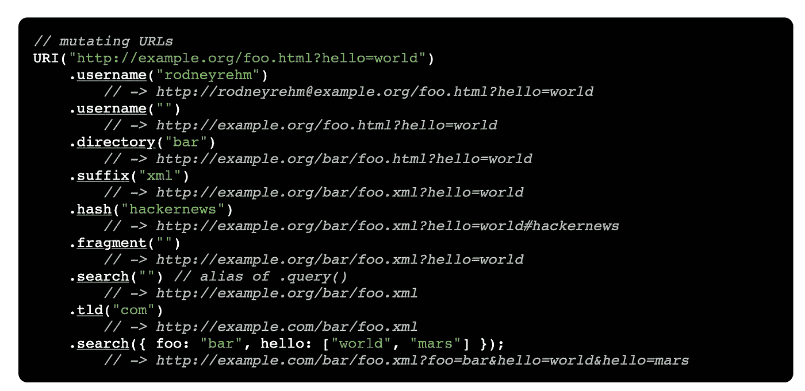
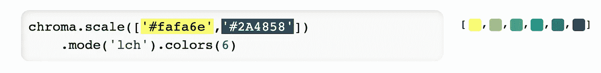
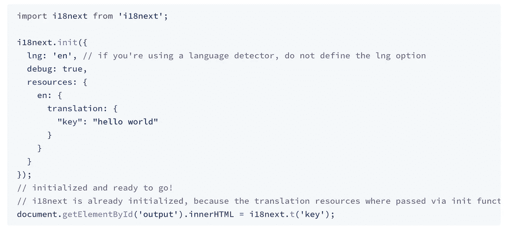
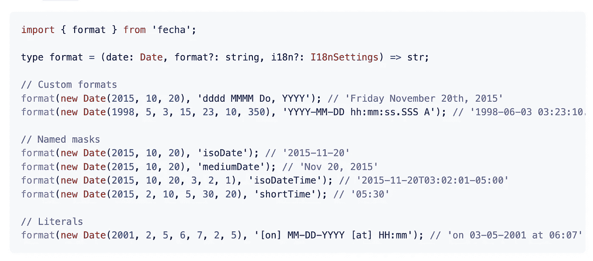
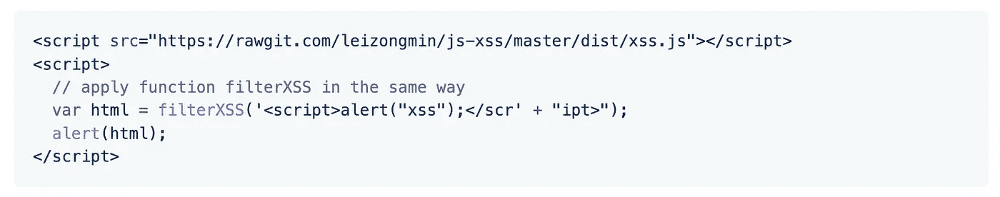

# 你应该在下一个项目中使用的 7 个有用的 JavaScript 库

> 原文：<https://javascript.plainenglish.io/7-useful-javascript-libraries-you-should-use-in-your-next-project-47d233d24480?source=collection_archive---------2----------------------->

## 增强您的 JavaScript 开发

Photo by [Pakata Goh](https://unsplash.com/@pakata?utm_source=unsplash&utm_medium=referral&utm_content=creditCopyText) on [Unsplash](https://unsplash.com/s/photos/programming?utm_source=unsplash&utm_medium=referral&utm_content=creditCopyText)

当一个库可以完成同样的事情时，你为什么要创建定制的功能呢？库是开发者最好的朋友和救星。在我看来，一个好的项目利用了一些最好的可用库。

我不认为 JavaScript 需要任何介绍。它是几乎所有用途中最常用的编程语言之一。在这里，我编译了 7 个有用的 JavaScript 库，它们将在您的开发之旅中为您提供帮助。

# 1.可手持的

这是拥有超过 17.5k 颗星的最多星的库之一。它结合了数据网格特性和类似电子表格的 UX。它还提供数据绑定、数据验证、过滤、排序和 CRUD 操作。它与反应，角度和 Vue 一起工作。它包括许多功能，如多列排序、非连续选择、过滤数据、导出到文件
验证数据等等。

 [## GitHub-handsontable/handsontable:带有电子表格外观的 JavaScript 数据网格。与…一起工作

### 带有电子表格外观的 JavaScript 数据网格。与反应、角度和 Vue 一起使用。由手持设备支持…

github.com](https://github.com/handsontable/handsontable) 

# 2.PapaParse

这是最快的 T2 浏览器内 CSV(或分隔文本)解析器。根据 [RFC 4180](https://tools.ietf.org/html/rfc4180) 它是可靠和正确的。它包括许多特性，如直接解析 CSV 文件(本地或通过网络)、流式传输大文件(甚至通过 HTTP)、反向解析(将 JSON 转换为 CSV)等等。它在 GitHub 上有超过 10.5k 颗星。

 [## GitHub - mholt/PapaParse:快速而强大的 CSV(分隔文本)解析器，可以优雅地处理…

### 快速和强大的 CSV(分隔文本)解析器，优雅地处理大文件和畸形输入

github.com](https://github.com/mholt/PapaParse) 

# 3.上呼吸道感染

这个库提供了处理查询字符串的简单而强大的方法，有许多 URI 规范化函数，并转换相对/绝对路径。而这个库提供了一个 [jQuery 插件](http://medialize.github.io/URI.js/jquery-uri-plugin.html)。URI.js 本身并不依赖 jQuery。使用这个不需要 jQuery。这个库在 GitHub 上有超过 6k 的星星。

 [## GitHub-media lize/uri . js:Javascript URL 突变库

### 重要提示:您可能不再需要 URI.js 了！现代浏览器提供了 URL 和 URLSearchParams 接口。注意:…

github.com](https://github.com/medialize/URI.js) 

# 4.色度

作为一名开发人员，我们必须使用多种颜色。这是一个[小型](https://bundlephobia.com/result?p=chroma-js)零依赖 JavaScript 库( [13.5kB](https://bundlephobia.com/result?p=chroma-js) )，适用于各种颜色转换和色阶。它包括许多功能，如从各种格式中读取颜色，分析和处理颜色，将颜色转换为各种格式，等等。这个库在 GitHub 上有 9k 多颗星。

 [## GitHub - gka/chroma.js:用于各种颜色操作的 JavaScript 库

### Chroma.js 是一个非常小的零依赖 JavaScript 库(13.5kB)，用于各种颜色转换和颜色…

github.com](https://github.com/gka/chroma.js) 

# 5.i18 下一步

如果你想为你的应用程序增加国际化，这是一个很好的资源。它不仅仅提供标准的 i18n 特性，比如([复数](/translation-function/plurals)、[上下文](/translation-function/context)、[插值](/translation-function/interpolation)和[格式](/translation-function/formatting))。它为您提供了一个完整的解决方案，将您的产品从 web 本地化到移动和桌面。它在 GitHub 上有超过 6k 颗星。

 [## GitHub - i18next/i18next: i18next:学一次-到处翻译

### i18 下一步:学一次——到处翻译。在 GitHub 上创建一个帐户，为 i18next/i18next 开发做贡献。

github.com](https://github.com/i18next/i18next) 

# 6.费沙

处理数据是开发人员的常见任务之一。这将有助于你完成这项任务。这是一个日期格式化和解析(~2KB)库，旨在取代 moment.js 的解析和格式化功能。

 [## GitHub — taylorhakes/fecha:轻量级和简单的 JS 日期格式化和解析

### 轻量级日期格式化和解析(~2KB)。旨在取代 moment.js 的解析和格式化功能…

github.com](https://github.com/taylorhakes/fecha) 

# 7.js-xss

正如你已经猜到的名字，这个库是用来过滤来自用户的输入，以防止 XSS 攻击。它用白名单指定的配置来净化不可信的 HTML(以防止 XSS)。它在 GitHub 上有超过 4.5k 颗星。

 [## GitHub - leizongmin/js-xss:用指定的配置净化不可信的 HTML(防止 XSS)…

### xss 是一个用于过滤用户输入以防止 XSS 攻击的模块。(什么是 XSS 攻击？)项目主页…

github.com](https://github.com/leizongmin/js-xss) 

# 其他一些很棒的资源在哪里？

总有新的东西要学。如果你想了解 JavaScript 上的数据可视化库，请点击下面的链接。

 [## 您可以在下一个项目中使用的 7 个最佳 JavaScript 数据可视化库

### 增强你的发展

javascript.plainenglish.io](/7-best-javascript-data-visualization-library-you-can-use-in-your-next-project-24c238952db6) 

今天到此为止。相信这些库对你的开发之旅会有很大的帮助。

如果你知道任何其他漂亮的 JavaScript 数据库，请在评论中分享。直到我们再次见面…干杯！

***想要连接？*** *如果你愿意，可以在* [***推特***](https://twitter.com/FarhanTanvirBD) ***上与我联系。***

*更多内容请看* [***说白了就是***](https://plainenglish.io/) *。报名参加我们的* [***免费每周简讯***](http://newsletter.plainenglish.io/) *。关注我们关于* [***推特***](https://twitter.com/inPlainEngHQ) ，[***LinkedIn***](https://www.linkedin.com/company/inplainenglish/)*，*[***YouTube***](https://www.youtube.com/channel/UCtipWUghju290NWcn8jhyAw)*[***不和***](https://discord.gg/GtDtUAvyhW) *。对增长黑客感兴趣？检查出* [***电路***](https://circuit.ooo/) *。**