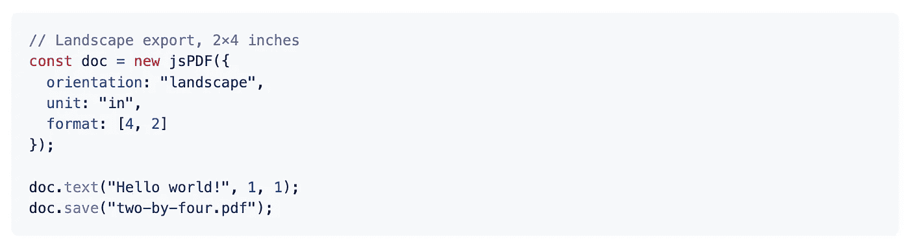
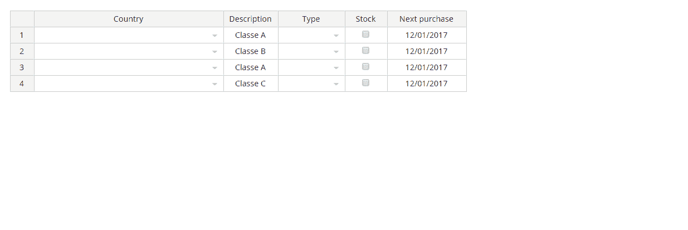
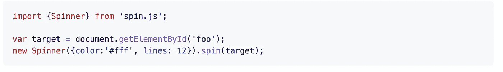
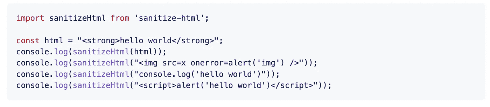
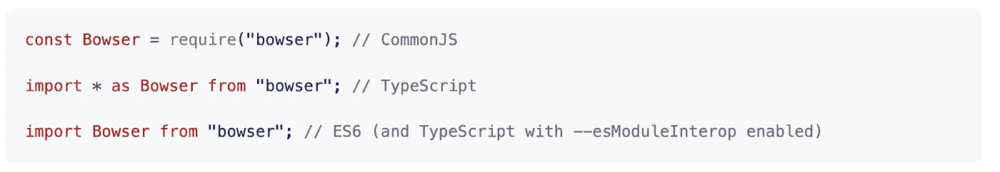
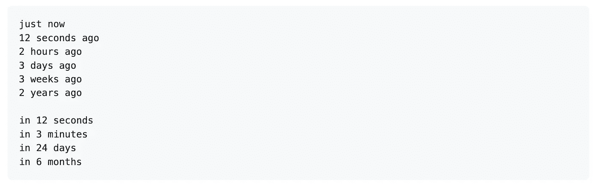
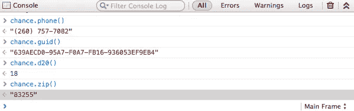

# 你应该在下一个项目中使用的 7 个有用的 JavaScript 库

> 原文：<https://javascript.plainenglish.io/7-useful-javascript-libraries-you-should-use-in-your-next-project-c0f2b0499f79?source=collection_archive---------5----------------------->

## 增强您的 JavaScript 开发


Photo by [Clément Hélardot](https://unsplash.com/@clemhlrdt?utm_source=unsplash&utm_medium=referral&utm_content=creditCopyText) on [Unsplash](https://unsplash.com/s/photos/javascript-code?utm_source=unsplash&utm_medium=referral&utm_content=creditCopyText)

有句谚语“不必多此一举”。图书馆就是最好的例子。它帮助你以一种简单的方式编写复杂而耗时的功能。根据我的观点，一个好的项目使用一些最好的可用库

我不认为 JavaScript 需要任何介绍。它是几乎所有用途中最常用的编程语言之一。在这里，我编译了 7 个有用的 JavaScript 库，它们将在您的开发之旅中为您提供帮助。

# 1.jsPDF



这是星级最高的库之一，拥有超过 25k 个星级。如果您想为活动门票、报告、证书等生成 pdf，这是一个很好的资源。正如您已经猜到的，这个库将帮助您生成客户端 JavaScript PDF。

[](https://github.com/parallax/jsPDF) [## GitHub - parallax/jsPDF:面向所有人的客户端 JavaScript PDF 生成。

### 面向所有人的客户端 JavaScript PDF 生成。- GitHub - parallax/jsPDF:客户端 JavaScript PDF 生成…

github.com](https://github.com/parallax/jsPDF) 

# 2.英国国教会



这是一个轻量级的库，用来创建惊人的基于 web 的交互式 HTML 表格和与其他电子表格软件兼容的电子表格。您可以从 JS 数组、JSON、CSV 或 XSLX 文件创建在线电子表格。您可以从 excel 复制并直接粘贴到 CE 电子表格中，反之亦然。集成任何第三方 JavaScript 插件来创建您自己的定制列、定制编辑器以及将任何特性定制到您的应用程序中是非常容易的。它在 GitHub 上有超过 6k 颗星。

[](https://github.com/jspreadsheet/ce) [## jspreadsheet 是一个轻量级的普通 javascript 插件，可以创建令人惊奇的…

### Jspreadsheet 是一个轻量级的普通 javascript 插件，用于创建令人惊叹的基于 web 的交互式表格和电子表格…

github.com](https://github.com/jspreadsheet/ce) 

# 3.旋转



加载数据时显示加载屏幕是创造良好用户体验的最佳方式之一。正如你已经猜到的，这个库提供了一个旋转的活动指示器。它包括许多特性，如无图像、无依赖性、高度可配置、独立于分辨率等等。它在 GitHub 上有超过 9k 颗星。

[](https://github.com/fgnass/spin.js) [## GitHub - fgnass/spin.js:一个旋转活动指示器

### 旋转活动指示器。在 GitHub 上创建一个帐户，为 fgnass/spin.js 的开发做出贡献。

github.com](https://github.com/fgnass/spin.js) 

# 4.Sanitize-HTML



这个库非常适合清理 HTML 片段，例如 CKEditor 和其他富文本编辑器创建的 HTML 片段。当从 Word 中复制和粘贴时，它对于删除不需要的 CSS 特别方便。它允许您指定想要允许的标记，以及每个标记允许的属性。这个库在 GitHub 上有超过 3k 颗星。

[](https://github.com/apostrophecms/sanitize-html) [## GitHub-apostrophecms/sanitize-html:清理用户提交的 HTML，保留白名单中的元素…

### 清理用户提交的 HTML，保留每个元素的白名单元素和白名单属性。建成…

github.com](https://github.com/apostrophecms/sanitize-html) 

# 5.加油车



这个库是用来帮助检测你的用户使用的是什么浏览器，并给你一个方便的 API 来根据用户的浏览器过滤用户。它包括一些特性，比如小文件(大约 4.8kB gzipped)，只使用你需要的解析器，多平台等等。它在 GitHub 上有超过 5k 颗星。

[](https://github.com/lancedikson/bowser) [## GitHub - lancedikson/bowser:浏览器检测器

### 一个小型、快速和丰富的 API 浏览器/平台/引擎检测器，适用于浏览器和节点。小。使用普通的 ES5 版本…

github.com](https://github.com/lancedikson/bowser) 

# 6.很久以前



正如您所猜测的，这是一个 nano 库(小于`2 kb`)，用于用`*** time ago`语句格式化日期时间。比如“3 小时前”。它包括支持 i18n，支持时间`ago`和时间`in`，支持实时渲染等特性。它在 GitHub 上有超过 4k 颗星。

[](https://github.com/hustcc/timeago.js) [## GitHub-HUS TCC/time ago . js::clock 8:time ago . js 是一个很小的(2.0 kb)库，用于格式化日期…

### clock8: :hourglass: timeago.js 是一个很小的(2.0 kb)库，用于用` *** time ago '语句格式化日期。- GitHub …

github.com](https://github.com/hustcc/timeago.js) 

# 7.Chancejs



这是一个最小化的随机字符串、数字等生成器，有助于减少一些单调，特别是在编写自动化测试或者任何你需要随机的地方。它是在这个网站上加载的，所以你可以在你的浏览器上打开控制台玩。它在 GitHub 上有超过 6k 颗星。

[](https://github.com/chancejs/chancejs) [## GitHub-Chance js/Chance js:JavaScript 的随机生成器助手

### JavaScript 主页的随机生成器助手:http://chancejs.com

github.com](https://github.com/chancejs/chancejs) 

# 其他一些很棒的资源在哪里？

总有新的东西要学。如果你想了解更多的 Javascript 库，请点击下面的链接。

[](/7-useful-javascript-libraries-you-should-use-in-your-next-project-47d233d24480) [## 你应该在下一个项目中使用的 7 个有用的 JavaScript 库

### 增强您的 JavaScript 开发

javascript.plainenglish.io](/7-useful-javascript-libraries-you-should-use-in-your-next-project-47d233d24480) 

今天到此为止。相信这些库对你的开发之旅会有很大的帮助。

如果你知道任何其他漂亮的 JavaScript 库，请在评论中分享。直到我们再次见面…干杯！

```
**Want to Connect?**If you want to, you can connect with me on [**Twitter**](https://twitter.com/FarhanTanvirBD)
```

*更多内容请看*[***plain English . io***](https://plainenglish.io/)*。报名参加我们的* [***免费周报***](http://newsletter.plainenglish.io/) *。关注我们关于*[***Twitter***](https://twitter.com/inPlainEngHQ)[***LinkedIn***](https://www.linkedin.com/company/inplainenglish/)*[***YouTube***](https://www.youtube.com/channel/UCtipWUghju290NWcn8jhyAw)*[***不和***](https://discord.gg/GtDtUAvyhW) *。对增长黑客感兴趣？检查* [***电路***](https://circuit.ooo/) *。***