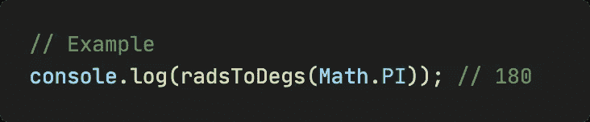
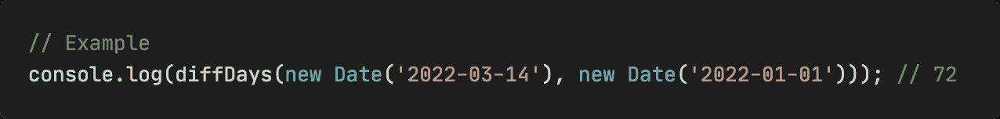
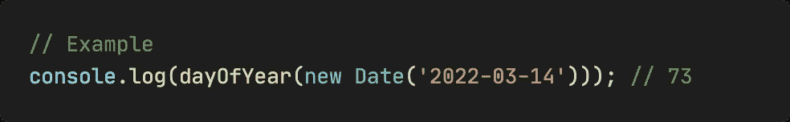
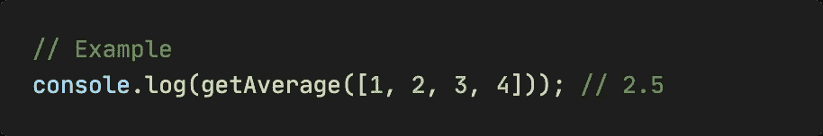
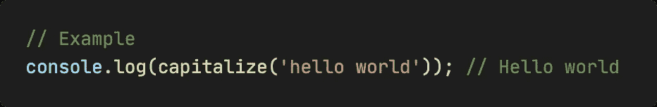
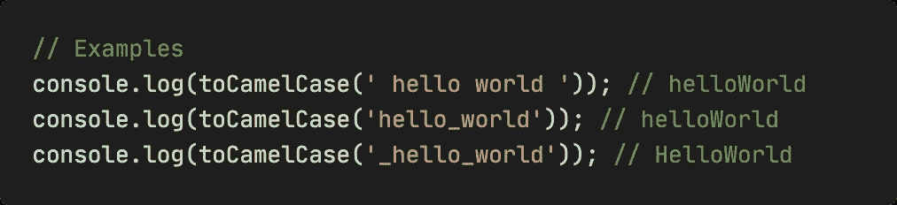
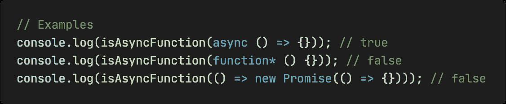

# JavaScript 中 7 个有用的一行程序

> 原文：<https://javascript.plainenglish.io/7-useful-one-liners-in-javascript-862a2a1a3669?source=collection_archive---------7----------------------->

## 代码越少意味着越好。

Photo by [Sigmund](https://unsplash.com/@sigmund?utm_source=medium&utm_medium=referral) on [Unsplash](https://unsplash.com?utm_source=medium&utm_medium=referral)

在本文中，我将向您介绍 7 个有用且有趣的 JS 一行程序。

希望你看到每一项的标题后想一想，如果你自己去实现应该怎么做？然后点击**运行项目**看我给的代码对比一下，看看和你想的有什么不一样？

如果你认为有其他解决方案或者我给出的代码可以优化，请在评论中告诉我。

# 1.将弧度转换为角度

# 2.计算两个日期之间的差异

# 3.从日期中获取一年中的某一天

# 4.获取数组的平均值

# 5.将字符串的第一个字母大写

# 6.将字符串转换为驼色

# 7.检查一个值是否是异步函数

*最后，我是李。我会继续输出前端技术相关的故事。如果你喜欢这样的故事，想支持我，请考虑成为* [*中等会员*](https://medium.com/@islizeqiang/membership) *。每月 5 美元，你可以无限制地访问媒体内容。如果你通过* [*我的链接*](https://medium.com/@islizeqiang/membership) *报名，我会得到一点佣金。*

你的支持对我来说非常重要——谢谢。

*更多内容看* [***说白了。报名参加我们的***](https://plainenglish.io/) **[***免费每周简讯***](http://newsletter.plainenglish.io/) *。关注我们* [***推特***](https://twitter.com/inPlainEngHQ) *和*[***LinkedIn***](https://www.linkedin.com/company/inplainenglish/)*。加入我们的* [***社区不和谐***](https://discord.gg/GtDtUAvyhW) *。***