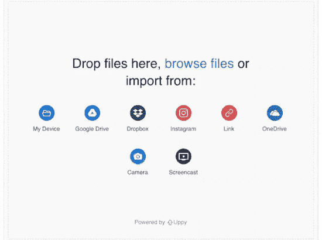
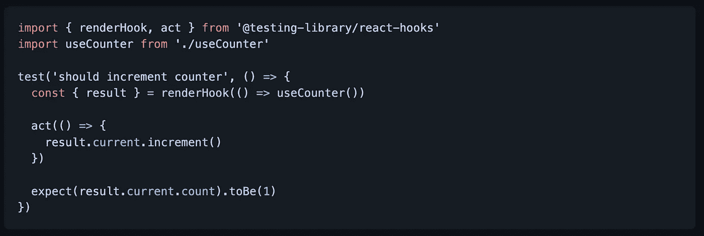
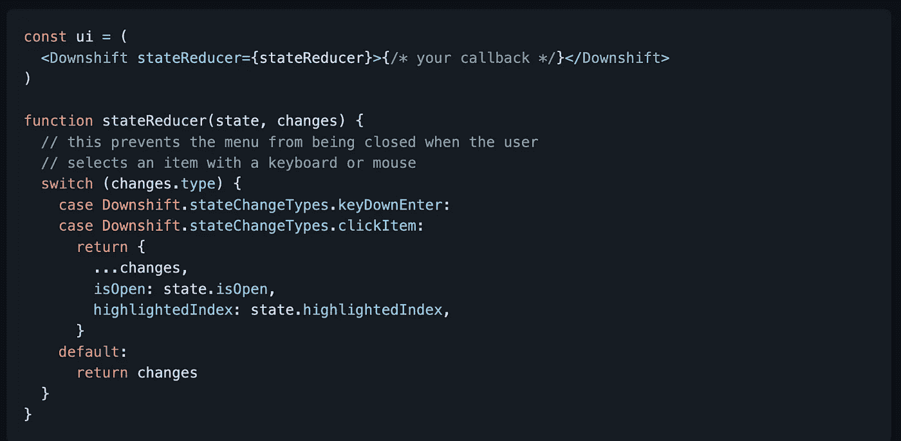
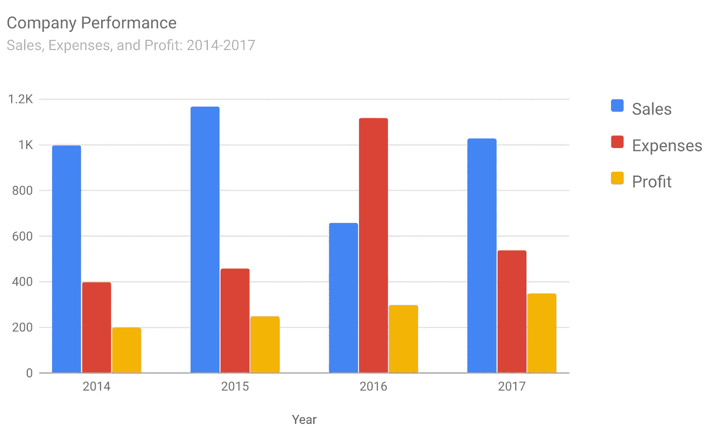
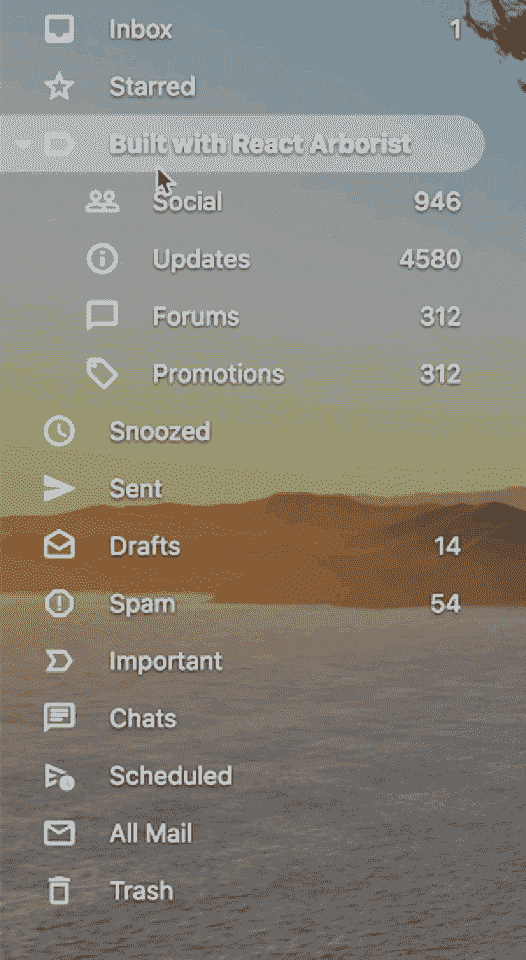

# 您应该在下一个项目中使用的 7 个有用的 React 库

> 原文：<https://javascript.plainenglish.io/7-useful-react-libraries-you-should-use-in-your-next-project-29194fbace7a?source=collection_archive---------2----------------------->

## 增强你的反应能力


Photo by [Tudor Baciu](https://unsplash.com/@baciutudor?utm_source=unsplash&utm_medium=referral&utm_content=creditCopyText) on [Unsplash](https://unsplash.com/s/photos/react-js?utm_source=unsplash&utm_medium=referral&utm_content=creditCopyText)

当我们可以通过使用一个库轻松实现相同的结果时，为什么还要编写自定义功能呢？开发人员最好的朋友和救星是库。我相信一个好的项目会利用一些最好的可用库。React 是创建用户界面的最好的 JavaScript 库之一。在这里，我编译了一个包含 7 个 React 库的列表，这些库将在您的开发之旅中对您有所帮助。

# 1.uppy



从头开始创建文件上传程序有时可能是一项复杂或耗时的任务。这是一个文件上传程序，可以与任何应用程序无缝集成。它包括从本地磁盘、远程 URL、Google Drive、Dropbox、box、Instagram 或 snap 获取文件以及用相机记录自拍、上传到最终目的地、可选处理/编码等功能。它在 GitHub 上有超过 26k 颗星。

[](https://github.com/transloadit/uppy) [## GitHub-transloadit/uppy:web 浏览器的下一个开源文件上传程序

### web 浏览器的下一个开源文件上传器:dog: - GitHub - transloadit/uppy:下一个开源文件…

github.com](https://github.com/transloadit/uppy) 

# 2.反应-钩子-测试-库



测试是软件开发最重要的阶段之一。它会让你的应用防弹。正如您从名字中猜到的，这个库允许您为 React 钩子创建一个简单的测试工具，处理在函数组件主体中运行钩子，并提供各种有用的实用函数来更新输入和检索您的定制钩子的输出。它在 GitHub 上有超过 4.5k 颗星。

[](https://github.com/testing-library/react-hooks-testing-library) [## GitHub -测试-库/react-hooks-测试-库:🐏简单和完整的反应挂钩测试…

### 简单完整的 React hooks 测试工具鼓励良好的测试实践。如果您正在使用当前…

github.com](https://github.com/testing-library/react-hooks-testing-library) 

# 3.换低速档



如果你需要一个自动完成/组合框，或者在你的应用程序中有一个选择体验，并且你希望它是可访问的，那么这是一个很好的资源。这个库包括一组 React 钩子，提供了使相应的组件起作用和可访问所需的有状态逻辑。这个库在 GitHub 上有超过 10.5k 的星星。

[](https://github.com/downshift-js/downshift) [## GitHub -降档-js/降档:🏎一组原语构建简单、灵活的 WAI-ARIA…

### 🏎一组原语来构建简单、灵活、符合 WAI-ARIA 的 React autocomplete、combobox 或 select dropdown…

github.com](https://github.com/downshift-js/downshift) 

# 4.谷歌图表



如果你想像谷歌一样展示图表，那么这是一个很好的资源。正如您已经猜到的，这个库在 Google Charts 可视化和 Charts API 上提供了一个瘦的、类型化的 React 包装器。它在 GitHub 上有超过 1k 颗星。

[](https://github.com/RakanNimer/react-google-charts) [## GitHub-rakan nimer/react-Google-Charts:一个薄薄的、打字的、React 包装的 Google Charts…

### 一个薄薄的、打字的、React 的谷歌图表包装器。快速入门*文档*贡献*堆栈溢出安装此库…

github.com](https://github.com/RakanNimer/react-google-charts) 

# 5.树木研究者



树形视图在软件应用中无处不在。该库为 React 生态系统提供了一个完整的解决方案，以构建相当于 VSCode 侧栏、Mac Finder、Windows 资源管理器或 Sketch/Figma 图层面板的工具。它在 GitHub 上有超过 1.5k 颗星。

[](https://github.com/brimdata/react-arborist) [## GitHub-brim data/React-arborist:React 的完整树形视图组件

### 查看演示树状视图在软件应用程序中无处不在。这个库为 React 生态系统提供了一个…

github.com](https://github.com/brimdata/react-arborist) 

# 6.汉堡牛肉饼


这是一个[汉堡菜单图标](https://hamburger-react.netlify.app/)，带有 CSS 驱动的过渡。它被创造得尽可能优雅和高性能。这意味着没有 JavaScript 动画，没有非廉价属性上的转换，以及小尺寸。

[](https://github.com/luukdv/hamburger-react) [## GitHub-luukdv/hamburger-React:React 的动画汉堡菜单图标(1.5 KB)🍔

### React 的动画汉堡菜单图标(1.5 KB)🍔- GitHub - luukdv/hamburger-react:动画汉堡菜单图标…

github.com](https://github.com/luukdv/hamburger-react) 

# 7.图像库


如果你想创建图片库和旋转木马，那么这个库是一个很好的资源。它包括移动滑动手势、缩略图导航、全屏支持、RTL 支持等功能。它在 GitHub 上有超过 3k 颗星。

[](https://github.com/xiaolin/react-image-gallery) [## GitHub-Xiaolin/React-image-gallery:带有缩略图支持的 React carousel image gallery 组件…

### 带有缩略图支持的 React carousel 图像库组件🖼-github-Xiaolin/react-image-gallery:react carousel…

github.com](https://github.com/xiaolin/react-image-gallery) 

# 其他一些很棒的资源在哪里？

总有新的东西要学。如果你想了解更多 React 上的精彩资源，请点击下面的链接。

[](/7-most-starred-react-libraries-you-should-know-19fc3508d2c1) [## 你应该知道的 7 个最著名的 React 库

### 使用这些 React 库增强您的开发能力。

javascript.plainenglish.io](/7-most-starred-react-libraries-you-should-know-19fc3508d2c1) 

今天到此为止。我希望这些库有助于简化开发过程。

如果你知道任何其他有用的 React 库，请在评论中分享。直到我们再次相遇。干杯！

```
**Want to Connect?.** If you want to,you can connect with me on [**Twitter**](https://twitter.com/FarhanTanvirBD)
```

*更多内容请看*[***plain English . io***](https://plainenglish.io/)*。报名参加我们的* [***免费周报***](http://newsletter.plainenglish.io/) *。关注我们关于*[***Twitter***](https://twitter.com/inPlainEngHQ)[***LinkedIn***](https://www.linkedin.com/company/inplainenglish/)*[***YouTube***](https://www.youtube.com/channel/UCtipWUghju290NWcn8jhyAw)*[***不和***](https://discord.gg/GtDtUAvyhW) *。对增长黑客感兴趣？检查* [***电路***](https://circuit.ooo/) *。***