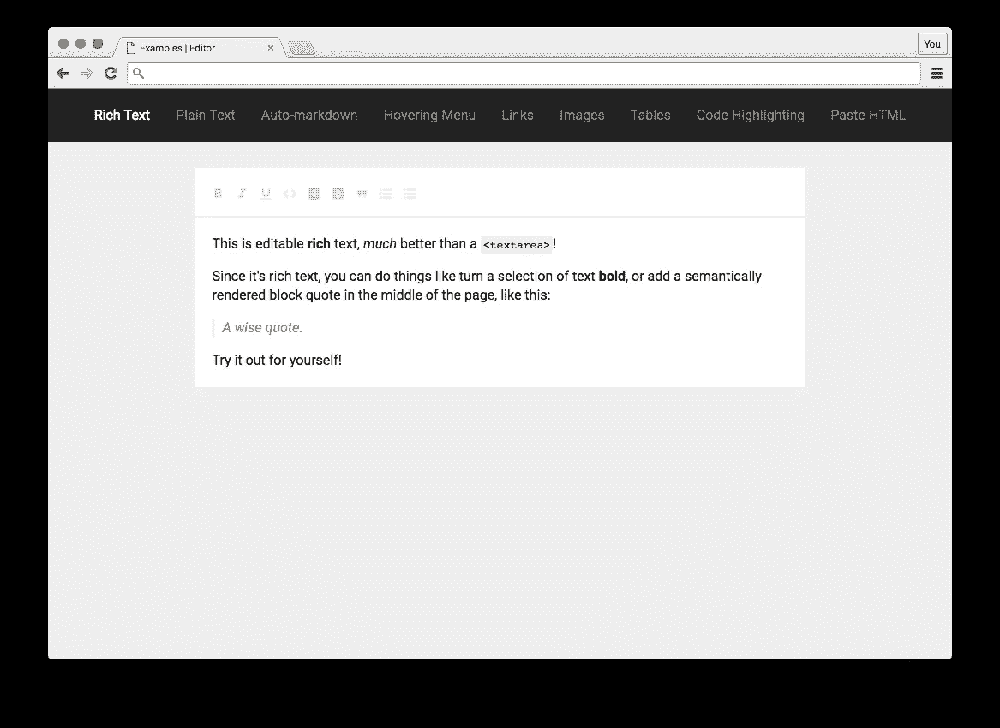
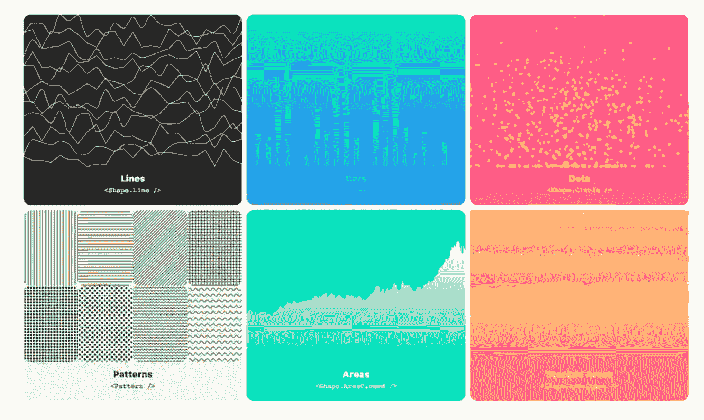
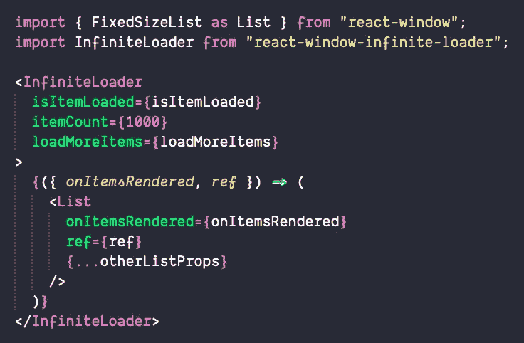
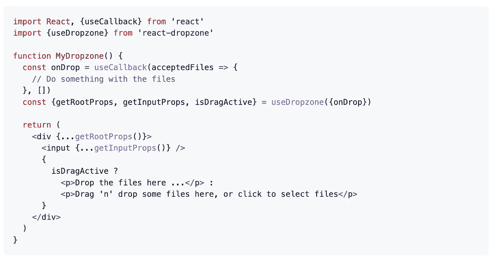
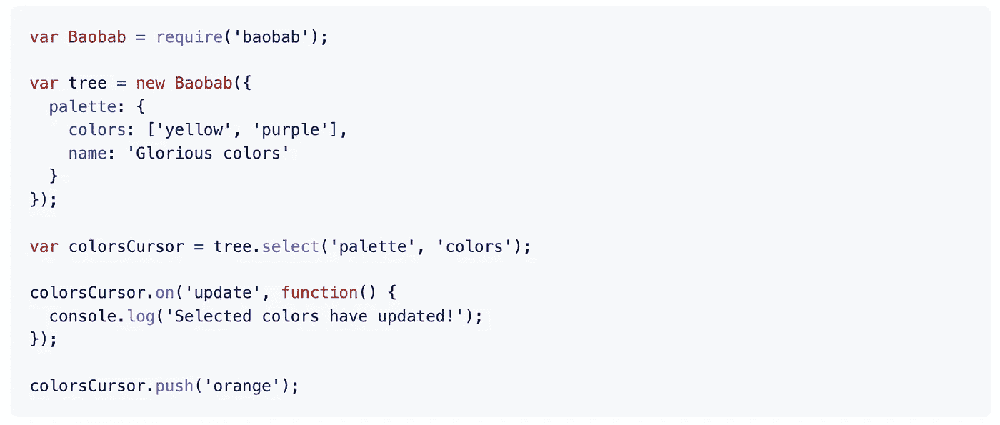
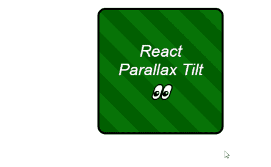
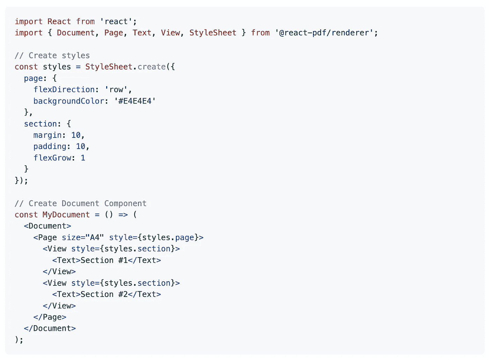

# 您应该在下一个项目中使用的 7 个有用的 React 库

> 原文：<https://javascript.plainenglish.io/7-useful-react-libraries-you-should-use-in-your-next-project-4bb6dff21d54?source=collection_archive---------0----------------------->

## 为你的项目反应库:1。石板，2。visx，3。反应窗口，4。反应-dropzone，5。猴面包树，6 岁。视差倾斜和 7。react-pdf。


Photo by [AltumCode](https://unsplash.com/@altumcode?utm_source=unsplash&utm_medium=referral&utm_content=creditCopyText) on [Unsplash](https://unsplash.com/s/photos/programming-code?utm_source=unsplash&utm_medium=referral&utm_content=creditCopyText)

当我们可以通过使用一个库轻松实现相同的结果时，为什么还要编写自定义功能呢？开发人员最好的朋友和救星是库。我相信一个好的项目会利用一些最好的可用库。React 是创建用户界面的最好的 JavaScript 库之一。

本文是 React 的令人敬畏的库系列的一部分，在该系列中，我总是汇编一个 7 个 React 库的列表，这些库将在您的开发旅程中帮助您。

# 1.石板



这是最受欢迎的 GitHub 库之一，拥有超过 25k 颗星。这会让你构建丰富、直观的编辑器，就像那些在[媒体](https://medium.com/)、 [Dropbox Paper](https://www.dropbox.com/paper) 或[谷歌文档](https://www.google.com/docs/about/)中的编辑器。它可以做到这一点，因为它的所有逻辑都是通过一系列插件实现的，所以你永远不会受到“核心”中有什么或没有什么的约束。你可以把它看作是建立在 [React](https://facebook.github.io/react/) 之上的`contenteditable`的可插拔实现。它的灵感来自于像 [Draft.js](https://facebook.github.io/draft-js/) 、 [Prosemirror](http://prosemirror.net/) 和 [Quill](http://quilljs.com/) 这样的库。

[](https://github.com/ianstormtaylor/slate) [## GitHub - ianstormtaylor/slate:一个完全可定制的框架，用于构建富文本编辑器…

### 一个完全可定制的框架，用于构建富文本编辑器。Slate 让您构建丰富、直观的编辑器，如…

github.com](https://github.com/ianstormtaylor/slate) 

# 2.visx



这张是 Airbnb 的。这是一个可重用的低级可视化组件的集合。它结合了 d3 生成可视化的能力和 react 更新 DOM 的优势。它在 GitHub 上有超过 15k 颗星。

[](https://github.com/airbnb/visx) [## GitHub - airbnb/visx:🐯visx |可视化组件

### visx 是一个可重用的低级可视化组件的集合。visx 结合了 d3 的力量来产生你的…

github.com](https://github.com/airbnb/visx) 

# 3.反应窗口



如果您必须处理大量数据，那么这是一个很好的资源。它的工作原理是只渲染大型数据集的一部分(仅够填充视口)。这有助于解决一些常见的性能瓶颈，比如渲染初始视图和处理更新所需的工作量和时间，通过避免 DOM 节点的过度分配而占用的内存，等等。它在 GitHub 上有超过 13k 颗星。

[](https://github.com/bvaughn/react-window) [## GitHub-bvaughn/React-window:React 组件，用于高效呈现大型列表和表格…

### React 组件可以有效地呈现大型列表和表格数据，React window 只需呈现一个

github.com](https://github.com/bvaughn/react-window) 

# 4.反应-下降区



从头开始创建拖放功能有时会非常耗时且复杂。这个库将帮助您完成这项任务。它提供了一个简单的 React 钩子来为文件创建一个符合 HTML5 的拖放区。这个库在 GitHub 上有 9k 多颗星。

[](https://github.com/react-dropzone/react-dropzone) [## GitHub—react-drop zone/react-drop zone:带有 React.js 的简单 HTML5 拖放区。

### 简单的 React 钩子为文件创建一个 HTML5 兼容的拖放区。文档和示例位于…

github.com](https://github.com/react-dropzone/react-dropzone) 

# 5.猴面包树



这是一个 JavaScript & TypeScript [持久化](http://en.wikipedia.org/wiki/Persistent_data_structure)和[不可变化](http://en.wikipedia.org/wiki/Immutable_object)(至少默认情况下)的数据树，支持游标并使开发人员能够通过事件轻松导航和监控嵌套数据。它旨在提供一个集中的模型来保存应用程序的状态，并且可以通过 mixins、高阶组件、包装器组件或 decorators 轻松地与 React 配对。它在 GitHub 上有超过 3k 颗星。

[](https://github.com/Yomguithereal/baobab) [## GitHub-Yomguithereal/baobab:JavaScript & TypeScript 持久的和可选的不可变数据…

### JavaScript & TypeScript 持久的和可选的不可变的带有游标的数据树。- GitHub - Yomguithereal/baobab…

github.com](https://github.com/Yomguithereal/baobab) 

# 6.视差倾斜



正如你从名字中猜到的，这个库将帮助你轻松地在 React 组件上应用倾斜悬停效果。它包括许多功能，如轻量级(3kB)，零依赖性，支持鼠标和触摸事件，支持设备倾斜(陀螺仪)，眩光效果，等等。

[](https://github.com/mkosir/react-parallax-tilt) [## GitHub-mko sir/react-parallax-tilt:👀轻松将倾斜悬停效果应用于反应组件…

### 👀在 React 组件上轻松应用倾斜悬停效果 npm 安装 react-parallax-tilt 轻量级(≈3kB)，零…

github.com](https://github.com/mkosir/react-parallax-tilt) 

# 7.react-pdf



如果你必须使用 PDF，那么这是一个很好的资源。这个库将帮助你创建 pdf。如果您希望显示现有的 pdf，您可以寻找 [react-pdf](https://github.com/wojtekmaj/react-pdf) 。这个库在 GitHub 上有超过 11k 的星星。

[](https://github.com/diegomura/react-pdf) [## GitHub - diegomura/react-pdf:📄使用 React 创建 PDF 文件

### React 渲染器用于在浏览器和服务器上创建 PDF 文件这个包用于使用 React 创建 PDF。如果你…

github.com](https://github.com/diegomura/react-pdf) 

# 另一部分在哪里？

有很多很棒的 React 库。我想分享尽可能多的资源，让你的开发之旅更轻松。

如果你想知道更多牛逼的 React 库，请查看下面。

[](/7-must-know-libraries-for-a-react-developer-57a324da9520) [## React 开发人员必须知道的 7 个库

### 加快你的反应发展

javascript.plainenglish.io](/7-must-know-libraries-for-a-react-developer-57a324da9520) [](/7-more-useful-react-libraries-you-should-use-in-your-next-project-5699594be1c8) [## 您应该在下一个项目中使用的 7 个更有用的 React 库

### 加快你的反应发展

javascript.plainenglish.io](/7-more-useful-react-libraries-you-should-use-in-your-next-project-5699594be1c8) [](/7-useful-react-libraries-you-should-use-in-your-next-project-dec9b577f15c) [## 您应该在下一个项目中使用的 7 个有用的 React 库

### 第 3 部分:用这些库加速 React 开发。

javascript.plainenglish.io](/7-useful-react-libraries-you-should-use-in-your-next-project-dec9b577f15c) [](/7-useful-react-libraries-you-should-use-in-your-next-project-8f33b9cf83e7) [## 您应该在下一个项目中使用的 7 个有用的 React 库

### 加快你的反应发展

javascript.plainenglish.io](/7-useful-react-libraries-you-should-use-in-your-next-project-8f33b9cf83e7) [](/7-useful-react-libraries-you-should-use-in-your-next-project-c6668d317db0) [## 您应该在下一个项目中使用的 7 个有用的 React 库

### 使用这些库加速您的 React 开发。

javascript.plainenglish.io](/7-useful-react-libraries-you-should-use-in-your-next-project-c6668d317db0) 

今天到此为止。我希望这些库有助于简化开发过程。

如果你知道任何其他有用的 React 库，请在评论中分享。直到我们再次相遇。干杯！

```
**Want to Connect?.** If you want to,you can connect with me on [**Twitter**](https://twitter.com/FarhanTanvirBD)
```

*更多内容请看*[***plain English . io***](https://plainenglish.io/)*。报名参加我们的* [***免费周报***](http://newsletter.plainenglish.io/) *。关注我们关于*[***Twitter***](https://twitter.com/inPlainEngHQ)[***LinkedIn***](https://www.linkedin.com/company/inplainenglish/)*[***YouTube***](https://www.youtube.com/channel/UCtipWUghju290NWcn8jhyAw)*[***不和***](https://discord.gg/GtDtUAvyhW) *。对增长黑客感兴趣？检查* [***电路***](https://circuit.ooo/) *。***