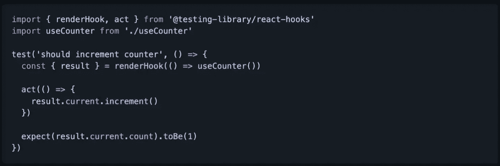
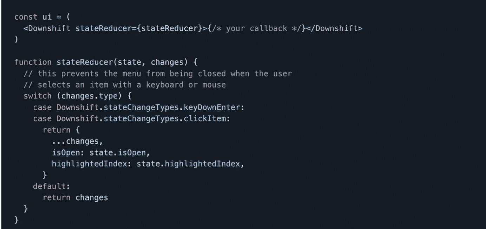
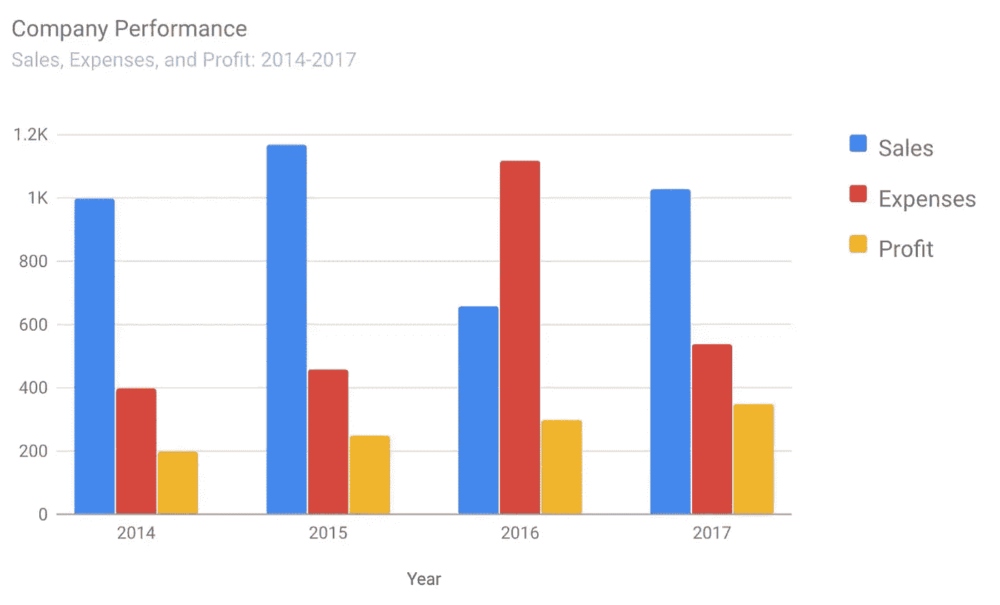
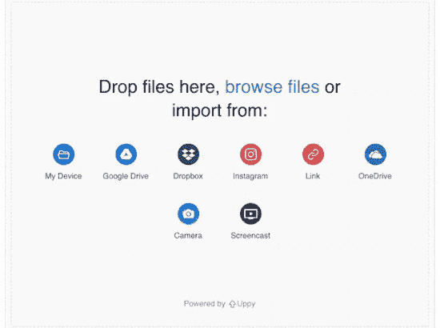

# 您应该在下一个项目中使用的 7 个有用的 React 库

> 原文：<https://javascript.plainenglish.io/7-useful-react-libraries-you-should-use-in-your-next-project-84a102f7bb1?source=collection_archive---------2----------------------->

## 增强你的反应能力

Photo by [Lautaro Andreani](https://unsplash.com/@lautaroandreani?utm_source=medium&utm_medium=referral) on [Unsplash](https://unsplash.com?utm_source=medium&utm_medium=referral)

## ***对扩展您的软件创业感兴趣？*** *检查出* [***电路***](https://circuit.ooo/?utm=publication-post-cta) *。*

既然有现成的解决方案，为什么还要使用定制代码呢？库对于任何开发人员来说都是必不可少的。我认为使用一些最好的图书馆是个好主意。React 有很多很棒的用于创建用户界面的子库，所以我列出了 7 个 React 库，可以在你的开发过程中帮助你。

# 1.反应-钩子-测试-库

开发软件时，测试非常重要。你的应用程序将更能抵抗“损害”这个库允许您为 React 挂钩创建一个测试工具，该测试工具在函数组件的主体内运行，并提供各种有用的实用函数来更新输入和检索自定义挂钩的输出。GitHub 上又一个有很多明星的。

 [## GitHub -测试-库/react-hooks-测试-库:🐏简单和完整的反应挂钩测试…

### 简单完整的 React hooks 测试工具鼓励良好的测试实践。如果您正在使用当前…

github.com](https://github.com/testing-library/react-hooks-testing-library) 

# 2.汉堡牛肉饼

这是一个带有 CSS 驱动过渡的汉堡菜单图标。代码被设计得尽可能的简洁和高效。这意味着在低质量的属性上没有华丽的动画或过渡，并且文件很小。

 [## GitHub—luukdv/hamburger-React:React 的动画汉堡菜单图标(1.5 KB)🍔

### React 的动画汉堡菜单图标(1.5 KB)🍔— GitHub — luukdv/hamburger-react:动画汉堡菜单图标…

github.com](https://github.com/luukdv/hamburger-react) 

# 3.换低速档

如果您的应用程序需要一些自动完成/组合框，这是一个很好的解决方案。它有一堆 React 钩子，可以让你用你的组件做有状态的事情。这个库在 GitHub 上有超过 10，500 颗星星。

 [## GitHub -降档-js/降档:🏎一组原语构建简单、灵活的 WAI-ARIA…

### 🏎一组原语来构建简单、灵活、符合 WAI-ARIA 的 React autocomplete、combobox 或 select dropdown…

github.com](https://github.com/downshift-js/downshift) 

# 4.谷歌图表

如果你想像谷歌一样创建图表，这是一个很好的资源。正如您已经猜到的，这个库在 Google Charts 可视化和 Charts API 上提供了一个瘦的、类型化的 React 包装器。它在 GitHub 上有很多明星。

 [## GitHub-rakan nimer/react-Google-Charts:一个薄薄的、打字的、React 包装的 Google Charts…

### 一个薄薄的、打字的、React 的谷歌图表包装器。快速入门*文档*贡献*堆栈溢出安装此库…

github.com](https://github.com/RakanNimer/react-google-charts) 

# 5.uppy

制作自己的文件上传器可能是一项复杂或耗时的任务。这是一个文件上传程序，适用于任何应用程序。它是一个工具，让你可以从你的电脑、远程网址或谷歌驱动器、Box 或 Dropbox 上抓取文件。你也可以自拍并上传到 Instagram 或 Snapchat。哦，它在 GitHub 上有很多星星！

 [## GitHub——transload it/uppy:web 浏览器的下一个开源文件上传程序

### web 浏览器的下一个开源文件上传器:dog: — GitHub — transloadit/uppy:下一个开源文件…

github.com](https://github.com/transloadit/uppy) 

# 6.树木研究者

在 web 应用程序中创建一个树形视图并不是我最喜欢做的事情。该库提供了一个完整的解决方案，可以使用 React 构建相当于 VSCode 侧栏、Mac Finder、Windows 资源管理器或 Sketch/Figma layers 面板的功能。又快又简单。哦，再一次在 GitHub 上，它有很多星星——它有超过 1.5k。

 [## GitHub-brim data/React-arborist:React 的完整树形视图组件

### 查看演示树状视图在软件应用程序中无处不在。这个库为 React 生态系统提供了一个…

github.com](https://github.com/brimdata/react-arborist) 

# 7.图像库

如果你想创建图片库和旋转木马，那么这个库是一个很好的资源。它具有移动滑动手势、缩略图导航、全屏支持、RTL 支持等功能。它在 GitHub 上有超过 3k 颗星。

 [## GitHub-Xiaolin/React-image-gallery:带有缩略图支持的 React carousel image gallery 组件…

### 带有缩略图支持的 React carousel 图像库组件🖼-github-Xiaolin/react-image-gallery:react carousel…

github.com](https://github.com/xiaolin/react-image-gallery) 

# 我在哪里可以找到一些其他伟大的资源？

总有新的东西要学。如果您有兴趣了解更多关于 React 和前端的内容，可以查看以下链接:

 [## 现在是 2022 年，不要再用 console.log 了，除了这个

### JavaScript 控制台对象有许多方法和技巧。这里有五个值得了解的。

medium.com](https://medium.com/@naubit/its-2022-don-t-use-console-log-anymore-but-this-e7fe4369dffe)  [## 网络开发者必备的 10 个 Chrome 扩展

### 1.维斯布格，2。主题化，3。WhatFont，4。瓦帕里斯，5 岁。Talend API 测试器，6。波，7。假数据，8。果酱，9。SVG 抓取器…

javascript.plainenglish.io](/10-must-have-chrome-extensions-for-web-developers-6a30f3fe9296)  [## TypeScript 中的路径别名以及为什么应该使用它们

### 嗯，开始这篇文章的正常方式是谈论路径别名和它们的故事…一旦读者(你)…

medium.com](https://medium.com/@naubit/path-aliases-in-typescript-and-why-you-should-use-them-c41344e0d0) 

我们连线:[推特:@thenaubit](https://twitter.com/thenaubit)

*更多内容请看*[***plain English . io***](https://plainenglish.io/)*。报名参加我们的* [***免费周报***](http://newsletter.plainenglish.io/) *。关注我们上*[***Twitter***](https://twitter.com/inPlainEngHQ)[***LinkedIn***](https://www.linkedin.com/company/inplainenglish/)*[***YouTube***](https://www.youtube.com/channel/UCtipWUghju290NWcn8jhyAw)**和* [***不和***](https://discord.gg/GtDtUAvyhW) *对成长黑客感兴趣？检查* [***电路***](https://circuit.ooo/) ***。*****