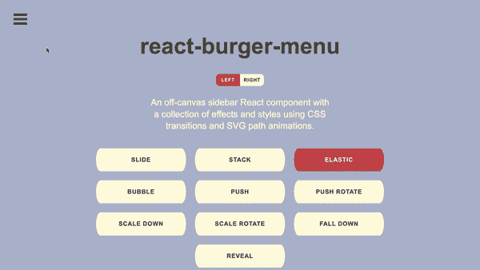
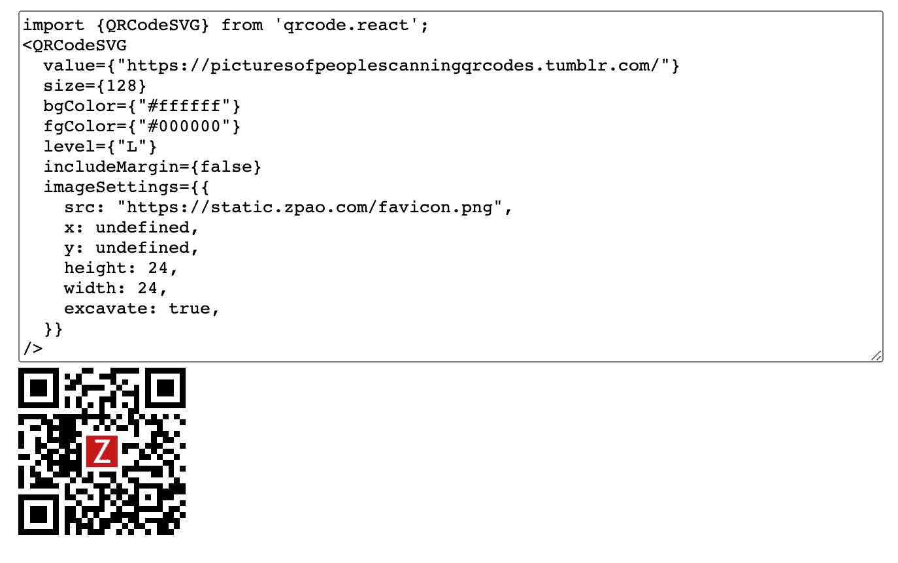
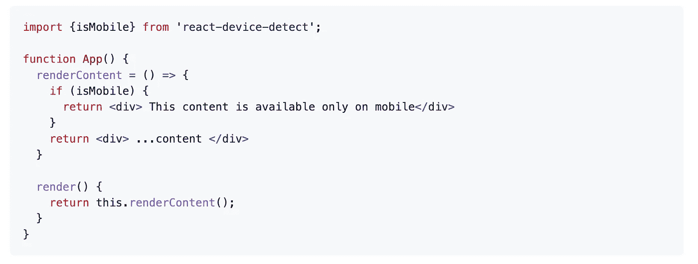
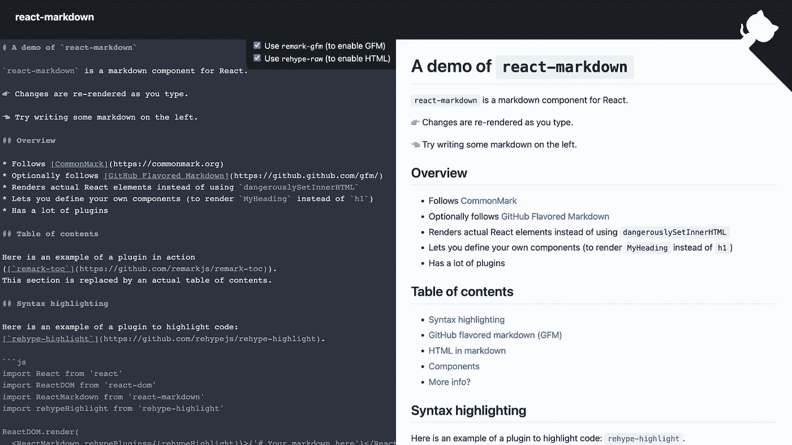

# 您应该在下一个项目中使用的 7 个有用的 React 库

> 原文：<https://javascript.plainenglish.io/7-useful-react-libraries-you-should-use-in-your-next-project-8f33b9cf83e7?source=collection_archive---------4----------------------->

## 加快你的反应发展

Photo by [Fili Santillán](https://unsplash.com/@filisantillan?utm_source=medium&utm_medium=referral) on [Unsplash](https://unsplash.com?utm_source=medium&utm_medium=referral)

当我们可以通过使用一个库轻松实现相同的结果时，为什么还要编写自定义功能呢？开发人员最好的朋友和救星是库。我相信一个好的项目会利用一些最好的可用库。React 是创建用户界面的最好的 JavaScript 库之一。

本文是 React 的令人敬畏的库系列的一部分，在该系列中，我总是汇编一个 7 个 React 库的列表，这些库将在您的开发旅程中帮助您。

# 1.反应汉堡菜单

这个非画布侧边栏 React 组件使用 SVG 路径动画和 CSS 过渡来创建各种效果和样式。它包括许多不同类型的动画，如 pushRotate、scaleDown、scaleRotate、fallDown、reveal 等等。您也可以根据需要对其进行定制。如果你正在使用 redux，你可以在这里 查看这个库的 redux 版本 [**。这个库在 GitHub 上有超过 4.5k 的星星。**](https://github.com/negomi/redux-burger-menu)

 [## GitHub-negomi/react-burger-menu:一个非画布侧边栏组件，包含一组效果和…

### hamburger:一个非画布侧边栏组件，使用 CSS 转场和 SVG 路径来收集效果和样式…

github.com](https://github.com/negomi/react-burger-menu) 

# 2.鸽子地图

地图在应用程序中的性能有时达不到您的预期。这个库将在这种情况下帮助您。它提供了一个性能优先、以反应为中心的可扩展地图引擎。它还提供了许多功能，如显示磁贴、任意叠加(标记等)、通过拖动移动地图、在手机上通过触摸移动地图、使用滚轮缩放等等。这个库在 GitHub 上有超过 3.3k 的星星。

 [## GitHub - mariusandra/pigeon-maps:没有外部依赖的 ReactJS 地图

### ReactJS 映射没有外部依赖性。在…上创建一个帐户，为 marius andra/鸽子地图的开发做出贡献

github.com](https://github.com/mariusandra/pigeon-maps) 

# 3.二维码. react

如果你必须生成一个二维码，那么这是一个很好的资源。正如你已经猜到的，这个库将帮助你生成二维码来渲染到 DOM 中。它同时支持 SVG 和 Canvas 渲染。通常建议使用 SVG，因为它更灵活，但是 Canvas 可能是更好的选择。这个库在 GitHub 上有超过 3k 颗星。

 [## GitHub - zpao/qrcode.react:与 react 一起使用的组件。

### 与 React 一起使用的组件。在 GitHub 上创建一个帐户，为 zpao/qrcode.react 开发做贡献。

github.com](https://github.com/zpao/qrcode.react) 

# 4.反作用弹簧

这是最有明星气质的 GitHub 动画库之一，拥有超过 23k 个明星。这个基于 spring physics 的动画库应该可以满足你的大部分 UI 动画需求。你得到了足够灵活的工具，可以大胆地将你的概念转化为移动的用户界面。

 [## ✌️:一个基于弹簧物理学的 react 动画库

### react-spring 是一个跨平台的 spring-physics 首个动画库。这很简单:只是关于我们的一点点…

github.com](https://github.com/pmndrs/react-spring) 

# 5.反应-设备-检测

正如你已经猜到的名字，这个库将帮助你检测设备，并根据检测到的设备类型呈现视图。为了查找设备信息，该库使用一种称为用户代理嗅探的方法。因此，它通过检查浏览器提供的用户代理字符串并将其与已知浏览器和设备名称列表进行对比来进行操作。这个库在 GitHub 上有超过 2k 的星星。

 [## GitHub-dusk load/react-device-Detect:检测设备，并根据检测到的设备渲染视图…

### 检测设备，并根据检测到的设备类型渲染视图。要安装，您可以使用 npm 或 yarn: npm 安装…

github.com](https://github.com/duskload/react-device-detect) 

# 6.反应-彩色

如果你想创建一个颜色选择器，这是一个很好的资源。这是 React 的一个小的(2，8 KB)颜色选择器组件，包括许多功能，如手机友好，跨浏览器，树摇动等。它在 GitHub 上有超过 2k 颗星。

 [## GitHub - omgovich/react-colorful:🎨一个小的(2,8 KB)颜色选择器组件，用于反应和预反应…

### react-colorful 是 react 和 Preact 应用程序的一个小型颜色选择器组件。🗜 Small:仅 2,8 kb gzipped(比前者轻 13 倍…

github.com](https://github.com/omgovich/react-colorful) 

# 7.反应-降价

这个库是一个 React 组件，可以给它一串降价，它将安全地呈现给 React 元素。您可以传递插件来更改 markdown 如何转换为 React 元素，并传递将用来代替普通 HTML 元素的组件。它在 GitHub 上有超过 9k 颗星。

 [## GitHub—remarkjs/React-markdown:React 的 Markdown 组件

### React 的降价组件。通过在 GitHub 上创建一个帐户，为 remakjs/react-markdown 开发做出贡献。

github.com](https://github.com/remarkjs/react-markdown) 

# 另一部分在哪里？

有很多很棒的 React 库。我想分享尽可能多的资源，让你的开发之旅更轻松。

如果你想知道更多牛逼的 React 库，请查看下面。

 [## React 开发人员必须知道的 7 个库

### 加快你的反应发展

javascript.plainenglish.io](/7-must-know-libraries-for-a-react-developer-57a324da9520)  [## 您应该在下一个项目中使用的 7 个更有用的 React 库

### 加快你的反应发展

javascript.plainenglish.io](/7-more-useful-react-libraries-you-should-use-in-your-next-project-5699594be1c8)  [## 您应该在下一个项目中使用的 7 个有用的 React 库

### 第 3 部分:用这些库加速 React 开发。

javascript.plainenglish.io](/7-useful-react-libraries-you-should-use-in-your-next-project-dec9b577f15c) 

今天到此为止。我希望这些库有助于简化开发过程。

如果你知道任何其他有用的 React 库，请在评论中分享。直到我们再次相遇。干杯！

***想要连接？***

*如果你愿意，可以在* [***推特***](https://twitter.com/FarhanT99598254) ***上和我联系。***

*更多内容请看*[***plain English . io***](https://plainenglish.io/)*。报名参加我们的* [***免费周报***](http://newsletter.plainenglish.io/) *。关注我们关于*[***Twitter***](https://twitter.com/inPlainEngHQ)*和*[***LinkedIn***](https://www.linkedin.com/company/inplainenglish/)*。查看我们的* [***社区不和谐***](https://discord.gg/GtDtUAvyhW) *加入我们的* [***人才集体***](https://inplainenglish.pallet.com/talent/welcome) *。*