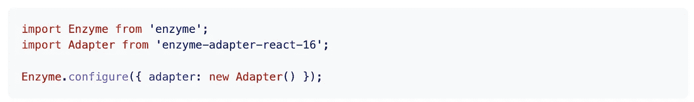
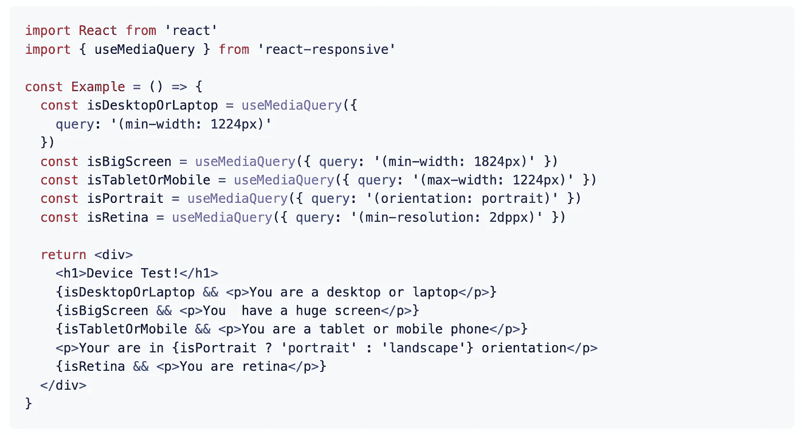
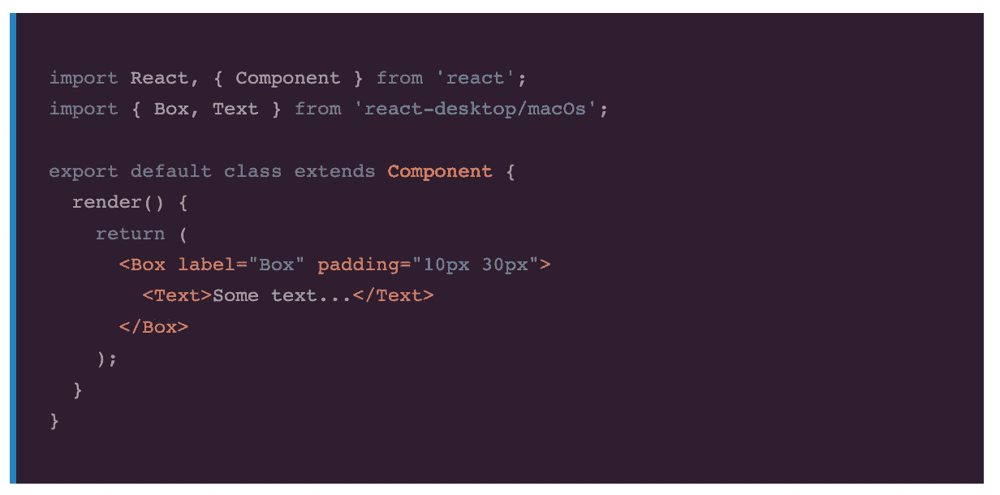
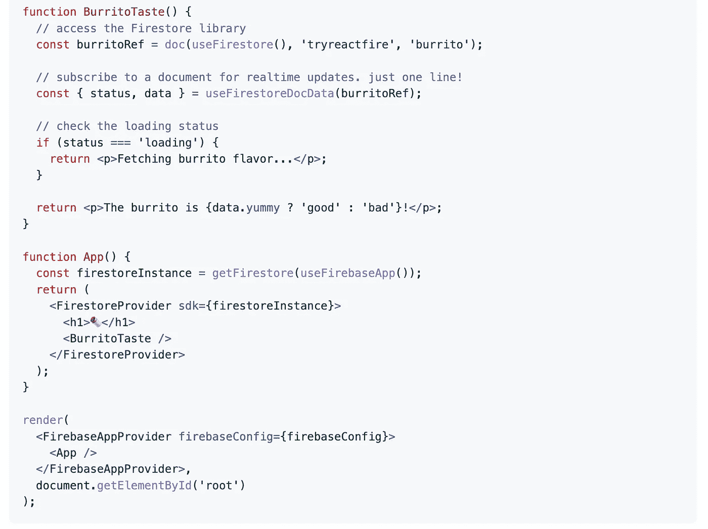
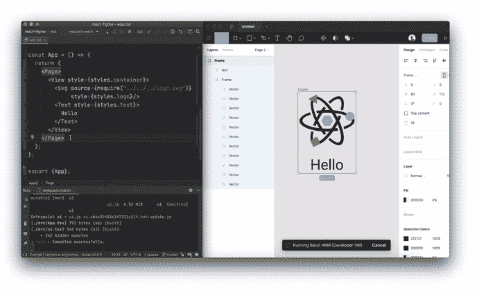
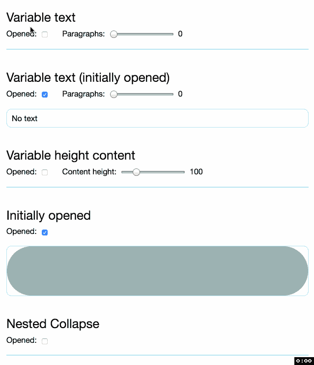

# 您应该在下一个项目中使用的 7 个有用的 React 库

> 原文：<https://javascript.plainenglish.io/7-useful-react-libraries-you-should-use-in-your-next-project-c6668d317db0?source=collection_archive---------4----------------------->

## 使用这些库加速您的 React 开发。


Photo by [Juanjo Jaramillo](https://unsplash.com/es/@juanjodev02?utm_source=medium&utm_medium=referral) on [Unsplash](https://unsplash.com?utm_source=medium&utm_medium=referral)

当我们可以通过使用一个库轻松实现相同的结果时，为什么还要编写自定义功能呢？开发人员最好的朋友和救星是库。我相信一个好的项目会利用一些最好的可用库。React 是创建用户界面的最好的 JavaScript 库之一。

本文是 React 的令人敬畏的库系列的一部分，在该系列中，我总是汇编一个 7 个 React 库的列表，这些库将在您的开发旅程中帮助您。

# 1.酶



这是 Github 上星级最高的库之一，拥有超过 19.9k 颗星。测试是软件开发中最重要的工作之一。它会让你的应用防弹。这个库使得测试 React 组件的输出更加容易。您还可以操纵、遍历和以某种方式模拟给定输出的运行时。它的 API 通过模仿 jQuery 的 DOM 操作和遍历 API 来实现直观和灵活。

[](https://github.com/enzymejs/enzyme) [## GitHub-enzyme js/enzyme:React 的 JavaScript 测试实用程序

### React 的 JavaScript 测试实用程序。在 GitHub 上创建一个帐户，为 enzymejs/enzyme development 做出贡献。

github.com](https://github.com/enzymejs/enzyme) 

# 2.有反应的



开发人员的主要职责之一就是创建一个响应迅速的用户界面。这个库将帮助您完成这些职责。它包括 CSS 媒体查询或响应设计。它还包括许多功能，如服务器端渲染、测试、根据设备类型改变设计等。这个库在 Github 上有超过 6k 的星星。

[](https://github.com/yocontra/react-responsive) [## GitHub-yocontra/react-responsive:react-for responsive design 中的 CSS 媒体查询，等等。

### 最受支持、最易于使用的 react 媒体查询模块。$ npm 安装 react-responsive - save 挂钩是一个新的…

github.com](https://github.com/yocontra/react-responsive) 

# 3.反应-桌面



如果你想创建一个设计类似于 macOS 或 windows 的应用程序，那么这是一个很好的资源。该库旨在为网络带来原生桌面体验，包含许多 macOS Sierra 和 Windows 10 组件。它可以与 [NW.js](http://nwjs.io/) 和 [Electron.js](http://electron.atom.io/) 完美配合，但可以用于任何基于 JavaScript 的项目。这个库在 Github 上有 9k 多颗星。

[](https://github.com/gabrielbull/react-desktop) [## GitHub-Gabriel bull/React-desktop:用于 macOS High Sierra 和 Windows 10 的 React UI 组件

### React 用于 macOS High Sierra 和 Windows 10 的 UI 组件。npm 安装反应-桌面-保存我正在寻找开发人员…

github.com](https://github.com/gabrielbull/react-desktop) 

# 4.反应图标


图标是任何项目中最常用的组件之一。顾名思义，这个库包含了项目中的流行图标。它利用 ES6 导入，允许您只包含项目正在使用的图标。这个库在 Github 上有超过 8k 的星星。

[](https://github.com/react-icons/react-icons) [## GitHub—react-icons/react-icons:SVG 流行图标包的 react 图标

### 使用 react-icons 可以轻松地在 React 项目中包含流行图标，React-icons 利用 ES6 导入允许您…

github.com](https://github.com/react-icons/react-icons) 

# 5.反应火



Firebase 日益流行。这个库提供了钩子、上下文提供者和组件，使得与 Firebase 的交互变得容易。它还包括诸如功能组件的简单实时更新、从任何组件访问 Firebase 库、安全配置 Firebase 库等功能。这个库在 Github 上有超过 3k 颗星。

[](https://github.com/FirebaseExtended/reactfire) [## GitHub-firebase extended/react fire:挂钩、上下文提供者和组件，使之易于…

### 钩子、上下文提供者和组件使得与 Firebase 的交互变得容易。轻松实时更新您的…

github.com](https://github.com/FirebaseExtended/reactfire) 

# 6.反应-figma



我相信你已经知道菲格玛了。它是最强大的设计系统之一。顾名思义，这个库是 Figma 的 React 渲染器。它提供了许多功能，如与 [react-native](https://facebook.github.io/react-native/) 、 [react-sketchapp](https://github.com/airbnb/react-sketchapp) 、 [react-primitives](https://github.com/lelandrichardson/react-primitives) API 的兼容性、与 [Yoga Layout](https://yogalayout.com/) 的灵活布局支持、水合和 [HMR](https://webpack.js.org/concepts/hot-module-replacement/) 支持等等。这个库在 Github 上有超过 2k 的星星。

 [## github-react-fig ma/react-fig ma:⚛️

### Figma 的 React 渲染器。使用 React 组件作为设计的来源。代码示例:您可以使用…

github.com](https://github.com/react-figma/react-figma) 

# 7.反应-崩溃



从头开始创建塌陷动画有时会很耗时。这个库将帮助您完成这项任务。它将帮助您创建具有可变和动态高度的元素的反作用运动的折叠动画。这个库在 GitHub 上有超过 1.1k 的星星。

 [## GitHub - nkbt/react-collapse:折叠动画的组件包装器，带有 react-motion for…

### 可变(和动态)高度元素的折叠动画的组件包装…

github.com](https://github.com/nkbt/react-collapse) 

# 另一部分在哪里？

有很多很棒的 React 库。我想分享尽可能多的资源，让你的开发之旅更轻松。

如果你想知道更多牛逼的 React 库，请查看下面。

[](/7-must-know-libraries-for-a-react-developer-57a324da9520) [## React 开发人员必须知道的 7 个库

### 加快你的反应发展

javascript.plainenglish.io](/7-must-know-libraries-for-a-react-developer-57a324da9520) [](/7-more-useful-react-libraries-you-should-use-in-your-next-project-5699594be1c8) [## 您应该在下一个项目中使用的 7 个更有用的 React 库

### 加快你的反应发展

javascript.plainenglish.io](/7-more-useful-react-libraries-you-should-use-in-your-next-project-5699594be1c8) [](/7-useful-react-libraries-you-should-use-in-your-next-project-dec9b577f15c) [## 您应该在下一个项目中使用的 7 个有用的 React 库

### 第 3 部分:用这些库加速 React 开发。

javascript.plainenglish.io](/7-useful-react-libraries-you-should-use-in-your-next-project-dec9b577f15c) [](/7-useful-react-libraries-you-should-use-in-your-next-project-8f33b9cf83e7) [## 您应该在下一个项目中使用的 7 个有用的 React 库

### 加快你的反应发展

javascript.plainenglish.io](/7-useful-react-libraries-you-should-use-in-your-next-project-8f33b9cf83e7) 

今天到此为止。我希望这些库有助于简化开发过程。

如果你知道任何其他有用的 React 库，请在评论中分享。直到我们再次相遇。干杯！

```
**Want to Connect?.** If you want to,you can connect with me on [**Twitter**](https://twitter.com/FarhanT99598254)
```

*更多内容请看*[***plain English . io***](https://plainenglish.io/)*。报名参加我们的* [***免费周报***](http://newsletter.plainenglish.io/) *。关注我们关于*[***Twitter***](https://twitter.com/inPlainEngHQ)[***LinkedIn***](https://www.linkedin.com/company/inplainenglish/)*[***YouTube***](https://www.youtube.com/channel/UCtipWUghju290NWcn8jhyAw)*[***不和***](https://discord.gg/GtDtUAvyhW) *。***