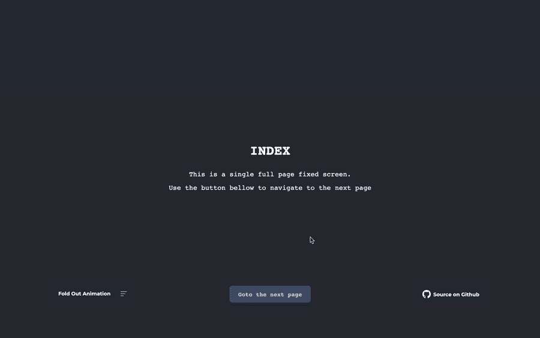
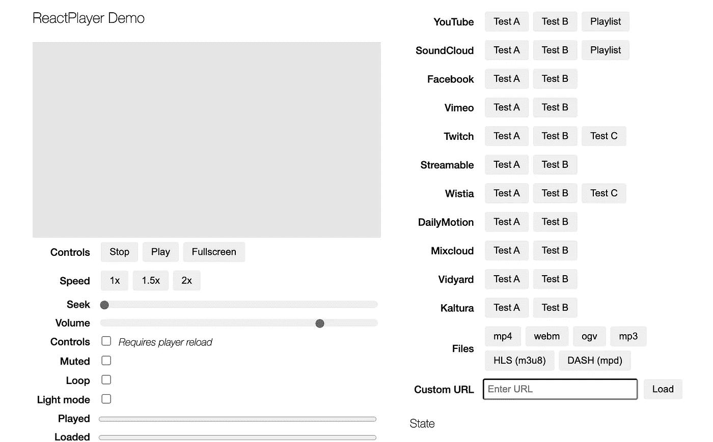

# 您应该在下一个项目中使用的 7 个有用的 React 库

> 原文：<https://javascript.plainenglish.io/7-useful-react-libraries-you-should-use-in-your-next-project-dec9b577f15c?source=collection_archive---------7----------------------->

## 第 3 部分:用这些库加速 React 开发。

Photo by [Joshua Aragon](https://unsplash.com/@goshua13?utm_source=medium&utm_medium=referral) on [Unsplash](https://unsplash.com?utm_source=medium&utm_medium=referral)

当我们可以通过使用一个库轻松实现相同的结果时，为什么还要编写自定义功能呢？开发人员最好的朋友和救星是库。我相信一个好的项目会利用一些最好的可用库。

React 是创建用户界面的最好的 JavaScript 库之一。这里有一些有用的库，可以帮助你更快更有效地构建你的项目。

# 1.财富表

如果你想创建一个像 Excel 和 Google Sheets 这样的电子表格，这是一个很好的资源。这个库提供了一个功能丰富、易于配置的在线电子表格，您可以开箱即用。它提供了许多功能，如文本对齐和旋转、文本截断、溢出、合并单元格、内置公式等等。它在 GitHub 上有超过 1.3k 颗星。

 [## GitHub - ruilisi/fortune-sheet:一个嵌入式 javascript 电子表格库，提供丰富的…

### 一个嵌入式 javascript 电子表格库，提供了丰富的功能，如 Excel 和 Google Sheets - GitHub …

github.com](https://github.com/ruilisi/fortune-sheet) 

# 2.反应-真棒-滑块

正如你已经猜到的，这个库提供了一个内容转换滑块。这是一个 60fps、轻量级、高性能的组件，呈现一组带有全页面过渡的生产就绪 UI 通用滑块的动画。它还提供对 NextJS 和 GatsbyJS 的支持。它在 GitHub 上有超过 2.5k 颗星。

 [## GitHub—rcaferati/React-awesome-slider:React 内容过渡滑块。真棒滑块是一个…

### 反应内容过渡滑块。Awesome Slider 是一个 60fps、轻量级、高性能的组件，可呈现动画…

github.com](https://github.com/rcaferati/react-awesome-slider) 

# 3.反应按钮

这种 3D 动画 react 组件将取代过时、单调的按钮。你可以改变你的按钮样式，而不需要添加任何 UI 框架。这个库有一个进度条，目标是让用户看到点击按钮后发生了什么。虽然这个图书馆还是新的，但它是一个有趣的图书馆。

 [## 带有进度条的 3D 动画反应按钮组件。

### 带有进度条的 3D 动画反应按钮组件。反应按钮是一个三维动画反应组件，以取代…

github.com](https://github.com/arifszn/reactive-button) 

# 4.银栅

这个库提供了一个功能全面、高度可定制的 JavaScript 数据网格。它提供了出色的性能，不依赖于第三方，并与所有流行的 JavaScript 框架无缝集成，包括 React、Angular、Vue 等。它提供了很多特性，比如列交互(调整大小、重新排序和锁定列)、分页、排序等等。它在 GitHub 上有超过 8.5k 颗星。

 [## GitHub - ag-grid/ag-grid:构建企业应用程序的最佳 JavaScript 数据表…

### 构建企业应用程序的最佳 JavaScript 数据表。支持 React/Angular/Vue/Plain JavaScript…

github.com](https://github.com/ag-grid/ag-grid) 

# 5.sweetalert2

如果你想摆脱无聊的 JavaScript 弹出框，并想提供一个定制的体验，那么是一个很好的资源给你。这是一个漂亮的、反应灵敏的、高度可定制的、可访问的 JavaScript 弹出框的替代品。它不依赖于第三方。这个库在 GitHub 上有超过 14.5k 的星星。

 [## GitHub - sweetalert2/sweetalert2:一款美观、反应灵敏、高度可定制且易于使用的…

### 一个漂亮的、反应灵敏的、高度可定制的和可访问的(WAI-ARIA)JavaScript 弹出框的替代品。零…

github.com](https://github.com/sweetalert2/sweetalert2) 

# 6.反应内容加载器

如果你想创建一个像脸书的卡加载加载器，那么这是一个很好的资源给你。这个库提供了一个支持 SVG 的组件来轻松创建占位符加载，比如脸书的卡片加载。它提供了许多功能，如改变颜色，速度，大小，反应原生支持等。它在 GitHub 上有超过 12k 的星星。

 [## github-danilowoz/react-content-loader:⚪SVG 驱动的组件，用于轻松创建框架…

### SVG 驱动的组件可以轻松地创建占位符加载(像脸书的卡加载)。

github.com](https://github.com/danilowoz/react-content-loader) 

# 7.反应型玩家

如果你正在创建一个以播放视频为特色的应用，那么这是一个很好的资源。这是一个用于播放各种 URL 的库，包括文件路径、YouTube、脸书、Twitch、SoundCloud、Streamable、Vimeo、Wistia、DailyMotion 等。它在 GitHub 上有超过 6k 颗星。

 [## GitHub - cookpete/react-player:一个 react 组件，用于播放各种 URL，包括文件…

### 一个 React 组件，用于播放各种 URL，包括文件路径、YouTube、脸书、Twitch、SoundCloud…

github.com](https://github.com/CookPete/react-player) 

# 另一部分在哪里？

有很多很棒的 React 库。我想分享尽可能多的资源，让你的开发之旅更轻松。

如果你想知道更多牛逼的 React 库，请查看下面。

 [## React 开发人员必须知道的 7 个库

### 加快你的反应发展

javascript.plainenglish.io](/7-must-know-libraries-for-a-react-developer-57a324da9520)  [## 您应该在下一个项目中使用的 7 个更有用的 React 库

### 加快你的反应发展

javascript.plainenglish.io](/7-more-useful-react-libraries-you-should-use-in-your-next-project-5699594be1c8)  [## 您应该在下一个项目中使用的 7 个有用的 React 库

### 加快你的反应发展

javascript.plainenglish.io](/7-useful-react-libraries-you-should-use-in-your-next-project-8f33b9cf83e7) 

今天到此为止。我希望这些库有助于简化开发过程。

如果你知道任何其他有用的 React 库，请在评论中分享。直到我们再次相遇。干杯！

***想要连接？***

*如果你愿意，可以在* [***推特***](https://twitter.com/FarhanT99598254) 上与我联系

*更多内容请看*[***plain English . io***](https://plainenglish.io/)*。报名参加我们的* [***免费周报***](http://newsletter.plainenglish.io/) *。关注我们关于*[***Twitter***](https://twitter.com/inPlainEngHQ)**和*[***LinkedIn***](https://www.linkedin.com/company/inplainenglish/)*。查看我们的* [***社区不和谐***](https://discord.gg/GtDtUAvyhW) *加入我们的* [***人才集体***](https://inplainenglish.pallet.com/talent/welcome) *。**