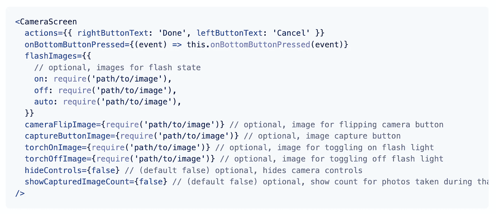
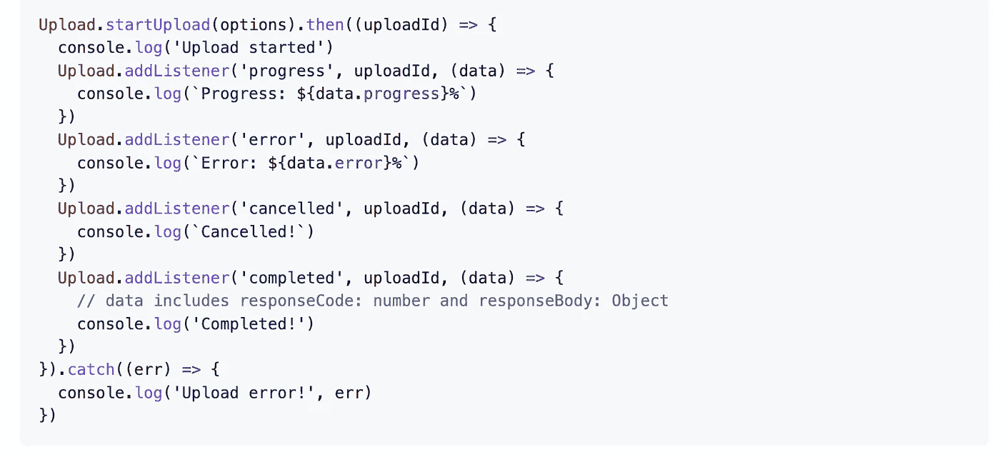
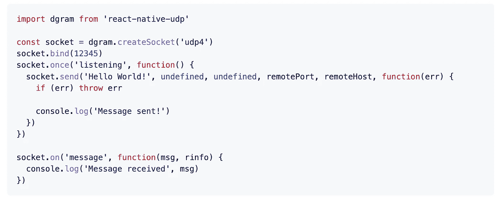
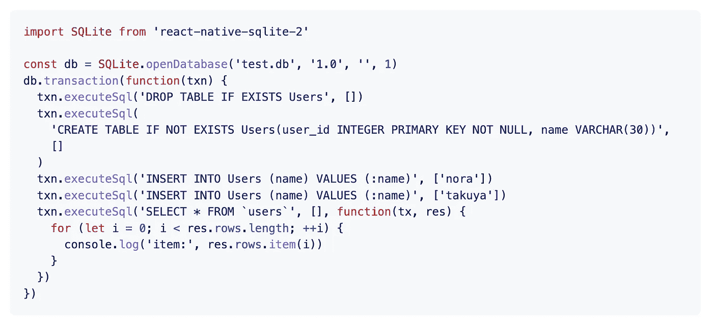
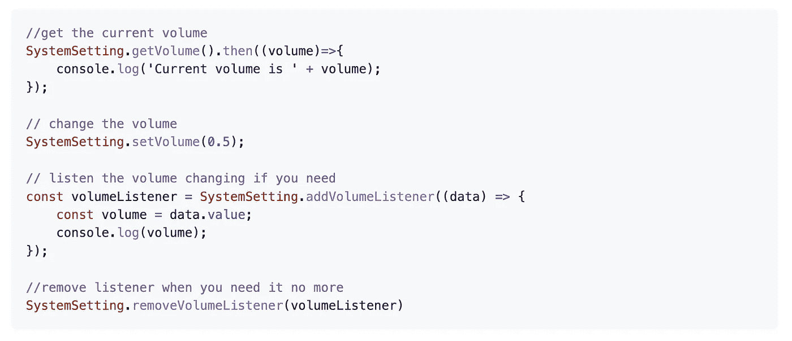

# 您应该在下一个项目中使用的 7 个有用的 React 原生库

> 原文：<https://javascript.plainenglish.io/7-useful-react-native-libraries-you-should-use-in-your-next-project-1e7e44f2e2a0?source=collection_archive---------2----------------------->

## 1.相机套件，2 个。跟踪播放器，3。总帐-模型-视图，4。后台上传，请按 5。UDP，6。SQLite-2，7。系统设置

Photo by [Sigmund](https://unsplash.com/@sigmund?utm_source=unsplash&utm_medium=referral&utm_content=creditCopyText) on [Unsplash](https://unsplash.com/s/photos/mobile-app-development?utm_source=unsplash&utm_medium=referral&utm_content=creditCopyText)

当一个库可以完成同样的事情时，你为什么要创建定制的功能呢？库是开发者最好的朋友和救星。在我看来，一个好的项目利用了一些最好的可用库。

本文是 React Native 的令人敬畏的库系列的一部分，在该系列中，我总是汇编 7 个 React Native 库的列表，这些库将在您的开发之旅中帮助您。

# 1.照相机套件

从头开始创建一个跨平台的相机有时会非常耗时或复杂。这个库将帮助您完成这项任务。顾名思义，这是一个高性能、易于使用、坚如磐石的相机库。它包括许多功能，如 QR/条形码扫描支持，优化性能和高照片捕捉率，iOS 模拟器中的相机预览支持等。这个库在 GitHub 上有超过 1.8k 的星星。

 [## GitHub-Tesla motors/react-native-camera-kit:一款高性能、易于使用、坚如磐石的相机…

### 一个高性能、易于使用、坚如磐石的相机库，用于 React 本地应用程序。

github.com](https://github.com/teslamotors/react-native-camera-kit) 

# 2.田径运动员

如果你想创建一个音乐应用程序，那么这是你最好的资源之一。这是一个为音乐应用程序创建的成熟的音频模块。它提供了许多功能，如音频播放、外部媒体控制、Chromecast 支持、背景模式等等。它在 GitHub 上有超过 2.4k 的星星。

 [## GitHub-double symmetry/react-native-track-player:一个完全成熟的音乐音频模块…

### 为音乐应用创建的完全成熟的音频模块。提供音频播放、外部媒体控制、chromecast…

github.com](https://github.com/doublesymmetry/react-native-track-player) 

# 3.总帐-模型-视图

这个库将帮助你显示和动画任何波前。OBJ 三维物体。对于 iOS，它使用本机桥连接到 [GLView](https://github.com/nicklockwood/GLView) ，对于 Android，它使用本机桥连接到 [jPCT-AE](http://www.jpct.net/jpct-ae/) 。它包括许多功能，如显示，旋转，缩放和平移纹理 3D 模型，通过使用[动画 API](https://facebook.github.io/react-native/docs/animations.html#using-the-native-driver) 本地驱动程序以惊人的快速 60 fps 制作动画等。

 [## GitHub-rasta pasta/react-native-GL-model-view:📺显示和动画纹理波前。OBJ 3D 版…

### 📺显示和动画纹理波前。具有 60fps 的 OBJ 3D 模型-GL view(iOS)和 jPCT-AE 的原生桥接…

github.com](https://github.com/rastapasta/react-native-gl-model-view) 

# 4.后台-上传

在后台上传大文件有时是一项具有挑战性的任务。这是一个 HTTP post 文件上传器，支持 android 和 iOS 后台。如果您正在上传视频等大型文件，请使用此功能，以便您的用户可以在漫长的上传过程中后台处理您的应用程序。

 [## GitHub-vy dia/react-Native-background-Upload:在 React 原生应用程序中上传文件，即使在…

### 在 React 本地应用中上传文件，即使它是后台的。支持安卓和 iOS，包括相机胶卷…

github.com](https://github.com/Vydia/react-native-background-upload) 

# 5.用户数据报协议(User Datagram Protocol)

顾名思义，这是一个用于 Android 和 iOS 的 UDP(用户数据报协议)套接字 API。它允许你创建 UDP 套接字，模仿 Node 的 [dgram](https://nodejs.org/api/dgram.html) API 功能。

 [## GitHub-tradle/react-native-UDP:react-native 的节点 dgram

### react Android 和 iOS 的原生 UDP 套接字 API。它允许你创建 UDP 套接字，模仿节点的 dgram API…

github.com](https://github.com/tradle/react-native-udp) 

# 6.SQLite-2

这是一个多平台 SQLite3 原生插件。它支持 Android、iOS、Windows 和 macOS。这个插件提供了一个兼容 [WebSQL](http://www.w3.org/TR/webdatabase/) 的 API，通过在本地端使用 SQLite 数据库，将数据存储在 react 本地应用中。

 [## GitHub-craftzdog/React-Native-SQLite-2:SQLite 3 原生插件，适用于 iOS、Android……

### Android、iOS、Windows 和 macOS 的 React 原生 SQLite3 原生插件。这个插件提供了一个兼容 WebSQL 的…

github.com](https://github.com/craftzdog/react-native-sqlite-2) 

# 7.系统设置

如果你必须从你的应用程序管理系统设置，那么这是一个很好的资源。这个库允许您访问系统设置，并轻松地更改它。它支持音量(与听者)，亮度，Wifi 开关，位置，蓝牙等。它还支持 android 和 iOS。

 [## GitHub-c 19354837/react-native-system-setting:一个用于访问系统设置并更改它的库…

### 它为您提供了一些系统设置 API。同时支持 iOS 和 Android。音量(带听众)亮度 Wifi…

github.com](https://github.com/c19354837/react-native-system-setting) 

# 另一部分在哪里？

有很多很棒的 react-native 库。我想分享尽可能多的资源，让你的开发之旅更轻松。

如果你想知道更多牛逼的 React 原生库请查看下面。

 [## 您应该在下一个项目中使用的 7 个有用的 React 原生库

### 增强您的反应能力

javascript.plainenglish.io](/7-useful-react-native-libraries-you-should-use-in-your-next-project-7484c8c7da93)  [## 您应该在下一个项目中使用的 7 个更有用的 React 原生库

### 增强您的反应能力

javascript.plainenglish.io](/7-more-useful-react-native-libraries-you-should-use-in-your-next-project-85267f105f61)  [## 您应该在下一个项目中使用的 7 个更有用的 React 原生库

### 增强您的反应能力

javascript.plainenglish.io](/7-more-useful-react-native-libraries-you-should-use-in-your-next-project-2d2a49dfcead)  [## 您应该在下一个项目中使用的 7 个更有用的 React 原生库

### 增强您的反应能力

javascript.plainenglish.io](/7-more-useful-react-native-libraries-you-should-use-in-your-next-project-ed3bcbd58b86)  [## 您应该在下一个项目中使用的 7 个有用的 React 原生库

### 通过使用这些库来增强您的 React 本机开发。

javascript.plainenglish.io](/7-useful-react-native-libraries-you-should-use-in-your-next-project-35603b2bcab6)  [## 您应该在下一个项目中使用的 7 个有用的 React 原生库

### 增强您的反应能力

javascript.plainenglish.io](/7-useful-react-native-libraries-you-should-use-in-your-next-project-a77a6f544945) 

今天到此为止。相信这些库对你的开发之旅会有很大的帮助。

如果你知道任何其他漂亮的 React 原生库，请在评论中分享。直到我们再次相遇。干杯！

**想要连接？**如果你愿意，可以在 [**推特**](https://twitter.com/FarhanT99598254) 上和我联系

*更多内容看* [***说白了就是 io***](https://plainenglish.io/) *。报名参加我们的* [***免费周报***](http://newsletter.plainenglish.io/) *。关注我们关于* [***推特***](https://twitter.com/inPlainEngHQ) ， [***领英***](https://www.linkedin.com/company/inplainenglish/) *，*[***YouTube***](https://www.youtube.com/channel/UCtipWUghju290NWcn8jhyAw)*[***不和***](https://discord.gg/GtDtUAvyhW) *。对增长黑客感兴趣？检查* [***电路***](https://circuit.ooo/) *。**