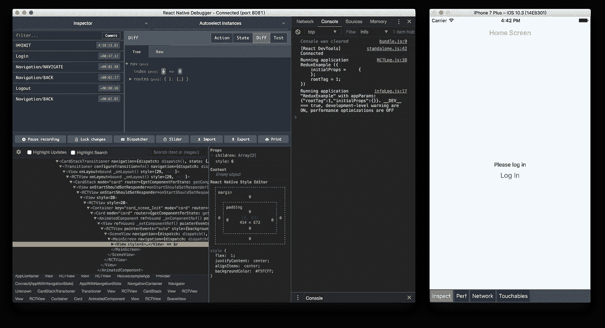
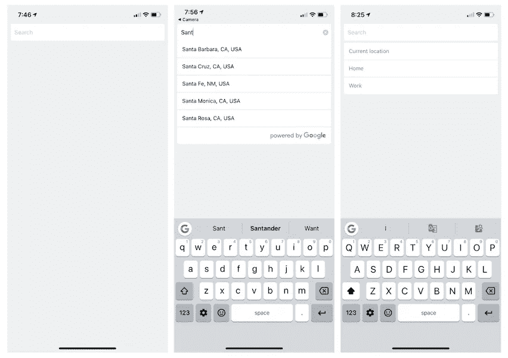
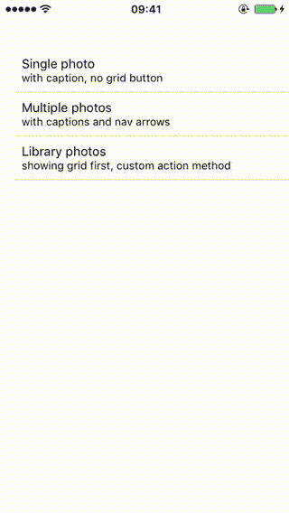
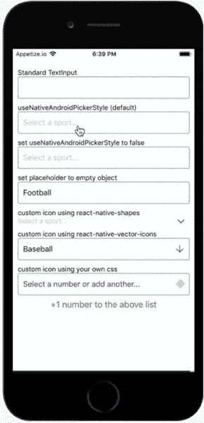
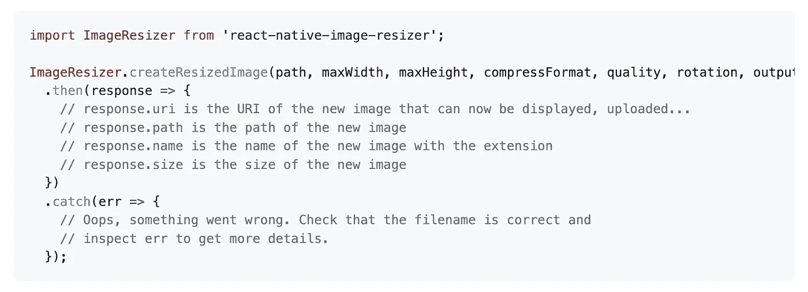
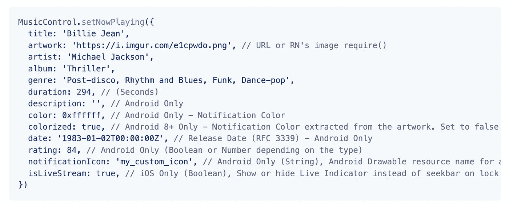
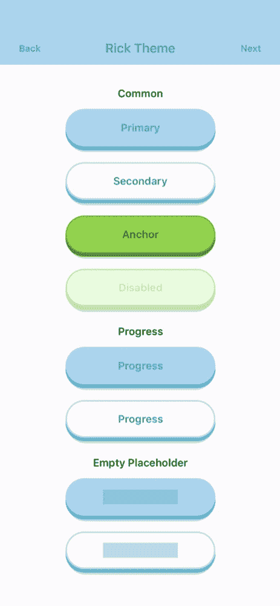

# 您应该在下一个项目中使用的 7 个有用的 React 原生库

> 原文：<https://javascript.plainenglish.io/7-useful-react-native-libraries-you-should-use-in-your-next-project-35603b2bcab6?source=collection_archive---------4----------------------->

## 通过使用这些库来增强您的 React 本机开发。

Photo by [Christina @ wocintechchat.com](https://unsplash.com/@wocintechchat?utm_source=medium&utm_medium=referral) on [Unsplash](https://unsplash.com?utm_source=medium&utm_medium=referral)

当一个库可以完成同样的事情时，你为什么要创建定制的功能呢？库是开发者最好的朋友和救星。在我看来，一个好的项目利用了一些最好的可用库。

本文是 React Native 的令人敬畏的库系列的一部分，在该系列中，我总是汇编 7 个 React Native 库的列表，这些库将在您的开发之旅中帮助您。

# 1.react-本机调试器

作为开发人员，我们的大部分时间都花在了调试上。这将有助于你完成这项任务。它基于 React Native 的官方调试器。还包括来自`[react-devtools-core](https://github.com/facebook/react/tree/master/packages/react-devtools-core)`的 [React Inspector](https://github.com/jhen0409/react-native-debugger/blob/master/docs/react-devtools-integration.md) ，Redux DevTools，made [与](https://github.com/jhen0409/react-native-debugger/blob/master/docs/redux-devtools-integration.md)`[redux-devtools-extension](https://github.com/zalmoxisus/redux-devtools-extension)`，[Apollo Client DevTools](https://github.com/jhen0409/react-native-debugger/blob/master/docs/apollo-client-devtools-integration.md)(`[apollographql/apollo-client-devtools](https://github.com/apollographql/apollo-client-devtools)`)相同的 API 作为 dev tools 扩展。它在 GitHub 上有超过 9k 颗星。

 [## GitHub-jhen 0409/react-native-debugger:基于 React 官方调试器的独立应用…

### 使用 redux DevTools 设置运行 react-navigation 的 Redux 示例这是一个用于调试 React Native 的独立应用程序…

github.com](https://github.com/jhen0409/react-native-debugger) 

# 2.谷歌-地点-自动完成

如果你正在使用谷歌地图，那么这是一个很好的资源。这个库为 iOS 和 Android 提供了可定制的 Google Places 自动完成组件。它包括许多功能，如使用`styles`参数定制，快速输入时 XHR 取消，谷歌位置条款兼容，预定义的地方，等等。它在 GitHub 上有超过 1.8k 的星星。

 [## GitHub-FaridSafi/react-native-Google-Places-autocomplete:可定制的 Google Places 自动完成…

### 该库的第 2 版现已推出。请参阅“版本”部分了解更多信息。我们需要更多的人或者…

github.com](https://github.com/FaridSafi/react-native-google-places-autocomplete) 

# 3.照片浏览器

从头开始创建照片浏览器有时既耗时又复杂。这个库将在这种情况下帮助你。它提供了一个带有标题、选择和网格视图的全屏图像库。它同时支持 iOS 和 android。

 [## GitHub-halib/react-native-photo-browser:带字幕的本地和远程媒体集…

### 一个全屏图片画廊，带有标题，选择和网格视图支持。布局和 API 设计是…

github.com](https://github.com/halilb/react-native-photo-browser) 

# 4.反应-本机-选取器-选择

这个库提供了一个 picker 组件，它模拟了 iOS 和 Android 的本机`<select>`接口。对于 iOS，默认情况下，它包装一个无样式的 TextInput 组件。然后，您可以传递样式，以根据您的需要进行定制。对于 Android，默认情况下，我们使用原生 Picker 组件。如果您愿意，可以将`useNativeAndroidPickerStyle`设置为 false，这也将呈现一个无样式的 TextInput 组件。然后，您可以传递样式，以根据您的需要进行定制。这个库在 GitHub 上有超过 1.5k 的星星。

 [## GitHub-lawn starter/react-native-picker-select:🔽React Native 的选取器组件，它…

### React Native 的一个选择器组件，它模拟了 iOS 和 Android 的本地界面，默认情况下我们是…

github.com](https://github.com/lawnstarter/react-native-picker-select) 

# 5.图像缩放器

处理图像大小是开发人员的常见任务之一。这个库将帮助您创建本地图像的缩放版本(也支持 iOS 上的资源库)。它在 Github 上有超过 1.3 颗星。

 [## GitHub-bam lab/react-native-image-resizer:🗻使用 React Native 调整本地图像的大小

### 一个 React 本机模块，可以创建本地图像的缩放版本(也支持 iOS 上的资源库)…

github.com](https://github.com/bamlab/react-native-image-resizer) 

# 6.音乐控制

如果您正在使用音频应用程序，那么这是一个很好的资源。这个库将帮助你在 iOS 和 Android 的锁屏和通知中心显示和管理媒体控件。

 [## GitHub-tanguyantoine/react-native-music-control:在锁屏上显示和管理媒体控件…

### 在 iOS 和 Android 的锁屏和通知中心显示和管理媒体控制。带纱:纱加…

github.com](https://github.com/tanguyantoine/react-native-music-control/) 

# 7.非常棒的按钮

顾名思义，这个库是一个高性能的、可扩展的、生产就绪的 React 本地组件，它呈现一组 3D UI 按钮的动画。这个库在 GitHub 上有超过 1.1k 的星星。

 [## GitHub—rcaferati/React-Native-really-awesome-button:React 原生按钮组件。太棒了…

### 反应本机按钮组件。Awesome Button 是一个 60fps 的 3D，支持进度，社交就绪，可扩展，生产…

github.com](https://github.com/rcaferati/react-native-really-awesome-button) 

# 另一部分在哪里？

有很多很棒的 react-native 库。我想分享尽可能多的资源，让你的开发之旅更轻松。

如果你想知道更多牛逼的 React 原生库请查看下面。

 [## 您应该在下一个项目中使用的 7 个有用的 React 原生库

### 增强您的反应能力

javascript.plainenglish.io](/7-useful-react-native-libraries-you-should-use-in-your-next-project-7484c8c7da93)  [## 您应该在下一个项目中使用的 7 个更有用的 React 原生库

### 增强您的反应能力

javascript.plainenglish.io](/7-more-useful-react-native-libraries-you-should-use-in-your-next-project-85267f105f61)  [## 您应该在下一个项目中使用的 7 个更有用的 React 原生库

### 增强您的反应能力

javascript.plainenglish.io](/7-more-useful-react-native-libraries-you-should-use-in-your-next-project-2d2a49dfcead)  [## 您应该在下一个项目中使用的 7 个更有用的 React 原生库

### 增强您的反应能力

javascript.plainenglish.io](/7-more-useful-react-native-libraries-you-should-use-in-your-next-project-ed3bcbd58b86)  [## 您应该在下一个项目中使用的 7 个有用的 React 原生库

### 增强你的反应能力。

javascript.plainenglish.io](/7-useful-react-native-libraries-you-should-use-in-your-next-project-807cb3f2af1d) 

今天到此为止。相信这些库对你的开发之旅会有很大的帮助。

如果你知道任何其他漂亮的 React 原生库，请在评论中分享。直到我们再次相遇。干杯！

***想要连接？*** *如果你愿意，可以和我联系* [***推特***](https://twitter.com/FarhanT99598254)

*更多内容看* [***说白了。报名参加我们的***](https://plainenglish.io/)***[***免费每周简讯***](http://newsletter.plainenglish.io/) *。关注我们关于* [***推特***](https://twitter.com/inPlainEngHQ) ，[***LinkedIn***](https://www.linkedin.com/company/inplainenglish/)*，*[***YouTube***](https://www.youtube.com/channel/UCtipWUghju290NWcn8jhyAw)*[***不和***](https://discord.gg/GtDtUAvyhW) *。*****