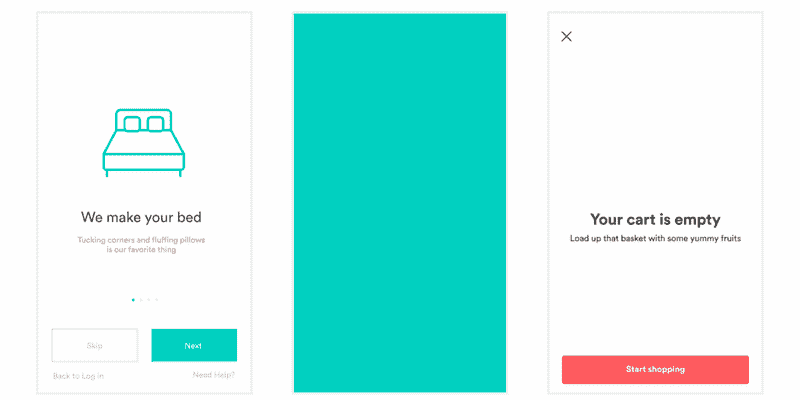
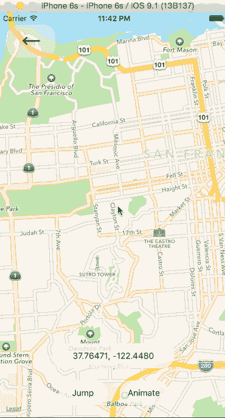
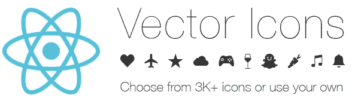
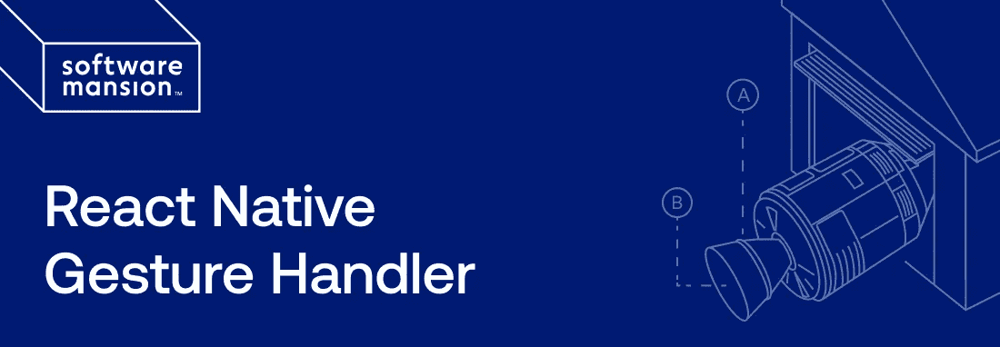

# 您应该在下一个项目中使用的 7 个有用的 React 原生库

> 原文：<https://javascript.plainenglish.io/7-useful-react-native-libraries-you-should-use-in-your-next-project-7484c8c7da93?source=collection_archive---------3----------------------->

## 增强您的反应能力


Photo by [Marvin Meyer](https://unsplash.com/@marvelous?utm_source=medium&utm_medium=referral) on [Unsplash](https://unsplash.com?utm_source=medium&utm_medium=referral)

当一个库可以为你做这些工作时，为什么还要编写自定义功能呢？图书馆是开发者最好的朋友和生活品味。在我看来，一个好的项目利用了一些最好的可用库。我已经列出了 7 个 React 本地库，它们将帮助您的开发工作。

# 1.洛蒂-反应-本土



我想每个人都喜欢动画。Lottie 是向您的移动应用程序添加动画的最简单方法之一。Lottie 是一个库集合，用于解析和渲染使用身体移动导出为 JSON 的 Adobe After Effects 动画。这个库为 React Native 提供了 Lottie 组件。它在 Github 上有超过 15k 颗星。

[](https://github.com/lottie-react-native/lottie-react-native) [## GitHub-lottie-React-Native/Lottie-React-Native:React Native 的 Lottie 包装器。

### Lottie 组件用于 React Native ( iOS、Android 和 Windows) Lottie 是一个用于解析 Adobe 的库生态系统…

github.com](https://github.com/lottie-react-native/lottie-react-native) 

# 2 .反应本地地图



如果你正在使用一张地图，那么这将是一个有用的库。顾名思义这是 React Native (iOS + Android)的 Mapview 组件。它提供了许多功能，如自定义地图风格，跟踪地区/位置等。它在 Github 上有超过 13k 颗星。

[](https://github.com/react-native-maps/react-native-maps) [## GitHub-React-Native-maps/React-Native-maps:适用于 iOS + Android 的 React Native Mapview 组件

### react iOS+Android 的原生地图组件这个项目是由一小群人维护的，任何帮助…

github.com](https://github.com/react-native-maps/react-native-maps) 

# 3.反应-本地-天赋-聊天


如果你想轻松地创建一个聊天应用，那么这是最适合你的库之一。这个库是 React Native 最完整的聊天 UI。它提供了许多功能，如完全可定制的组件，作曲家的行动(附加照片等)。)、加载早期消息、将消息复制到剪贴板等。它在 Github 上有超过 11k 颗星。

[](https://github.com/FaridSafi/react-native-gifted-chat) [## GitHub-farid safi/react-native-gifted-chat:💬React Native 最完整的聊天 UI

### React Native 最完整的聊天& Web 零食 GiftedChat 游乐场编码训练营位于巴黎，由…

github.com](https://github.com/FaridSafi/react-native-gifted-chat) 

# 4.反应-本地-导航


对于 React 原生应用，React 原生导航在 iOS 和 Android 上都提供了 100%的原生平台导航。这个库使用的 JavaScript API 很简单，并且是跨平台的。它也有很好的文档。它在 Github 上有超过 12k 的星星。

[](https://github.com/wix/react-native-navigation) [## GitHub-wix/React-Native-navigation:React Native 的完整原生导航解决方案

### React 原生导航在 iOS 和 Android 上为 React 原生应用提供 100%的原生平台导航。的…

github.com](https://github.com/wix/react-native-navigation) 

# 5.反应-本地-矢量-图标



图标是每个应用程序都有的东西之一。该库提供了 React Native 的可定制图标，支持图像源和完整的样式。这个库非常适合按钮、徽标和导航/标签栏。它在 Github 上有超过 15k 颗星。

[](https://github.com/oblador/react-native-vector-icons) [## GitHub-ob ador/React-Native-vector-Icons:React Native 的可定制图标，支持…

### 非常适合按钮、徽标和导航/标签栏。易于扩展、设计和集成到您的项目中。如果你想用…

github.com](https://github.com/oblador/react-native-vector-icons) 

# 6.反应-本机-选项卡-视图


这是一个跨平台工作的 React 本地选项卡视图组件。在 Android 和 iOS 上使用 react-native-pager-view，在 Web、macOS 和 Windows 上使用 PanResponder。它提供了许多功能，如平滑的动画和手势，可滚动的标签，支持顶部和底部标签栏等。它在 Github 上有超过 4.5k 颗星。

[](https://github.com/satya164/react-native-tab-view) [## GitHub-satya 164/React-Native-Tab-View:React Native 的跨平台选项卡视图组件

### React Native 的跨平台选项卡视图组件。在 Android 和 iOS 上使用 react-native-pager-view 实现，并且…

github.com](https://github.com/satya164/react-native-tab-view) 

# 7.react-native-手势处理器



这个库帮助开发人员创建最好的基于触摸的体验。手势不再由 JS responder 系统控制，而是由这个库在 UI 线程中识别和跟踪。它确保触摸交互和手势跟踪不仅流畅，而且一致可靠。它在 Github 上有超过 4.5k 颗星。

[](https://github.com/software-mansion/react-native-gesture-handler) [## GitHub-software-mansion/react-native-gesture-handler:公开平台原生的声明式 API

### React 本机手势处理程序提供本机驱动的手势管理 API，用于构建最佳的基于触摸的…

github.com](https://github.com/software-mansion/react-native-gesture-handler) 

谢谢你留到最后。如果你喜欢这篇文章，我相信你也会喜欢这篇关于 React Native 的文章

[](/7-react-native-open-source-projects-to-become-a-better-mobile-app-developer-43a77b1cb389) [## 7 对原生开源项目做出反应，成为更好的移动应用开发者

### 增强您的移动应用开发

javascript.plainenglish.io](/7-react-native-open-source-projects-to-become-a-better-mobile-app-developer-43a77b1cb389) 

今天到此为止。相信这些库对你的开发之旅会有很大的帮助。

如果你知道任何其他漂亮的 React 原生库，请在评论中分享。直到我们再次相遇。干杯！

```
**Want to Connect?**If you want to, you can connect with me on [**Twitter**](https://twitter.com/FarhanT99598254) 
```

*更多内容请看*[***plain English . io***](https://plainenglish.io/)*。报名参加我们的* [***免费周报***](http://newsletter.plainenglish.io/) *。关注我们关于*[***Twitter***](https://twitter.com/inPlainEngHQ)*和*[***LinkedIn***](https://www.linkedin.com/company/inplainenglish/)*。查看我们的* [***社区不和谐***](https://discord.gg/GtDtUAvyhW) *加入我们的* [***人才集体***](https://inplainenglish.pallet.com/talent/welcome) *。*