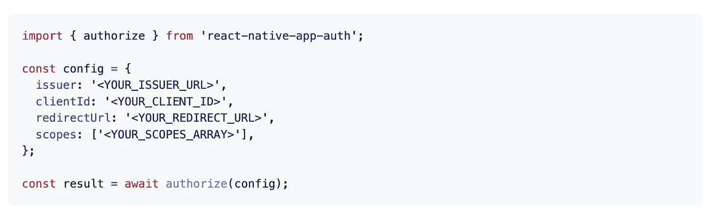
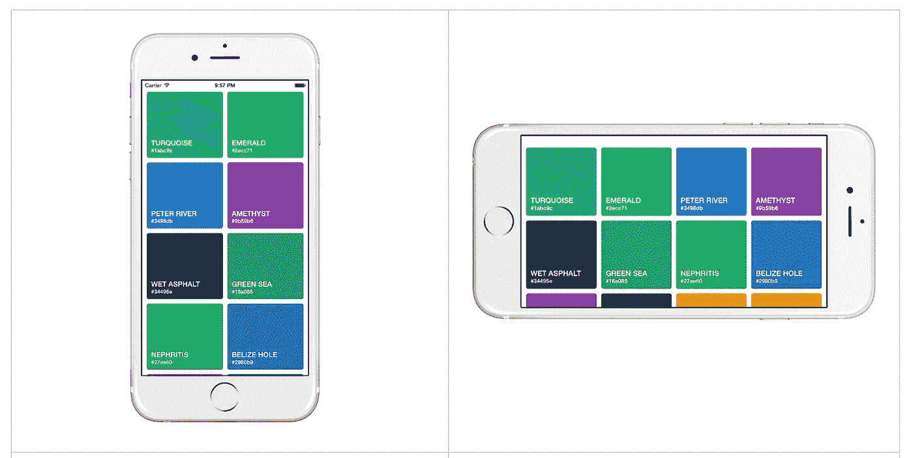

# 您应该在下一个项目中使用的 7 个有用的 React 原生库

> 原文：<https://javascript.plainenglish.io/7-useful-react-native-libraries-you-should-use-in-your-next-project-807cb3f2af1d?source=collection_archive---------3----------------------->

## 增强你的反应能力。


Photo by [Max Duzij](https://unsplash.com/@max_duz?utm_source=medium&utm_medium=referral) on [Unsplash](https://unsplash.com?utm_source=medium&utm_medium=referral)

当一个库可以完成同样的事情时，你为什么要创建定制的功能呢？库是开发者最好的朋友和救星。在我看来，一个好的项目利用了一些最好的可用库。

本文是 React Native 的令人敬畏的库系列的一部分，在该系列中，我总是汇编 7 个 React Native 库的列表，这些库将在您的开发之旅中帮助您。

# 1.反应-本机-循环-进度


在加载数据或等待任务执行时显示进度条是提供更好用户体验的一种常见方式。正如你已经猜到的，这个库将帮助你创建一个漂亮的动画圆形进度条。这个库在 Github 上有超过 2k 的星星。

[](https://github.com/bartgryszko/react-native-circular-progress) [## GitHub-bartgryszko/React-Native-circular-progress:React 本地组件用于创建动画…

### React 本地组件，用于创建动画、循环进度。例如，用于显示用户点数。

github.com](https://github.com/bartgryszko/react-native-circular-progress) 

# 2.反应-本机-flash-消息


与用户沟通是应用程序的另一个重要部分。这个库将帮助您轻松地创建高度可定制的 flashbars、顶部通知或警报。它还将为 iPhone X、XR、XS 和 XS Max 的 notch 提供支持。这个库在 Github 上有 1k 多颗星。

[](https://github.com/lucasferreira/react-native-flash-message) [## GitHub-lucasferreira/React-Native-flash-message:React Native flash bar 和 top notification alert…

### Flash Message 是一个 React 本机模块，帮助您轻松创建高度可定制的 flashbars、顶部通知或…

github.com](https://github.com/lucasferreira/react-native-flash-message) 

# 3.大量


很明显，在整个项目中处理利润是非常困难的，并且可能不可扩展。对于网络项目，一个名为 [Braid](https://seek-oss.github.io/braid-design-system/foundations/layout) 的设计系统有一个开发人员友好的 API 用于构建布局。然而，React 基于本机的项目缺少一个类似的库。因此，创建了 Stacks，它采用了略有不同的 Braid Layouts API。正如您已经了解的，这个库提供了一组有用的组件来帮助您轻松构建和维护 React Native (Web too)布局。

[](https://github.com/mobily/stacks) [## GitHub — mobily/stacks: ⚡一组有用的组件，帮助您构建和维护 React Native…

### ⚡提供了一套有用的组件来帮助你轻松构建和维护 React Native (Web too)布局。— GitHub …

github.com](https://github.com/mobily/stacks) 

# 4.反应-原生-应用-认证



Auth 是大部分 app 都有的功能之一。这个库为 [AppAuth-iOS](https://github.com/openid/AppAuth-iOS) 和[app auth-Android](https://github.com/openid/AppAuth-Android)SDK 提供了与 [OAuth 2.0](https://tools.ietf.org/html/rfc6749) 和 [OpenID Connect](http://openid.net/specs/openid-connect-core-1_0.html) 提供者通信的桥梁。它支持任何实现了 [OAuth2 规范](https://tools.ietf.org/html/rfc6749#section-2.2)的 OAuth 提供者。这个库在 GitHub 上有超过 1.5k 的星星。

[](https://github.com/FormidableLabs/react-native-app-auth) [## GitHub-FormidableLabs/React-native-app-auth:React native bridge for app auth-an SDK for…

### React native bridge for AppAuth -一个 SDK，用于与此版本支持的 OAuth2 提供程序进行通信…

github.com](https://github.com/FormidableLabs/react-native-app-auth) 

# 5.反应本地日期选择器


我相信通过名字你已经明白了，这是一个 Android 和 iOS 的日期时间选择器。它包括日期、时间和日期时间选择器模式。日期选择器是可定制的，并支持不同的语言。它是用本机代码编写的，以实现最佳的外观、感觉和性能。这个库在 GitHub 上有超过 1.4k 的星星。

[](https://github.com/henninghall/react-native-date-picker) [## GitHub-Henning hall/React-Native-Date-Picker:React Native Date Picker 是一个日期时间选择器，用于…

### React Native 日期选择器是 Android 和 iOS 的日期选择器。它包括日期、时间和日期时间选择器模式。的…

github.com](https://github.com/henninghall/react-native-date-picker) 

# 6.反应原生超级网格



作为一名开发人员，我们的主要职责之一是创建一个响应式的设计。这个库将帮助您完成这项任务。它支持响应式网格视图。该库导出两个组件— FlatGrid(类似于 FlatList)和 SectionGrid(类似于 SectionList)。这两个组件都呈现一个网格布局，可以适应各种屏幕分辨率。这个库在 GitHub 上有超过 1.2k 的星星。

[](https://github.com/saleel/react-native-super-grid) [## GitHub—saleel/React-Native-super-Grid:React Native 的响应式网格视图

### React Native 的响应式网格视图。这个库导出两个组件——flat grid(类似于 FlatList)和…

github.com](https://github.com/saleel/react-native-super-grid) 

# 7.反应-本机-自动完成-输入


自动完成输入是提供良好用户体验的另一个重要因素。正如你已经猜到的，这个库将帮助你创建一个自动完成组件。它是建立在纯 JS 之上的。

[](https://github.com/mrlaessig/react-native-autocomplete-input) [## GitHub-mrlaessig/react-native-autocomplete-input:纯 javascript 自动完成输入…

### React Native 的纯 JS 自动完成组件。在您自己的项目中使用该组件，或者将其作为灵感来…

github.com](https://github.com/mrlaessig/react-native-autocomplete-input) 

# 另一部分在哪里？

有很多很棒的 react-native 库。我想分享尽可能多的资源，让你的开发之旅更轻松。

如果你想知道更多牛逼的 React 原生库请查看下面。

[](/7-useful-react-native-libraries-you-should-use-in-your-next-project-7484c8c7da93) [## 您应该在下一个项目中使用的 7 个有用的 React 原生库

### 增强您的反应能力

javascript.plainenglish.io](/7-useful-react-native-libraries-you-should-use-in-your-next-project-7484c8c7da93) [](/7-more-useful-react-native-libraries-you-should-use-in-your-next-project-85267f105f61) [## 您应该在下一个项目中使用的 7 个更有用的 React 原生库

### 增强您的反应能力

javascript.plainenglish.io](/7-more-useful-react-native-libraries-you-should-use-in-your-next-project-85267f105f61) [](/7-more-useful-react-native-libraries-you-should-use-in-your-next-project-2d2a49dfcead) [## 您应该在下一个项目中使用的 7 个更有用的 React 原生库

### 增强您的反应能力

javascript.plainenglish.io](/7-more-useful-react-native-libraries-you-should-use-in-your-next-project-2d2a49dfcead) [](/7-more-useful-react-native-libraries-you-should-use-in-your-next-project-ed3bcbd58b86) [## 您应该在下一个项目中使用的 7 个更有用的 React 原生库

### 增强您的反应能力

javascript.plainenglish.io](/7-more-useful-react-native-libraries-you-should-use-in-your-next-project-ed3bcbd58b86) 

今天到此为止。相信这些库对你的开发之旅会有很大的帮助。

如果你知道任何其他漂亮的 React 原生库，请在评论中分享。直到我们再次相遇。干杯！

```
**Want to Connect?**If you want to, you can connect with me on [**Twitter**](https://twitter.com/FarhanT99598254) 
```

*更多内容请看*[***plain English . io***](https://plainenglish.io/)*。报名参加我们的* [***免费周报***](http://newsletter.plainenglish.io/) *。关注我们关于*[***Twitter***](https://twitter.com/inPlainEngHQ)*和*[***LinkedIn***](https://www.linkedin.com/company/inplainenglish/)*。查看我们的* [***社区不和谐***](https://discord.gg/GtDtUAvyhW) *加入我们的* [***人才集体***](https://inplainenglish.pallet.com/talent/welcome) *。*