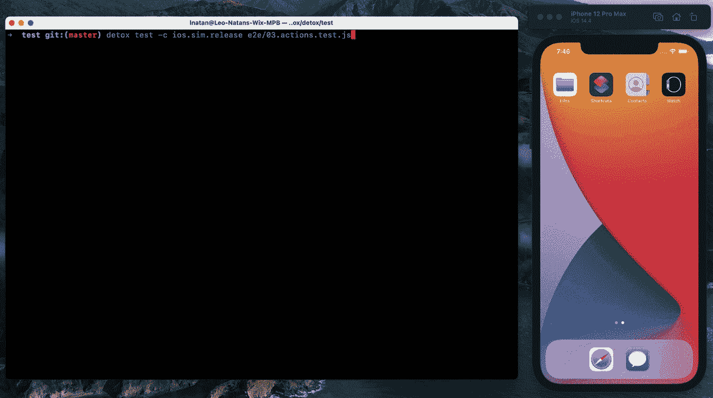
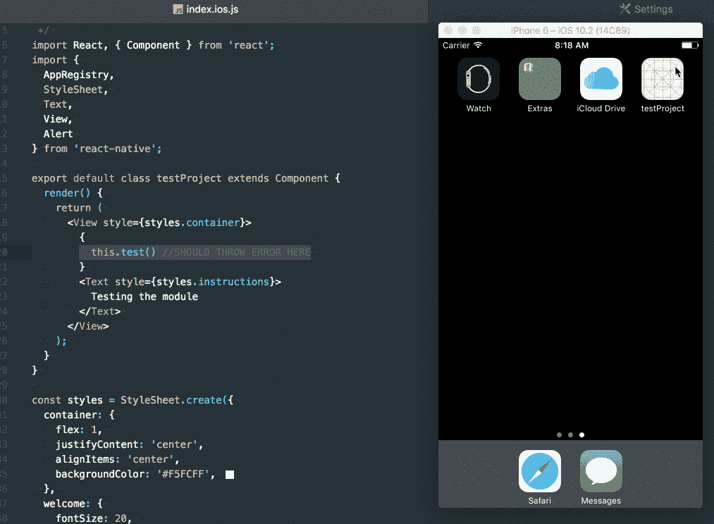
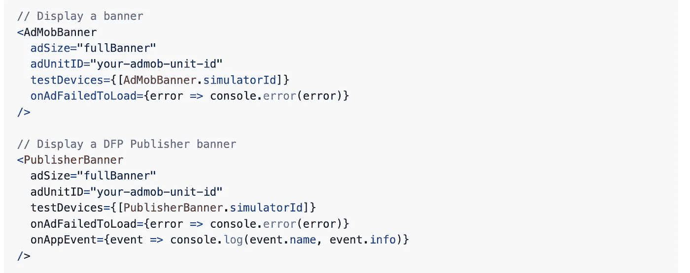
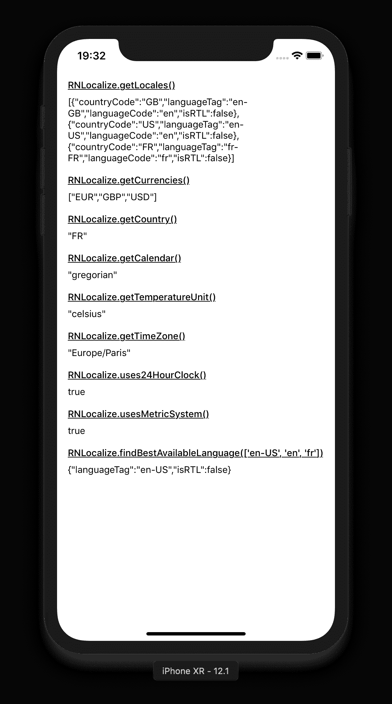
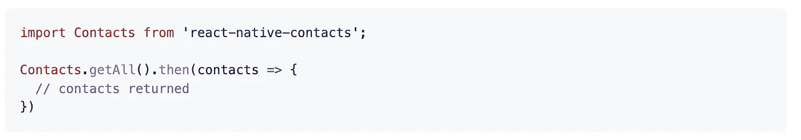

# 您应该在下一个项目中使用的 7 个有用的 React 原生库

> 原文：<https://javascript.plainenglish.io/7-useful-react-native-libraries-you-should-use-in-your-next-project-a77a6f544945?source=collection_archive---------5----------------------->

## 增强您的反应能力


Photo by [Nubelson Fernandes](https://unsplash.com/@nublson?utm_source=medium&utm_medium=referral) on [Unsplash](https://unsplash.com?utm_source=medium&utm_medium=referral)

当一个库可以完成同样的事情时，你为什么要创建定制的功能呢？库是开发者最好的朋友和救星。在我看来，一个好的项目利用了一些最好的可用库。

本文是 React Native 的令人敬畏的库系列的一部分，在该系列中，我总是汇编 7 个 React Native 库的列表，这些库将在您的开发之旅中帮助您。

# 1.戒瘾诊所



这是 GitHub 上超过 9.5k 星的最有星的框架之一。测试是软件开发最重要的阶段之一。这是一个用于移动应用的灰盒端到端测试和自动化框架。当你的移动应用运行在真实的设备/模拟器上时，它会测试你的移动应用，就像一个真实的用户一样与之互动。它包括许多特性，比如跨平台、自动同步、独立于测试运行程序、可调试等等。

[](https://github.com/wix/detox) [## GitHub - wix/Detox:用于移动应用的灰盒端到端测试和自动化框架

### 灰盒端到端测试和移动应用自动化框架- GitHub - wix/Detox:灰盒端到端测试…

github.com](https://github.com/wix/detox) 

# 2.升级助手


更新应用程序的版本是开发人员的常见任务之一。这将有助于你完成这项任务。它是一个支持 React 原生开发者升级应用的 web 工具。它的目标是基于之前在 [rn-diff-purge](https://github.com/react-native-community/rn-diff-purge) 项目中所做的工作，提供任何两个版本之间发生的全部变化。它包括许多功能，如行内注释，以帮助您更深入地了解精确的文件，一组链接，进一步解释您要升级到什么版本，新的二进制文件的下载按钮，等等。它在 GitHub 上有超过 2.5k 颗星。

[](https://github.com/react-native-community/upgrade-helper) [## github-react-native-community/upgrade-helper:⚛️一个支持 react 本地开发者的 web 工具…

### 帮助您轻松升级 React 原生应用的 web 工具！🚀打开工具！升级助手工具旨在…

github.com](https://github.com/react-native-community/upgrade-helper) 

# **3。反应本地异常处理器**



一个好的开发人员知道如何以适当的方式处理异常。这个库允许您注册一个全局错误处理程序，它可以捕获致命/非致命的未捕获异常。该模块有助于防止 RN 应用程序突然崩溃，而不向用户发出优雅的消息。它在 GitHub 上有超过 1.4k 的星星。

[](https://github.com/a7ul/react-native-exception-handler) [## GitHub-a7ul/react-native-exception-handler:一个 react 本机模块，允许您注册一个…

### 一个 react 本机模块，允许您注册一个全局错误处理程序，可以捕获致命/非致命的未捕获…

github.com](https://github.com/a7ul/react-native-exception-handler) 

# 4.反应-原生-admob



使用谷歌的 AdMob 是将你的应用货币化的最好方式之一。顾名思义，这是一个用于 Google AdMob 横幅、间隙、奖励视频以及 DFP 横幅的库。横幅类型被实现为组件，而间隙和奖励视频有一个命令式 API。它在 GitHub 上有超过 1k 颗星。

[](https://github.com/sbugert/react-native-admob) [## GitHub-sbu Gert/react-native-AdMob:Google AdMob 横幅的 react-native 组件

### 谷歌 AdMob 横幅，间隙，奖励视频和 DFP 横幅的反应原生模块。横幅类型…

github.com](https://github.com/sbugert/react-native-admob) 

# 5.反应-本地-本地化



创建本地化的应用程序有时可能是一项耗时或复杂的任务。这个库将帮助您完成这项任务。正如你已经猜到的，这个库将帮助你本地化你的应用程序。它还包括许多功能，如货币、数字格式设置、温度单位、日历等等。它在 GitHub 上有超过 1.8k 的星星。

[](https://github.com/zoontek/react-native-localize) [## GitHub-zoon tek/react-native-localize:🌍React 本地应用程序本地化的工具箱

### React 本地应用本地化工具箱。这个模块是按原样提供的，我在空闲时间对它进行研究。如果你的…

github.com](https://github.com/zoontek/react-native-localize) 

# 6.反应-本地-联系人



如果你必须和联系人一起工作，那么这是一个很好的资源。它`getAll`的功能是访问联系人。`getAll`是一个数据库密集型过程，根据联系人列表的大小，可能需要很长时间才能完成。因此，建议您在需要之前访问`getAll`方法，并缓存结果以备将来使用。它在 GitHub 上有超过 1.5k 颗星。

[](https://github.com/morenoh149/react-native-contacts) [## GitHub-morenoh 149/React-Native-Contacts:React 本地联系人

### 要投稿，请阅读 CONTRIBUTING.md。在 stackoverflow 上提问，而不是在问题跟踪器上提问。getAll 是一个数据库…

github.com](https://github.com/morenoh149/react-native-contacts) 

# 7.react-原生-音频-工具包


顾名思义，这是 React Native 的跨平台(Android 和 iOS)音频库。它支持录音和播放音频。除了基本功能之外，还包括许多有用的功能，包括搜索、循环和基于网络的音频文件流。

[](https://github.com/react-native-audio-toolkit/react-native-audio-toolkit) [## GitHub-react-native-audio-toolkit/react-native-audio-toolkit:跨平台音频库…

### React Native 的跨平台音频库。贡献给 react-native-audio-toolkit/react-native-audio-toolkit…

github.com](https://github.com/react-native-audio-toolkit/react-native-audio-toolkit) 

# 另一部分在哪里？

有很多很棒的 react-native 库。我想分享尽可能多的资源，让你的开发之旅更轻松。

如果你想知道更多牛逼的 React 原生库请查看下面。

[](/7-useful-react-native-libraries-you-should-use-in-your-next-project-7484c8c7da93) [## 您应该在下一个项目中使用的 7 个有用的 React 原生库

### 增强您的反应能力

javascript.plainenglish.io](/7-useful-react-native-libraries-you-should-use-in-your-next-project-7484c8c7da93) [](/7-more-useful-react-native-libraries-you-should-use-in-your-next-project-85267f105f61) [## 您应该在下一个项目中使用的 7 个更有用的 React 原生库

### 增强您的反应能力

javascript.plainenglish.io](/7-more-useful-react-native-libraries-you-should-use-in-your-next-project-85267f105f61) [](/7-more-useful-react-native-libraries-you-should-use-in-your-next-project-2d2a49dfcead) [## 您应该在下一个项目中使用的 7 个更有用的 React 原生库

### 增强您的反应能力

javascript.plainenglish.io](/7-more-useful-react-native-libraries-you-should-use-in-your-next-project-2d2a49dfcead) [](/7-more-useful-react-native-libraries-you-should-use-in-your-next-project-ed3bcbd58b86) [## 您应该在下一个项目中使用的 7 个更有用的 React 原生库

### 增强您的反应能力

javascript.plainenglish.io](/7-more-useful-react-native-libraries-you-should-use-in-your-next-project-ed3bcbd58b86) [](/7-useful-react-native-libraries-you-should-use-in-your-next-project-35603b2bcab6) [## 您应该在下一个项目中使用的 7 个有用的 React 原生库

### 通过使用这些库来增强您的 React 本机开发。

javascript.plainenglish.io](/7-useful-react-native-libraries-you-should-use-in-your-next-project-35603b2bcab6) 

今天到此为止。相信这些库对你的开发之旅会有很大的帮助。

如果你知道任何其他漂亮的 React 原生库，请在评论中分享。直到我们再次相遇。干杯！

```
**Want to Connect?**If you want to, you can connect with me on [**Twitter**](https://twitter.com/FarhanT99598254)
```

*更多内容请看*[***plain English . io***](https://plainenglish.io/)*。报名参加我们的* [***免费周报***](http://newsletter.plainenglish.io/) *。关注我们关于*[***Twitter***](https://twitter.com/inPlainEngHQ)[***LinkedIn***](https://www.linkedin.com/company/inplainenglish/)*[***YouTube***](https://www.youtube.com/channel/UCtipWUghju290NWcn8jhyAw)*[***不和***](https://discord.gg/GtDtUAvyhW) *。***