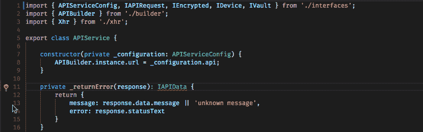

# 7 使用 TypeScript 时有用的 VS 代码扩展

> 原文：<https://javascript.plainenglish.io/7-useful-vs-code-extension-if-you-are-using-typescript-a5c811284c35?source=collection_archive---------4----------------------->

## 使用这些 VS 代码扩展提高您的 TypeScript 生产率。

Photo by [Blake Connally](https://unsplash.com/@blakeconnally?utm_source=medium&utm_medium=referral) on [Unsplash](https://unsplash.com?utm_source=medium&utm_medium=referral)

TypeScript 是一种基于 JavaScript 的强类型编程语言。它在开发人员中很受欢迎，因为它为您提供了任何规模的更好的工具。

VSCode 是流行的 IDE 之一。我相信很难找到不使用 VSCode 的开发者。这里有 7 个 VScode 扩展，如果您正在使用 TypeScript，它们将帮助您充分利用 VScode。

# 1.打字稿导入程序

当我们在一个大项目中工作时，有很多文件，很难记住。这个扩展将在这种情况下帮助你。它自动在工作区文件中搜索 TypeScript 定义，并提供所有已知的符号作为完成项，以允许代码完成。它有超过 531k 的安装

 [## TypeScript 导入程序- Visual Studio 市场

### 自动在工作区文件中搜索 TypeScript 定义，并提供所有已知符号作为完成项…

marketplace.visualstudio.com](https://marketplace.visualstudio.com/items?itemName=pmneo.tsimporter) 

# 2.移动 TS

您是否曾经遇到过这样的情况:您移动了一个文件，现在您必须优化每个文件的导入？如果是，那么你就知道这个问题有多无聊了。这个库将在这种情况下帮助您。此库提供了移动 TypeScript 文件和文件夹以及更新其相对导入路径的功能。它的安装超过 528k。

 [## 移动 TS -移动 TypeScript 文件并更新相对导入- Visual Studio 市场

### 支持在工作区内移动 typescript 文件和更新相对导入。移动打字稿文件和文件夹…

marketplace.visualstudio.com](https://marketplace.visualstudio.com/items?itemName=stringham.move-ts) 

# 3.TypeScript 工具箱

这是一个多合一的扩展。它能增强你的打字稿。这个库提供了很多特性，比如优化或自动导入，生成 getters、setters、constructors 等。它有超过 189，000 个安装。

 [## TypeScript 工具箱- Visual Studio 市场

### 优化您的所有导入行:添加缺失的导入和删除未使用的轻松创建一个基于私有的构造器…

marketplace.visualstudio.com](https://marketplace.visualstudio.com/items?itemName=DSKWRK.vscode-generate-getter-setter) 

# 4.打字稿导入分类器

如果你喜欢组织你的代码，这个扩展会对你有帮助。在大型项目中，会有大量的导入。该扩展根据您的配置对 TypeScript 导入进行排序。默认值遵循 ESLint 排序-导入规则。该配置还支持正则表达式。该扩展也适用于更漂亮的。它有超过 93k 的安装。

 [## TypeScript 导入排序器- Visual Studio 市场

### 根据提供的配置对 TypeScript 导入进行排序的扩展。配置默认值如下…

marketplace.visualstudio.com](https://marketplace.visualstudio.com/items?itemName=mike-co.import-sorter) 

# 5.角度 10 片段

代码片段是我一直使用的东西之一。我的意思是谁不喜欢代码自动完成。这个扩展为 Angular 2，4，5，6，7，8，9 & 10 提供了 TypeScript 和 Html 片段以及代码示例。它提供了基于角度样式指南的代码片段。它的装置超过 2M。

 [## Angular 10 snippet-TypeScript，Html，Angular Material，ngRx，RxJS & Flex Layout - Visual Studio…

### cli 备忘单 Cli 备忘单 e-atbr 期望异步解析 e-ntbd 期望未定义 e-ntbf 期望未定义…

marketplace.visualstudio.com](https://marketplace.visualstudio.com/items?itemName=Mikael.Angular-BeastCode) 

# 6.C#到打字稿

假设您必须将一个 C#项目转换为 TypeScript。那么这次延期将是你的救命稻草。顾名思义，这个库将帮助你把 C#代码转换成 Typescript。它帮助您将 C#模型、视图模型和 dto 转换成它们的等效类型。它有超过 95k 的安装。

 [## C#到 TypeScript - Visual Studio 市场

### 将 C#模型、视图模型和 dto 转换为它们的等效 TypeScript。“C#到 TypeScript(替换)”-转换…

marketplace.visualstudio.com](https://marketplace.visualstudio.com/items?itemName=adrianwilczynski.csharp-to-typescript) 

# 7.将 JavaScript 反应为 TypeScript 转换器

这可能是另一个为你节省时间的插件。我相信从名字上你已经明白了，这个库将帮助你把你的 React 代码从 JavaScript 自动转换成 TypeScript。它有超过 15k 的安装。

 [## 将 JavaScript 反应为 VSCode 的 type script Transformer-Visual Studio market place

### 转换的源代码位于 lyft/react-JavaScript-to-typescript-transform，请向 transformer repo 报告错误…

marketplace.visualstudio.com](https://marketplace.visualstudio.com/items?itemName=mohsen1.react-javascript-to-typescript-transform-vscode) 

今天到此为止。我希望这个扩展将有助于简化开发过程。

如果你知道任何其他对 TypeScript 有用的 VS 代码扩展，请在评论中分享。直到我们再次相遇。干杯！

***想要连接？***

*如果你愿意，可以在*[***Twitter***](https://twitter.com/FarhanT99598254)**或*[***LinkedIn***](https://www.linkedin.com/in/farhan-tanvir-b08520151/)***上与我联系。****

**更多内容请看*[***plain English . io***](https://plainenglish.io/)*。报名参加我们的* [***免费周报***](http://newsletter.plainenglish.io/) *。关注我们关于*[***Twitter***](https://twitter.com/inPlainEngHQ)*和*[***LinkedIn***](https://www.linkedin.com/company/inplainenglish/)*。加入我们的* [***社区不和谐***](https://discord.gg/GtDtUAvyhW) *。**