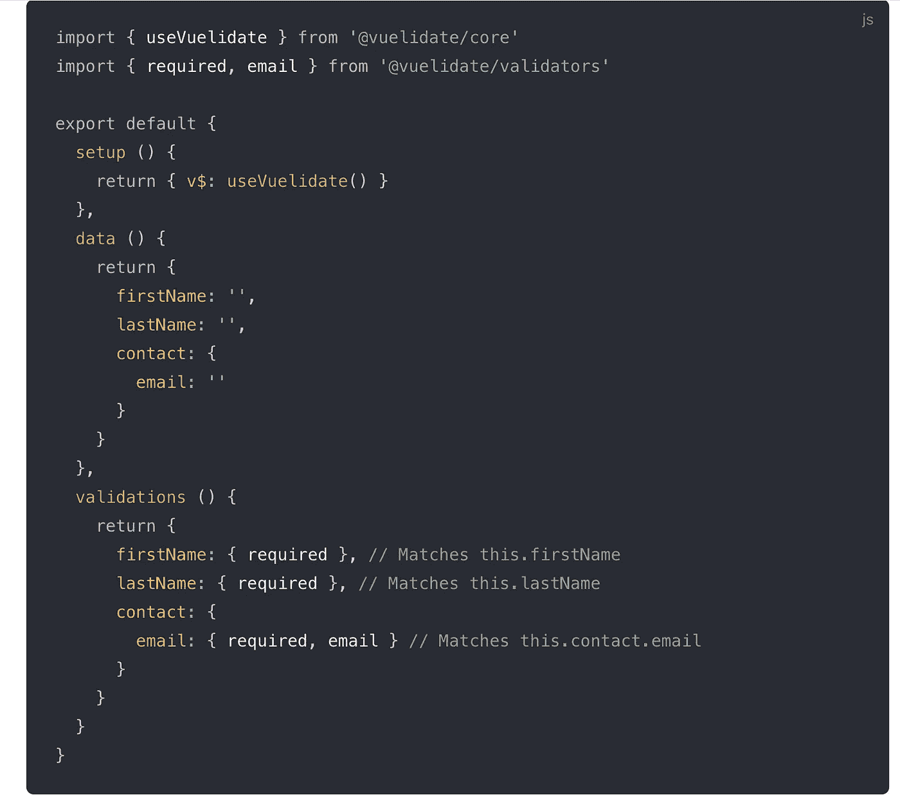
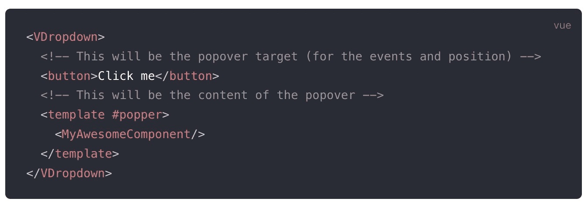
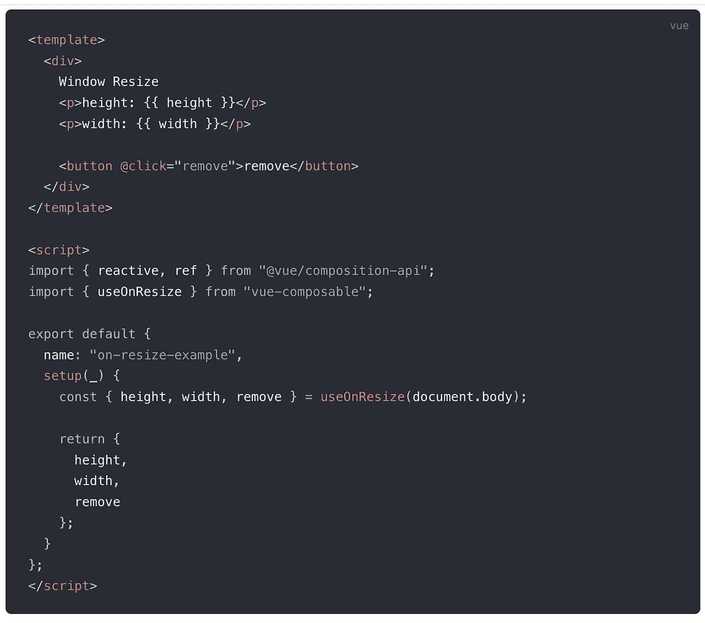
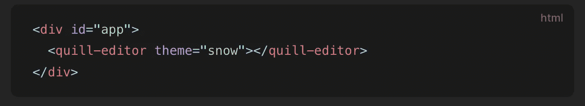
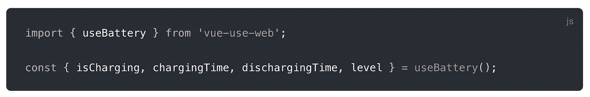
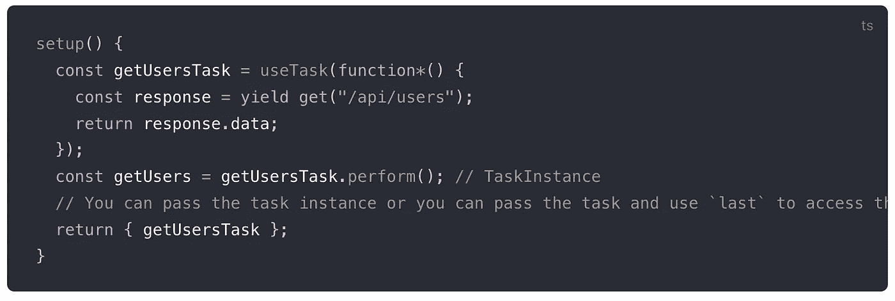
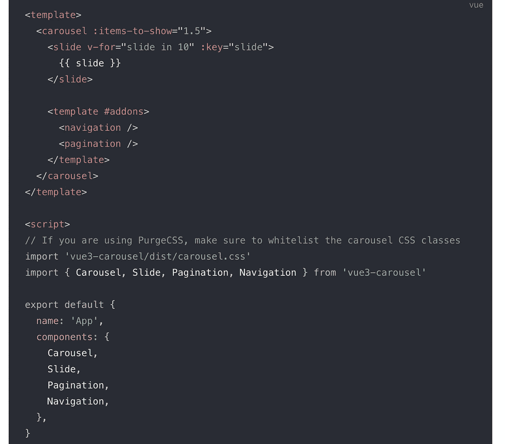

# 你应该在下一个项目中使用的 7 个有用的 Vue.js 库

> 原文：<https://javascript.plainenglish.io/7-useful-vue-js-libraries-you-should-use-in-your-next-project-bc85ac592d46?source=collection_archive---------5----------------------->

## 加速您的 Vue.js 开发


Photo by [Mohammad Rahmani](https://unsplash.com/@afgprogrammer?utm_source=unsplash&utm_medium=referral&utm_content=creditCopyText) on [Unsplash](https://unsplash.com/s/photos/programmer?utm_source=unsplash&utm_medium=referral&utm_content=creditCopyText)

有句谚语“不必多此一举”。图书馆就是最好的例子。它帮助你以一种简单的方式编写复杂而耗时的功能。根据我的观点，一个好的项目使用一些最好的库。Vue.js 是创建用户界面的最好的 JavaScript 框架之一。

本文是关于 Vue.js 的优秀库的系列文章的一部分，在该系列文章中，我一直在整理一个 7 个 Vue.js 库的列表，它们将在您的开发之旅中对您有所帮助。

# 1.Vuelidate



对于 Vue.js 3 和 2，这是一个简单但功能强大的轻量级基于模型的验证。它被认为是基于模型的，因为验证规则是在数据旁边定义的，并且验证树结构与数据模型结构相匹配。它在 GitHub 上有超过 6.5k 颗星。

[](https://github.com/vuelidate/vuelidate/tree/next) [## GitHub-vue lidate/vue lidate:vue . js 的简单、轻量级的基于模型的验证

### 用于 Vue.js 2.x 和 3.0 的简单、轻量级的基于模型的验证，请访问 Vuelidate 文档以获取详细说明。你可以…

github.com](https://github.com/vuelidate/vuelidate/tree/next) 

# 2.浮动 vue



如果你想创建自定义和漂亮的工具提示，弹出窗口，下拉菜单和其他弹出窗口，那么这是一个很好的资源。我相信你已经猜到这个库将帮助你轻松地添加这些功能。它在 GitHub 上有超过 2.4k 的星星。

[](https://github.com/Akryum/floating-vue) [## GitHub - Akryum/floating-vue:💬简单的工具提示，弹出式菜单，下拉菜单...为了 Vue

### 简单的工具提示、下拉菜单、菜单...使用浮动 UI，这个包已经从 v-tooltip 重命名为 floating-vue，现在…

github.com](https://github.com/Akryum/floating-vue) 

# 3.(音乐)可设定的



这个库的目标是成为许多真实世界的可组合函数的一站式商店，并通过积极的树抖动来减轻您的最终代码。它由 50 多个不同的组件组成，如 i18n、验证、分页、获取等。这个库在 GitHub 上有 1k 多颗星。

[](https://github.com/pikax/vue-composable) [## GitHub-pikax/Vue-composable:Vue 组合-api 可组合组件。i18n，验证…

### 这个库的目标是成为许多现实世界中可组合组件的一站式商店…

github.com](https://github.com/pikax/vue-composable) 

# 4.Vue-quill



从头开始创建富编辑器有时可能是一项复杂或耗时的任务。这个库提供了一个漂亮的富文本编辑器，由 Vue 3 和 Quill 提供支持。它很容易使用，并且完全用 TypeScript 编写。

[](https://github.com/vueup/vue-quill) [## GitHub-Vue up/Vue-quill:Vue 3 的富文本编辑器组件。

### 👀观看现场演示 VueQuill 是一个构建富文本编辑器的组件，由 Vue 3 和 Quill 提供支持。💚建造于…

github.com](https://github.com/vueup/vue-quill) 

# 5.使用-网络



Web APIs 千变万化，这个库旨在为 Vue.js 开发者提供一个稳定的接口，很好地融入生态系统。此外，当浏览器不支持所述特性时，界面会适度降级。在 Vue composition API (hooks)中实现 web APIs 使它们为 Vue 3.0 及更高版本做好了准备。

[](https://github.com/Tarektouati/vue-use-web) [## GitHub - Tarektouati/vue-use-web:作为 Vue.js 组合函数实现的 web apis

### 作为 Vue.js 组合函数实现的 Web APIs。这是作为 Vue.js composition 公开的 Web APIs 集合…

github.com](https://github.com/Tarektouati/vue-use-web) 

# 6.并发



这是一个用于封装异步操作和管理 Vue 和 Composition API 并发性的库。它旨在为执行异步操作提供合理的抽象。它减少了样板代码，提供了可靠的派生状态，并允许采用新的技术方法，如节流、去抖动和轮询。

[](https://github.com/MartinMalinda/vue-concurrency) [## GitHub-MartinMalinda/vue-concurrency:一个封装异步操作和

### 灵感来自 ember-concurrency。一个用于封装异步操作和管理 Vue 和…

github.com](https://github.com/MartinMalinda/vue-concurrency) 

# 7.旋转木马



顾名思义，这个库提供了一个现代的轻量级 carousel 组件。它包括许多功能，如响应断点，鼠标/触摸拖动，无限滚动(回绕)，自动播放，等等。

[](https://github.com/ismail9k/vue3-carousel) [## GitHub-Ismail 9k/Vue 3-carousel:Vue 3 carousel 组件

### Vue 3 转盘组件。在 GitHub 上创建一个帐户，为 ismail9k/vue3-carousel 开发做出贡献。

github.com](https://github.com/ismail9k/vue3-carousel) 

# 另一部分在哪里？

有很多很棒的 Vue.js 库。我想分享尽可能多的资源，让你的开发之旅更轻松。

如果你想知道更多厉害的 Vue.js 库请查看下面。

[](/7-useful-vue-js-libraries-you-should-use-in-your-next-project-e62044bba4ef) [## 你应该在下一个项目中使用的 7 个有用的 Vue.js 库

### 加速您的 Vue.js 开发

javascript.plainenglish.io](/7-useful-vue-js-libraries-you-should-use-in-your-next-project-e62044bba4ef) [](/7-useful-vue-js-libraries-you-should-use-in-your-next-project-ec56f73f5fa3) [## 你应该在下一个项目中使用的 7 个有用的 Vue.js 库

### 加速您的 Vue.js 开发

javascript.plainenglish.io](/7-useful-vue-js-libraries-you-should-use-in-your-next-project-ec56f73f5fa3) [](/7-useful-vue-js-libraries-you-should-use-in-your-next-project-dc9a55d90d2c) [## 你应该在下一个项目中使用的 7 个有用的 Vue.js 库

### 加速您的 Vue.js 开发

javascript.plainenglish.io](/7-useful-vue-js-libraries-you-should-use-in-your-next-project-dc9a55d90d2c) 

今天到此为止。我希望这些库有助于简化开发过程。

如果你知道任何其他有用的 Vue.js 库，请在评论中分享。直到我们再次见面…干杯！

```
**Want to Connect?**If you want to, you can connect with me on [**Twitter**](https://twitter.com/FarhanTanvirBD)
```

*更多内容请看*[***plain English . io***](https://plainenglish.io/)*。报名参加我们的* [***免费周报***](http://newsletter.plainenglish.io/) *。关注我们关于*[***Twitter***](https://twitter.com/inPlainEngHQ)[***LinkedIn***](https://www.linkedin.com/company/inplainenglish/)*[***YouTube***](https://www.youtube.com/channel/UCtipWUghju290NWcn8jhyAw)*[***不和***](https://discord.gg/GtDtUAvyhW) *。对增长黑客感兴趣？检查* [***电路***](https://circuit.ooo/) *。***