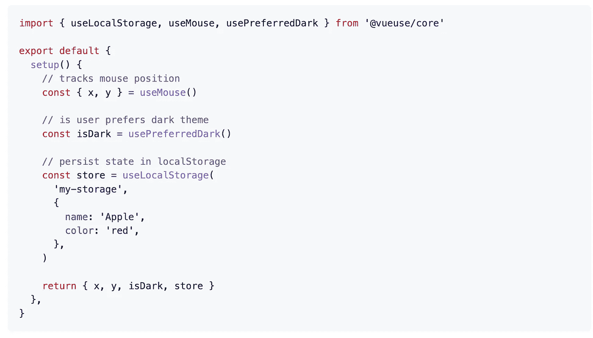
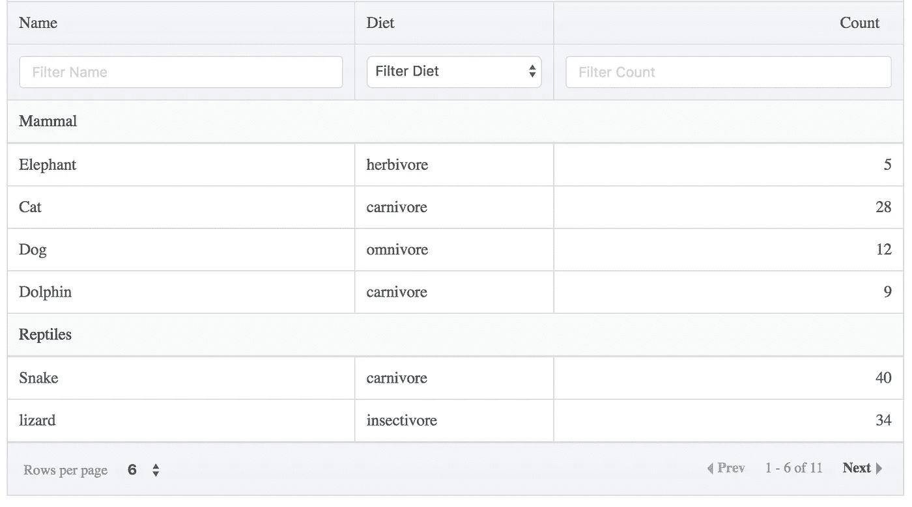
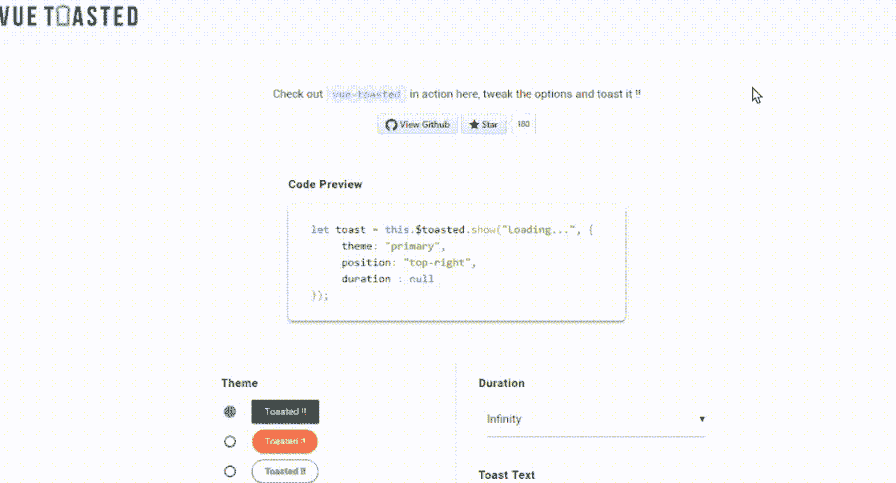
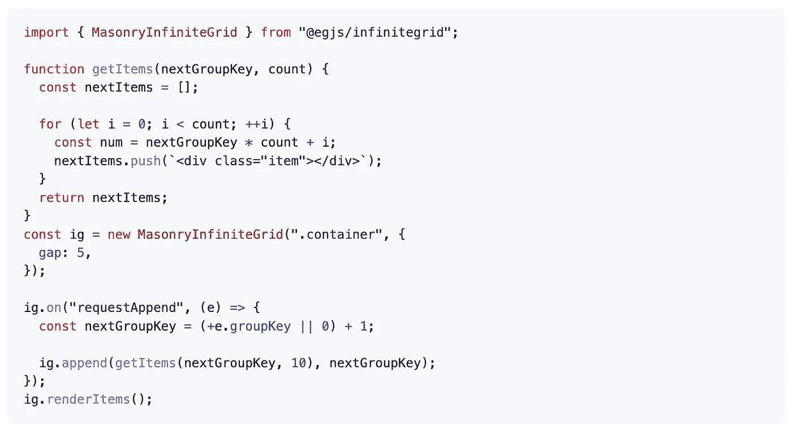
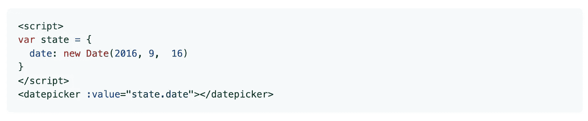
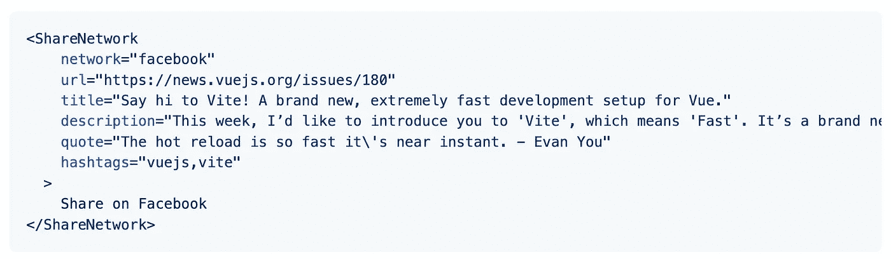

# 您应该在下一个项目中使用的 7 个有用的 Vue.js 库

> 原文：<https://javascript.plainenglish.io/7-useful-vue-js-libraries-you-should-use-in-your-next-project-dc9a55d90d2c?source=collection_archive---------3----------------------->

## 加快您的 Vue.js 开发速度


Photo by [Nicole Wolf](https://unsplash.com/@joeel56?utm_source=unsplash&utm_medium=referral&utm_content=creditCopyText) on [Unsplash](https://unsplash.com/s/photos/programming-code?utm_source=unsplash&utm_medium=referral&utm_content=creditCopyText)

当我们可以通过使用一个库很容易地达到同样的结果时，为什么要编写自定义功能呢？开发者最好的朋友和救星是图书馆。我相信一个好的项目会利用一些最好的可用库。Vue.js 是创建用户界面的最好的 JavaScript 框架之一。

本文是关于 Vue.js 的优秀库的系列文章的一部分，在这个系列文章中，我总是会整理出 7 个 Vue.js 库的列表，这些库将会在您的开发旅程中为您提供帮助。

# 1.vueuse



这是 GitHub 上最著名的库之一，有超过 10000 颗星星。这是基于 [Composition API](https://v3.vuejs.org/guide/composition-api-introduction.html) 的实用函数的集合。如果您不熟悉 composite API，请在继续之前对[composite API](https://v3.vuejs.org/guide/composition-api-introduction.html)有一些基本的了解。

[](https://github.com/vueuse/vueuse) [## git hub-vu euse/vu euse:Vue 2 和 3 的基本 Vue 合成实用程序集

### 基本 Vue 合成实用程序集。更多详情请参阅功能列表或文档。🎩来自…

github.com](https://github.com/vueuse/vueuse) 

# 2.好桌子



表格是软件开发中最常用的组件之一。这是一个易于使用的强大数据表，具有高级定制功能，包括排序、列过滤、分页、分组等。它在 GitHub 上有超过 1.9 千颗恒星。

[](https://github.com/xaksis/vue-good-table) [## GitHub - xaksis/vue-good-table:一个易于使用的强大的 vuejs 数据表，具有高级…

### 一个易于使用的强大的 vuejs 数据表，具有高级定制功能，包括排序、列过滤…

github.com](https://github.com/xaksis/vue-good-table) 

# 3.敬酒



通过 toast 消息与用户交流是该应用的常见功能之一。这个库将帮助您完成这项任务。它被 Vue.js、Laravel 和 NuxtJS 使用，并受到更多组织的信任。它反应灵敏，与触摸兼容，易于使用，有吸引力，并且具有丰富的图标、动作等功能。它在 GitHub 上有超过 2k 颗恒星。

[](https://github.com/shakee93/vue-toasted) [## git hub-shake 93/vue-Toast:vue js 2+的🖖响应触摸兼容 toast 插件

### vue duked 是 VueJS 最好的烤面包插件之一。它被 VueJS、Laravel、NuxtJS 使用，并受到…

github.com](https://github.com/shakee93/vue-toasted) 

# 4.egjs-无限网格



如果你必须使用网格布局，那么这是一个很好的资源。该库用于根据网格类型无限排列包含内容的元素。它将帮助您实现由不同尺寸的卡元素组成的各种网格。它通过在任何情况下保持模块处理的 DOM 数量来保证性能。它在 GitHub 上有超过 1.9 千颗恒星。

[](https://github.com/naver/egjs-infinitegrid) [## git hub—naver/egjs-infini integrid:一个用于排列卡片元素(包括内容)的模块……

### 用于根据网格类型无限排列包含内容的元素的模块。通过本模块，您可以…

github.com](https://github.com/naver/egjs-infinitegrid) 

# 5.日期选择器



从头开始创建日期选择器有时会很耗时或复杂。这个库将帮助您完成这项任务。正如你已经猜到的，这是一个日期选择器组件，支持禁用日期、内嵌模式、翻译等等。它在 GitHub 上有超过 2.5k 颗星。

[](https://github.com/charliekassel/vuejs-datepicker) [## GitHub-charliekassel/vue js-date picker:一个简单的 Vue.js datepicker 组件。支持禁用…

### datepicker Vue 组件。兼容 Vue 2.x NB。直到 v0.9.9 版本才支持 Vue 1.x。

github.com](https://github.com/charliekassel/vuejs-datepicker) 

# 6.树选择


顾名思义，这是一个带有嵌套选项的多选组件。它包括许多功能，如支持嵌套选项的单选和多选、模糊匹配、异步搜索、延迟加载(仅在需要时加载深层选项的数据)等等。它在 GitHub 上有超过 2.5k 颗星。

[](https://github.com/riophae/vue-treeselect) [## GitHub - riophae/vue-treeselect:一个多选组件，支持 Vue.js 的嵌套选项

### 带有嵌套选项的多选组件支持 Vue.js 单个和多个嵌套选项支持的多选…

github.com](https://github.com/riophae/vue-treeselect) 

# 7.社交分享



如果你的应用有在社交网络上分享链接的功能，那么这对你来说是一个很好的资源。当你在社交网络上分享一个链接时，社交网络会抓取该链接，以检测[开放图元标签](https://ogp.me/)。如果您共享的链接不包含开放图形元标签，社交网络将无法为您的链接显示丰富的内容。这是一个无渲染的 Vue.js 组件，用于共享社交网络的链接，与 SSRR 兼容。它在 GitHub 上有超过 1.3k 颗星。

[](https://github.com/nicolasbeauvais/vue-social-sharing) [## GitHub-nicolasbeauvais/vue-social-sharing:一个无渲染的 Vue.js 组件，用于共享链接到…

### 用于在主要社交网络上共享链接的无渲染组件小于 2.5kb 的 gzipped 无渲染组件提供…

github.com](https://github.com/nicolasbeauvais/vue-social-sharing) 

# 另一部分在哪里？

有很多很棒的 Vue.js 库。我想分享尽可能多的资源，让你的开发之旅更轻松。

如果你想知道更多厉害的 Vue.js 库请查看下面。

[](/7-useful-vue-js-libraries-you-should-use-in-your-next-project-e62044bba4ef) [## 你应该在下一个项目中使用的 7 个有用的 Vue.js 库

### 加速您的 Vue.js 开发

javascript.plainenglish.io](/7-useful-vue-js-libraries-you-should-use-in-your-next-project-e62044bba4ef) [](/7-useful-vue-js-libraries-you-should-use-in-your-next-project-ec56f73f5fa3) [## 你应该在下一个项目中使用的 7 个有用的 Vue.js 库

### 加速您的 Vue.js 开发

javascript.plainenglish.io](/7-useful-vue-js-libraries-you-should-use-in-your-next-project-ec56f73f5fa3) 

今天到此为止。我希望这些库有助于简化开发过程。

如果你知道任何其他有用的 Vue.js 库，请在评论中分享。直到我们再次见面…干杯！

```
**Want to Connect?**If you want to, you can connect with me on [**Twitter**](https://twitter.com/FarhanTanvirBD)
```

*更多内容请看*[***plain English . io***](https://plainenglish.io/)*。报名参加我们的* [***免费周报***](http://newsletter.plainenglish.io/) *。关注我们关于*[***Twitter***](https://twitter.com/inPlainEngHQ)[***LinkedIn***](https://www.linkedin.com/company/inplainenglish/)*[***YouTube***](https://www.youtube.com/channel/UCtipWUghju290NWcn8jhyAw)*[***不和***](https://discord.gg/GtDtUAvyhW) *。对增长黑客感兴趣？检查* [***电路***](https://circuit.ooo/) *。***