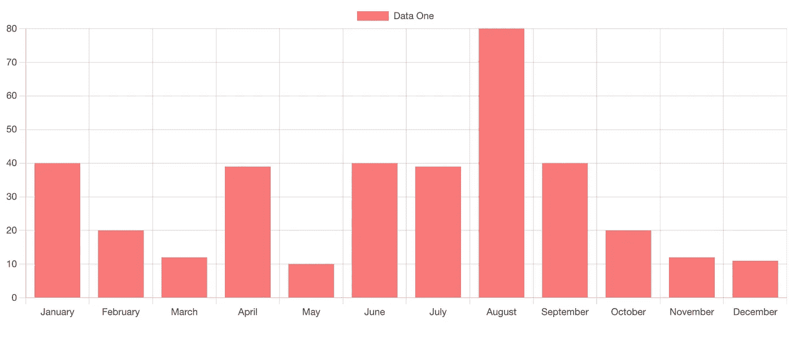
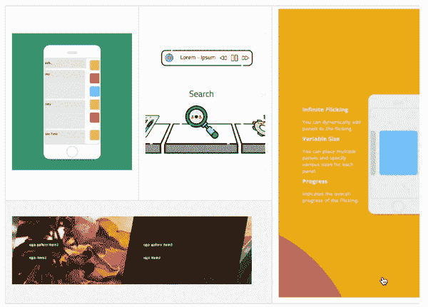
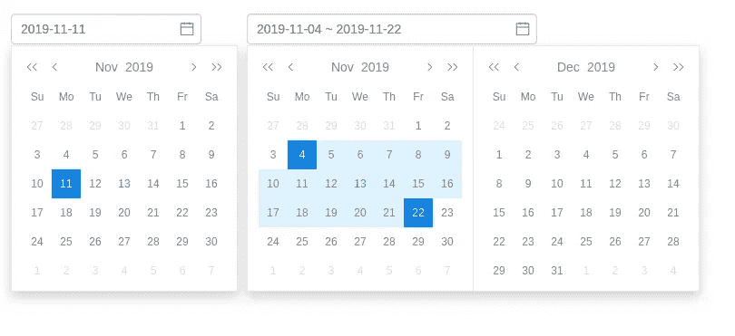
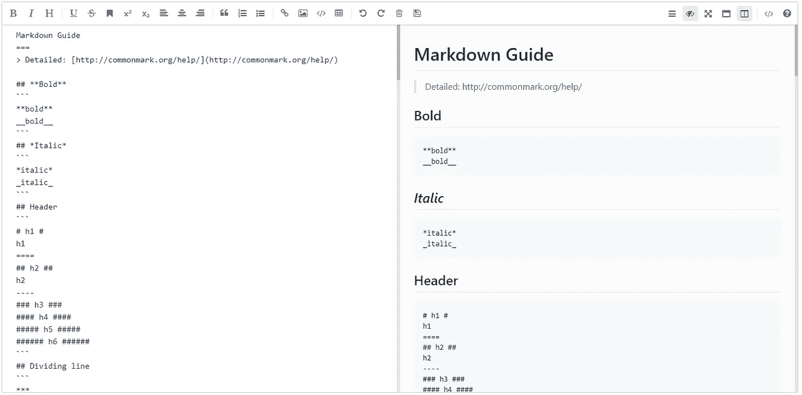
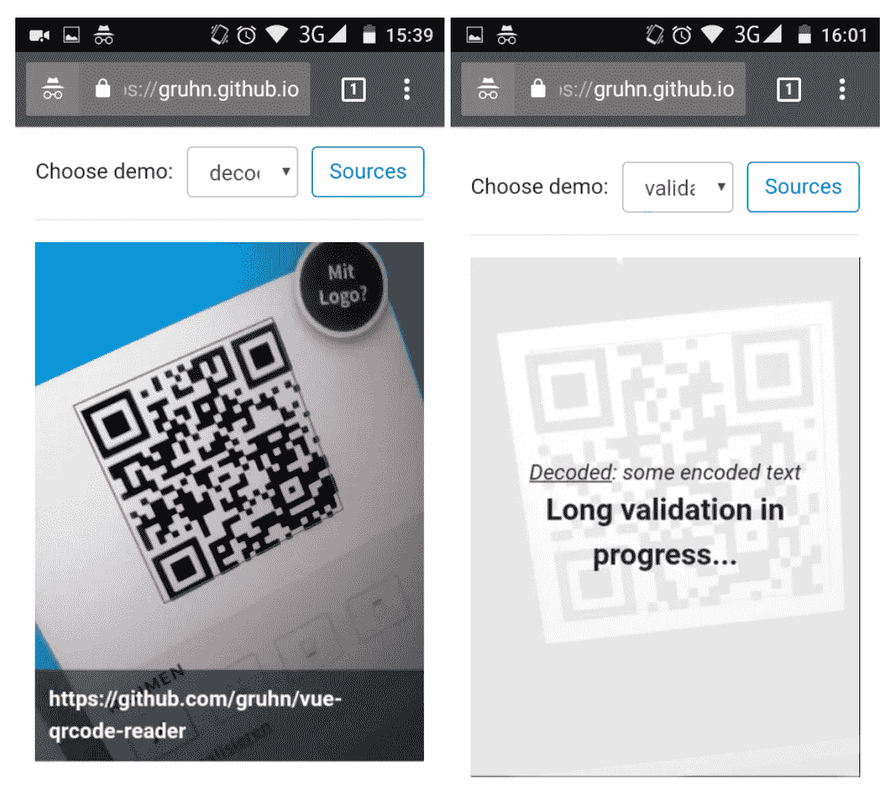

# 你应该在下一个项目中使用的 7 个有用的 Vue.js 库

> 原文：<https://javascript.plainenglish.io/7-useful-vue-js-libraries-you-should-use-in-your-next-project-e62044bba4ef?source=collection_archive---------4----------------------->

## 加速您的 Vue.js 开发

Photo by [Mohammad Rahmani](https://unsplash.com/@afgprogrammer?utm_source=medium&utm_medium=referral) on [Unsplash](https://unsplash.com?utm_source=medium&utm_medium=referral)

当我们可以通过使用一个库轻松实现相同的结果时，为什么还要编写自定义功能呢？开发人员最好的朋友和救星是库。我相信一个好的项目会利用一些最好的可用库。Vue.js 是创建用户界面的最好的 JavaScript 框架之一。

本文是关于 Vue.js 的优秀库的系列文章的一部分，在该系列文章中，我一直在整理一个 7 个 Vue.js 库的列表，它们将在您的开发之旅中对您有所帮助。

# 1.银栅

显示和处理数据是开发人员执行的重要且常见的任务之一。这个库将帮助您完成这项任务。这是一个功能全面、高度可定制的 JavaScript 数据网格。它提供卓越的性能，并且独立于第三方。它还包括许多功能，如列交互(调整大小、重新排序和锁定列)、分页、排序、行选择等等。这个库在 Github 上有 9k 多颗星。

 [## GitHub - ag-grid/ag-grid:构建企业应用程序的最佳 JavaScript 数据表…

### 构建企业应用程序的最佳 JavaScript 数据表。支持 React/Angular/Vue/Plain JavaScript…

github.com](https://github.com/ag-grid/ag-grid) 

# 2.vue-chartjs

如果你想展示一个图表，那么这是一个很好的资源。正如你已经猜到的名字，这个库将帮助你创建可重用的图表组件。它支持许多不同类型的图表，如条形图、气泡图、圆环图、折线图、饼图、极化图、雷达图等等。这个库在 Github 上有超过 4.5k 的星星。

 [## GitHub -无孔/vue-chartjs:📊Chart.js 的 Vue.js 包装器

### vue-chartjs 是 vue 中 Chart.js 的包装器。您可以轻松创建可重用的图表组件。支持 Chart.js v3…

github.com](https://github.com/apertureless/vue-chartjs) 

# 3.egjs-flicking

当我们必须显示大量图像时，carousel 是我们最常用的组件之一。这个库提供了一个可靠的、灵活的、可扩展的传送带。它建立在 Typescript 之上。它还包括许多功能，如 SSR(服务器端渲染)支持，循环(Loop)模式，支持 IE9+和 polyfill，等等。这个库在 Github 上有超过 2k 的星星。

 [## GitHub - naver/egjs-flicking:🎠♻️每天有 3000 万人经历。它可靠、灵活…

### 🎠♻️每天有 3000 万人经历。它是可靠、灵活和可扩展的转盘。- GitHub …

github.com](https://github.com/naver/egjs-flicking) 

# 4.内容加载器

如果你喜欢脸书的内容加载器，那么这是一个很好的资源。在这个库的帮助下，你可以创建类似于脸书卡片的占位符加载。它还包括像纯 SVG 这样的功能，不需要任何 javascript、画布等，完全可定制:你可以改变颜色、速度、大小等等。这个库在 Github 上有超过 2.5k 的星星。

 [## GitHub-egoist/vue-content-loader:创建占位符加载的 SVG 组件，像脸书…

### SVG 组件创建占位符加载，像脸书卡加载。这是 react-content-loader 的 Vue 端口…

github.com](https://github.com/egoist/vue-content-loader) 

# 5.日期选择器

正如您从名字中猜到的，这个库提供了 Datepicker / DateTimepicker。它包括主题化、国际化、格式化等特性。这是针对 Vue 2.0 的，但是对于 Vue 3.0，你可以使用同一作者的 [vue-datepicker-next](https://github.com/mengxiong10/vue-datepicker-next) 。这个库在 Github 上有超过 1.4k 的星星。

 [## GitHub-Meng Xiong 10/vue 2-date picker:vue 2 的 datepicker / datetimepicker 组件

### Vue2 的日期选择器/日期时间选择器组件。通过创建一个……为 mengxiong10/vue2-datepicker 的开发做出贡献

github.com](https://github.com/mengxiong10/vue2-datepicker) 

# 6.mavonEditor

如果你想添加一个功能的 markdown 编辑器，那么这是一个很好的资源给你。这个库提供了一个 markdown 编辑器，支持各种个性化的特性。它支持表情符号、下标、上标、容器、定义列表等等。这个库在 Github 上有超过 5.5k 的星星。

 [## GitHub-hines boy/mavon editor:mavon editor-一个基于 Vue 的 markdown 编辑器，支持多种…

### mavonEditor -基于 Vue 的 markdown 编辑器，支持多种个性化功能- GitHub …

github.com](https://github.com/hinesboy/mavonEditor) 

# 7.vue-二维码阅读器

该库提供了一组组件(QrcodeStream、QrcodeDropZone、QrcodeCapture)，允许您在不离开浏览器的情况下检测和解码 QR 码。所有部件都有反应。这个库在 Github 上有超过 1.5k 的星星。

 [## GitHub - gruhn/vue-qrcode-reader:一组用于检测和解码二维码的 Vue.js 组件。

### 现场演示| api 引用了一组 Vue.js 组件，允许您检测和解码二维码，而无需离开…

github.com](https://github.com/gruhn/vue-qrcode-reader) 

# 另一部分在哪里？

有很多很棒的 Vue.js 库。我想分享尽可能多的资源，让你的开发之旅更轻松。

如果你想知道更多厉害的 Vue.js 库请查看下面。

 [## 你应该在下一个项目中使用的 7 个有用的 Vue.js 库

### 加速您的 Vue.js 开发

javascript.plainenglish.io](/7-useful-vue-js-libraries-you-should-use-in-your-next-project-ec56f73f5fa3) 

今天到此为止。我希望这些库有助于简化开发过程。

如果你知道任何其他有用的 Vue.js 库，请在评论中分享。直到我们再次相遇。干杯！

***想要连接？*** *如果你愿意，可以在* [***推特***](https://twitter.com/FarhanT99598254) ***上与我联系。***

*更多内容请看*[***plain English . io***](https://plainenglish.io/)*。报名参加我们的* [***免费周报***](http://newsletter.plainenglish.io/) *。关注我们关于*[***Twitter***](https://twitter.com/inPlainEngHQ)[***LinkedIn***](https://www.linkedin.com/company/inplainenglish/)*，以及* [***不和***](https://discord.gg/GtDtUAvyhW) *。*