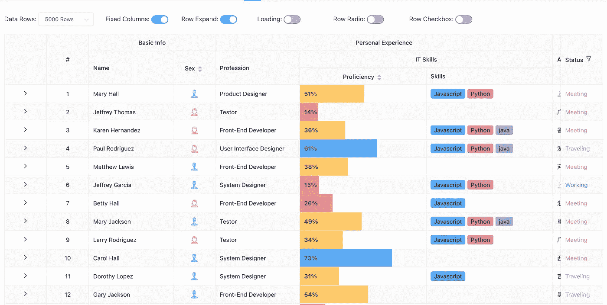
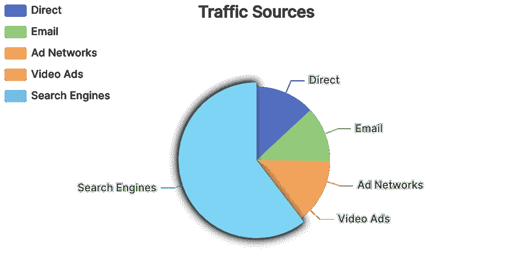
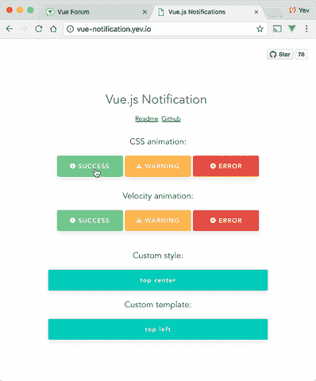
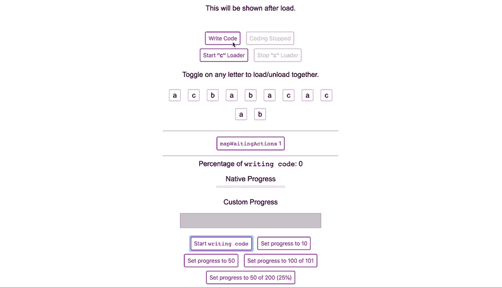
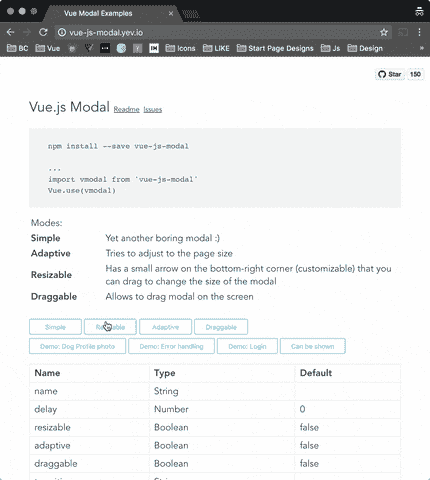
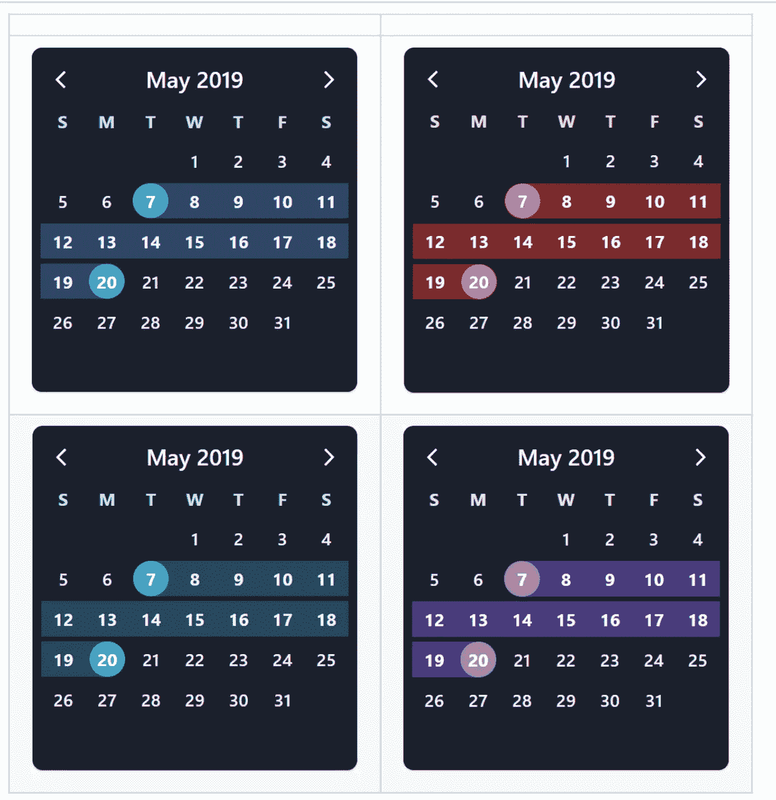

# 你应该在下一个项目中使用的 7 个有用的 Vue.js 库

> 原文：<https://javascript.plainenglish.io/7-useful-vue-js-libraries-you-should-use-in-your-next-project-ec56f73f5fa3?source=collection_archive---------5----------------------->

## 加速您的 Vue.js 开发

Photo by [Mohammad Rahmani](https://unsplash.com/@afgprogrammer?utm_source=medium&utm_medium=referral) on [Unsplash](https://unsplash.com?utm_source=medium&utm_medium=referral)

当我们可以通过使用一个库轻松实现相同的结果时，为什么还要编写自定义功能呢？开发人员最好的朋友和救星是库。我相信一个好的项目会利用一些最好的可用库。

Vue.js 是创建用户界面的最好的 JavaScript 框架之一。这里有一些有用的库，可以帮助你更快更有效地构建你的项目。

# 1.vue-简易桌

这个库提供了一个功能全面、高度可定制的表格组件/数据网格。它支持许多功能，如虚拟滚动、固定列、固定标题、标题分组、过滤、排序、单元格省略号、行扩展、行复选框等等。单元测试覆盖率大于 85%。这个库在 Github 上有超过 2.5k 的星星。

 [## GitHub-Happy-Coding-Clans/vue-easy table:🍉表格组件/数据网格/数据表。支持…

### 通过成为赞助商来支持这个项目。您的徽标或名称将显示在此处，并带有您提供的链接。成为一名…

github.com](https://github.com/Happy-Coding-Clans/vue-easytable) 

# 2.武埃查尔兹

如果你正在创建一个数据驱动的应用程序，它很有可能有一个图表。在这种情况下，这个库对您来说是一个很好的资源。这个库提供了许多漂亮的可定制的图表，如条形图、饼图、极坐标图、散点图等等。这个库在 Github 上有超过 7k 的星星。

 [## GitHub-ECOM Fe/vue-e charts:vue . js 的 Apache ECharts 组件。

### Apache ECharts 的 Vue.js 组件。使用 Apache ECharts 5 并适用于 Vue.js 2/3。如果您从…迁移

github.com](https://github.com/ecomfe/vue-echarts) 

# 3.vue 通知

向用户显示消息是应用程序的基本功能之一。正如你已经猜到的，这个库将帮助你创建一个漂亮的通知。它提供了很多特性，比如动画、自定义位置、自定义样式等等。这个库在 Github 上有超过 2.3k 的星星。

 [## GitHub-euvl/vue-notification:vue . js 2 用于显示通知的库

### icecream: Vue.js 2 显示通知的库-GitHub-euvl/vue-notification:vue . js 2 显示…

github.com](https://github.com/euvl/vue-notification) 

# 4.等等

这个库使得在一个页面上控制不同的加载状态而没有任何冲突成为可能。它的核心原理是管理具有多种加载状态的数组(或者，可选地，Vuex 存储)。集成加载器组件开始监听其注册的加载器，并立即进入加载状态。这个库在 Github 上有超过 1.9k 的星星。

 [## GitHub-f/Vue-wait:Vue/Vuex 和 Nuxt 应用程序的复杂加载程序和进度管理

### Vue 和(可选)Vuex 的多进程加载器管理。阅读中篇文章“管理复杂的等待…

github.com](https://github.com/f/vue-wait) 

# 5.vue-js-modal

正如你已经猜到的，这是一个易于使用、高度可定制的 Vue.js 模态库。该库支持静态和动态两种模式。静态是通过模板显式定义的。动态是根据传递给“显示模态”函数的配置生成的。这个库在 Github 上有超过 4k 的星星。

 [## GitHub - euvl/vue-js-modal:简单易用，高度可定制的 Vue.js 模态库。

### 易于使用，高度可定制的 Vue.js 模态库。版本 2.0.0 候选发行版将会有突破性的变化…

github.com](https://github.com/euvl/vue-js-modal) 

# 6.vue-敏捷

这是 Vue.js 的旋转库，灵感来自于 [Slick](https://github.com/kenwheeler/slick/) 。这个库提供了一个功能强大、响应迅速、界面友好的转盘。它还支持 Nuxt.js SSR。它不依赖于 jQuery。这个库在 Github 上有超过 1.4k 的星星。

 [## GitHub-lukaszflorczak/vue-agile:🎠Vue.js 的轮播组件

### 受 Slick 启发的 Vue.js 的 carousel 组件。功能强大，反应灵敏，触摸友好，支持 Nuxt.js SSR

github.com](https://github.com/lukaszflorczak/vue-agile) 

# 7.虚拟日历

处理日期是每个开发人员都需要处理的常见功能之一。在这种情况下，这个图书馆会让你的生活更轻松。正如你已经猜到的，这是一个优雅的日历和日期选择器。它提供了许多功能，如鞋钉突出，点，酒吧，自定义 popovers，日期范围，等等。这个库在 Github 上有超过 3.5k 的星星。

 [## GitHub - nathanreyes/v-calendar:一个优雅的日历和日期选择器插件。

### 此时您不能执行该操作。您已使用另一个标签页或窗口登录。您已在另一个选项卡中注销，或者…

github.com](https://github.com/nathanreyes/v-calendar) 

# 其他一些很棒的资源在哪里？

总有新的东西要学。如果你想了解更多关于编程的知识，请点击下面的链接。

 [## 学习任何编程语言的 7 个最佳 GitHub 库

### 启动您的程序员之旅。

javascript.plainenglish.io](/7-best-github-repositories-to-learn-any-programming-language-5843e5a3c8d8) 

今天到此为止。我希望这些库有助于简化开发过程。

如果你知道任何其他有用的 Vue.js 库，请在评论中分享。直到我们再次相遇。干杯！

***想要连接？***

*如果你愿意，可以在* [***推特***](https://twitter.com/FarhanT99598254) 上与我联系

*更多内容请看*[***plain English . io***](https://plainenglish.io/)*。报名参加我们的* [***免费周报***](http://newsletter.plainenglish.io/) *。关注我们关于*[***Twitter***](https://twitter.com/inPlainEngHQ)*和*[***LinkedIn***](https://www.linkedin.com/company/inplainenglish/)*。查看我们的* [***社区不和谐***](https://discord.gg/GtDtUAvyhW) *加入我们的* [***人才集体***](https://inplainenglish.pallet.com/talent/welcome) *。*