# 7 个对网站开发者有用的网站

> 原文：<https://javascript.plainenglish.io/7-useful-websites-for-web-developers-af1c7e9e2b4a?source=collection_archive---------19----------------------->

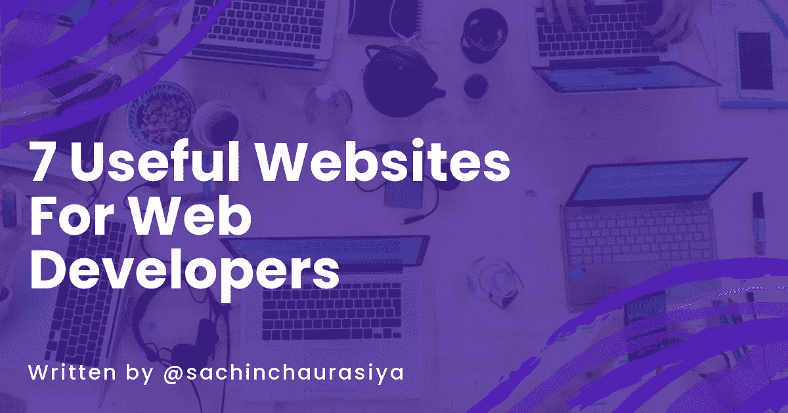

作为 web 开发人员，我们试图每天解决一些问题。为了解决这些问题，我们可能需要一些方便的工具/网站来查找。

今天，在这篇文章中，我将与你分享 7 个有用的网站，帮助你解决问题。

让我们开始吧。

# 元标签

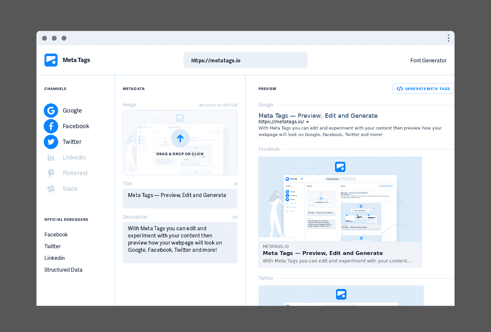

Meta Tags 是一个为任何网站调试和生成 meta tag 代码的工具。有了元标签，你可以编辑和试验你的内容，然后预览你的网页在谷歌、脸书、推特等网站上的外观。

你可以用这个工具来看看你的网站在不同的社交媒体平台上会是什么样子。

## 示例:

我的网站预览。

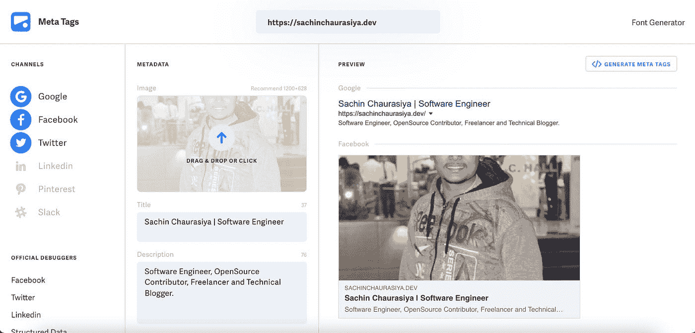

我可以点击`generate meta tags`按钮为我的网站生成元标签。

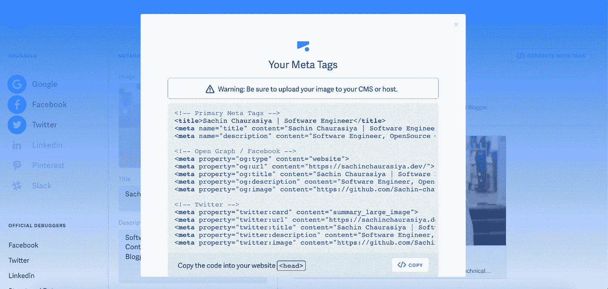

## [元标签链接](https://metatags.io/)

# 自述文件

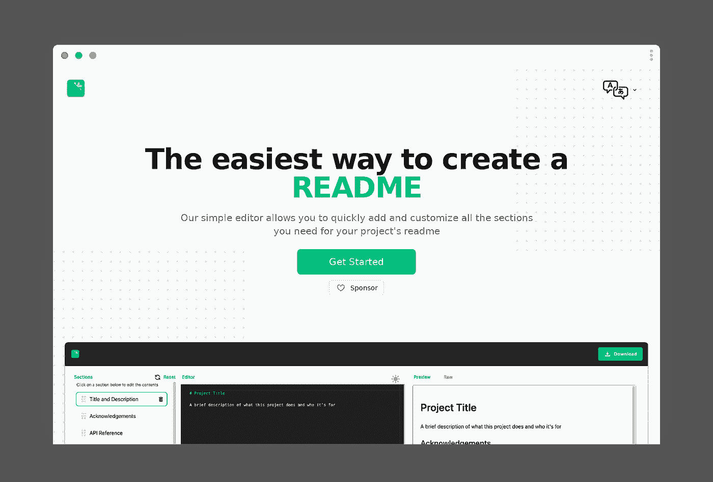

Readme 是一个非常棒的工具，可以为您的项目快速生成 Readme。它在您的自述文件中提供了许多部分。

## 示例:

这里你可以看到我使用了不同的部分，如`Title and Description`、`Authors`、`API reference`。

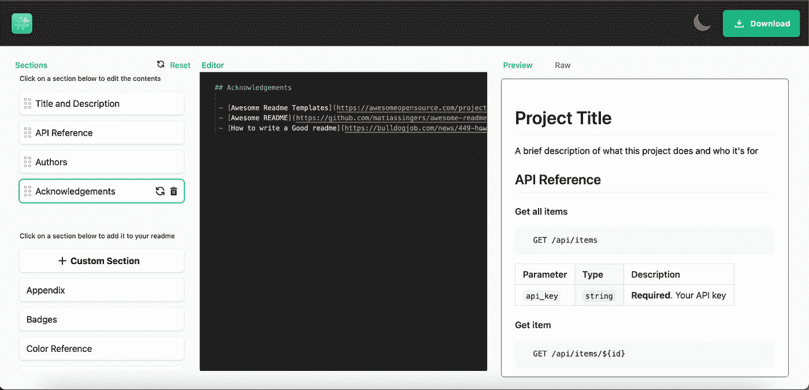

## [自述文件链接](https://readme.so/)

# 响应地

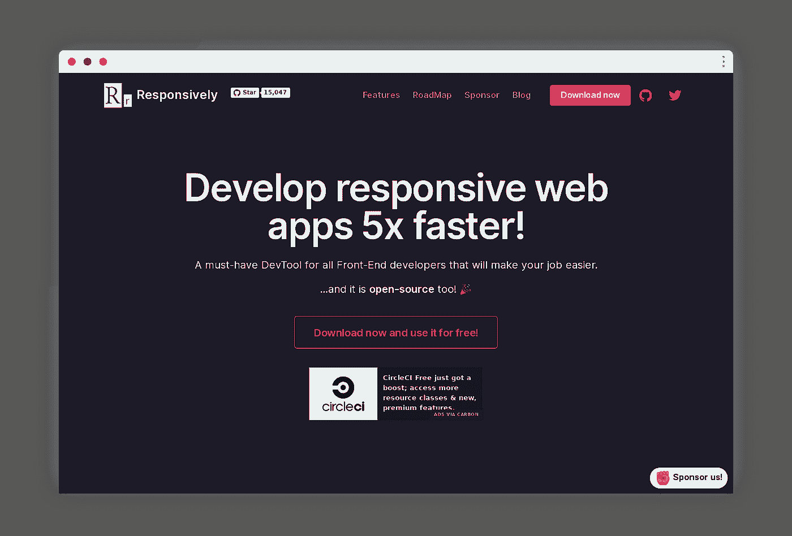

Responsively 是 web 开发人员查看他们的网站在不同屏幕尺寸下的外观的必备工具。最重要的是，这是一个开源工具，它有一些很酷的特性，

*   镜像交互
*   可定制的布局
*   令人敬畏的元素检查员
*   丰富的内置设备配置文件
*   一键截图
*   支持热重装

## [用于响应的链接](https://responsively.app/)

# 移除血糖

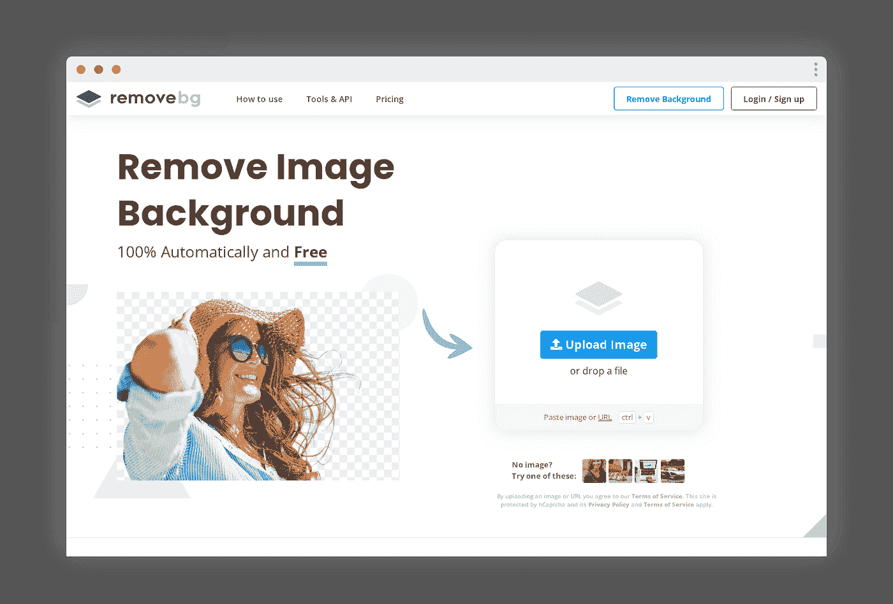

当你想从图像中移除背景时，移除背景是你需要的第一个工具。如果你想在你的项目中经常使用它，它有一个免费增值计划。它还提供了一个 API 来与您的项目集成。

它支持

*   个人
*   摄影师
*   营销
*   媒体
*   开发商
*   电子商务
*   企业

## [移除血糖的链接](https://www.remove.bg/)

# 类型标度

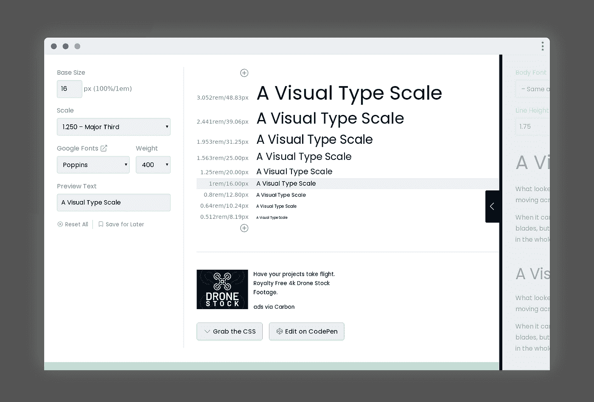

字体缩放是一个为你提供不同字体视觉效果的工具。您可以使用此工具查看不同字体、大小和比例的项目版式的视觉效果。它还为您的项目排版提供了 CSS 生成器。

## [字体比例的链接](https://type-scale.com/)

# 小型开发工具

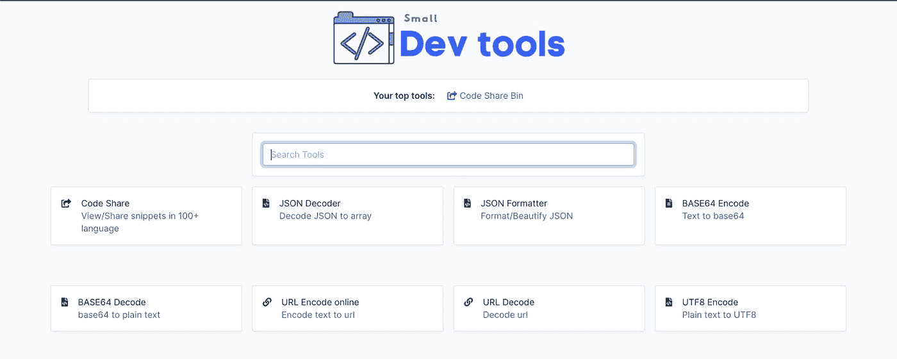

小开发工具是一个工具中心，为你提供一些很棒的小工具来帮助你的项目。

小型开发工具中我最喜欢的一些工具是，

*   [代码共享](https://smalldev.tools/share-bin)
*   [降价编辑](https://smalldev.tools/markdown-editor-online)
*   [HTML 到 Markdown 转换器](https://smalldev.tools/html-to-markdown-converter-online)
*   [占位符图像发生器](https://smalldev.tools/placeholder-image-generator-online)

## [小型开发工具的链接](https://smalldev.tools/)

# 智能模型

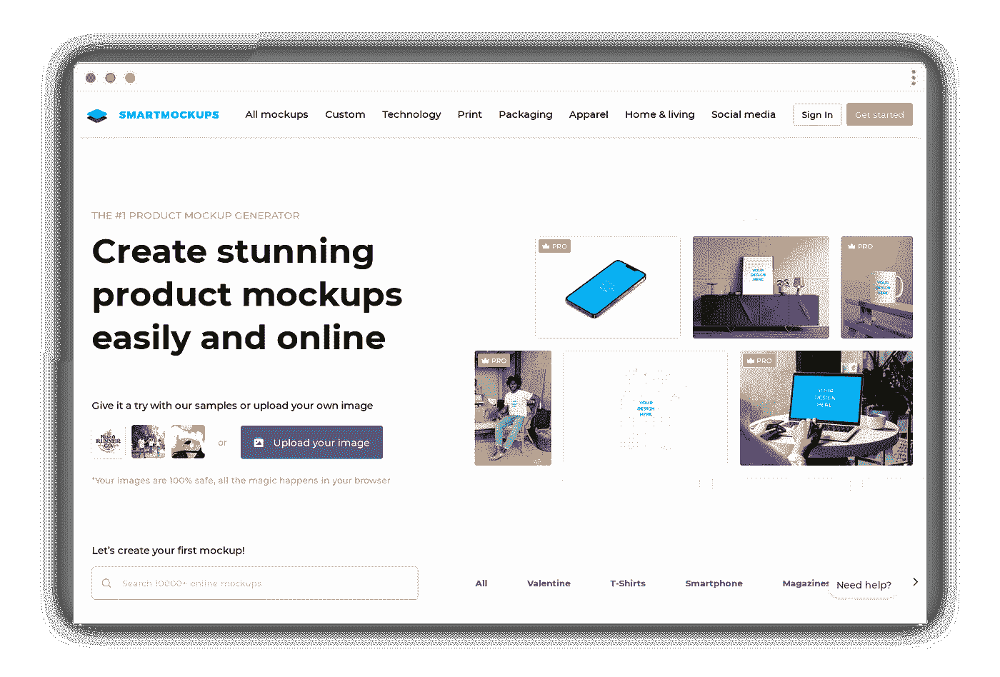

Smartmockups 是一款工具，可以让您在浏览器中一次性创建产品模型。它还包含 1000+样机模板，以帮助您创建一个为您的产品。您可以使用这个工具来创建，

*   技术模型
*   社交媒体模型
*   打印模型
*   家居和装饰模型
*   包装模型

为了加快您的工作流程，它还支持 Figma、Canva 和 Dropbox 等第三方集成。

## [智能模型的链接](https://smartmockups.com/)

# 摘要

总而言之，我们已经讨论了 7 个有用的网站，它们将帮助你解决日常问题。我希望这些工具对您有用，并且您现在将开始使用它们。

这个话题到此为止。感谢您的阅读。

# 与我联系

[LinkedIn](https://www.linkedin.com/in/sachin-chaurasiya)|[Twitter](https://twitter.com/sachindotcom)

*原发布于*[*https://blog . sachinchaurasiya . dev*](https://blog.sachinchaurasiya.dev/7-useful-websites-for-web-developers)*。*

*更多内容看* [***说白了就是***](http://plainenglish.io/) *。报名参加我们的* [***免费每周简讯***](http://newsletter.plainenglish.io/) *。在我们的* [***社区***](https://discord.gg/GtDtUAvyhW) *获得独家获得写作机会和建议。*