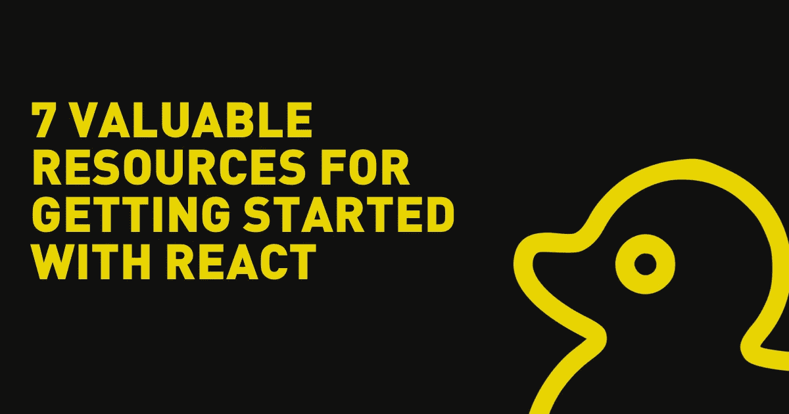

# React 入门的 7 个宝贵资源

> 原文：<https://javascript.plainenglish.io/7-valuable-resources-for-getting-started-with-react-380b0c274776?source=collection_archive---------8----------------------->

React 是一个强大的 JavaScript 库，允许开发人员使用可重用的组件创建用户界面。

作为初学者，当学习 React 时，知道从哪里开始可能是压倒性的。在这篇博文中，我将提供 7 个最有用的 React 入门资源，并解释为什么它们值得一试。

# React 文档

这是所有事物反应的首选资源。[文档](https://reactjs.org/docs/getting-started.html)提供了该库的全面概述，包括入门指南、教程视频和 API 参考指南。对于任何想从头开始学习 React 的人来说，这是一个很好的起点。

# ReactJS 网站

这是 React 的[官方网站，它提供了关于该图书馆的丰富信息，包括](https://reactjs.org/)[入门指南](https://reactjs.org/docs/getting-started.html)，示例，以及[社区资源](https://reactjs.org/community/support.html)。该网站还有一个“展示”部分，突出了用 React 构建的有趣且鼓舞人心的项目。

# FreeCodeCamp 网站上的教程

FreeCodeCamp 是学习 web 开发的绝佳资源，他们的 [React 教程](https://www.freecodecamp.org/news/tag/react/)也不例外。这些教程为构建简单的 React 应用程序提供了一步一步的指导，它们涵盖了组件、状态和生命周期方法等主题。教程还包括挑战和测验，以测试您的知识并巩固您所学的概念。

# React 初学者课程

这是一门付费课程，但它提供了对 React 的全面介绍，包括 JavaScript 和 React API 的基础知识。该课程包括视频讲座、代码挑战和真实世界的项目，以帮助您以实用和动手的方式学习反应。该课程由专家讲师韦斯·博斯教授，他擅长用通俗易懂的方式解释复杂的概念。

# Codecademy 网站上的入门页面

Codecademy 是一个流行的学习编码的在线平台，他们的 [React 入门页面](https://www.codecademy.com/search?query=react)提供了一系列交互式课程，将帮助您学习 React 的基础知识。课程涵盖组件、状态和事件等主题，还包括测验和挑战，以测试您的知识并巩固您所学的内容。

# MDN web docs 网站上的 React 文档

MDN web docs 是面向 web 开发人员的综合资源。他们的 React 文档提供了 React API 的[详细参考指南。文档包括关于 React 组件、组件生命周期以及使用状态和道具的信息。对于任何想深入了解 React 技术细节的人来说，这都是一个很好的资源。](https://developer.mozilla.org/en-US/docs/Learn/Tools_and_testing/Client-side_JavaScript_frameworks/React_getting_started)

# YouTube 频道 LearnCode.academy

[LearnCode.academy](https://www.youtube.com/user/learncodeacademy) 是 YouTube 上一个很受欢迎的频道，提供了大量关于 web 开发的教育视频。他们的 React 教程对初学者特别有帮助，因为它们提供了从头构建简单 React 应用程序的分步指南。教程涵盖了组件、状态和道具，还包括演示和代码示例来帮助您理解。

总之，有许多有价值的资源可用于开始使用 React。无论您是完全的初学者，还是希望了解更多 React 知识的有经验的开发人员，这些资源都将为您提供成功所需的信息和指导。

## 所以不要害怕投入并开始学习——有了这些资源，你很快就会掌握 React！

*更多内容请看*[***plain English . io***](https://plainenglish.io/)*。报名参加我们的* [***免费周报***](http://newsletter.plainenglish.io/) *。关注我们关于*[***Twitter***](https://twitter.com/inPlainEngHQ)[***LinkedIn***](https://www.linkedin.com/company/inplainenglish/)*[***YouTube***](https://www.youtube.com/channel/UCtipWUghju290NWcn8jhyAw)*[***不和***](https://discord.gg/GtDtUAvyhW) *。对增长黑客感兴趣？检查* [***电路***](https://circuit.ooo/) *。***