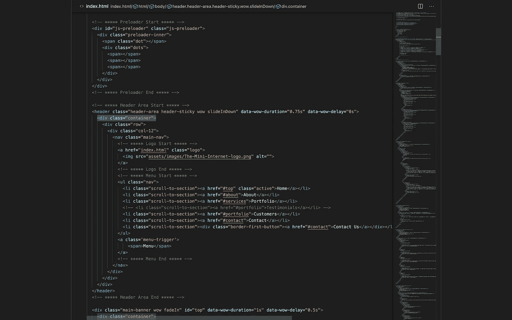
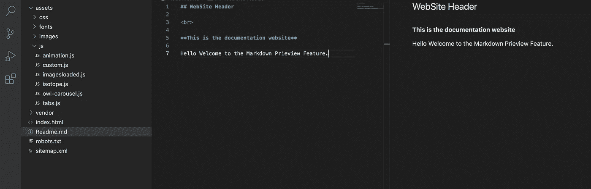
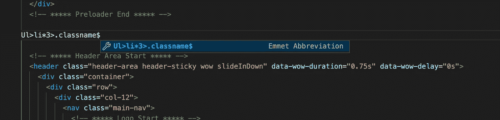
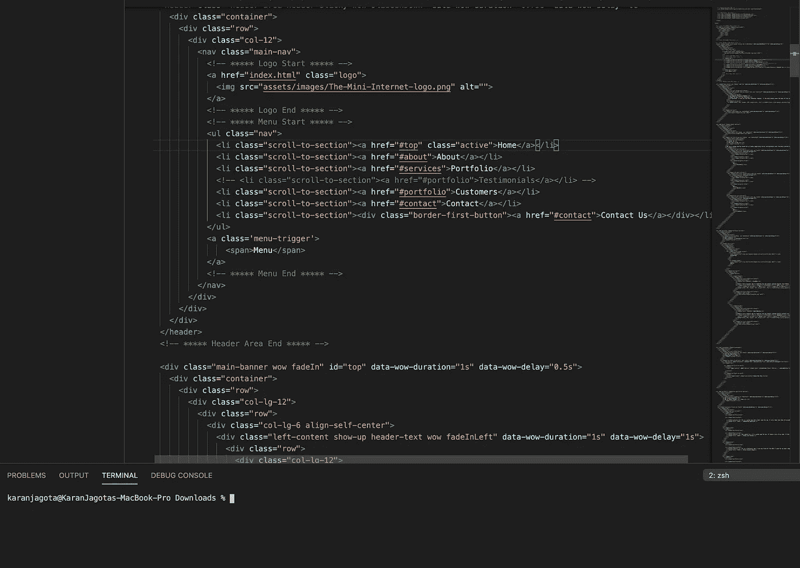

# 作为开发人员，我每天使用 7 个 VS 代码编辑器快捷键

> 原文：<https://javascript.plainenglish.io/7-vs-code-editor-shortcuts-i-use-every-day-as-a-developer-dfad44c709be?source=collection_archive---------9----------------------->

## 我喜欢 VS 代码编辑器开发应用程序的主要原因


Photo by [Juan Gomez](https://unsplash.com/@nosoylasonia?utm_source=unsplash&utm_medium=referral&utm_content=creditCopyText) on [Unsplash](https://unsplash.com/s/photos/shortcuts?utm_source=unsplash&utm_medium=referral&utm_content=creditCopyText)

现在大家都用 [VSCode](https://code.visualstudio.com/) 。它无疑是市场上最好的代码编辑器。无论您的计算机上安装了什么操作系统，VsCode 编辑器都可以在任何地方运行。它是内存高效的，并为开发人员提供了大量的功能来开发快速和快速的应用程序。

是的，是真的。它提供了很多我觉得非常方便的功能。看到一些开发者没有意识到这一点，我很难过。因此，我决定写这篇博客。从查看 Github 的存储库到从扩展库下载有用的扩展，以及快捷方式，这篇文章涵盖了很多内容。

# 1.禅宗模式

禅模式或无分心模式让你专注于全屏幕上的代码。这是以下列表中最好的特性之一。它隐藏了除代码之外的所有 UI。



Image By Author

**快捷键- Command + Shift + P，然后搜索禅宗模式**

**另一个快捷方式——Command+K Z**

# 2.向上或向下移动线条

如果你想在代码库上下移动几行代码，你可以通过下面的快捷键来完成。你可以高亮显示这段代码，剪切它，然后粘贴到你想粘贴的地方，但是仍然。我同意！这不是一个超级有用的捷径，但仍然可用。

***高亮显示你想要向上或向下并按下以下键。***

**选项+向上箭头键**

**选项+向下箭头键**

# 3.添加多个光标

VsCode 编辑器的另一个很酷的特性是它能够添加多个游标和编写代码。

**Alt 或 Option +点击鼠标或**

不仅如此，您还可以向当前选择的所有出现处添加额外的光标。

**Ctrl + shift + L**

# 4.降价预览

开发人员可以直接在 VsCode 编辑器中查看和编辑 markdown。



Image By Author

由于今天的大多数文档都是用 markdown 语法编写的，我相信这种快捷方式对开发人员来说可能会很方便。

**快捷键- Command + Shift + V**

**或者按 Command + Shift + P，然后选择打开预览到侧面**

# 5.Emmet 语法

它还支持 emmet 语法和代码片段。这是一个内置的功能快捷方式，不需要任何新的扩展。我很确定你们都会同意我的观点，至少对于 HTML 开发者来说这是必须的。它节省了大量的 HTML 编码时间。

因此，**当你开始用 Emmet 风格编写代码时，你会在建议框中看到一个缩写列表。**



Image By Author

```
Ul>li*5>.class_name$ <!-- The above will result in the following code --><Ul>
 <li><div class="classname1"></div></li>
 <li><div class="classname2"></div></li>
 <li><div class="classname3"></div></li>
</Ul>
```

# 6.CLI 工具(内置终端)

编辑器中的内置终端可以节省大量开发人员的时间。我相信这也是为什么微软决定将这个功能放在编辑器中，以支持在 windows 操作系统中编写代码的开发人员。在 windows 上为所有东西设置一个路径很费时间。这一功能的加入表明微软关心开发者在 Windows 上的体验，或者至少他们在尽力。



Image By the Author

**快捷方式-从应用程序栏选择终端。**

# 7.代码导航

如果你曾经做过一个大项目，那么你就会知道驾驭一个大项目有多难。我认为导航到函数定义的内置快捷方式是 VsCdoe 最有用的功能。这是我从 IntelliJ IDE 转向 VsCode 的一个重要原因。

**Command + click 转到函数定义。**

此外，它包含大量的 VsCode 扩展供开发人员选择；这是高度可定制的，以提高开发人员的生产力，根据他的要求和选择。最后，我想说最后一件事，“一个 web 开发人员不仅仅负责为公司编写代码，还负责按照自己的风格建立工作环境，以最大限度地提高工作效率。”

这就是这篇文章的内容。感谢您阅读我的帖子，并走了这么远。

如果你喜欢这篇文章，你也可以看看我的其他文章。

[](/heres-how-frontend-web-developers-get-your-browser-information-d2c86133fbbd) [## 以下是前端 Web 开发人员如何获取您的浏览器信息

### 这 6 个内置的单行代码识别设备和浏览器特定的信息。

javascript.plainenglish.io](/heres-how-frontend-web-developers-get-your-browser-information-d2c86133fbbd) [](/3-ways-senior-developers-stay-up-to-date-with-technology-trends-859f55566cfe) [## 高级开发人员紧跟技术趋势的 3 种方法

### 如何做一名高级开发人员，即使你不是。

javascript.plainenglish.io](/3-ways-senior-developers-stay-up-to-date-with-technology-trends-859f55566cfe) [](/10-engineering-blogs-i-read-to-stay-up-to-date-with-technology-trends-faa006460fd9) [## 我阅读的 10 个工程博客，以跟上技术趋势

### 2022 年及以后的顶级工程博客。

javascript.plainenglish.io](/10-engineering-blogs-i-read-to-stay-up-to-date-with-technology-trends-faa006460fd9) [](/12-terminal-commands-i-use-every-day-as-a-developer-4a38135ab305) [## 作为开发人员，我每天使用的 12 个终端命令

### 作为软件开发人员如何有效地使用计算机终端

javascript.plainenglish.io](/12-terminal-commands-i-use-every-day-as-a-developer-4a38135ab305) [](/7-google-projects-that-have-helped-developers-save-tons-of-time-fa8a72d9044c) [## 帮助开发者节省大量时间的 7 个谷歌项目

### 谷歌如何帮助开发人员创建令人惊叹的应用程序。

javascript.plainenglish.io](/7-google-projects-that-have-helped-developers-save-tons-of-time-fa8a72d9044c) 

# 想支持我吗

[](https://karanjagota.medium.com/membership) [## 通过我的推荐链接加入 Medium-Karan ja gota

### 作为一个媒体会员，你的会员费的一部分会给你阅读的作家，你可以完全接触到每一个故事…

karanjagota.medium.com](https://karanjagota.medium.com/membership) 

**你觉得这篇文章有帮助吗？在使用 VS 代码编辑器时，我是否错过了你做的一些事情？请在评论区告诉我。我很想知道你对此的看法。**

*更多内容请看*[***plain English . io***](https://plainenglish.io/)*。报名参加我们的* [***免费周报***](http://newsletter.plainenglish.io/) *。关注我们关于*[***Twitter***](https://twitter.com/inPlainEngHQ)*和*[***LinkedIn***](https://www.linkedin.com/company/inplainenglish/)*。加入我们的* [***社区不和谐***](https://discord.gg/GtDtUAvyhW) *。*